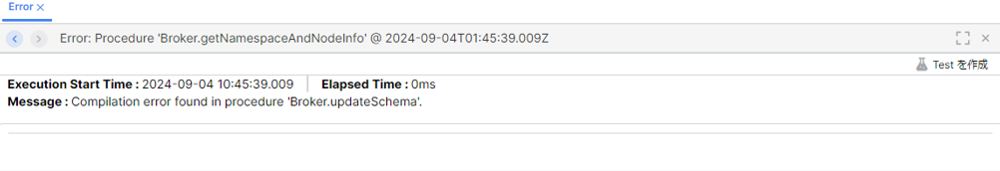
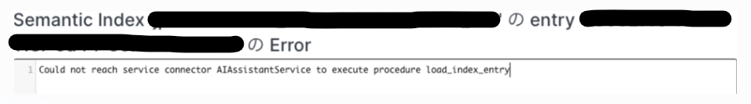

# はじめに

本ドキュメントは VantiqEdgeインストールおよび保守時のトラブルシューティング過去事例やTipsについて記載したものです。  
本ドキュメントに記載された内容はVantiq Private Cloudは対象外ですので、ご注意下さい。

# 目次
- [はじめに](#はじめに)
- [トラブルシューティング過去事例](#トラブルシューティング過去事例)
  - ["no space left on device"エラーが発生した](#no-space-left-on-deviceエラーが発生した)
  - ["Compilation error"が発生した](#compilation-errorが発生した)
  - ["Could not reach service connector AIAssistantService to execute procedure load_index_entry"エラーが発生した](#could-not-reach-service-connector-aiassistantservice-to-execute-procedure-load_index_entryエラーが発生した)
- [Tips](#tips)
  - [MongoDBをバックアップ・リストアしたい](#mongodbをバックアップリストアしたい)
  - [Qdrantをバックアップ・リストアしたい](#semanticindexqdrant-collectionをバックアップリストアしたい)
  - [VantiqEdge R1.42アップグレードの追加手順](#vantiqedge-r142アップグレードの追加手順)

# トラブルシューティング過去事例

## "no space left on device"エラーが発生した

VantiqEdgeのインストールにて、`docker compose up -d`を実行したのち、"no space left on device"と表示されコンテナが起動しないケースがあります。  
必要なストレージサイズを確保できていないことが原因となりますので、VantiqEdgeの要件である32GBを確保した上で、再度コマンドを実行して下さい。    
ストレージとは、AWSの場合はEBS、Azureの場合はManagedDiskのことを指します。

## "Compilation error"が発生した

VantiqEdgeの起動後に、systemユーザにてログインすると、ナビゲーションバーの⚠マークに赤くカウントされた数字が表示されるケースがあります。  


詳細を確認すると、procedureのコンパイルエラーが発生しているはずです。  
次の例では、`Broker.updateSchema`procedureとなっていますが、他のprocedureの場合もあります。  



この場合考えられる原因は2つあります。  
① ハードウェア要件を満たすCPU・Memoryが確保できていない  
② VantiqEdgeの初回起動処理を停止してしまった

①の場合、要件を満たすサイズに変更して下さい。Memoryは8GBで、CPUは2vcpuで動作することを確認しております。  
その後、MongoDBのDocker Volumeを一度削除し、再度`docker compose up -d`でコンテナを起動させてください。
VantiqEdgeの初回起動処理がはじめから行われます。
> **MongoDB Docker Volumeの削除方法**  
> `docker volume ls` を実行すると、MongoDBのDocker Volume名が確認できます。`<ディレクトリ名>_vantiq_edge_data`となっているVolumeです。`docker volume rm <MongoDB Docker Volume名>`で削除することができます。

②の場合は、`docker compose up -d`の実行後、VantiqEdgeコンテナでは初回起動処理が行われますが、その途中に`docker restart vantiq_edge_server`等で一時停止させてしまうことを指しています。  
VantiqEdgeの起動処理が完了するのにはしばらく時間がかかります。 
起動が遅いからという理由等でコンテナを再起動してしまうとコンパイルエラーが発生します。  
この場合もMongoDBのDocker Volumeを一度削除し、再度`docker compose up -d`でVantiqEdgeの初回起動処理をはじめからやり直して下さい。

なお、VantiqEdgeの初回起動処理は、コンテナログにて次のメッセージが表示されれば、完了したとみなせます。

```
Succeeded in deploying verticle
```

## "Could not reach service connector AIAssistantService to execute procedure load_index_entry"エラーが発生した

Vantiq IDE画面にて、"Could not reach service connector AIAssistantService to execute procedure load_index_entry"というエラーが発生するケースがあります。  



この場合、AI Assistantがハングアップしているため、次のコマンドで再起動して下さい。  
```
docker restart vantiq_ai_assistant
```

# Tips

## MongoDBをバックアップ・リストアしたい
### 1. MongoDBバックアップ

VantiqEdgeのcompose.yamlが存在するディレクトリへ移動する。  

```sh
. (<- ここがルート)
|-- compose.yaml
|-- config
    |-- license.key 
    |-- public.pem
```

Vantiq Edgeコンテナを停止する。

```sh
$ docker stop vantiq_edge_server
```

mongodumpを実行する。  
完了すると、コンテナ上の/tmp/ars02以下にダンプファイルが出力されます。

```sh
$ docker compose exec vantiq_edge_mongo mongodump -u ars -p ars -d ars02 --gzip -o /tmp/
```

コンテナ上のダンプファイルをホストにコピーする。

```sh
$ docker compose cp vantiq_edge_mongo:/tmp/ars02 ./
```

コンテナ上のダンプファイルを削除する。

```sh
$ docker compose exec vantiq_edge_mongo rm -fr /tmp/ars02
```

### 2. MongoDBリストア

VantiqEdgeのcompose.yamlが存在するディレクトリへ移動する。  
`ars02`ディレクトリが存在することを確認する。  

```sh
. (<- ここがルート)
|-- compose.yaml
|-- ars02/
|-- config
    |-- license.key 
    |-- public.pem
```

ダンプ(ars02)をコンテナにコピーする。
```sh
$ docker compose cp ars02 vantiq_edge_mongo:/tmp/
```

リストアを実行する。
```sh
$ docker compose exec vantiq_edge_mongo mongorestore -u ars -p ars -d ars02 --gzip --drop /tmp/ars02
```

## SemanticIndex(Qdrant Collection)をバックアップ・リストアしたい

### 前提

- [Vantiq CLI](https://dev.vantiq.com/docs/system/cli/index.html) がインストールされていること
- [profile](https://dev.vantiq.com/docs/system/cli/index.html#profile) が設定されていて、対象のVantiqEdge環境に接続できること
- 対象のVantiq環境にSemantic Indexが作成されていること 

### 1. SemanticIndexバックアップ
バックアップは、SemanticIndex毎に取得することになります。
```
vantiq dump semanticindexes <semanticindex名> -s <profile名> -d <バックアップファイル格納先ディレクトリ>
```
指定したディレクトリに、`<SemanticIndex名>.dmpファイル`が出力されるはずです。  
※5MB分のテキストファイルでは、30秒ほどでバックアップが完了することを確認しております。

### 2. SemanticIndexリストア
```
vantiq load semanticindexes -s <profile名> <dmpファイル>
```
※5MB分のテキストファイルでは、10分ほどでリストアが完了することを確認しております。

## VantiqEdge R1.42アップグレードの追加手順
Vantiq Edgeを1.41から1.42にアップグレードするには、Qdrantベクターデータベースのマイグレーションが必要です。マイグレーションスクリプトをご利用下さい。

### 1. マイグレーションスクリプトのダウンロード
[`edgeQDrantUpgrade.zip`](https://dev.vantiq.com/downloads/edgeQDrantUpgrade.zip)をダウンロードして下さい。

### 2. マイグレーションスクリプトのセットアップ
`compose.yaml`が存在するディレクトリに、`upgrade`ディレクトリを作成して下さい。  
その後、`upgrade`ディレクトリに、`edgeQDrantUpgrade.zip`を格納して下さい。
```
. (<- ここがルート)
|-- compose.yaml
|-- config
|-- upgrade
    |-- edgeQDrantUpgrade.zip
```
その後、`edgeQDrantUpgrade.zip`を解凍して下さい。

### 3. Vantiq Server停止
Vantiq Serverの状態を確認してください。
```
$ docker ps
```
もし`vantiq_edge_server`が起動している場合は、停止して下さい。
```
$ docker stop vantiq_edge_server
```

### 4. マイグレーションスクリプト実行
`upgrade`ディレクトリにて、マイグレーションスクリプトを実行して下さい。
```
$ ./upgrade.sh
```

`Migration complete.`のメッセージが出力されれば完了となりますので、[バージョンアップ手順](update_vantiq_edge_version.md#マイナーバージョンアップ)に戻って下さい。