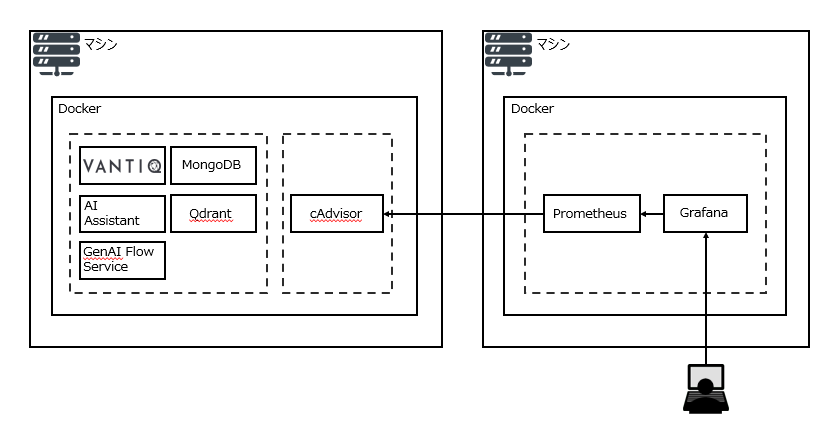
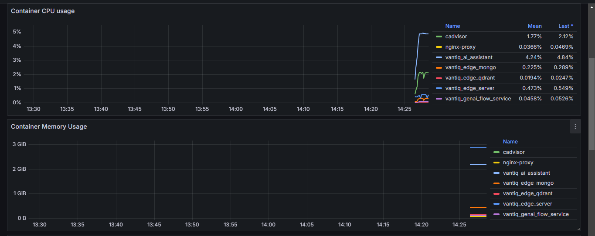

# 概要
VantiqEdgeはVantiq Private Cloudとは異なり、Grafana Dashboard機能が提供されていません。  
本記事では、VantiqEdgeを構成する各コンテナのリソース利用状況を可視化するための手順を紹介します。  
あくまでもコンテナレベルでのリソース利用状況を可視化するための手順であり、Vantiq Appのパフォーマンス状況等を可視化することは出来ませんのでご注意ください。  
また、本手順はVantiqの製品サポートの対象外です。  
皆さまの責任においてご利用下さい。  

# 環境
本記事で取り扱う内容は、次の環境にて確認しています。
* VantiqEdge ＆ cAdvisor  
  マシン：Amazon EC2  
  OS：Ubuntu 24.04  
  Vantiq：1.39.4  
  cAdvisor：0.49.1  

* Prometheus ＆ Grafana  
  マシン：Amazon EC2  
  OS：Ubuntu 24.04  
  ディスクサイズ：30 GB  
  Prometheus：2.53.2  
  Grafana：11.1.4  

# 構成図
本手順を実行することで実現されるアーキテクチャは次の図のようになります。  


各コンポーネントの役割は次の通りです。  
リンク先にて、各コンポーネントのライセンスなどの詳細情報が確認可能です。
* [cAdvisor](https://github.com/google/cadvisor/tree/master?tab=readme-ov-file)：VantiqEdgeを構成する各コンテナの情報を取得します。  
* [Prometheus](https://github.com/prometheus/prometheus?tab=readme-ov-file)：cAdvisorから各コンテナの情報を取得し、永続ボリュームに保存します。  
* [Grafana](https://github.com/grafana/grafana?tab=readme-ov-file)：Prometheusをデータソースとし、ユーザにDashboard機能を提供します。   

# 取得メトリクス一覧
* Container CPU Usage：各コンテナのCPU利用率
* Container Memory Usage：各コンテナのMemory利用量
* Container Network Input：各コンテナがネットワークを通じて受信した合計バイト数
* Container Network Output：各コンテナがネットワークを通じて送信した合計バイト数
* Filesystem usage：すべてのコンテナの合計ディスク容量に対する、未使用ディスク容量の割合

# セットアップ手順
## 前提
VantiqEdgeは既にインストール済みであることを前提とします。  

## cAdvisor コンテナ起動
※あらかじめ、マシンのインバウンドルールにて、cAdvisor用の TCP 8000 Portを許可して下さい。  
また、Prometheusをホストするマシンからのみをアクセス元として制限するのが望ましいです。

VantiqEdgeをホストしているマシンにて、次のコマンドを実行してください。  
cAdvisorコンテナが起動します。

```
$ sudo docker run \
  --volume=/:/rootfs:ro \
  --volume=/var/run:/var/run:ro \
  --volume=/sys:/sys:ro \
  --volume=/var/lib/docker/:/var/lib/docker:ro \
  --volume=/dev/disk/:/dev/disk:ro \
  --publish=8000:8080 \
  --detach=true \
  --name=cadvisor \
  --restart=unless-stopped \
  gcr.io/cadvisor/cadvisor:latest
```

cAdvisorコンテナが起動したことを確認して下さい。  

```
$ docker ps
CONTAINER ID   IMAGE                                    COMMAND                  CREATED         STATUS                            PORTS                                           NAMES
e4eae3bc21b8   gcr.io/cadvisor/cadvisor:latest          "/usr/bin/cadvisor -…"   2 seconds ago   Up 2 seconds (health: starting)   0.0.0.0:8000->8080/tcp, :::8000->8080/tcp       cadvisor
ff935536c81b   quay.io/vantiq/ai-assistant:1.39.4       "uvicorn app.ai_assi…"   5 weeks ago     Up 2 weeks                                                                        vantiq_ai_assistant
3b18cbcfac12   quay.io/vantiq/genaiflowservice:1.39.4   "uvicorn app.genaifl…"   5 weeks ago     Up 2 weeks                                                                        vantiq_genai_flow_service
daa7f7228029   quay.io/vantiq/vantiq-edge:1.39.4        "/opt/vantiq/bin/van…"   5 weeks ago     Up 2 weeks                        0.0.0.0:32768->8080/tcp, :::32768->8080/tcp     vantiq_edge_server
c62cdfb9f8fd   qdrant/qdrant:v1.9.2                     "./entrypoint.sh"        5 weeks ago     Up 2 weeks                        6333-6334/tcp                                   vantiq_edge_qdrant
4eddef142c66   jwilder/nginx-proxy                      "/app/docker-entrypo…"   5 weeks ago     Up 2 weeks                        80/tcp, 0.0.0.0:443->443/tcp, :::443->443/tcp   nginx-proxy
a5cd7ae0055d   bitnami/mongodb:4.2.5                    "/opt/bitnami/script…"   5 weeks ago     Up 2 weeks                        27017/tcp                                       vantiq_edge_mongo

```

## Prometheusコンテナ 及び Grafanaコンテナ起動
Prometheusコンテナ 及び Grafanaコンテナをホストするためのマシンを作成し、Dockerをインストールしてください。  
手順は割愛します。  

次に、任意のディレクトリを作成してください。  
こちらを作業ディレクトリとし、配下にコンテナ用の資材を格納することになります。  
本記事ではホームディレクトリ配下に`monitor`という名前のディレクトリを作成しています。

```
$ mkdir ~/monitor
$ cd ~/monitor
```

次に、Prometheusコンテナ用の設定ファイルを用意します。
```
$ mkdir ./prometheus
$ vi ./prometheus/prometheus.yml
```

`prometheus.yml`の内容を次のようにしてください。

```
global:
  scrape_interval:     10s

scrape_configs:
  - job_name: 'cadvisor'
    static_configs:
    - targets:
      - '<cAdvisorマシンのIP>:8000'
```

次に、`compose.yaml`を用意します。

```
$ vi compose.yaml
```

`compose.yaml`の内容を次のようにしてください。  
※`services.prometheus.command`の`--storage.tsdb.retention.time`はメトリクスの保持期間になります。ここでは31d(1か月)としていますが要件に合わせて変更して下さい。
```
services:
  prometheus:
    container_name: prometheus
    image: prom/prometheus
    volumes:
      - ./prometheus/prometheus.yml:/prometheus/prometheus.yml
      - prometheus_data:/prometheus
    command:
      - --storage.tsdb.retention.time=31d
    restart: unless-stopped
    networks:
      - monitor

  grafana:
    container_name: grafana
    image: grafana/grafana
    ports:
      - 3000:3000
    restart: unless-stopped
    networks:
      - monitor

networks:
  monitor:
    ipam:
      config: []

volumes:
  prometheus_data: {}
```

ディレクトリ構成とファイルを再度確認して下さい。
```
.
├── compose.yaml
└── prometheus
    └── prometheus.yml
```

compose.yamlがある作業ディレクトリにて下記コマンドを実行します。
```
$ docker compose up -d
```

`docker ps`にて起動状態を確認して下さい。
```
$ docker ps
CONTAINER ID   IMAGE             COMMAND                  CREATED              STATUS              PORTS                                       NAMES
aa252d31bf92   prom/prometheus   "/bin/prometheus --s…"   About a minute ago   Up About a minute   9090/tcp                                    prometheus
57213d523510   grafana/grafana   "/run.sh"                About a minute ago   Up About a minute   0.0.0.0:3000->3000/tcp, :::3000->3000/tcp   grafana
```

## Grafanaセットアップ
※あらかじめ、マシンのインバウンドルールにて、Grafana WebUI用の TCP 3000 Portを許可して下さい。  

### Grafanaログイン
1. ブラウザから、`http://<GrafanaマシンのIP>:3000`にてGrafanaにログインして下さい。  
2. ログイン画面では、次のデフォルトユーザ/パスワードにてログインして下さい。  
```
User：admin  
PW：admin
```

### デフォルトパスワードの変更
ログイン後にパスワードの変更を求められるため、任意のパスワードに変更して下さい。

### デフォルトユーザの変更
admin権限を持ったユーザの名前をデフォルトの`admin`から任意の名前に変更します。  
`Home` > `admin` > `Profile` を押下するとProfileの設定画面になるため、`Name`及び`Username`に任意の名前を入力して下さい。

### Data Soruceの設定
1.`Home` > `Connections` > `Data sources`を押下し、Data sourceの設定画面に遷移して下さい。  
2.URLに`http://prometheus:9090`と入力してください。  
3.`Save and Test`で接続が`Successfully`となることを確認して下さい。  
　URLが正しく設定されていると、`Successfully`となるはずです。  

### Dashboardインポート
1.次のURLから、DashboardのJSONファイルをダウンロードして下さい。
https://github.com/vegasbrianc/grafana_dashboard  
2.Grafanaの画面にて、`Home` > `Dashboard` を押下して下さい。  
3.Dashboards画面にて、`New` > `Import`を押下して下さい。  
4.先ほどダウンロードしたJSONファイルをインポートして下さい。  
　Data Sourceには、前のステップで作成した`Prometheus`を指定して下さい。

Dashboardが表示すれば成功です。


なお、Dashboardの一番上段でN/AとなっているMemory UsageとCPU Usageパネルは、マシン自体に関するパネルです。  
マシン自体のデータはPrometheusヘ転送していないため、表示されないのは想定通りの挙動です。

# オプション：SSL設定
※あらかじめ、マシンのインバウンドルールにて、Grafana WebUIアクセス用の TCP 443 Portを許可して下さい。

compose.yamlを配置するディレクトリにgrafana/certsディレクトリを作成し、以下のようにSSL証明書と秘密鍵ファイル(それぞれ`fullchain.pem`,`privkey.pem`とする)を配置します。

```
.
├── compose.yaml
└── prometheus
└── grafana
    └── certs
        ├── fullchain.pem
        └── privkey.pem
```

`compose.yaml`の内容を次のようにしてください。 

```
services:
  prometheus:
    container_name: prometheus
    image: prom/prometheus
    volumes:
      - ./prometheus/prometheus.yml:/prometheus/prometheus.yml
      - prometheus_data:/prometheus
    command:
      - --storage.tsdb.retention.time=31d
    restart: unless-stopped
    networks:
      - monitor

  grafana:
    container_name: grafana
    image: grafana/grafana
    ports:
      - 443:3000
    volumes:
      - ./grafana/certs/fullchain.pem:/etc/grafana/fullchain.pem
      - ./grafana/certs/privkey.pem:/etc/grafana/privkey.pem
    restart: unless-stopped
    environment:
      - GF_SERVER_PROTOCOL=https
      - GF_SERVER_CERT_FILE=/etc/grafana/fullchain.pem
      - GF_SERVER_CERT_KEY=/etc/grafana/privkey.pem
    networks:
      - monitor

networks:
  monitor:
    ipam:
      config: []

volumes:
  prometheus_data: {}
```

起動は通常時と同じく`docker compose up -d`で起動してください。  
DNSなどの名前解決の設定はそれぞれの環境に合わせて設定を行ってください。  
起動と名前解決の設定が完了したら`https://<YOUR-FQDN>`でGrafanaのWebUIにアクセスし、起動後の設定を行ってください。

# 参考
https://qiita.com/vko/items/95b6ba0cbce3d0bbc843
https://github.com/vegasbrianc/grafana_dashboard
https://community.grafana.com/t/ssl-setup-for-grafana-in-docker/115933/5