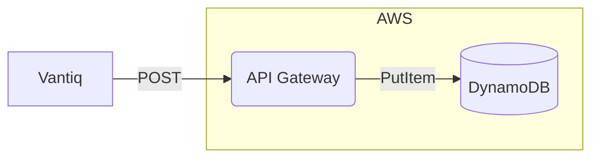
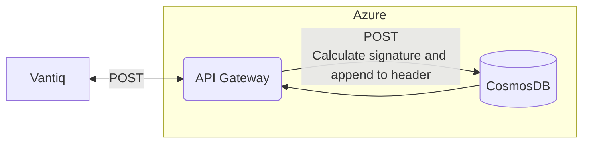
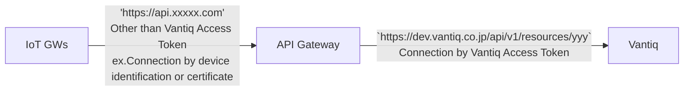
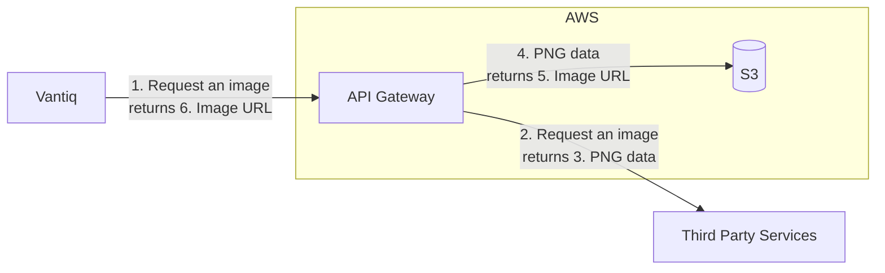

# Design Patterns Combined with API Gateway

## General Advantages of Using API Gateway
- Can be centralize the security management by collaborating with the authentication infrastructure
- Restrict with quota
- Cloud API Gateway mediates with private endpoints of underlying PaaS services
- Use as an interface adapter
- Allows version control of APIs

## Examples of Services that Vantiq cannot Collaborate directly with
In the following cases, Vantiq cannot directly connect with services in the followings, so API Gateway is configured.
- Cannot reach in terms of network (connection from Vantiq on public network to service endpoints on private network).  
- Protocols other than those supported by Vantiq (REST, WebSocket, MQTT, AMQP, Kafka, SMTP, and so on) are required.   
- Return a response other than the Content-Type supported by Vantiq (application/json, text/csv and so on）in the REST API.  
- Each request in the REST API requires an encrypted signature for the request message.  

### Collaboration with Private Service Endpoints
e.g）Amazon DynamoDB exposes only private service endpoints. It is collaborated via Amazon API Gateway.  

### Sign the Message
e.g）Azure CosmoDB should be appended to the request header, which is signed with the encryption key provided by CosmosDB. The API Gateway performs that process transparently.  

### Keep the devices and Vantiq loosely coupled
e.g）Devices are difficult to update once installed (tokens, URLs, etc.). On the other hand, endpoints on the Vantiq side have the possibility to change. API Gateway makes the API layer abstract and centrally manages security.  

- The 'api/v1/resources/yyy' may change in the future.  
- Can manage authentication in an integrated manner with API Gateway.  

### Convert Data Format
Convert and pass data in formats not supported by Vantiq.  e.g） 
- Image (binary) → Convert to Base64 or save to external storage and obtain image URL
- Rewrite Content-Type

