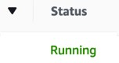
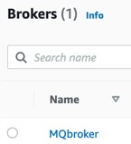
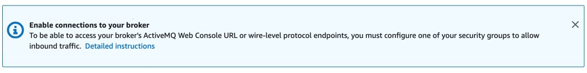
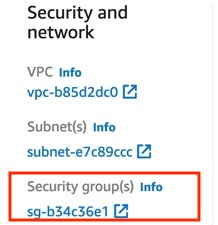
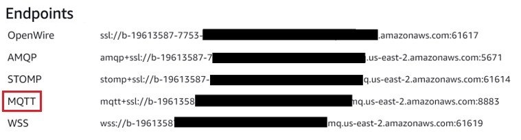

# External Connections: Amazon MQ (Amazon Web Services)
## Table Of Contents
- [How to create a User Account](#createUser)
- [How to connect using AMQP (Source)](#AMQP)
- [How to connect using MQTT (Source)](#MQTT)
- [Sample Project](#EPROJ)

<h2 id="createUser">1. How to create a User Account on Amazon MQ</h2>

### 1.1 Create a Broker
Work steps  
1. Click the _Get started_ button (Figure ① below)  
2. Leave engine as default (Figure ② below)
3. Select _Deploy mode_ (It depends.) and _Storage type_ (It depends.) (Figure ③ below)

|#|Images|
---|---
|①||
|②||
|③||

Work Steps  
1. Type the _Broker name_ (It depends) e.g., MQbroker (Figure ① below)  
2. Type both _Username_ (It depends) and _Password_ (It depends)(Figure ② below)  
3. Other settings are default. Click the _Create broker_ button (it will take about 15 minutes). (Figure ③ below)
4. Confirm that the _Status_ is changed to "Running".

|#|Images|
---|---
|①||
|②||
|③||
|④||

Work steps  
1. Click the Broker name that was just created. (Figure ① below)
2. Click the _Detailed instructions_ link (Figure ② below)

|#|Images|
---|---
|①||
|②||

### 1.2 Configure Security
Steps to enable a connection to the broker.
|Steps|Details|
---|---
||① Click the _Security group(s)_ link|
||② Select the Security group from the list|
||③ Click the _Inbound rules_ tab and click the _Edit inbound rules_ button.|
|| ④ All MQTT (8883), AMQP (5671), console (8162) are defined separately.<br> ⑤ For Custom, set 0.0.0.0/0 to all of the above.|

<h2 id="AMQP">2. How to connect using AMQP (Source) on Vantiq IDE</h2>

### 2.1 Configure AMQP (Source)
Modify the following items accordingly.
|# and Items|Details|
---|---
|①: serverURIs|Copy from Endpoints. Modify to `amqps://` (see below figure)|
|②: topics|It depends. e.g., /outbound/1|
|③: username|It depends|
|④: password|It depends|
```
{
    "passwordType": "string",
    "contentType": "application/json",
    "serverURIs": [
        “<①>"
    ],
    "topics": [
        “<②>"
    ],
    “username”: “<③>",
    “password”: “<④>"
}
```


### 2.2 Configure VAIL
Modify the following items accordingly.
|#|Details|
---|---
|①|The Source name that was just created.|
|②|The details configured in ② above. e.g., /outbount/1|
```
PROCEDURE mq_amqp_pub()
var msg = {"message": {"content": "ABCDEFGHIJKLMN"}}
PUBLISH msg to SOURCE <①> USING { "topic": "<②>" }
```
### 2.3 Operation Verification
Run VAIL and confirm that it returns the following results.


<h2 id="MQTT">3. How to connect using MQTT (Source)  on Vantiq IDE</h2>

### 3.1 Configure MQTT (Source)
Modify the following items accordingly.
|# and Items|Details|
---|---
|①: username|It depends|
|②: password|It depends|
|③: sreverURLs|Copy from Endpoints: modify to `mqtts://` (see below figure)|
|④: topics|It depends. e.g., /mq_topic/1|
```
{
    "passwordType": "string",
    "contentType": "application/json",
    "qos": "AT_LEAST_ONCE",
    "username": “<①>",
    “password”: “<②>”,
    "keepAliveInterval": 15,
    "connectionTimeout": 15,
    "cleanSession": true,
    "maxInflight": 10,
    "serverURIs": [
        “<③>"
    ],
    "topics": [
        “④"
    ]
}
```


### 3.2 Configure VAIL
Modify the following items accordingly.
|#|Details|
---|---
|①|The Source name that was just created.|
|②|The details configured in ④ above. e.g., /mq_topic/1|
```
PROCEDURE mq_mqtt_pub()
PUBLISH { "message": {"greeting":"hello world"}} TO SOURCE <①> USING { "topic": "<②>"}
```
### 3.3 Test the Connection
Run VAIL and confirm that it returns the following results.


<h2 id="EPROJ">Sample Project on Vantiq IDE</h2>

- [extConnAWS](../../conf/extConnAWS.zip)
