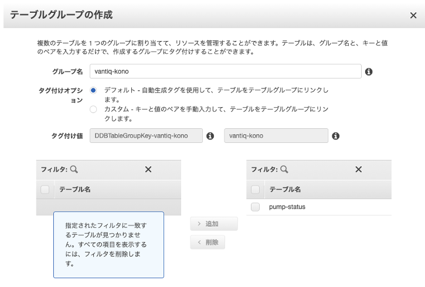
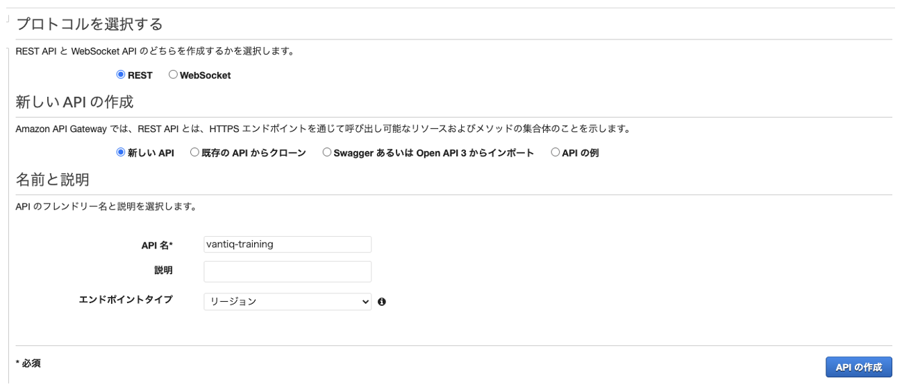
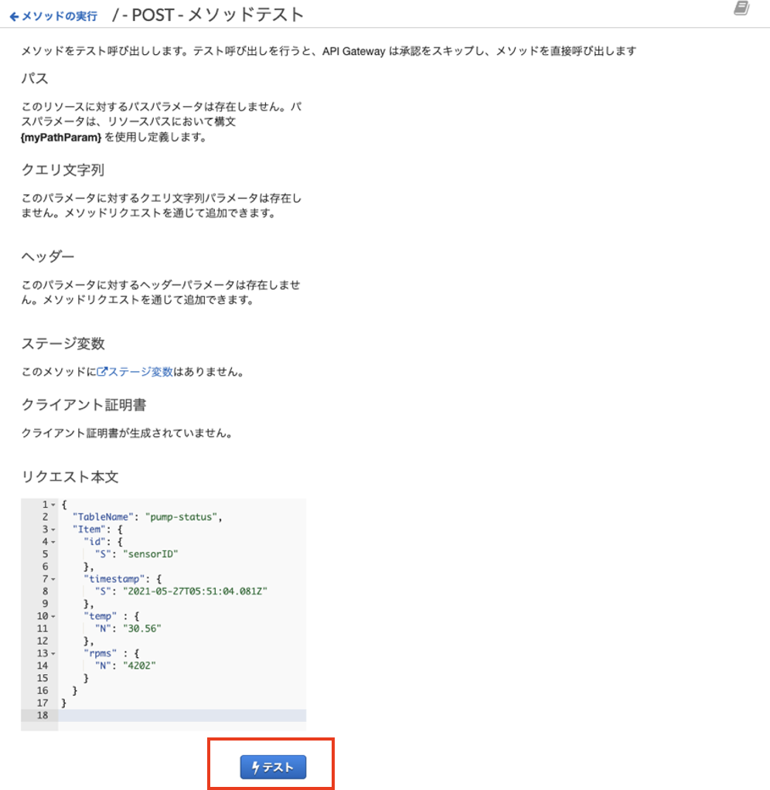
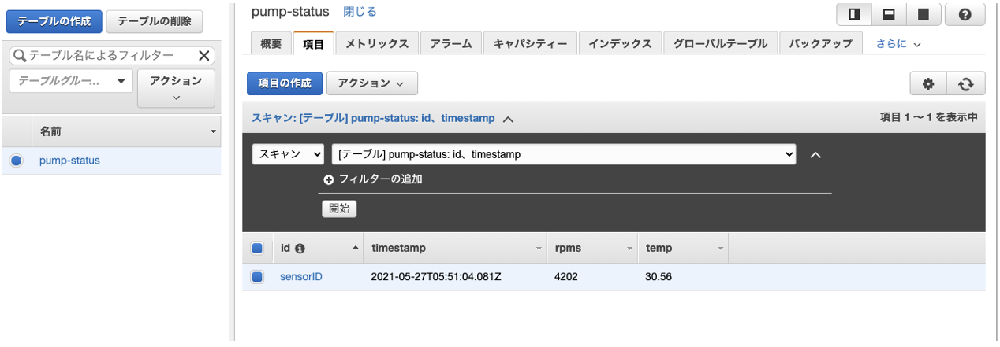
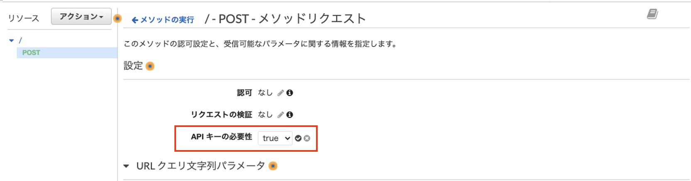
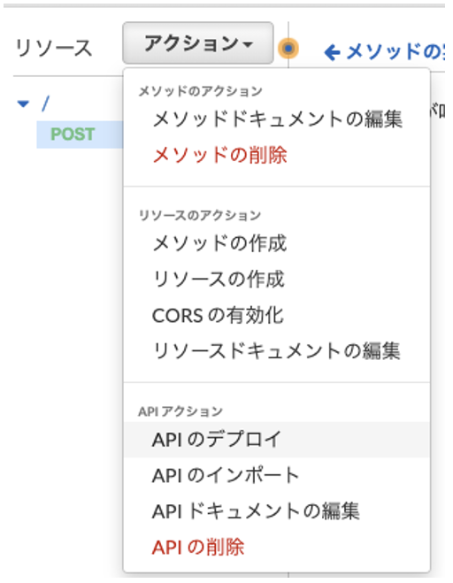
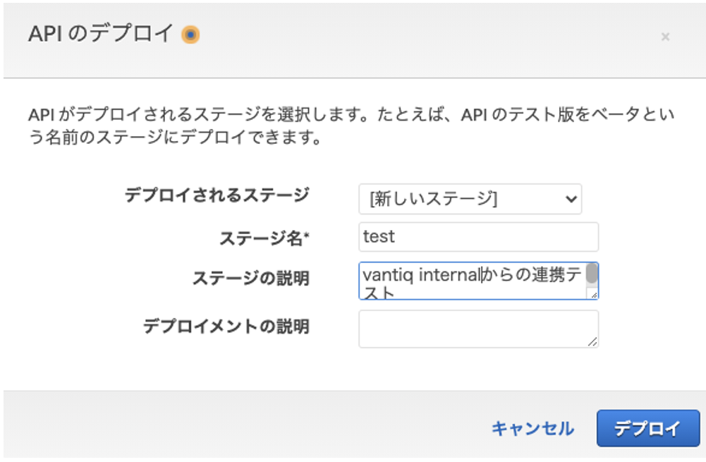

## Overview
This article explains the necessary configurations and integration methods to populate DynamoDB from Vantiq via REST API.

## Configurations
DynamoDB does not have an endpoint to the public, so it is accessed via API Gateway.  
•	Vantiq Cloud (Public)  
•	AWS Dynamo DB  
•	AWS API Gateway  


### Prerequisite
•	It is assumed that store the data processed in the Vantiq externally as time series data. Therefore, this document only covers the write process.

 
### Configure DynamoDB
Create a table. Set the following keys in consideration of the general use of the API.  
- Partition key = id
- Sort key = timestamp  


### Create a Table Group (Optional)
For ease of management, create a table group for each application, and add the table to the group. This has nothing to do with REST API operations, so it is not necessary to do so.  



### Create an IAM Role
Create an IAM Role to operate DynamoDB from API Gateway.

#### Create a Policy
Create a policy named `DynamoDBWriteItem`. Since it inserts into DynamoDB, at least `dynamodb:PutItem` is required in Action.
```json
{
    "Version": "2012-10-17",
    "Statement": [
        {
            "Sid": "VisualEditor0",
            "Effect": "Allow",
            "Action": "dynamodb:PutItem",
            "Resource": "*"
        }
    ]
}
```

#### Create a Role
Create the DynamoDBWriteItem role and attach the DynamoDBWriteItem policy created in the previous step.  


Make a note of the ARN of the created role.  
e.g. `arn:aws:iam::XXXXXXXXX:role/DynamoDBWriteItem`


### Create an API Gateway
#### Basic configuration of API Gateway
Select the REST API. The REST API allows the backend to be an Amazon service (it is not possible with HTTP API).  


Select REST as the protocol.
The API name can be something appropriate.  



Configure child resources if necessary (the following is configured in the root resource).　
- AWS Region: Region in which DynamoDB is configured
- AWS Service: DynamoDB
- HTTP method: POST (refer to [DynamoDB REST API](https://docs.aws.amazon.com/amazondynamodb/latest/APIReference/API_PutItem.html))
- Action: PutItem (refer to [DynamoDB REST API](https://docs.aws.amazon.com/amazondynamodb/latest/APIReference/API_PutItem.html))
- Execution role: ARN of the created role
- Content Handling: Passthrough (pass the Body as it is to the DynamoDB API)


Execute the test.  
  


JSON to be input (as for the format, refer to [API Reference](https://docs.aws.amazon.com/amazondynamodb/latest/APIReference/API_PutItem.html)).
```json
{
  "TableName": "pump-status",
  "Item": {
    "id": {
      "S": "sensorID"
    },
    "timestamp": {
      "S": "2021-05-27T05:51:04.081Z"
    },
    "temp" : {
      "N": "30.56"
    },
    "rpms" : {
      "N": "4202"
    }
  }
}
```

Confirm that the insertion has been made with the DynamoDB console.  



Configure an API key (Optional)  
Create an API key to restrict access.  


"Name" can be anything.  


Make a note of the API key created.  
e.g. `S4yNrDKZhK4CBahm6axGe7BvwU4 XXXXXXXXXXXXX`

Set the API key as required.  



#### Deploy the API
Deploy the API.




Stage name: "Stage Name" can be anything. Here, it is "Test".

  


After deploying, make a note of the API endpoint.  
e.g. `https://y39oxxxxxx.execute-api.ap-northeast-1.amazonaws.com/test`
 
### Create the Vantiq Source (REMOTE)

#### Create a Schema Type (Optional)
Define Schema Type as it makes easier to map properties.  
Both `id` and `timestamp` are Required because they are keys.  


#### Create a Source
Create a Source to connect to DynamoDB (API Gateway).  
- Source Type: `REMOTE`  

- Server URI: Endpoint of the deployed API Gateway
- Content Type: application/json
- Header: JSON
  - x-api-key: The API Key which was created  


 The following is the result of "Edit Config as JSON."
```json
{
    "pollingInterval": 0,
    "uri": "https://xxxxxxxx.execute-api.ap-northeast-1.amazonaws.com/test",
    "query": {},
    "requestDefaults": {
        "contentType": "application/json",
        "headers": {
            "x-api-key": "S4yNrDKZhK4CBahm6axxxxxxxxxxxx"
        }
    }
}
```

#### Create a Procedure (Optional)
Create a Procedure that calls the API to insert into the table.
In the following example, it is assumed that insertions into a large number of tables will to be made utility, by adding the Service prefix of "DynamoDB".
```
PROCEDURE DynamoDB.insertSensorStatus(status SensorStatus)

var msg = {
  "TableName": "pump-status",
  "Item": {
    "id": {
      "S": status.id
    },
    "timestamp": {
      "S": status.timestamp
    },
    "temp" : {
      "N": status.temp.toString()    // DynamoDB API only accepts String Literal
    },
    "rpms" : {
      "N": status.rpms.toString()    // DynamoDB API only accepts String Literal
    }
  }
}

PUBLISH { body: msg } to SOURCE DynamoDBSource USING { method: "POST"}
```

#### Connectivity test
Test connectivity by running the Procedure.  


Confirm that the insertion has been made.  


 
## Reference
•	https://blog.yuu26.com/api-gateway-dynamodb-json/     _(Japanese)_
