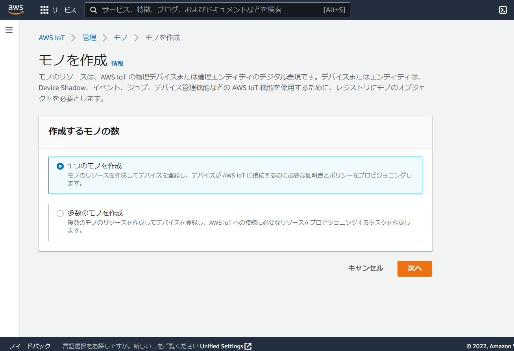
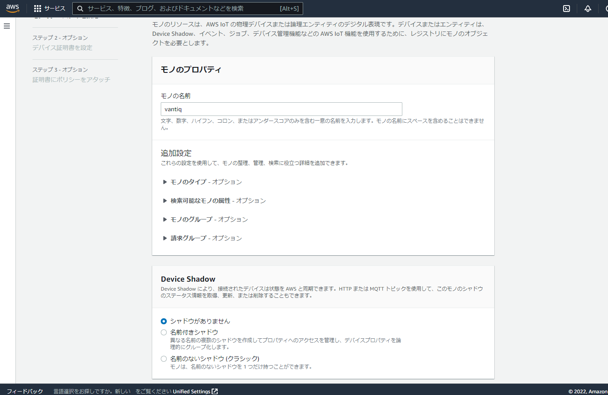
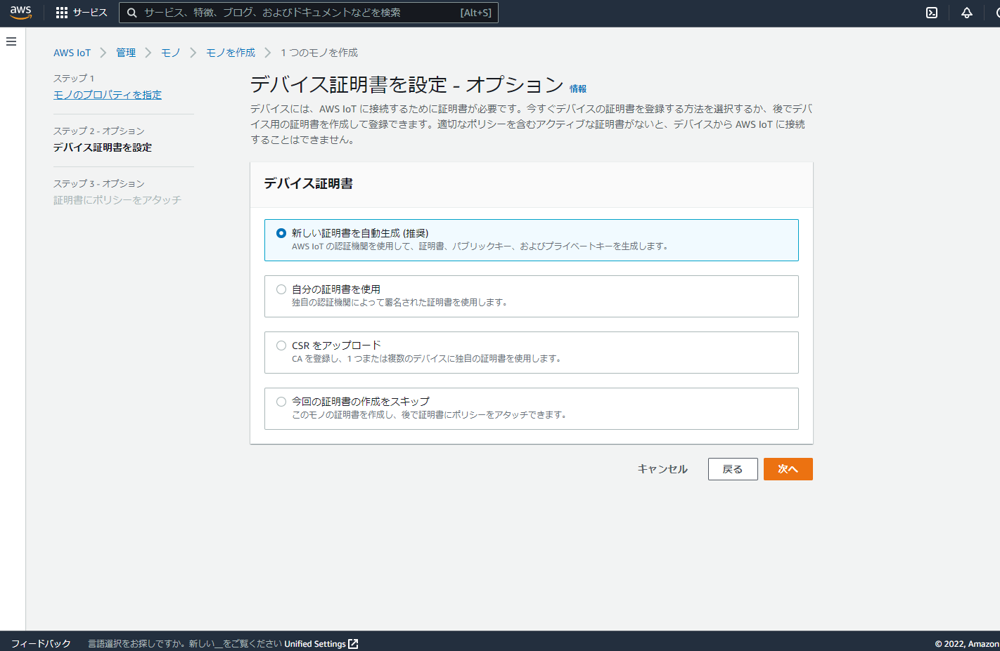
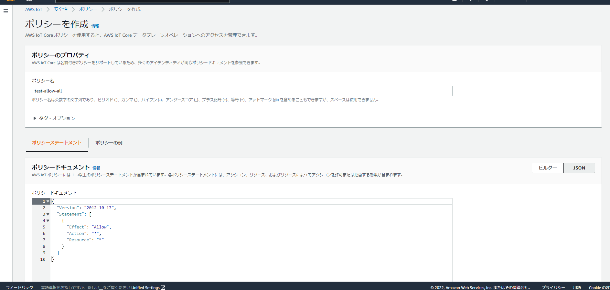
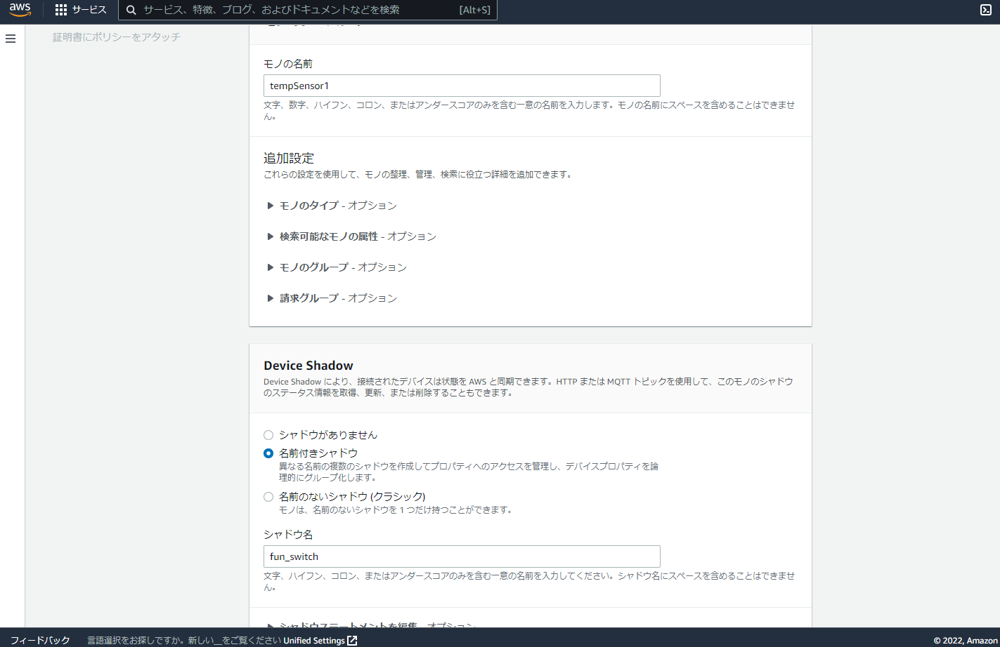
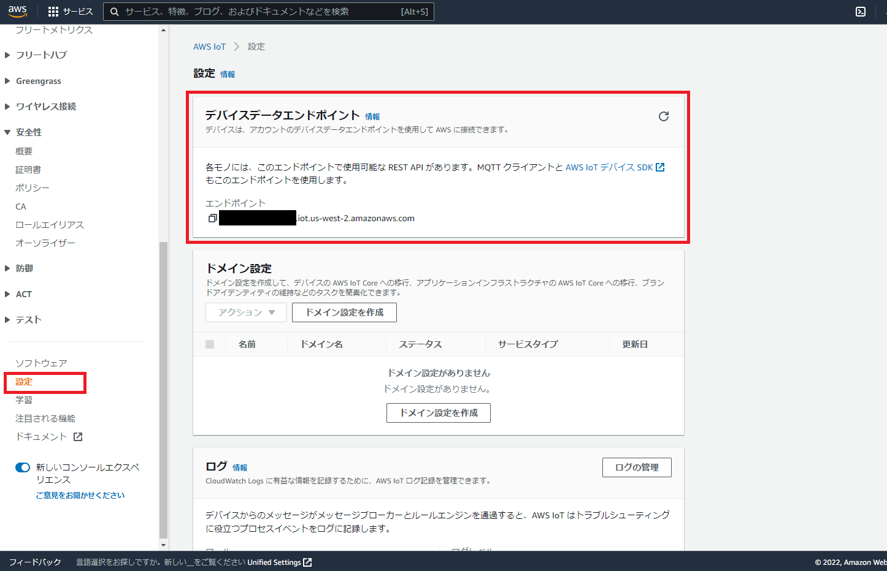
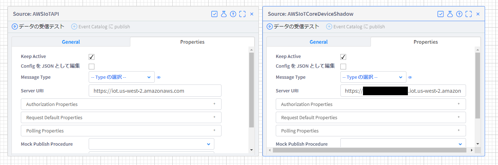
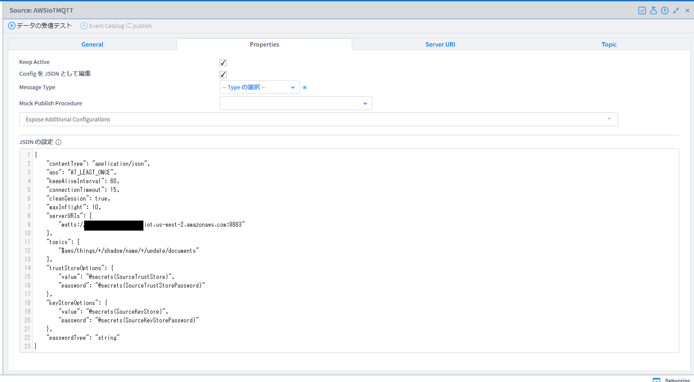

# Introduction
This article describes how to collaborate with AWS IoT APIs directly from Vantiq.    

From Vantiq, the following collaborations are possible.    

- Receive data (telemetry) from Vantiq to devices    
  Can Pub/Sub to MQTT on AWS IoT Core by setting mutual authentication in MQTT Source.  

- Read/write property values (Registry)    
  Can only be operated from AWS Console | CLI | IoT API.    
  Can be done by calling AWS IoT API.    

- Transmit properties (Control Signal)    

  Use Device Shadow.  
  Device Shadow supports HTTPS | MQTT, both of which are supported by Vantiq.  


This document describes how to do the following from Vantiq's Procedures.  

- Retrieve a list of "Things"  
- Retrieve details (Registry, Properties) of "Things"  
- Retrieve properties (Control Signal, Device Shadow) of "Things"  

- Update properties of "Things" (POST to Device Shadow)  

## Prerequisites
Vantiq Server v1.33 or higher is required

## Configuration of IoT Core
Prepare the Access key and the Secret key for your account to run AWS IoT Core REST API from Vantiq.  

## Creating "Things" for Vantiq assignment  
Create "Things" with the AWS console for assignment to Vantiq in order to make a connection from Vantiq to AWS IoT Core's MQTT.    
Go to AWS IoT > Manage > Things, and create "Things" as the followings.    
- Specify the property of a "Thing"  
  - The name of a "Thing"  
    `vantiq`
- Configure the device certificate    
  `新しい証明書を自動生成`  
    => Download certificate and key files and CA certificate file beforehand.  
- Attach the policy to the certificate    
  Create the following policy and attach.      
    ```json
    {
      "Version": "2012-10-17",
      "Statement": [
        {
          "Effect": "Allow",
          "Action": "*",
          "Resource": "*"
        }
      ]
    }
    ```

※ The above policy allows everything, but should essentially grant only the necessary permissions.  

Select `Create a single thing`


For Device Shadow, select the default `シャドウがありません`  


Select `新しい証明書を自動生成(推奨)`  


For policy, click `Create a policy` and move to the following screen. Create it there.    
The policy name can be any (`test-allow-all` in the image example). After creation, return to the original screen and check the checkbox for the policy name created.  


## Create a "Thing" for testing  
Create with the AWS console in the same way.    
- Specify the property of a "Thing"  
  - The name of a "Thing"    
    `tempSensor1`
  - Device Shadow
    - Select `名前付きシャドウ`  
    - The name of the Device Shadow    
      `fun_switch`
-  Configure the device certificate     
  `新しい証明書を自動生成`    
    => Download certificate and key files beforehand.  
- Attach the policy to the certificate    
  Attach the policy created by "Thing" "Vantiq" since it is for testing.    

In Device Shadow, select `名前付きシャドウ` and provide a Shadow name.  


## Create a JKS file  
Create a JKS file for server/client proofing when connecting from Vantiq's MQTT Source to AWS IoT Core's MQTT. The work environment must have java (keytool command) and openssl installed, and confirmed with the following versions in this procedure.       
References (Japanese):  
[はまりやすい難所！ 証明書ファイル（jksファイル）の作成方法 | 株式会社AMG Solution](https://amg-solution.jp/blog/13884)   
[Javaのkeytoolのキーストア（JKS）からPEM形式の証明書、秘密鍵に変換する方法 - Qiita](https://qiita.com/yasushi-jp/items/4aa690fbde11841686e5)  

```bash
$ java --version
openjdk 17.0.2 2022-01-18 LTS
OpenJDK Runtime Environment Zulu17.32+13-CA (build 17.0.2+8-LTS)
OpenJDK 64-Bit Server VM Zulu17.32+13-CA (build 17.0.2+8-LTS, mixed mode, sharing)

$ openssl version
OpenSSL 1.1.1f  31 Mar 2020
```

## Create a truststore file

Create a truststore file with the following command. Set any password as it is necessary to set a password when executing the command.    
**Make a note of the password that is set in the JKS file, as it needs to be set in the MQTT Source.**  
After execution, it asks "Trust this certificate?[no]:". Enter "yes".

```bash
# Generate the JKS file (the generated file name is "myTrustStore.jks")
$ keytool -import -storetype JKS -keystore myTrustStore.jks -storepass <any password> -alias <any alias name> -file <CA certificate file>

# Check the contents of the JKS file  
$ keytool -list -v -keystore myTrustStore.jks -storetype JKS -storepass <Password set in the JKS file>

```

## Create a keystore file  
After converting the downloaded both the certificate and the private key file of the "Thing" to a PKCS12 format file wiht the openssl command, convert it to a JKS file with the keytool command.  
Password should be set any one for each.    
**Make a note of the password that is set in the JKS file, as it needs to be set in the MQTT Source.**  

```bash
# Generate the PKCS12 file (the generated file name is "keystore.p12")  
$ openssl pkcs12 -export -in <Certificate of the "Thing" (xxx-certificate.pem.crt)> --name vantiq -inkey <Private key of the "Thing" (xxx-private.pem.key)> -out keystore.p12 -passout pass:<any password>

# Generate the JKS file (the generated file name is "keystore.jks")  
$ keytool -importkeystore -srckeystore keystore.p12 -srcstoretype PKCS12 -srcstorepass <Password set in the PKCS file> -destkeystore keystore.jks -deststoretype JKS -deststorepass <Any password to be set for the JKS file> -destkeypass <Any password to be set for the JKS file>

# Check the contents of the JKS file  
$ keytool -list -v -keystore keystore.jks -storetype JKS -storepass <Password set in the JKS file>

```

# Create Vantiq Resources  

## Register Secrets  
Register the following four Secret.    

- SourceTrustStore  
  Specify the base64-encoded value of the truststore file returned by the following command.    
  ```bash
  $ cat myTrustStore.jks | base64 | tr -d "\n" ; echo
  ```

- SourceTrustStorePassword  
  Password set in the myTrustStore.jks    

- SourceKeyStore  
  Specify the base64-encoded value of the keystore file returned by the following command.  
  ```bash
  $ cat keystore.jks | base64 | tr -d "\n" ; echo
  ```

- SourceKeyStorePassword  
  Password set in the keystore.jks  

## Create Sources

The **デバイス接続エンドポイント** can be found in the Device Data Endpoints column of the **AWS IoT > Settings** in the AWS console as the following.      
Make a note of it, as it is necessary for creating Sources and Procedures.  




### Create Remote Sources  
Create the following two types.  

- Source Name  
  `AWSIoTAPI`
- Server URI  
  `https://iot.us-west-2.amazonaws.com`  
    ※ The above is for us-west-2.    
    For other regions, refer to [AWS IoT Core endpoints and quotas - AWS General Reference](https://docs.aws.amazon.com/general/latest/gr/iot-core.html#iot-core-control-plane-endpoints).  

- Source Name  
  `AWSIoTCoreDeviceShadow`
- Server URI  
  `https://<Device Connection Endpoint>`



### Create MQTT Source

Specify in topic the publication destination for all "Things" named shadows when they are updated.    
Use of Device Shadow is assumed in this procedure.  
However, since Device Shadow uses some Topics of AWS IoT Core's MQTT as reserved, it is possible to Pub/Sub to AWS IoT Core's MQTT with the created Source.  
[Reserved topics - AWS IoT Core](https://docs.aws.amazon.com/iot/latest/developerguide/reserved-topics.html)

In actual use, the Source should be divided according to the topic design, etc.  
Reference (Japanese): [AWS IoT Core の MQTT トピックの設計](https://d1.awsstatic.com/whitepapers/ja_JP/Designing_MQTT_Topics_for_AWS_IoT_Core.pdf)


Create the following Source.  

- Source Name  
  `AWSIoTMQTT`
- Source Type  
  `MQTT`
- Config(Properties > Edit Config as JSON)  
```json
{
    "contentType": "application/json",
    "qos": "AT_LEAST_ONCE",
    "keepAliveInterval": 60,
    "connectionTimeout": 15,
    "cleanSession": true,
    "maxInflight": 10,
    "serverURIs": [
        "mqtts://<Device Connection Endpoint>:8883"
    ],
    "topics": [
        "$aws/things/+/shadow/name/+/update/documents"
    ],
    "trustStoreOptions": {
        "value": "@secrets(SourceTrustStore)",
        "password": "@secrets(SourceTrustStorePassword)"
    },
    "keyStoreOptions": {
        "value": "@secrets(SourceKeyStore)",
        "password": "@secrets(SourceKeyStorePassword)"
    }
}
```

Create the Source like the following.  


## Create Procedures for Sig v4 processing and header creation required for AWS API calls  
As for the details of Signature, refer to [Signing AWS requests with Signature Version 4 - AWS General Reference](https://docs.aws.amazon.com/general/latest/gr/sigv4_signing.html).  

- Procedure to convert binary and hexadecimal numbers required for signatures.  
```
PROCEDURE AWSAPIUtils.dec2sbin(dec Integer)
if (dec < -128 || dec > 127) {
    exception("Argument Error", format("Argument [dec] must be range between -128 and 127. [dec]={0}", dec))
}
var isNegative = false
if (dec < 0) {
    dec += 128
    isNegative = true
}
var bin = ""
var limit = dec == 0 ? 1 : Math.log2(dec) + 1
for (i in range(0, limit, 1)) {
    if (dec % 2 == 0) {
        bin = "0" + bin
    } else {
        bin = "1" + bin
    }
    dec = parseInt(dec / 2)
}
var length = length(bin)
if (length % 8 != 0) {
    bin = repeat("0", (8 - length % 8)) + bin
}
if (isNegative) {
    bin = "1" + bin.substring(1)
}
return bin
```

```
PROCEDURE AWSAPIUtils.dec2shex(dec Integer)
if (dec < -128 || dec > 127) {
    exception("Argument Error", format("Argument [dec] must be range between -128 and 127. [dec]={0}", dec))
}
var bin = AWSAPIUtils.dec2sbin(dec)
var result = ""
for (i in range(0, length(bin), 4)) {
    var tempStr = toString(parseInt(bin[i]) * 8 + parseInt(bin[i+1]) * 4 + parseInt(bin[i+2]) * 2 + parseInt(bin[i+3]))
    if (length(tempStr) == 2) {
        if (tempStr == "10") {
            result += "A"
        } else if (tempStr == "11") {
            result += "B"
        } else if (tempStr == "12") {
            result += "C"
        } else if (tempStr == "13") {
            result += "D"
        } else if (tempStr == "14") {
            result += "E"
        } else if (tempStr == "15") {
            result += "F"
        }
    } else {
        result += tempStr
    }
}
return result
```

- Signature Procedure  
```
PROCEDURE AWSAPIUtils.genSignatureVer4AWS(access_key, date, region, service_name, str_to_sign)

var k_secret = "AWS4" + access_key
var k_data = Hash.hmacSha256(k_secret, date)
var k_region = Hash.hmacSha256(k_data, region)
var k_service = Hash.hmacSha256(k_region, service_name)
var k_signing = Hash.hmacSha256(k_service, "aws4_request")

var bytes = Hash.hmacSha256(k_signing, str_to_sign)
var signature = ""

for (i in range(0, bytes.length())) {
    signature += AWSAPIUtils.dec2shex(bytes[i].intValue())
}

return signature.toLowerCase()
```

- Call the above three Procedures in the process in Procedure to create the headers required for API calls.  
```
PROCEDURE AWSAPIUtils.genAWSAPIHeaders(task1, task2, task3, task4)
// Parameters
// -----------
// task1 {
//     "method": string
//     "request_parameters": string
//     "payload": string(json stringify)
//     "canonical_headers_map": {
//         "host": string
//         "x-amz-date": string(formated "yyyyMMdd'T'HHmmss'Z'")
//     }
//     "canonical_uri": string
// }
// task2 {
//     "datestamp": string(formated "yyyyMMdd")
//     "region": string
//     "service_name": string
//     "amzdate": string(formated "yyyyMMdd'T'HHmmss'Z'")
// }
// task3 {
//     "secret_key": string
// }
// task4 {
//     "access_key": string
// }

// Task1: Create a canonical request
var canonical_querystring = task1.request_parameters
var payload_hash_bytes = Hash.sha256(task1.payload)
var payload_hash = ""
for(i in range(0, payload_hash_bytes.length())){
    payload_hash += AWSAPIUtils.dec2shex(payload_hash_bytes[i].intValue())
}
payload_hash = payload_hash.toLowerCase()

var sorted_canonical_headers_list = []
for(h in task1.canonical_headers_map){
    sorted_canonical_headers_list.push(h.key)
}
if(task1.payload != ""){
    sorted_canonical_headers_list.push("x-amz-content-sha256")
}
sorted_canonical_headers_list = sorted_canonical_headers_list.sort()

var canonical_headers = ""
var signed_headers = ""
var headers_counter = 0
for(h in sorted_canonical_headers_list){
    var hf = h
    hf = hf.toLowerCase()
    var hf_value = hf == "x-amz-content-sha256" ? payload_hash : task1.canonical_headers_map[h]
    canonical_headers += hf + ":" + hf_value + "\n"
    signed_headers += hf
    if(headers_counter < sorted_canonical_headers_list.length() - 1){
        signed_headers += ";"
    }
    headers_counter++
}

var canonical_request = task1.method + "\n" + task1.canonical_uri + "\n" + canonical_querystring + "\n" + canonical_headers + "\n" + signed_headers + "\n" + payload_hash

//Task2: Create the string to sign
var algorithm = "AWS4-HMAC-SHA256"
var credential_scope = task2.datestamp + "/" + task2.region + "/" + task2.service_name + "/" + "aws4_request"
var canonical_request_hash = Hash.sha256(canonical_request)
var canonical_request_hash_hex = ""
for (i in range(0, canonical_request_hash.length())){
    canonical_request_hash_hex += AWSAPIUtils.dec2shex(canonical_request_hash[i].intValue())
}
canonical_request_hash_hex = canonical_request_hash_hex.toLowerCase()
var string_to_sign = algorithm + "\n" +  task2.amzdate + "\n" +  credential_scope + "\n" + canonical_request_hash_hex

// Task3: Calculate the signature
var signature = AWSAPIUtils.genSignatureVer4AWS(task3.secret_key, task2.datestamp, task2.region, task2.service_name, string_to_sign)


// TASK4: Add signing information to the request
var authorization_header = algorithm + " " + "Credential=" + task4.access_key + "/" + credential_scope + ", " +  "SignedHeaders=" + signed_headers + ", " + "Signature=" + signature
var headers = {
    "x-amz-date": task2.amzdate,
    "Authorization": authorization_header
}
if(task1.payload != ""){
    headers["x-amz-content-sha256"] = payload_hash
}

return headers
```

Using the created AWSAPIUtils.genAWSAPIHeaders Procedure in a Procedure that calls the AWS API.  

## Crate the Procedure to retrieve a list of "Things"  

To retrieve a list of registered "Things", call the AWS IoT API.  
Reference: [ListThings - AWS IoT](https://docs.aws.amazon.com/iot/latest/apireference/API_ListThings.html)

```
PROCEDURE AWSIoTAPI.listThingsIoTCore()

var ACCESS_KEY = "<YOUR-AWS-ACCESS-KEY>"
var SECRET_KEY = "<YOUR-AWS-SECRET-KEY>"
var REGION = "us-west-2"
var HOST = "iot.us-west-2.amazonaws.com"

var date = now()
var amzdate = format("{0, date,yyyyMMdd'T'HHmmss'Z'}",date)
var datestamp = format("{0, date,yyyyMMdd}",date)

var task1 = {
    "method": "GET",
    "request_parameters": "",
    "payload": "",
    "canonical_headers_map": {
        "host": HOST,
        "x-amz-date": amzdate
    },
    "canonical_uri": "/things"
}
var task2 = {
    "datestamp": datestamp,
    "region": REGION,
    "service_name": "execute-api",
    "amzdate": amzdate
}
var task3 = {
    "secret_key": SECRET_KEY
}
var task4 = {
    "access_key": ACCESS_KEY
}

var path = "/things"
var headers = AWSAPIUtils.genAWSAPIHeaders(task1, task2, task3, task4)

SELECT FROM SOURCE AWSIoTAPI WITH method = "GET", path = path, headers = headers

```

Once executed, a list of "Things" can be retrieved as follows.    
```json
[
   {
      "nextToken": null,
      "things": [
         {
            "attributes": {},
            "thingArn": "arn:aws:iot:us-west-2:xxxxx:thing/tempSensor1",
            "thingName": "tempSensor1",
            "thingTypeName": null,
            "version": 1
         },
         {
            "attributes": {},
            "thingArn": "arn:aws:iot:us-west-2:xxxxx:thing/vantiq",
            "thingName": "vantiq",
            "thingTypeName": null,
            "version": 1
         }
      ]
   }
]
```

## Create the Procedure to retrieve details (Registry, Properties) of "Things"  

This can also be retrieved with the AWS IoT API.    
Reference: [DescribeThing - AWS IoT](https://docs.aws.amazon.com/iot/latest/apireference/API_DescribeThing.html)

```
PROCEDURE  AWSIoTAPI.describeThingIoTCore(thing_name)

var ACCESS_KEY = "<YOUR-AWS-ACCESS-KEY>"
var SECRET_KEY = "<YOUR-AWS-SECRET-KEY>"
var REGION = "us-west-2"
var HOST = "iot.us-west-2.amazonaws.com"

var date = now()
var amzdate = format("{0, date,yyyyMMdd'T'HHmmss'Z'}",date)
var datestamp = format("{0, date,yyyyMMdd}",date)

var task1 = {
    "method": "GET",
    "request_parameters": "",
    "payload": "",
    "canonical_headers_map": {
        "host": HOST,
        "x-amz-date": amzdate
    },
    "canonical_uri": "/things/" + thing_name
}
var task2 = {
    "datestamp": datestamp,
    "region": REGION,
    "service_name": "execute-api",
    "amzdate": amzdate
}
var task3 = {
    "secret_key": SECRET_KEY
}
var task4 = {
    "access_key": ACCESS_KEY
}

var path = "/things/" + thing_name
var headers = AWSAPIUtils.genAWSAPIHeaders(task1, task2, task3, task4)

SELECT FROM SOURCE AWSIoTAPI WITH method = "GET", path = path, headers = headers

```

Specify `tempSensor1` which is the name of the created "Thing" into the thing_name argument. Then execute it, the details of "Thing" can be retrieved as follows.  
```json
[
   {
      "attributes": {},
      "billingGroupName": null,
      "defaultClientId": "tempSensor1",
      "thingArn": "arn:aws:iot:us-west-2:xxxx:thing/tempSensor1",
      "thingId": "x-x-x-x-x",
      "thingName": "tempSensor1",
      "thingTypeName": null,
      "version": 1
   }
]
```

## Create the Procedure to retrieve properties (Control Support, Device Shadow) of "Things"  
AWS IoT Device Shadow supports both HTTPS/MQTT.   
For MQTT, since a named Shadow Topic is specified in AWSIoTMQTT that has already been created, when the Shadow is updated, the data is retrieved by Source.  

As for the details of Device Shadow's Topic, refer to [Device Shadow MQTT topics - AWS IoT Core](https://docs.aws.amazon.com/iot/latest/developerguide/device-shadow-mqtt.html).  

Here create the Procedure to retrieve the Shadow status of "Thing" via HTTPS.  

```
PROCEDURE AWSIoTAPI.getThingShadowIoTCore(thing_name, shadow_name)

var ACCESS_KEY = "<YOUR-AWS-ACCESS-KEY>"
var SECRET_KEY = "<YOUR-AWS-SECRET-KEY>"
var REGION = "us-west-2"
var HOST = "<Device Connection Endpoint>"

var date = now()
var amzdate = format("{0, date,yyyyMMdd'T'HHmmss'Z'}",date)
var datestamp = format("{0, date,yyyyMMdd}",date)

var task1 = {
    "method": "GET",
    "request_parameters": "name=" + shadow_name,
    "payload": "",
    "canonical_headers_map": {
        "x-amz-date": amzdate,
        "Host": HOST
    },
    "canonical_uri": "/things/" + thing_name + "/shadow"
}
var task2 = {
    "datestamp": datestamp,
    "region": REGION,
    "service_name": "iotdevicegateway",
    "amzdate": amzdate
}
var task3 = {
    "secret_key": SECRET_KEY
}
var task4 = {
    "access_key": ACCESS_KEY
}

var headers = AWSAPIUtils.genAWSAPIHeaders(task1, task2, task3, task4)
var path = "/things/" + thing_name + "/shadow?name=" + shadow_name

SELECT FROM SOURCE AWSIoTCoreDeviceShadow WITH method = "GET", path = path, headers = headers
```

Specify `tempSensor1` which is the name of the created "Thing" into the thing_name argument, and specify `fun_switch` into the shadow__name argument. Then execute it, the properties of "Thing" can be retrieved as follows.    

```json
[
   {
      "state": {
         "desired": {
            "welcome": "aws-iot"
         },
         "reported": {
            "welcome": "aws-iot"
         }
      },
      "metadata": {
         "desired": {
            "welcome": {
               "timestamp": 1652162711
            }
         },
         "reported": {
            "welcome": {
               "timestamp": 1652162711
            }
         }
      },
      "version": 1,
      "timestamp": 1652232283
   }
]
```

## Create the Procedure to update properties of "Things" (POST to Device Shadow)  
As for this one, AWS IoT Device Shadow supports both HTTPS/MQTT.   
For MQTT, updates can be performed by Publishing to an update topic in AWSIoTMQTT that has already been created.  
Here create the Procedure to update the Shadow status of the "Things" via HTTPS.  


```
PROCEDURE AWSIoTAPI.updateThingShadowIoTCore(thing_name, shadow_name)

var ACCESS_KEY = "<YOUR-AWS-ACCESS-KEY>"
var SECRET_KEY = "<YOUR-AWS-SECRET-KEY>"
var REGION = "us-west-2"
var HOST = "<Device Connection Endpoint>"

var body = {
  "state": {
    "desired": {
      "power": "on"
    },
    "reported": {
      "power": "on"
    }
  }
}

var date = now()
var amzdate = format("{0, date,yyyyMMdd'T'HHmmss'Z'}",date)
var datestamp = format("{0, date,yyyyMMdd}",date)

var task1 = {
    "method": "POST",
    "request_parameters": "name=" + shadow_name,
    "payload": stringify(body),
    "canonical_headers_map": {
        "host": HOST,
        "x-amz-date": amzdate
    },
    "canonical_uri": "/things/" + thing_name + "/shadow"
}
var task2 = {
    "datestamp": datestamp,
    "region": REGION,
    "service_name": "iotdevicegateway",
    "amzdate": amzdate
}
var task3 = {
    "secret_key": SECRET_KEY
}
var task4 = {
    "access_key": ACCESS_KEY
}

var headers = AWSAPIUtils.genAWSAPIHeaders(task1, task2, task3, task4)
var path = "/things/" + thing_name + "/shadow?name=" + shadow_name

SELECT FROM SOURCE AWSIoTCoreDeviceShadow WITH method = "POST", path = path, headers = headers, body = body

```

Execute the `Test Data Receipt` of the AWSIoTMQTT Source which has been created, and specify `tempSensor1` which is the name of the "Thing" created into thing_name argument, and specify `fun_switch` into the shadow_name argument. Once  execute it, the following response is returned.　　

```json
[
   {
      "state": {
         "desired": {
            "power": "on"
         },
         "reported": {
            "power": "on"
         }
      },
      "metadata": {
         "desired": {
            "power": {
               "timestamp": 1652233236
            }
         },
         "reported": {
            "power": {
               "timestamp": 1652233236
            }
         }
      },
      "version": 2,
      "timestamp": 1652233236
   }
]
```

Since the Shadow has been updated, it is possible to confirm that the following message is received at AWSIoTMQTT Source.  

```json
{
   "previous": {
      "state": {
         "desired": {
            "welcome": "aws-iot"
         },
         "reported": {
            "welcome": "aws-iot"
         }
      },
      "metadata": {
         "desired": {
            "welcome": {
               "timestamp": 1652162711
            }
         },
         "reported": {
            "welcome": {
               "timestamp": 1652162711
            }
         }
      },
      "version": 1
   },
   "current": {
      "state": {
         "desired": {
            "welcome": "aws-iot",
            "power": "on"
         },
         "reported": {
            "welcome": "aws-iot",
            "power": "on"
         }
      },
      "metadata": {
         "desired": {
            "welcome": {
               "timestamp": 1652162711
            },
            "power": {
               "timestamp": 1652233236
            }
         },
         "reported": {
            "welcome": {
               "timestamp": 1652162711
            },
            "power": {
               "timestamp": 1652233236
            }
         }
      },
      "version": 2
   },
   "timestamp": 1652233236
}
```

## Detect the Shadow update and attach the details of the "Things"  
Combining the created Source and Procedure, create a Rule that triggers the update of Shadow and creates an event attached with the detailed information of "Things" for the updated data.    

Create /tempsensor/fun_switch/update Topic for data confirmation.  

```
RULE OnDeviceShadowUpdate
WHEN EVENT OCCURS ON "/sources/AWSIoTMQTT" as msg

var payload = msg.value
var topic_name_split = split(msg.topic, "/")

var thing_details =  AWSIoTAPI.describeThingIoTCore(topic_name_split[2])

var publish_ev = {
    "thing_name": topic_name_split[2],
    "shadow_name": topic_name_split[5],
    "received_topic": msg.topic,
    "payload": payload,
    "thing_details": thing_details[0]
}

Publish publish_ev TO TOPIC "/tempsensor/fun_switch/update"

```

After creating the Rule, specify `tempSensor1` which is the name of the created "Things" into the thing_name argument, and specify `fun_switch` into the shadow_name argument. Execute it.    
It can be confirmed that the following data is published to /tempsensor/fun_switch/update Topic.  

```json
{
   "thing_name": "tempSensor1",
   "shadow_name": "fun_switch",
   "received_topic": "$aws/things/tempSensor1/shadow/name/fun_switch/update/documents",
   "payload": {
      "previous": {
         "state": {
            "desired": {
               "welcome": "aws-iot",
               "power": "off"
            },
            "reported": {
               "welcome": "aws-iot",
               "power": "on"
            }
         },
         "metadata": {
            "desired": {
               "welcome": {
                  "timestamp": 1652162711
               },
               "power": {
                  "timestamp": 1652235663
               }
            },
            "reported": {
               "welcome": {
                  "timestamp": 1652162711
               },
               "power": {
                  "timestamp": 1652235663
               }
            }
         },
         "version": 6
      },
      "current": {
         "state": {
            "desired": {
               "welcome": "aws-iot",
               "power": "on"
            },
            "reported": {
               "welcome": "aws-iot",
               "power": "on"
            }
         },
         "metadata": {
            "desired": {
               "welcome": {
                  "timestamp": 1652162711
               },
               "power": {
                  "timestamp": 1652235710
               }
            },
            "reported": {
               "welcome": {
                  "timestamp": 1652162711
               },
               "power": {
                  "timestamp": 1652235710
               }
            }
         },
         "version": 7
      },
      "timestamp": 1652235710
   },
   "thing_details": {
      "attributes": {},
      "billingGroupName": null,
      "defaultClientId": "tempSensor1",
      "thingArn": "arn:aws:iot:us-west-2:xxxx:thing/tempSensor1",
      "thingId": "x-x-x-x-x",
      "thingName": "tempSensor1",
      "thingTypeName": null,
      "version": 1
   }
}

```
