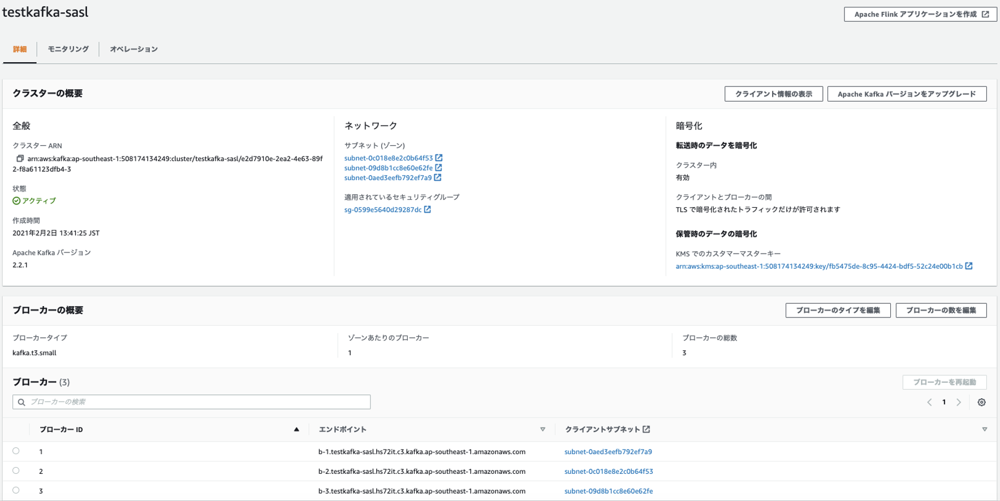
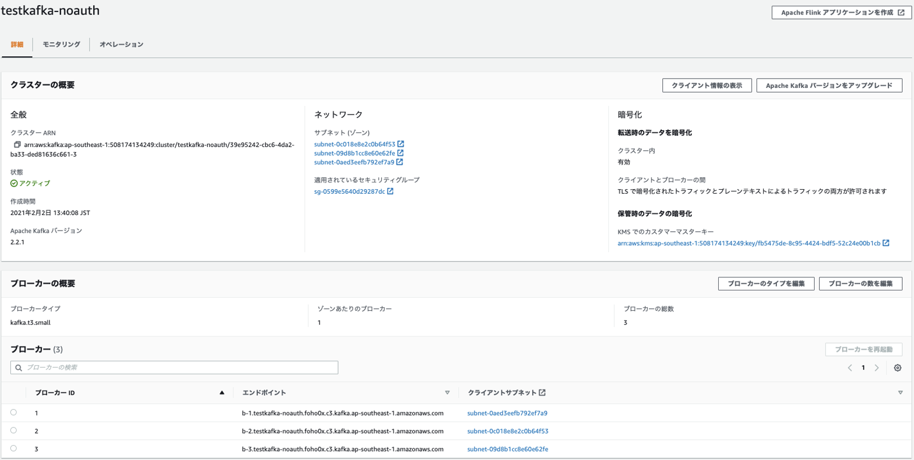
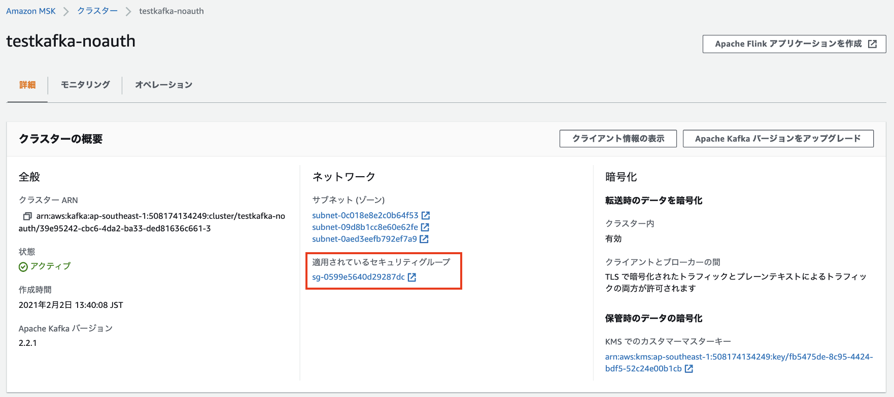
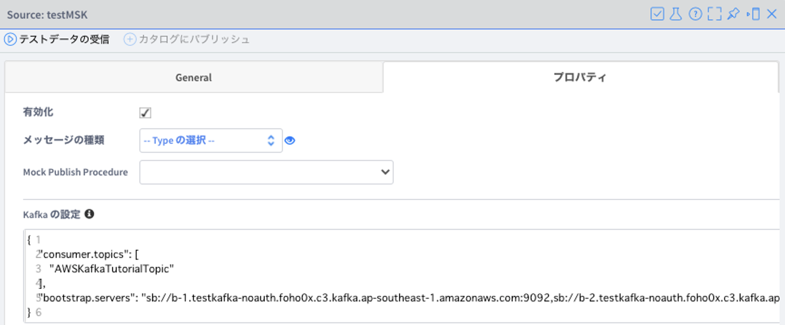
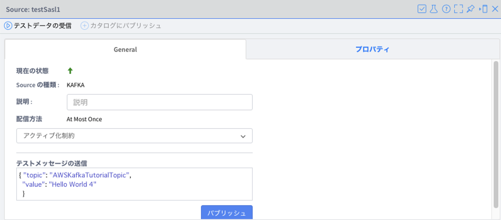
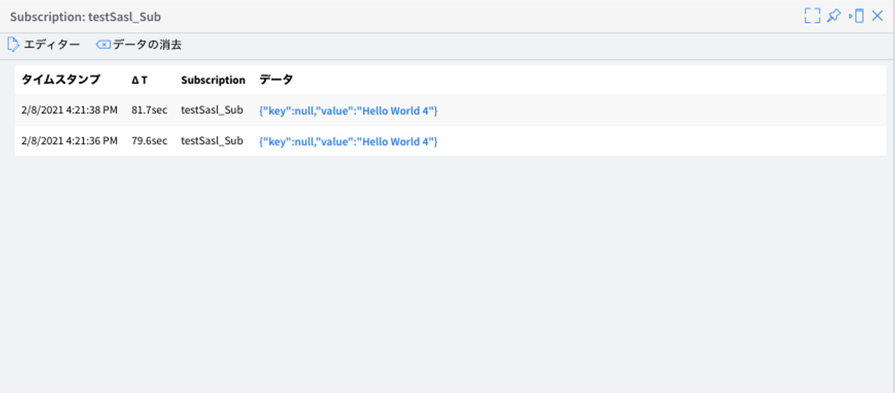

## About Amazon MSK

https://aws.amazon.com/msk/?nc1=h_ls

Amazon MSK is a fully managed service that makes it easy for you to build and run applications that use Apache Kafka to process streaming data. Apache Kafka is an open-source platform for building real-time streaming data pipelines and applications. With Amazon MSK, you can use native Apache Kafka APIs to populate data lakes, stream changes to and from databases, and power machine learning and analytics applications.


## Amazon MSK configurations

### Network Configuration

Amazon MSK does not support public endpoint.  Therefore, Vantiq private cloud or Vantiq Edge is required to integrate with Amazon MSK.  Vantiq should be in the same VPC as Amazon MSK private endpoint or the endpoint should be reachable through one of the following configurations:
- VPC Peering
- VPC Transit Gateway
- AWS Direct Connect
- REST Proxy
- VPN

### Security Configuration

Amazon MSK can be configured to use either of 3 authentication methods.  2 are supported by Vantiq.

| #   | Authentication | Vantiq Support? | Remarks |
| --- | ------------------------- | :-------------: | -------------- |
|1|No Authentication|Yes|
|2|SASL/SCRAM + TLS|Yes|The credentials should be managed through AWS Secret Manager
|3|TLS Client Certificate|No|Vantiq does not support client authentication.


## Sample Amazon MSK configurations
2 configuration samples.


**testkafka-sasl** – Kafka instance with SASL/SCRAM enabled.



Assume that the secret has been created in KMS with the following properties.
```json
{
  "username": "test",
  "password": "12345"
}
```

**testkafka-noauth** – Kafka instance with no authorization enabled.




### Network Configurations
By Default, the security group does not allow inbound connection for port 9092, 9094, 9096, 2181.  Allow inbound connection to connect to Kafka cluster from the client.




### Install Kafka

In order to use Kafka CLI, follow the instruction in [kafka](http://kafka.apache.org/quickstart) and download Kafka, then extract.
```sh
wget http://ftp.riken.jp/net/apache/kafka/2.8.0/kafka_2.13-2.8.0.tgz
tar -xzf kafka_2.13-2.8.0.tgz
cd kafka_2.13-2.8.0
```

### Configure testkafka-sasl

#### Prepare users_jaas.conf
Refer to [Username and password authentication with AWS Secrets Manager](https://docs.aws.amazon.com/msk/latest/developerguide/msk-password.html) in this step as required.

Using the credentials info in secret, create JAAS file `users_jaas.conf`.
```
KafkaClient {
   org.apache.kafka.common.security.scram.ScramLoginModule required
   username="test"
   password="12345";
};
```
Use the following command to export to `KAFKA_OPTS` env variable.
```sh
export KAFKA_OPTS=-Djava.security.auth.login.config=<path-to-jaas-file>/users_jaas.conf
```

#### Prepare client_sasl.properties
This step is to enable SSL SASL auth. Copy the keystore file in JDK to a temp location, then create `client_sasl.properties` file.
```sh
cp $JAVA_HOME/jre/lib/security/cacerts /tmp/kafka.client.truststore.jks
```
**client_sasl.properties**
```json
security.protocol=SASL_SSL
sasl.mechanism=SCRAM-SHA-512
ssl.truststore.location=/tmp/kafka.client.truststore.jks
```


#### testkafka-sasl configuration details
Confirm the details of **testkafka-sasl** in CLI. Specify `--cluster-arn` and `--region` as per the instance actually created.
```sh
$ aws kafka describe-cluster --region ap-southeast-1 \
  --cluster-arn arn:aws:kafka:ap-southeast-1:508174134249:cluster/testkafka-sasl/e2d7910e-2ea2-4e63-89f2-f8a61123dfb4-3
```
returns the following details. Note down `ClusterInfo.ZookeeperConnectString`.
```json
{
    "ClusterInfo": {
        "BrokerNodeGroupInfo": {
            "BrokerAZDistribution": "DEFAULT",
            "ClientSubnets": [
                "subnet-0c018e8e2c0b64f53",
                "subnet-09d8b1cc8e60e62fe",
                "subnet-0aed3eefb792ef7a9"
            ],
            "InstanceType": "kafka.t3.small",
            "SecurityGroups": [
                "sg-0599e5640d29287dc"
            ],
            "StorageInfo": {
                "EbsStorageInfo": {
                    "VolumeSize": 10
                }
            }
        },
        "ClientAuthentication": {},
        "ClusterArn": "arn:aws:kafka:ap-southeast-1:508174134249:cluster/testkafka-sasl/e2d7910e-2ea2-4e63-89f2-f8a61123dfb4-3",
        "ClusterName": "testkafka-sasl",
        "CreationTime": "2021-02-02T04:41:25.128Z",
        "CurrentBrokerSoftwareInfo": {
            "KafkaVersion": "2.2.1"
        },
        "CurrentVersion": "K3P5ROKL5A1OLE",
        "EncryptionInfo": {
            "EncryptionAtRest": {
                "DataVolumeKMSKeyId": "arn:aws:kms:ap-southeast-1:508174134249:key/fb5475de-8c95-4424-bdf5-52c24e00b1cb"
            },
            "EncryptionInTransit": {
                "ClientBroker": "TLS",
                "InCluster": true
            }
        },
        "EnhancedMonitoring": "DEFAULT",
        "OpenMonitoring": {
            "Prometheus": {
                "JmxExporter": {
                    "EnabledInBroker": false
                },
                "NodeExporter": {
                    "EnabledInBroker": false
                }
            }
        },
        "LoggingInfo": {
            "BrokerLogs": {
                "CloudWatchLogs": {
                    "Enabled": false
                },
                "Firehose": {
                    "Enabled": false
                },
                "S3": {
                    "Enabled": false
                }
            }
        },
        "NumberOfBrokerNodes": 3,
        "State": "ACTIVE",
        "Tags": {
            "user": "kono"
        },
        "ZookeeperConnectString": "z-1.testkafka-sasl.hs72it.c3.kafka.ap-southeast-1.amazonaws.com:2181,z-2.testkafka-sasl.hs72it.c3.kafka.ap-southeast-1.amazonaws.com:2181,z-3.testkafka-sasl.hs72it.c3.kafka.ap-southeast-1.amazonaws.com:2181"
    }
}
```
#### testkafka-sasl Create Topic
In this example, create the topic `AWSKafkaTutorialTopic`.
```sh
$ bin/kafka-topics.sh --create \
  --zookeeper "z-1.testkafka-sasl.hs72it.c3.kafka.ap-southeast-1.amazonaws.com:2181,z-2.testkafka-sasl.hs72it.c3.kafka.ap-southeast-1.amazonaws.com:2181,z-3.testkafka-sasl.hs72it.c3.kafka.ap-southeast-1.amazonaws.com:2181" \
  --replication-factor 2 \
  --partitions 1 \
  --topic AWSKafkaTutorialTopic
```

Confirm the endopoint of the broker.
```sh
$ aws kafka get-bootstrap-brokers \
  --cluster-arn arn:aws:kafka:ap-southeast-1:508174134249:cluster/testkafka-sasl/e2d7910e-2ea2-4e63-89f2-f8a61123dfb4-3 \
  --region ap-southeast-1
```
retuns the following:
```json
{
    "BootstrapBrokerStringSaslScram": "b-1.testkafka-sasl.hs72it.c3.kafka.ap-southeast-1.amazonaws.com:9096,b-3.testkafka-sasl.hs72it.c3.kafka.ap-southeast-1.amazonaws.com:9096,b-2.testkafka-sasl.hs72it.c3.kafka.ap-southeast-1.amazonaws.com:9096"
}
```

#### testkafka-sasl Connection Test – Producer

```sh
./kafka-console-producer.sh \
  --broker-list "b-1.testkafka-sasl.hs72it.c3.kafka.ap-southeast-1.amazonaws.com:9096,b-3.testkafka-sasl.hs72it.c3.kafka.ap-southeast-1.amazonaws.com:9096,b-2.testkafka-sasl.hs72it.c3.kafka.ap-southeast-1.amazonaws.com:9096" \
  --producer.config client_sasl.properties \
  --topic AWSKafkaTutorialTopic
>test message 1
>test message 23
>test message 44
>test meesagege 23
```

#### testkafka-sasl Connection Test – Consumer
```sh
./kafka-console-consumer.sh \
  --bootstrap-server "b-1.testkafka-sasl.hs72it.c3.kafka.ap-southeast-1.amazonaws.com:9096,b-3.testkafka-sasl.hs72it.c3.kafka.ap-southeast-1.amazonaws.com:9096,b-2.testkafka-sasl.hs72it.c3.kafka.ap-southeast-1.amazonaws.com:9096"
  --consumer.config client.properties \
  --topic AWSKafkaTutorialTopic \
  --from-beginning
test message 1
test message 23
test message 44
```

### Configure testkafka-noauth
#### testkafka-noauth configuration details
Confirm the details of **testestkafka-noauth** in CLI. Specify `--cluster-arn` and `--region` as per the instance actually created.
```sh
$ aws kafka describe-cluster --region ap-southeast-1 \
  --cluster-arn arn:aws:kafka:ap-southeast-1:508174134249:cluster/testkafka-noauth/39e95242-cbc6-4da2-ba33-ded81636c661-3
```
returns the following details. Note down `ClusterInfo.ZookeeperConnectString`.
```json
{
    "ClusterInfo": {
        "BrokerNodeGroupInfo": {
            "BrokerAZDistribution": "DEFAULT",
            "ClientSubnets": [
                "subnet-0c018e8e2c0b64f53",
                "subnet-09d8b1cc8e60e62fe",
                "subnet-0aed3eefb792ef7a9"
            ],
            "InstanceType": "kafka.t3.small",
            "SecurityGroups": [
                "sg-0599e5640d29287dc"
            ],
            "StorageInfo": {
                "EbsStorageInfo": {
                    "VolumeSize": 10
                }
            }
        },
        "ClusterArn": "arn:aws:kafka:ap-southeast-1:508174134249:cluster/testkafka-noauth/39e95242-cbc6-4da2-ba33-ded81636c661-3",
        "ClusterName": "testkafka-noauth",
        "CreationTime": "2021-02-02T04:40:08.918Z",
        "CurrentBrokerSoftwareInfo": {
            "KafkaVersion": "2.2.1"
        },
        "CurrentVersion": "K3P5ROKL5A1OLE",
        "EncryptionInfo": {
            "EncryptionAtRest": {
                "DataVolumeKMSKeyId": "arn:aws:kms:ap-southeast-1:508174134249:key/fb5475de-8c95-4424-bdf5-52c24e00b1cb"
            },
            "EncryptionInTransit": {
                "ClientBroker": "TLS_PLAINTEXT",
                "InCluster": true
            }
        },
        "EnhancedMonitoring": "DEFAULT",
        "OpenMonitoring": {
            "Prometheus": {
                "JmxExporter": {
                    "EnabledInBroker": false
                },
                "NodeExporter": {
                    "EnabledInBroker": false
                }
            }
        },
        "LoggingInfo": {
            "BrokerLogs": {
                "CloudWatchLogs": {
                    "Enabled": false
                },
                "Firehose": {
                    "Enabled": false
                },
                "S3": {
                    "Enabled": false
                }
            }
        },
        "NumberOfBrokerNodes": 3,
        "State": "ACTIVE",
        "Tags": {
            "user": "kono"
        },
        "ZookeeperConnectString": "z-1.testkafka-noauth.foho0x.c3.kafka.ap-southeast-1.amazonaws.com:2181,z-3.testkafka-noauth.foho0x.c3.kafka.ap-southeast-1.amazonaws.com:2181,z-2.testkafka-noauth.foho0x.c3.kafka.ap-southeast-1.amazonaws.com:2181"
    }
}
```

### testkafka-noauth - Create Topic
In this example, create the topic `AWSKafkaTutorialTopic`.
```sh
$ bin/kafka-topics.sh --create --zookeeper "z-1.testkafka-noauth.foho0x.c3.kafka.ap-southeast-1.amazonaws.com:2181,z-3.testkafka-noauth.foho0x.c3.kafka.ap-southeast-1.amazonaws.com:2181,z-2.testkafka-noauth.foho0x.c3.kafka.ap-southeast-1.amazonaws.com:2181" --replication-factor 2 --partitions 1 --topic AWSKafkaTutorialTopic
```

Confirm the endopoint of the broker.

```sh
$ aws kafka get-bootstrap-brokers  --region ap-southeast-1 --cluster-arn arn:aws:kafka:ap-southeast-1:508174134249:cluster/testkafka-noauth/39e95242-cbc6-4da2-ba33-ded81636c661-3
```
returns the following:
```json
{
    "BootstrapBrokerString": "b-2.testkafka-noauth.foho0x.c3.kafka.ap-southeast-1.amazonaws.com:9092,b-1.testkafka-noauth.foho0x.c3.kafka.ap-southeast-1.amazonaws.com:9092,b-3.testkafka-noauth.foho0x.c3.kafka.ap-southeast-1.amazonaws.com:9092",
    "BootstrapBrokerStringTls": "b-2.testkafka-noauth.foho0x.c3.kafka.ap-southeast-1.amazonaws.com:9094,b-1.testkafka-noauth.foho0x.c3.kafka.ap-southeast-1.amazonaws.com:9094,b-3.testkafka-noauth.foho0x.c3.kafka.ap-southeast-1.amazonaws.com:9094"
}
```


### Testkafka-noauth  - Connection Test – Producer

```sh
$ bin/kafka-console-producer.sh --broker-list "b-2.testkafka-noauth.foho0x.c3.kafka.ap-southeast-1.amazonaws.c:9092,b-1.testkafka-noauth.foho0x.c3.kafka.ap-southeast-1.amazonaws.com:9092,b-3.testkafka-noauth.foho0x.c3.kafka.ap-southeast-1.amazonaws.com:9092" --topic AWSKafkaTutorialTopic
>test message 1
>test message 23
>test message 44
>test meesagege 23
```

### Testkafka-noauth  - Connection Test – Consumer
```sh
$ bin/kafka-console-consumer.sh --bootstrap-server "b-2.testkafka-noauth.foho0x.c3.kafka.ap-southeast-1.amazonaws.com:9092,b-1.testkafka-noauth.foho0x.c3.kafka.ap-southeast-1.amazonaws.com:9092,b-3.testkafka-noauth.foho0x.c3.kafka.ap-southeast-1.amazonaws.com:9092" --topic AWSKafkaTutorialTopic --from-beginning
test message 1
test message 23
test message 44
```


## Vantiq Configuration

### Source Configuration (No Auth)

Configuration
```json
{
    "consumer.topics": [
        "AWSKafkaTutorialTopic"
    ],
    "bootstrap.servers": "sb://b-1.testkafka-noauth.foho0x.c3.kafka.ap-southeast-1.amazonaws.com:9092,sb://b-2.testkafka-noauth.foho0x.c3.kafka.ap-southeast-1.amazonaws.com:9092,sb://b-3.testkafka-noauth.foho0x.c3.kafka.ap-southeast-1.amazonaws.com:9092"
}
```


Test Publish Sample


Test Subscribe


### Source Configuration (Sasl/Scram)
```json
{
    "bootstrap.servers": "sb://b-1.testkafka-sasl.hs72it.c3.kafka.ap-southeast-1.amazonaws.com:9096,sb://b-3.testkafka-sasl.hs72it.c3.kafka.ap-southeast-1.amazonaws.com:9096,sb://b-2.testkafka-sasl.hs72it.c3.kafka.ap-southeast-1.amazonaws.com:9096",
    "sasl.jaas.config": "org.apache.kafka.common.security.scram.ScramLoginModule required username=\"test\" password=\"12345\";",
    "sasl.mechanism": "SCRAM-SHA-512",
    "security.protocol": "SASL_SSL",
    "consumer.topics": [
        "AWSKafkaTutorialTopic"
    ]
}
```


Test Publish Message




Test Subscribe


