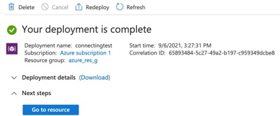
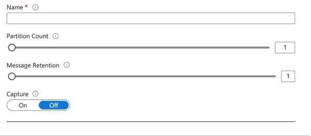
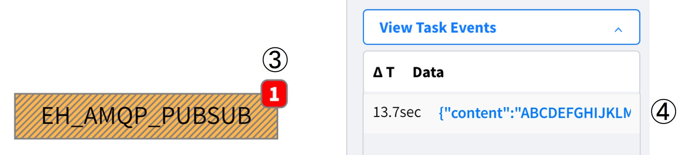
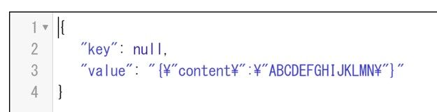

# External Connections: Azure Event Hubs (Microsoft Azure Services)
## Table Of Contents
- [How to create a User Account](#createUser)
- [How to connect using AMQP (Source)](#AMQP)
- [How to connect using Kafka (Source)](#KAFKA)
- [Information about Protocol Conversion](#TRNSPROT)
- [Information about Shared Access Key](#SASKEY)
- [Information about SAS Token](#SASTOKEN)
- [Sample Project](#EPROJ)

<h2 id="createUser">1. How to create a User Account  on Azure Event Hubs</h2>

### 1.1 Create a Namespace
Reference URL: [Quickstart: Create an event hub using Azure portal](hhttps://docs.microsoft.com/en-us/azure/event-hubs/event-hubs-create)
1. There is no Event Hubs namespace, so click the _Create event hubs namespace_ button (below figure)


### 1.2 Configure the Namespace
Modify the following items accordingly.
|Items|Details|
---|---
|Subscription|It depends.|
|Resource group|Select if it already exist, otherwise click the _Create new_ link.|
|Namespace name|Give it a unique and easy-to-understand name. e.g., connectingtest|
|Location|It depends.|
|Pricing tier|Select "Standard", because Kafka is not available in "Basic".|
|Throughput Units|It depends.|


### 1.3 Other configurations (Optional)
In the above image, there are "Feature" tab and "Tags" tab, but for now just leave them as Default.    
Then, go to the "Review + Create" tab and finish the configuration. → Wait for a while until the message "Your deployment is complete" appears (below figure).



### 1.4 Configure Event Hubs
Click "+ Event Hub" to the right of the search window (below figure) and fill in the following configuration items (bottom figure).


|Items|Details|
---|---
|Name|Give a Unique name. e.g., eh_topic|
|Partion Count|Default|
|Message Retention|Default|
|Capture|Default|


<h2 id="AMQP">2. How to connect using AMQP (Source) on Vantiq IDE</h2>

### 2.1 Configure AMQP (Source)
Modify the following items accordingly. This Source is also used for both Publisher and Subscriber.  
|Items|Details|
---|---
|① password|[SAS Token](#SASTOKEN)|
|② namespace name|Namespace name. e.g., connectingtest|
|③ Event Hub Topics Name|e.g., eh_topic|
|④ SharedAccessKeyName name|e.g., RootManageSharedAccessKey (default) Change is recommended for production environments.|
```
{
    "contentType": "application/json",
    "enabledSaslMechanisms": [
        "PLAIN"
    ],
    “password”: “<①>",
    "passwordType": "string",
    "serverURIs": [
        “amqps://<②>.servicebus.windows.net:5671"
    ],
    "topics": [
        “③/ConsumerGroups/$default/Partitions/0"
    ],
    “username”: “<④>"
}
```
### 2.2 Configure VAIL
Modify the following items accordingly.
|Items|Details|
---|---
|1: SOURCE name|e.g., EH_AMQP_PUB|
|2: topic|● Event Hub Topics Name<br>● ③ in [2.1 Configure AMQP (Source)] e.g., eh_topic|
```
PROCEDURE eh_amqp_pub()
var msg = {"message": {"content": “ABCDEFGHIJKRLMN"}}
PUBLISH msg to SOURCE <①> USING { "topic": “<②>" }
```
- For Payload, use the following structure.
```
{
  “message”: {
    “key": “value“
  }
}
```
### 2.3 Operation Verification
Run VAIL and confirm that it returns the following results. (below figure)



<h2 id="KAFKA">3. How to connect using Kafka (Source) on Vantiq IDE</h2>

### 3.1 Configure Kafka (Source)
Modify the following items accordingly.
|# and Items|Details|
---|---
|①: Namespace name|e.g., connectingtest|
|②: Password|※ (Refer to below)|
|③: Event Hub Topic Name|e.g,. eh_topic|
```
{
    “bootstrap.servers”: “sb://<①>.servicebus.windows.net:9093",
    “sasl.jaas.config”: “org.apache.kafka.common.security.plain.PlainLoginModule required username=\”$ConnectionString\“ password=\“<②>\";",
    "sasl.mechanism": "PLAIN",
    "security.protocol": "SASL_SSL“,
    "consumer.group.id": "$Default",
    "consumer.topics": [
        “<③>"
    ]
}
```
※ Detailed format of Password
|Items|Details|
---|---
|①|Namespace name. e.g., connectingtest|
|②|[Shared Access Key Name](#SASKEY)|
|③|[Shared Access Key](#SASKEY) (primary key)|
- Endpoint=sb://①.servicebus.windows.net/;SharedAccessKeyName=②;SharedAccessKey=③;
### 3.2 Configure VAIL
Modify the following items accordingly.
|# and Items|Details|
---|---
|①: Source name|It depends. e.g., KAFKA_PUBSUB|
|②: topic|e.g., eh_topic|

The "`key`" of the data to be published is optional.
```
PROCEDURE eh_kafka_pub()
PUBLISH {"value":"hello world", "key": "dummy" } to SOURCE <①> USING { "topic": "②" }
```
### 3.3 Operation Verification
Run VAIL and confirm that the data is received (①). (below figure)  


<h2 id="TRNSPROT">4. Information about Protocol Conversion</h2>

- Even if it is a single publish in AMQP, it can be received in Kafka Source at the same time (below figure)  
Note: Both &lt;Source Name&gt; and &lt;Topic Name&gt; need to be set to appropriate values.
```
PROCEDURE eh_amqp_pub()
var msg = {"message": {"content": “ABCDEFGHIJKRLMN"}}
PUBLISH msg to SOURCE <Source Name> { "topic": “<Topic Name>" }
```


- However, note that the structure of the received JSON data will look like the following.  


<h2 id="SASKEY">5. Information about Shared Access Key</h2>

1. Select _Shared access policies_ from Top Menu (below left figure)
2. Select the key to use from the listed policy. e.g., RootManageSharedAccessKey ← Default
3. Copy _Primary key_ (below right figure)

|||
---|---

<h2 id="SASTOKEN">6. Information about SAS Token</h2>

To generate a SAS Token, refer to the following URL.
- Reference URL: [Generate SAS token](https://docs.microsoft.com/en-us/rest/api/eventhub/generate-sas-token)

The following contents will be output (modify the &lt;&gt; parts accordingly).
<pre>
Authorization: SharedAccessSignature sr=&lt;NAMESPACE NAME&gt;.servicebus.windows.net&sig=&lt;SHARED ACCESS KEY&gt;&se=&lt;TOKEN EXPIRY INSTANT&gt;&skn=&lt;SHARED KEY NAME&gt;
</pre>

### Information about Common parameters and headers
- Reference URL: [Event Hubs service REST - Common parameters and headers](https://docs.microsoft.com/en-us/rest/api/eventhub/event-hubs-runtime-rest)

<h2 id="EPROJ">Sample Project on Vantiq IDE</h2>

[extConnAzure](../../conf/extConnAzure.zip)
