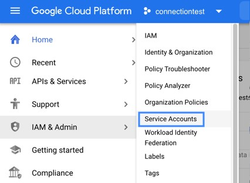

# External Connections: Google Cloud Pub/Sub (Google Cloud Platform)
## Table of Contents
- [How to create a User Account](#createUser)
- [How to connect using REMOTE (Source)](#REMOTE)
- [Sample Project](#EPROJ)

<h2 id="createUser">1. How to create a User Account on Google Cloud Pub/Sub</h2>

### 1.1 Create a Project
Work steps
|Steps|Details|
---|---
||①: Click the _CREATE PROJECT_ link|
||②: Select "Home" > "Dashboard"<br> from the top left MENU|
||③: Dashboard will be displayed|

### 1.2 Create a Service Account
- Create Google Key JSON

Work steps
|Steps|Details|
---|---
||①: Select "IMA & Admin" > "Service Accounts" from MENU|
||②: Click the _+ CREATE SERVICE ACCOUNT_ link|
||③: Service account name: It depends.<br>e.g., connect-services<br><br>④ Click the _CREATE AND CONTINUE_ button|
||⑤: Grant the following privileges<br>● Pub/Sub Admin<br>● Pub/Sub Editor<br>● Pub/Sub Publisher<br>● Pub/Sub Subscriber<br><br>Click the _DONE_ button at the bottom|
||⑥: Click the service account just created from the list|
||⑦: Use the following steps to get JSON<br>● Click the _KEYS_ tab<br>● Click the _ADD KEY_ and click the _Create new key_ at the bottom|
||⑧: Use the following steps to get JSON<br>● Select the _JSON_ radio button and click the _CREATE_ button<br>● Download of the JSON file will start automatically|

### 1.3 Create Topic/Subscription
Work steps
|Steps|Details|
---|---
||①: Select "Pub/Sub" > "Topics" from the top left MENU|
||②: Click the _CREATE TOPIC_ button|
||③: Set the _Topic ID_ e.g., connect-topic<br>④: Click the _CREATE TOPIC_ button<br>Subscription will also be created automatically.<br>e.g., connect-topic-sub（Required when defining Source.）|

<h2 id="REMOTE">2. How to connect using REMOTE (Source) on Vantiq IDE</h2>

### 2.1 Configure SOURCE
Work steps
|Steps|Details|
---|---
||①: Source Name: It depends. e.g., GOOGLE_PUBSUB<br>②: Source Type: Select _GCPS_|
||■ Click the _Properties_ tab<br>③: Project ID: It depends.<br>④: Google Key JSON: (The downloaded JSON.)<br>⑤: Polling Interval: e.g., 500|
||■ Click the _Subscription IDs_ tab<br>⑥: Click the _Add Subscription ID_ button and configure.<br>e.g., connect-topic-sub|

### Operation Verification
- **PUBLISHER**: Modify the following items accordingly.

|# and Items|Details|
---|---
|①: topicID|e.g., connect-topic|
|②: Name of SOURCE| e.g., GOOGLE_P: UBSUB|
```
PROCEDURE google_pub()
var topicID = "<①>"
PUBLISH { topicID: topicID, message: "Hello World!"} TO SOURCE <②>
```
- Execution Result


- **SUBSCRIBER**: Modify the following item accordingly.  

|# and Item|Details|
---|---
|①: Name of SOURCE| e.g., GOOGLE_PUBSUB|
```
RULE google_sub
WHEN MESSAGE ARRIVES FROM <①> AS msg
log.info("Received a message from {} with data: {}",[msg.subscriptionId, msg.data])
```
- Execution Result


<h2 id="EPROJ">Sample Project on Vantiq IDE</h2>

- [extConnGCPS](../../conf/extConnGCPS.zip)
