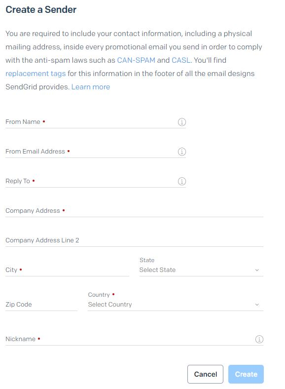
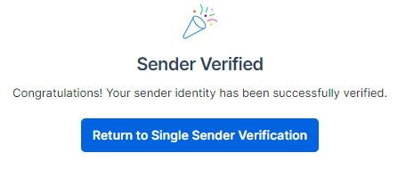
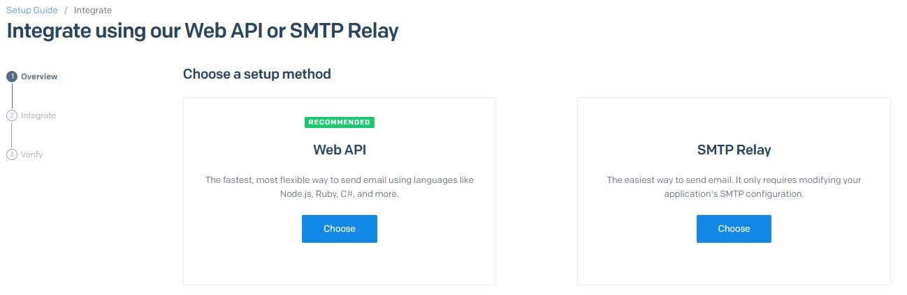
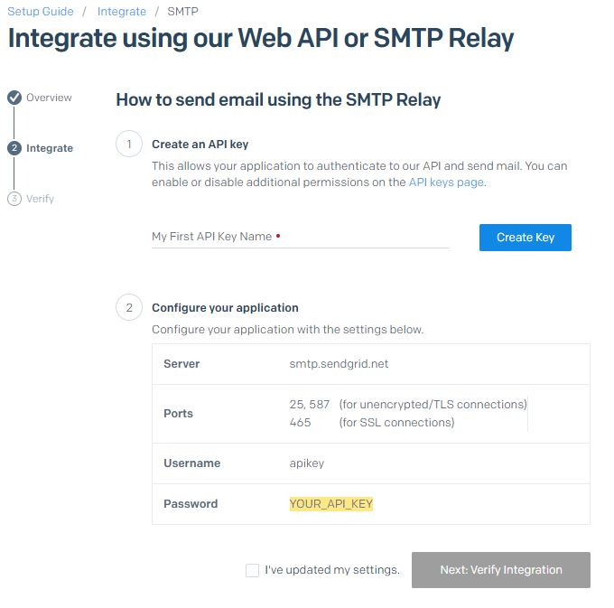
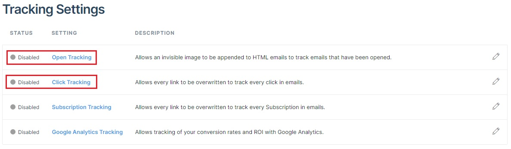
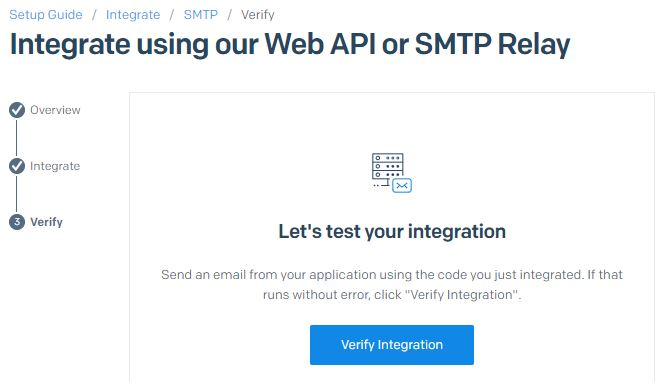
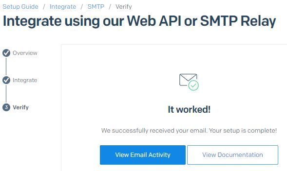
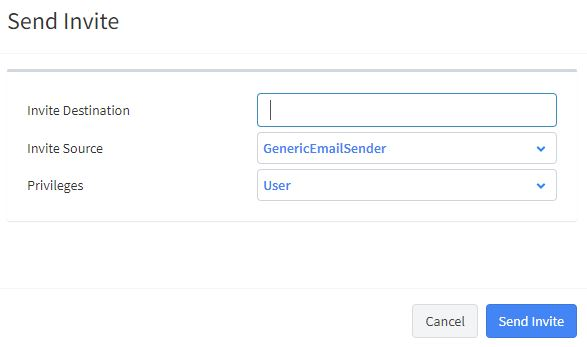
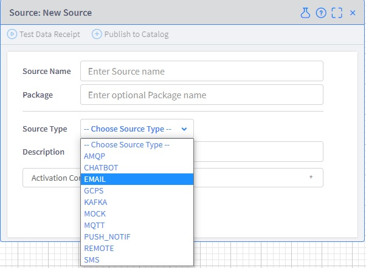

## How to register SendGrid account
- Since the purpose here is to **test the connection** with Vantiq using SendGrid, "Free Plan" is used to build the environment.

## Table Of Contents
- [Configure the SendGrid related items](#sendgrid)
  - [Access the SendGrid site](#site)
  - [Enter the login information](#login)
  - [Enter the personal information](#pinfo)
  - [Prepare the environment for sending Email](#rdyemail)
  - [Enter the Single Sender information](#inputss)
  - [Receive the confirmation email](#rcvconf)
  - [A Confirmation screen appears](#confirm)
  - [Test Email transfer](#sendemail)
  - [Select a transfer method](#select)
  - [Confirm Email transfer with MTP Relay](#smtp)
  - [Disable Tracking](#disablet)
  - [Confirm sending and receiving of Emails](#checksr)
- [Configure in the Vantiq IDE](#vantiq-ide)
  - [Configure GenericEmailSender](#genericemailsender)
  - [Configure other Email Source items](#emailsource)

<h2 id="sendgrid">1. Configure the SendGrid related items</h2>
<h3 id="site">1.1 Access the SendGrid site</h3>

- [SendGrid](https://sendgrid.com/)

- Click the "Start Free" button in the top right or the bottom right.

<h3 id="login">1.2. Enter the login information</h3>

Enter the following items.
|Items|Details|
---|---
|Email Address|Email address for membership registration|
|Password|Password (at least 16 characters)|
- Check in the following checkboxes.
  - I'm not a robot
  - I accept the Terms of Service and have read the Service Privacy Policy

- Once finished, click the "Create Account" button.
<h3 id="pinfo">1.3. Enter the personal information</h3>

Enter the following items.

|Items|Details|
---|---
|First Name|First Name|
|Last Name|Last Name|
|Company Name|Company Name|
|Company Website|Company Website|
|Country Code|Country Code|
|What is your role?|Job role|
|How many emails do you send per month?|Total number of emails sent in a month|
|How many employees work at your company?|Number of employees|

- Once entered all the information, click the "Get Started!" button.

<h3 id="rdyemail">1.4. Prepare the environment for sending email</h3>

Before sending an email, it is necessary to create a Sender ID. There are two ways to do this, but creating a Single Sernder is more efficient.

- Click the "Create a single sender" button.

<h3 id="inputss">1.5. Enter the Single Sender information</h3>

Enter the following items.
|Items|Details
---|---
|From Name|Name of forwarding source|
|From Email Address|Email address of the forwarding source|
|Reply To|Email address to reply to|
|Company Address|Company Address|
|City|City|
|Country|Country|
|Nickname|Nickname|

- Once entered all the information, click the "Create" button.

<h3 id="rcvconf">1.6. Receive the confirmation Email</h3>

- After clicking the "Create" button, the confirmation Email will be received.

- Click the "Verify Single Sender" button
- 2FA screen will appear, then follow the message.

<h3 id="confirm">1.7. A Confirmation screen appears</h3>

- After clicking the button, the following screen will be appeared.

- Click the "Return to Single Sender Verification".

<h3 id="sendemail">1.8. Test Email transfer</h3>

- Click the "Start" button in "Integrate using our Web API or SMTP Relay".

<h3 id="select">1.9. Select a transfer method</h3>

- Click the "Choose" button in "SMTP Relay".

<h3 id="smtp">1.10. Confirm Email transfer with MTP Relay</h3>

Enter the following items.
|Items|Details
---|---
|My First API Key Name|API KEY Name ・After entering, click "Create Key" button. ・**Copy the Key after creation.**|
|I've updated my settings|Check this checkbox|

- Once entered all the information, click the "Next: Verify Integration" button.
- This will rewrite the URL for Tracking, so disable it.

<h3 id="disablet">1.11. Disable Tracking</h3>

- Since the screen transitions from the above operations should be retained, the following operations should be performed in a separate tab.
- Select "Settings" > "Tracking" from the left menu (left figure below).
- Changed both "Open Tracking" and "Click Tracking" to Disabled (right figure below).

|Select Menu Item|Configuration Items|
---|---
|||

<h3 id="checksr">1.12. Confirm sending and receiving of Emails</h3>

- Once completing the above works, confirm that the Email can be transferred with [Vantiq IDE](#vantiq-ide).
- After finishing the operation verification, it should return to this screen.

- Click the "Verify Integration" button after receiving the Email.
- If it works, the following result will appear.

<h2 id="vantiq-ide">2. Configure in the Vantiq IDE</h2>

<h3 id="genericemailsender">2.1. Configure GenericEmailSender</h3>

The followings are the configurations for **GenericEmailSender** which is used to issue invitations to the Namespace. GenericEmailSender can only be configured by **system admin**.
- Log in with system account.
- Search for `GenericEmailSender` in the Search field and register it in the Project Contents Dock.

- Modify `GenericEmailSender` with the following contents.

|Items|Details|
---|---
|host|smtp.sendgrid.net|
|port|587|
|username|apikey|
|password|The API KEY value which was copied.|
|passwordType|string|
|from|Email address of administrator|

- Operation verification: use invite to Namespace to verify operation
- Enter the following items.

|Items|Details|
---|---
|Invite Destination|Email address of invite destination.|
|Invite Source|GenericEmailSender|
|Privileges|It depends.|

- Once all configurations have been made, click the "Send Invite" button.

<h3 id="emailsource">2.2. Configure other Email Source items</h3>

- The followings are the settings for generic Email Source other than GenericEmailSender.

- Create a New Source
- Select "EMAIL" as the Source Type

- The rest of the configurations are the same as below.

