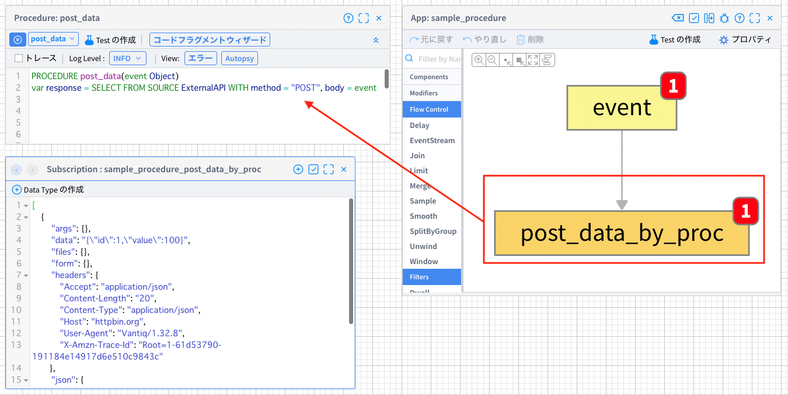
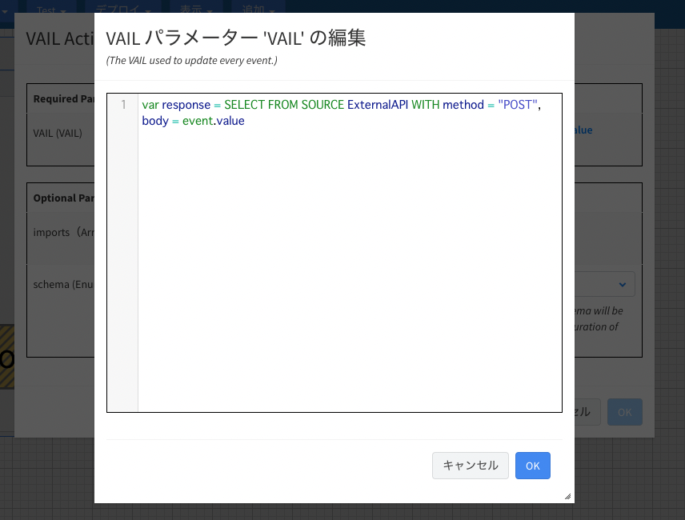
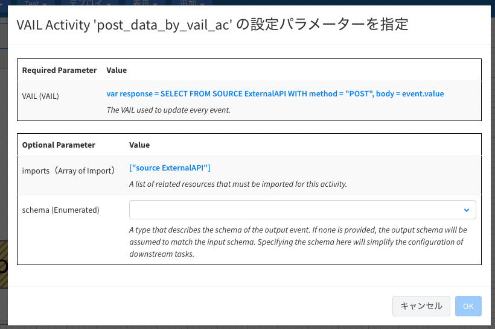
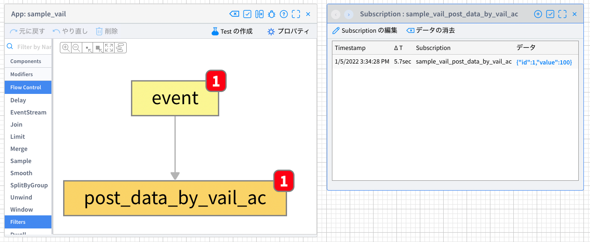
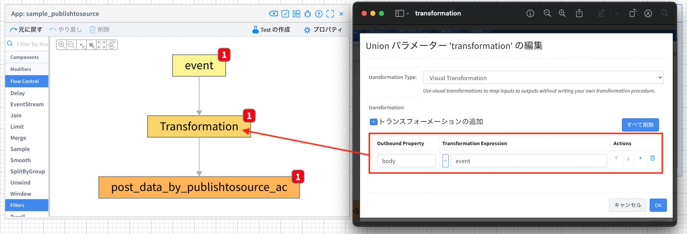
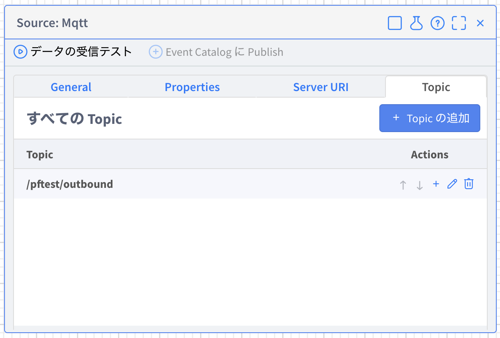

# データ送信方法まとめ

## 内容

1. [データ送信処理実装方法](#implement)
    1. [Procedureでの実装](#implement-proc)
    1. [Activity patternでの実装](#implement-ac)
        1. [VAIL Activity](#implement-ac-vail)
        1. [PublishToSource Activity (+Transformation Activity)](#implement-ac-pts)

1. [各Source別実装サンプル](#samples)
    1. [REMOTE Source](#sample-remote)
    1. [MQTT Source](#sample-mqtt)
    1. [AMQP Source](#sample-amqp)
    1. [KAFKA Source](#sample-kafka)
    1. [EMAIL Source](#sample-email)
    1. [SMS Source](#sample-sms)
    1. [サマリ](#sample-summary)

1. [注意点](#notes)
    1. [SELECT文とPUBLISH文の使い分け](#note-select-publish)
    1. [パスの設定（REMOTE）](#note-path)
    1. [Topicの設定の意味](#note-topic)
    1. [QoSとDelivery Mode](#note-qos-and-delivery-mode)

---
<br><br>

<a id="implement"></a>

## 1. データ送信処理実装方法

<a id="implement-proc"></a>

### **1. Procedureでの実装**

Procedureで送信処理を実装する方法です。そのProcedureをAppやRuleで呼び出し、データ送信を行います。

例えば、他システムのAPIを実行してデータをPOSTする際は以下のようなProcedureを実装します。
```js
PROCEDURE post_data(event Object)
var response = SELECT FROM SOURCE ExternalAPI WITH path = path, method = "POST", body = event
```
このProcedureでは`ExternalAPI`というSourceで設定されたエンドポイントに対して引数である`event`の内容をPOSTしています。

このProcedureをAppで呼び出す場合の具体例です。



画像右側にAppがあり、`post_data_by_proc`というタスクで`post_data` Procedureを`Procedure Activity`を使って呼び出しています。
post_data Procedureの引数は`event`ですが、これには同Appの`event`タスクの出力が該当します。

つまり、このAppではeventタスクの出力をPOSTしています。post_data_by_procタスクの出力（画面左下）はREST APIを実行した際のレスポンス内容が表示されています。

これは、Procedureの最終行が以下のようにREST API実行時のレスポンスとなっているためです。
```js
var response = SELECT FROM SOURCE ExternalAPI WITH path = path, method = "POST", body = event
```
<a id="implement-ac"></a>

### **2. Activity patternでの実装**
Procedureを作成しなくてもActivity Patternを使用して送信処理を実装することができます。


<a id="implement-ac-vail"></a>

#### 1. VAIL Activity

`VAIL` Activityを使用するとタスクに直接VAILを記述することができます。

先ほどと同じように前のタスクの出力を他システムのREST APIを実行してPOSTする処理を記述する場合は以下のようになります。

```js
var response = SELECT FROM SOURCE ExternalAPI WITH method = "POST", body = event.value
```


記述したVAIL内で他のリソースを使用している場合はImportする必要があります。


Procedure ActivityでProcedureを呼び出す場合の違いとしては前タスクの出力内容にアクセスする場合はeventではなく、`event.value`とする必要があります。また、このActivityが設定されたタスクの出力の内容も`event.value`となります。



<br>

<a id="implement-ac-pts"></a>

#### 2. PublishToSource Activity (+Transformation Activity)
VAILの記述自体をしない場合は`PublishToSource` Activityを使用します。また、Sourceの種類によって送信するデータに必要なプロパティが異なるため、前もってTransformation Activityで必要な形式に加工します。

PublishToSource Activityの設定では以下の画像のように送信先として使用するSourceを設定します。
送信先のTopicなど送信の際の設定がある場合は、`sourceConfig`にJSON形式で記述します（ここで設定できるプロパティについては後述します）。


例えば送信先にREMOTE Sourceを使う場合は、送信内容を`body`プロパティのバリューに設定する必要があります。

```JSON
{
    "id": 1,
    "value": 100
}
```
例えば、上記のような内容で送信したい場合は、
```JSON
{
   "body": {
      "id": 1,
      "value": 100
   }
}
```
とする必要があります。
そのため、PublishToSource Activityの前にTransformation Activityで加工しておきます。
（各Sourceごとにどのような形式が必要かは後述します。）



また、PublishToSource Activityの出力は、以下のように送信時に使用した内容となります。
```JSON
{
   "body": {
      "id": 1,
      "value": 100
   }
}
```
<a id="samples"></a>

## 2. 各Source別実装サンプル

各Sourceごとに送信処理を実装したVAILのサンプルを紹介します。

<a id="sample-remote"></a>

### **1. REMOTE Source**
```js
var data = {
    "id": 1,
    "value": 100
}
var method = "POST" 
var path = "/anything"
var headers = {
    "Content-type": "application/json",
    "Authorization": "abcdefghijk"
}
var query = {
    "sensor_id": 100
}
var response = SELECT FROM SOURCE YourRemoteSource WITH body = data, method = method, path = path, headers = headers, query = query
```
`SELECT FROM SOURCE <Source名> WITH body = <送信したい内容>`が基本形になります。その他、設定が必要な場合は`WITH`句に追加します。上記の例で行っている設定は以下の通りです。

|プロパティ名|内容|
|-|-|
|method|HTTPリクエスト時のメソッド、SELECT文の場合`デフォルトがGET`になるのでPOSTに上書き|
|headers|ヘッダー設定|
|path|REMOTE SourceのServer URIをベースとして追加されるパス。例えばServer URIの値が`https://httpbin.org`でpathが`/anything`の場合、`https://httpbin.org/anything`がリクエスト時のURLになる|
|query|クエリパラメータ|

これらのプロパティはそれぞれ`Source自体に設定することができます`がリクエストの時点で上書きしたい場合などにVAIL側に記述します。

上記以外に設定できるプロパティもあります。必要に応じてリファレンスを参照ください。
[Remote Source Integration](https://dev.vantiq.co.jp/docs/system/sources/remote/index.html)

また、REMOTE Sourceの場合は、`SELECT`文でも`PUBLISH`文でもPOSTすることができます。
```js
var data = {
    "id": 1,
    "value": 100
}
var config = {
    "path": "/anything",
    "headers": {
        "Content-type": "application/json",
        "Authorization": "abcdefghijk..."
    },
    "query": {
        "sensor_id": 100
    }
}
PUBLISH { "body": data } TO SOURCE YourRemoteSource USING config
```
`PUBLISH`文の場合はデフォルトのメソッドがPOSTであるため、上記のVAILではメソッドの設定がありません。
PUBLISHではWITHではなく`USING`句を使用します。USING句はJSON形式で記述します。
SELECT文を使用する場合とPUBLISH文を使用する場合の違いについては、[こちら](#note-select-publish)を参照してください。

<a id="sample-mqtt"></a>

### **2. MQTT Source**
```js
var data = {
    "id": 1,
    "value": 100
}
var config = {
	"topic": "/your/topic",
	"qos": "AT_LEAST_ONCE" // 指定しない場合は AT MOST ONCE
}
PUBLISH { message: data } TO SOURCE YourMqttSource USING config
```
`PUBLISH { message: <送信したい内容> } TO SOURCE <Source名> USING { "topic": <送信先のブローカーのトピック> }`が基本形になります。MQTTブローカーへの送信の際には`QoS`の設定が可能です。デフォルトは`AT MOST ONCE`ですが変更したい場合は上記の例のように`qos`プロパティを設定します。

MQTT Source自体に`Topic`、`QoS`, `Delivery Mode`の設定がございますが、これらの設定項目はデータのサブスクライブ時に使用するものであり、`送信時には使用されません`ので送信したい場合は必ず送信先のTopicを設定する必要があります。`Topic`、`QoS`,`Delivery Mode`の詳細については以下を参照してください。

[Topic設定の意味](#note-topic)

[Delivery ModeとQoS](#note-qos-and-delivery-mode)

<a id="sample-amqp"></a>

### **3. AMQP Source**
```js
var data = {
    "id": 1,
    "value": 100
}
var config = {
	"topic": "your-topic"
}
PUBLISH { message: data } TO SOURCE YourAmqpBroker USING config
```
MQTT Sourceの場合と同様に`PUBLISH { message: <送信したい内容> } TO SOURCE <Source名> USING { "topic": <送信先のブローカーのトピック> }`が基本形になります。

VantiqのAMQPは`AMQP 1.0`であり、RabbitMQなどで使用される`AMQP 0.9.1`との互換性はありません。
接続する際はブローカーの仕様を確認するようにしてください。

<a id="sample-kafka"></a>

### **4. KAFKA Source**
```js
var key = "some_key"
var data = {
    "id": 1,
    "value": 100
}
var config = {
	"topic": "your-topic"
}
PUBLISH { "key": key, "value": stringify(data) } TO SOURCE YourKafkaBroker USING config
```
`PUBLISH { "value": stringify(<送信したい内容>) } TO SOURCE <Source名> USING { "topic": <送信先のブローカーのトピック> }`が基本形になります。`key`は必須ではありません。
KAFKAで送信する際は、`key`と`value`をString型にする必要があります。

<a id="sample-email"></a>

### **5. EMAIL Source**
```js
var to_address = "yamada@your-domain.co.jp"
var from_address = "info@your-domain.com"
var subject = "From Vantiq"
var body = "<div>Hello!</div>"
var config =  { "to": to_address, "from": from_address, "subject": subject }  
PUBLISH { "html": body } TO SOURCE YourMailServer USING config
```
`PUBLISH { "html": <メールの本文> } TO SOURCE <Source名> USING { "to": <送信先のアドレス>, "from": <送信元のアドレス>, "subject": <メールの件名> }`が基本形になります。

`{ "html": <メールの本文> }`の部分はHTMLメールを送る場合です。テキストメールを送る場合は`{ "text": <メールの本文> }`となります。

また、送信先のメールアドレスが複数ある場合は、`"to":["yamada@your-domain.co.jp","suzuki@your-domain.co.jp","kawai@your-domain.co.jp"]`というように`to`プロパティに配列でメールアドレスを設定します。

<a id="sample-sms"></a>

### **6. SMS Source**
```js
var phone_number = "+81xxxxxxxxxx‬"
var body = "Hello!"
PUBLISH { "body": body } TO SOURCE YourSmsSource USING { "to": phone_number }
```
`PUBLISH { "body": <SMSの本文> } TO SOURCE <Source名> USING { "to": <送信先の電話番号> }`の形式で送信します。`to`プロパティは配列にすることはできません。

<br>

<a id="sample-summary"></a>

### **サマリ**
---
REMOTE Sourceを除き、PUBLISH文を使用してデータ送信を行います。

その際、`PUBLISH { <プロトコルごとに必要なキー>: <送りたい内容> } TO SOURCE <Source名> USING <必要な設定>`という形式になります。

Sourceごとに必要とするキーは以下の通りです。
|Source|キー|
|-|-|
|REMOTE|body|
|MQTT|message|
|AMQP|message|
|KAFKA|value|
|EMAIL|html または text|
|SMS|body|

<br>

<a id="notes"></a>

## 3. 注意点

<a id="note-select-publish"></a>

### **1. SELECT文とPUBLISH文の使い分け**
全ての種類のSourceで両方が使用できるわけではありません。詳細なレスポンス内容が必要なREMOTE SourceのみでSELECT文が使用できます。

|Source|SELECT|PUBLISH|
|-|-|-|
|REMOTE|○|○|
|MQTT|×|○|
|AMQP|×|○|
|KAFKA|×|○|
|EMAIL|×|○|
|SMS|×|○|

SELECT文とPUBLISH文による送信では以下の差があります。必要に応じて使い分けてください。
1. デフォルトのメソッドの違い

    SELECT文では`GET`、PUBLISH文では`POST`になります。

1. 返り値の違い

    SELECT文はリクエスト結果のレスポンスの内容が返り値となり、PUBLISH文ではリクエスト自体が成功したかどうかがtrue/falseで返り値となります。レスポンス内容がそれ以降の処理に必要な場合はSELECT文を使用してください。

> PUBLISH文のメソッドをGETにしてリクエストをすることもできますが、返り値はtrue/falseにしかならないため、この実装をすることはほとんどありません。

<a id="note-path"></a>

### **2. パスの設定（REMOTE Source）**

REMOTE Sourceを使用してデータ送信を行う際、`path`を追加で設定することができます。
REMOTE Sourceの`Server URI`の値をベースとして`path`の値が追加されます。
その際、pathの先頭に`/`があるかどうかで挙動が変わるので注意が必要です。

例えばServer URIの値が`https://httpbin.org/aaa/bbb/`でpathが`ccc`の場合、`https://httpbin.org/anything/aaa/bbb/ccc`がリクエスト時のURLとなりますが、pathの値が`/ccc`の場合、URLは`https://httpbin.org/ccc`になります。

先頭に`/`がある場合はルートから置き換わり、ない場合は追加されます。


<a id="note-topic"></a>

### **3. Topicの設定の意味**

ブローカー関連のSourceには以下の画像のようなTopicの設定があります（KafkaはJSON形式）。
このTopicの設定は`データをサブスクライブする際に使用するものであり、送信時に使用されるものではありません。`従って、送信だけに使うSourceである場合は、`Source自体へのTopicの設定は必要ありません。送信処理の実装で送信先のTopicを設定する必要があります。`逆に送信先とするTopicをSource自体のTopic設定に入れてしまうと、自分で送信してそのまま受信もすることになり、リソースを不必要に消費してしまうので空にしておくようにしてください。



<a id="note-qos-and-delivery-mode"></a>

### **4. QoSとDelivery Mode**

MQTT SourceにはDelivery ModeとQoSの設定項目があり、それぞれ`AT LEAST ONCE`、`AT MOST ONCE`というような値を持つ設定項目です(KAFKA SourceにはQoSの設定項目がなくAMQPには両方存在しません)。それぞれが何のQoSかは以下の通りです。
|項目|内容|
|-|-|
|QoS|サブスクライブ時のブローカーとSource間のQoS|
|Delivery Mode|Sourceがデータを受け取ってからVantiq内部（Appなど）にデータを渡す際のQoS|

どちらも`データの送信には関係がない`ことに注意してください。