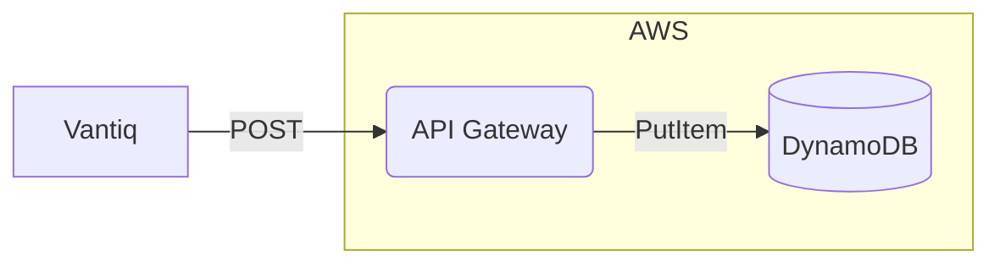
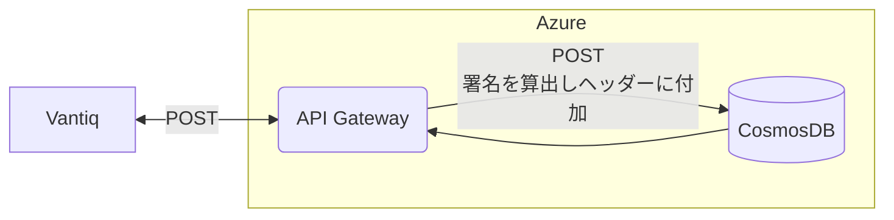
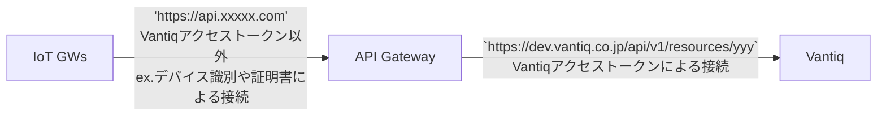
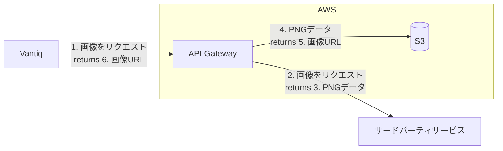

# API Gatewayと組み合わせたデザインパターン

## API Gatewayを使用する一般的な利点
- 認証基盤と連携して、セキュリティ管理を一元化できる
- クオータによる制限をかける
- クラウドAPI Gatewayは背後にあるPaaSサービスのプライベートエンドポイントと仲介する
- インタフェースのアダプタとしての利用する
- APIのバージョン管理ができる

## Vantiqが直接連携できないサービス例
以下のようなケースにおいては、Vantiqはサービスと直接連携ができないため、API Gatewayを活用する。
- ネットワーク的にリーチできない（パブリックネットワークのVantiqからプライベートネットワーク上のサービスエンドポイントへの接続）
- Vantiqがサポートするプロトコル（REST、WebSocket、MQTT、AMQP、Kafka、SMTP…)以外接続が必要である
- REST APIでVantiqがサポートするContent-Type（application/json, text/csvなど）以外のレスポンスを返す
- REST APIでリクエストの都度、リクエストメッセージに対して暗号化署名が必要である

### プライベートサービスエンドポイントとの連携
例）Amazon DynamoDBはプライベートのサービスエンドポイントのみ公開している。 Amazon API Gatewayを介して連携する。

### メッセージを署名する
例）Azure CosmoDBはCosmosDBが提供する暗号化キーで署名したものをリクエストヘッダーに付加する必要がある。その処理をAPI Gatewayで透過的に行う。

### デバイスとVantiqを疎結合化
例）デバイスは一度設置すると更新が難しい（トークン、URLなど）。一方、Vantiq側のエンドポイントが変わる可能性もある。API Gatewayにより、API層を抽象化し、セキュリティを一元的に管理する。

- 'api/v1/resources/yyy'は将来的に変わる可能性もある。
- API Gatewayで統合的に認証管理ができる

### データ形式の変換
Vantiqがサポートしない形式のデータを変換して渡す
例）
- 画像（バイナリ）→ Base64に変換 or 外部ストレージ保存の上、画像URLを取得
- Content-Typeの書き換え

