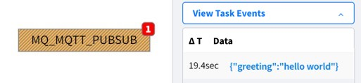

# 外部接続 : Amazon MQ (Amazon Web Services)
## Table Of Contents
- [ユーザ- アカウントの作成方法](#createUser)
- [AMQP (Source) の接続方法](#AMQP)
- [MQTT (Source) の接続方法](#MQTT)
- [サンプル プロジェクト](#EPROJ)

<h2 id="createUser">1. ユーザー アカウントの作成方法 on Amazon MQ</h2>

### 1.1 Broker の作成
作業手順  
1. 「開始方法」ボタンを押下（下図 ①）  
2. エンジンはデフォルトのまま（下図 ②）  
3. デプロイモード（It depends.）ストレージタイプ（It depends.）を選択（下図 ③）

|項番|画像|
---|---
|①||
|②||
|③||

作業手順  
1. フローカー名（It depends）e.g., MQbroker（下図 ①）  
2. ユーザー名（It depends）＆ パスワード（It depends）を入力（下図 ②）  
3. その他はデフォルト。「ブローカーの作成」ボタンを押下（15分程度の時間がかかる）（下図 ③）
4. ステータスが「実行中」になったことを確認する

|項番|画像|
---|---
|①||
|②||
|③||
|④||

作業手順  
1. 作成したブローカー名をクリック（下図 ①）
2. 「詳細な手順」リンクをクリック（下図 ②）  

|項番|画像|
---|---
|①||
|②||

### 1.2 セキュリティ設定
ブローカーへの接続を有効化する手順
|手順|内容|
---|---
||① セキュリティグループのリンクをクリック|
||② 一覧からセキュリティグループを選択|
||③ インバウンドルールのタブを選択し、「インバウンドルールを編集」のボタンをクリック|
|| ④ MQTT (8883)、AMQP (5671)、console (8162) 全て個別に定義する<br> ⑤ カスタムには 0.0.0.0/0 を上記全てに設定する|

<h2 id="AMQP">2. AMQP (Source) の接続方法 on Vantiq IDE</h2>

### 2.1 AMQP (Source) の設定
以下の項目を適宜書き換える
|項番:項目|内容|
---|---
|①: serverURIs|エンドポイントからコピー amqps://に変更（下図）|
|②: topics|It depends. e.g., /outbound/1|
|③: username|It depends|
|④: password|It depends|
```
{
    "passwordType": "string",
    "contentType": "application/json",
    "serverURIs": [
        “<①>"
    ],
    "topics": [
        “<②>"
    ],
    “username”: “<③>",
    “password”: “<④>"
}
```


### 2.2 VAIL 設定
以下の項目を適宜書き換える
|項番|内容|
---|---
|①|作成した Source の名前|
|②|上記の ② で設定した内容 e.g., /outbount/1|
```
PROCEDURE mq_amqp_pub()
var msg = {"message": {"content": "ABCDEFGHIJKLMN"}}
PUBLISH msg to SOURCE <①> USING { "topic": "<②>" }
```
### 2.3 動作確認
VAIL を実行して下記のような結果を得ることを確認


<h2 id="MQTT">3. MQTT (Source) の接続方法 on Vantiq IDE</h2>

### 3.1. MQTT (Source) 設定
以下の項目を適宜書き換える
|項番:項目|内容|
---|---
|①: username|It depends|
|②: password|It depends|
|③: sreverURLs|エンドポイントからコピー: mqtts://に変更（下図）|
|④: topics|It depends. e.g., /mq_topic/1|
```
{
    "passwordType": "string",
    "contentType": "application/json",
    "qos": "AT_LEAST_ONCE",
    "username": “<①>",
    “password”: “<②>”,
    "keepAliveInterval": 15,
    "connectionTimeout": 15,
    "cleanSession": true,
    "maxInflight": 10,
    "serverURIs": [
        “<③>"
    ],
    "topics": [
        “④"
    ]
}
```


### 3.2 VAIL 設定
以下の項目を適宜書き換える
|項番|内容|
---|---
|①|作成した Source の名前|
|②|上記の ④ で設定した内容 e.g., /mq_topic/1|
```
PROCEDURE mq_mqtt_pub()
PUBLISH { "message": {"greeting":"hello world"}} TO SOURCE <①> USING { "topic": "<②>"}
```
### 3.3 接続テスト
VAIL を実行して下記のような結果を得ることを確認



<h2 id="EPROJ">サンプル プロジェクト on Vantiq IDE</h2>

- [extConnAWS](../../conf/extConnAWS.zip)
