## 概要
この記事はVantiqからREST API　経由でDynamoDBにデータを投入するのに必要な構成と連携方法を説明する。

## 構成
DynamoDBはpublicへのendpointを持たないため、API Gateway経由でアクセスします。
•	Vantiq Cloud (Public)  
•	AWS Dynamo DB
•	AWS API Gateway

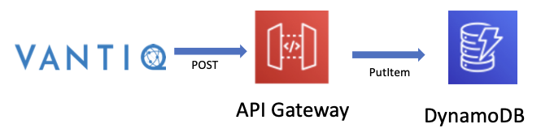


### 前提
•	Vantiq内で処理したデータを時系列データとして外部に蓄積するケースを想定している。そのため、このドキュメントでは書き込み処理のみカバーする。

 
### DynamoDBの構成
テーブルを作成する。APIの汎用的利用を考慮し、以下のキーを設定する。
- パーティションキー = id
- ソートキー = timestamp
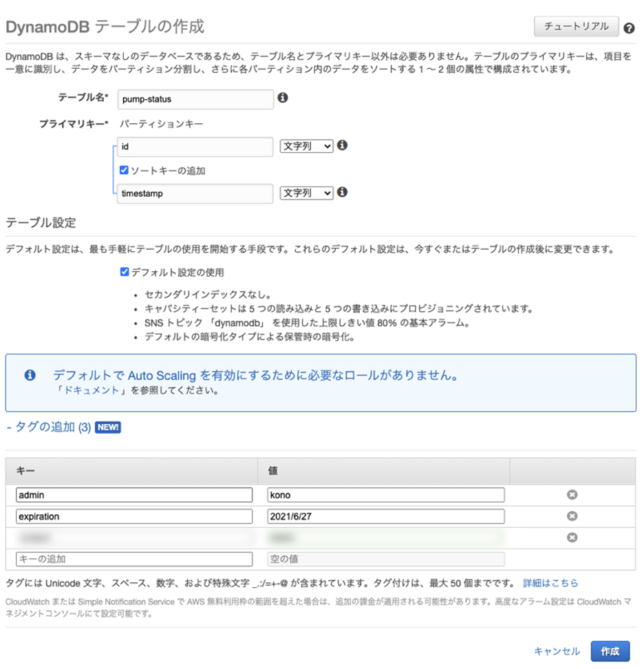

### テーブルグループを作成（オプション）
管理を容易にするため、テーブルグループをアプリ単位等で作成し、テーブルをグループに追加しておく。これは
REST　APIの操作とは関係ないので、しなくてもよい。
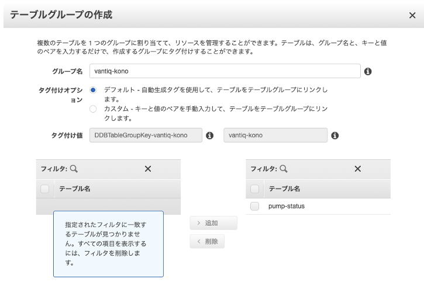

### IAM Roleの作成
API GatewayからDynamoDBを操作するためにIAM Roleを作成する。

#### ポリシーの作成
`DynamoDBWriteItem`という名前でポリシーを作成する。 DynamoDBに挿入するので、Actionで最低限 `dynamodb:PutItem`が必要。
```json
{
    "Version": "2012-10-17",
    "Statement": [
        {
            "Sid": "VisualEditor0",
            "Effect": "Allow",
            "Action": "dynamodb:PutItem",
            "Resource": "*"
        }
    ]
}
```

#### ロールの作成
DynamoDBWriteItemロールを作成し、前ステップで作成したDynamoDBWriteItemポリシーをアタッチする。
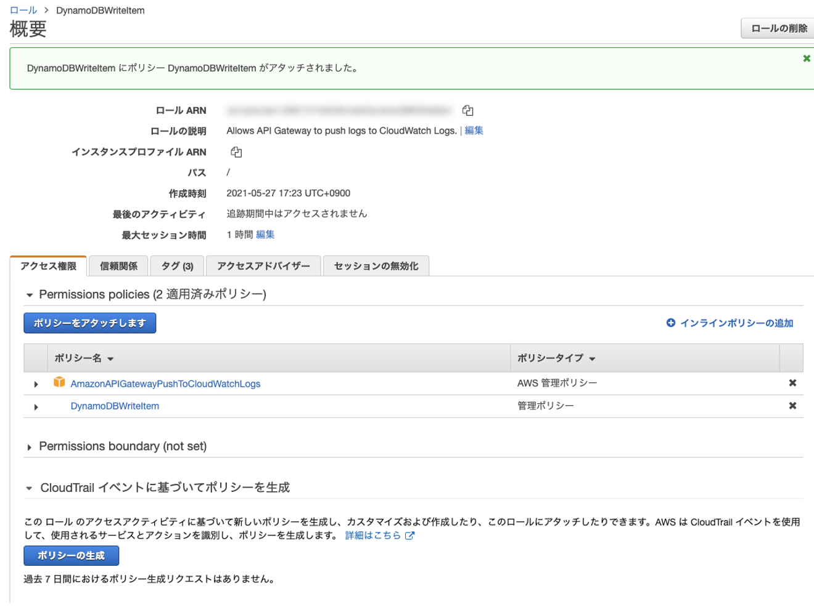

作成されたロールのARNをメモしておく。
例）`arn:aws:iam::XXXXXXXXX:role/DynamoDBWriteItem`


### API Gatewayの作成
#### API Gatewayの基本構成
REST APIを選択する。REST APIはバックエンドをAmazonサービスにすることができる。 (HTTP APIは不可)
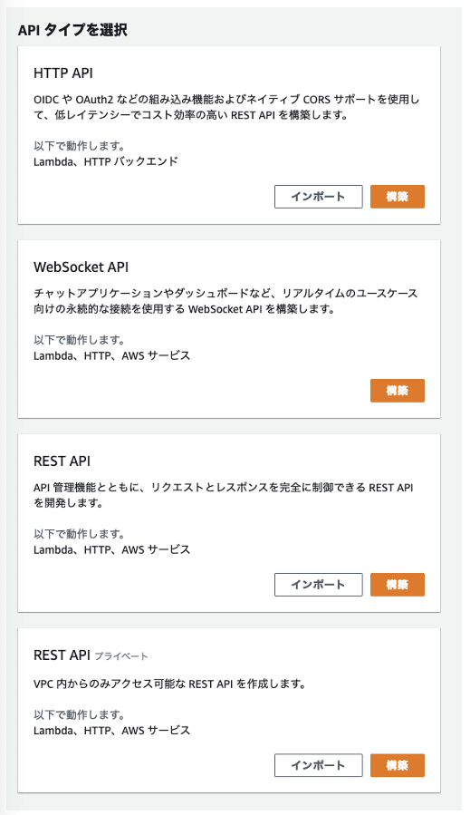


プロトコルにRESTを選択する。
API名は適当な名前でよい。
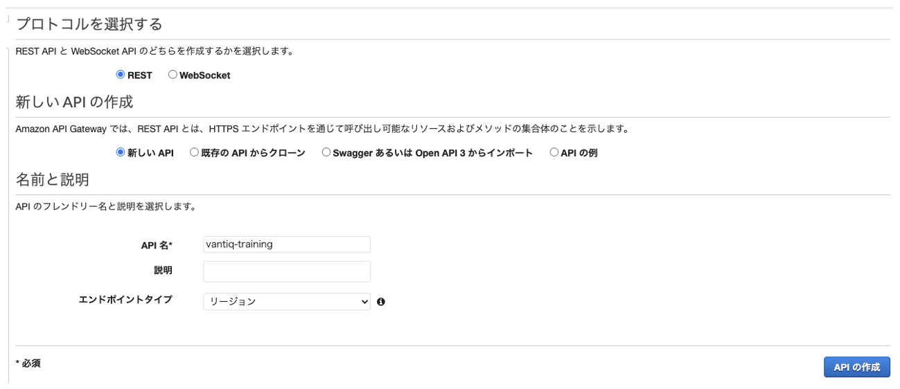


必要に応じて子リソースを設定する（下記はルートのリソースで設定している）。　
- AWSリージョン:  DynamoDBを構成したリージョン
- AWSサービス: DynamoDB
- HTTPメソッド:  POST ([DynamoDB REST API](https://docs.aws.amazon.com/amazondynamodb/latest/APIReference/API_PutItem.html)を参照)
- アクション: PutItem  ([DynamoDB REST API](https://docs.aws.amazon.com/amazondynamodb/latest/APIReference/API_PutItem.html)を参照)
- 実行ロール:  作成したロールのARN
- コンテンツの処理: パススルー（BodyをそのままDynamoDB APIに渡す）

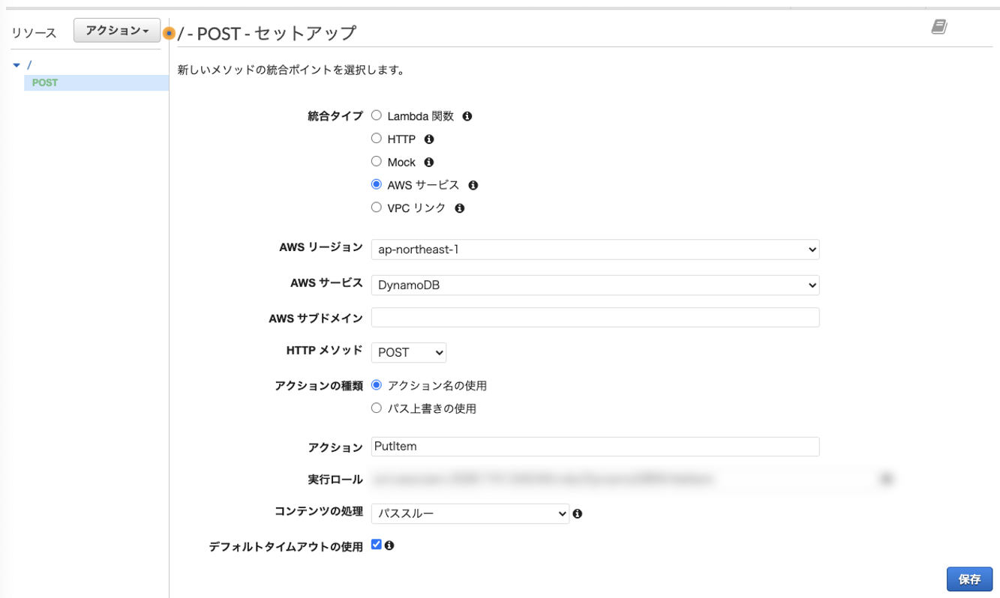

テストを実行する。
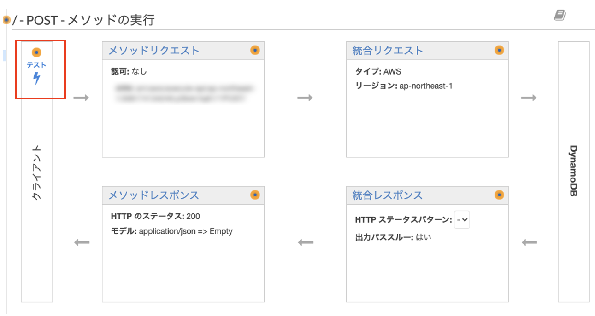
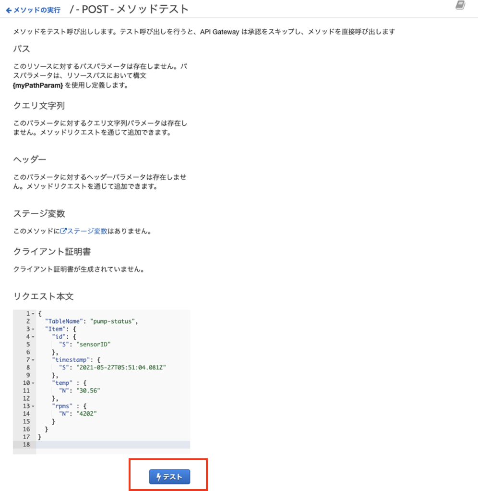

入力するJSON（フォーマットは[APIドキュメント](https://docs.aws.amazon.com/amazondynamodb/latest/APIReference/API_PutItem.html)を参照）
```json
{
  "TableName": "pump-status",
  "Item": {
    "id": {
      "S": "sensorID"
    },
    "timestamp": {
      "S": "2021-05-27T05:51:04.081Z"
    },
    "temp" : {
      "N": "30.56"
    },
    "rpms" : {
      "N": "4202"
    }
  }
}
```

挿入ができていることをDynamoDBコンソールで確認する。
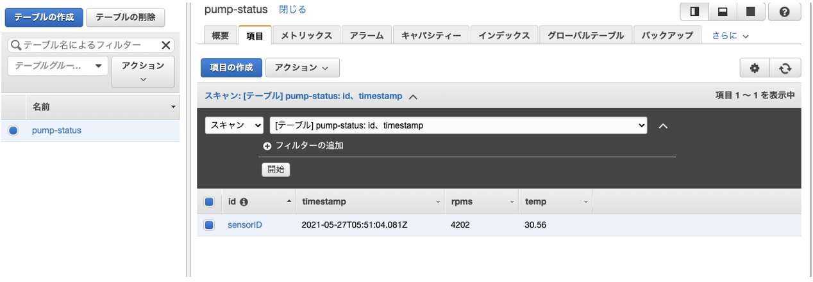


APIキーを設定（オプション）
アクセス制限のため、APIキーを生成する。
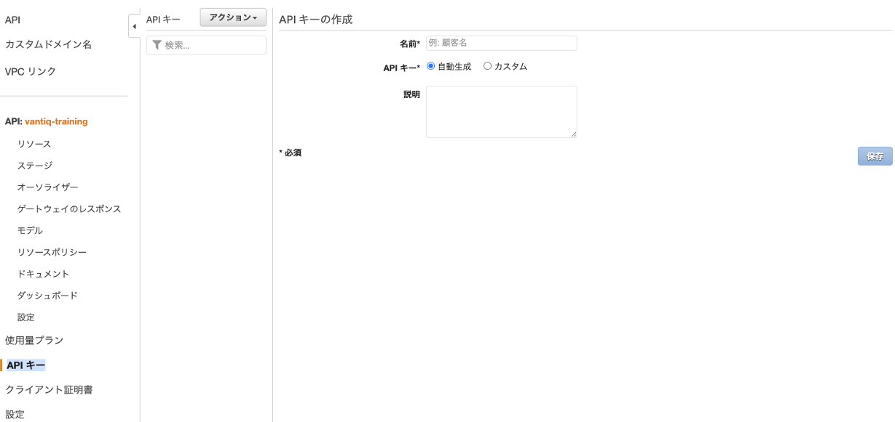


名前は任意でよい。
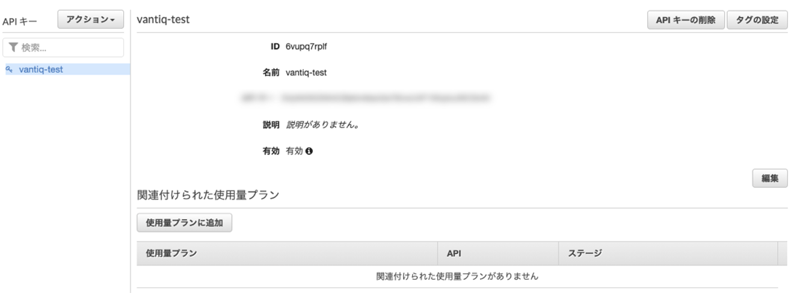

作成されたAPIキーをメモしておく。
例：`S4yNrDKZhK4CBahm6axGe7BvwU4 XXXXXXXXXXXXX`

APIキーを必須に設定する。
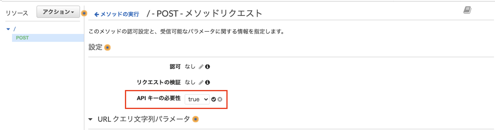


#### APIのデプロイ
APIのデプロイを行う。

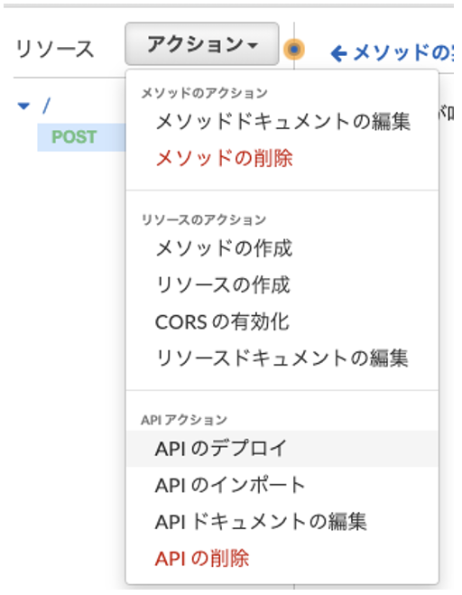


ステージ名：任意のステージ名。ここではTestとする。

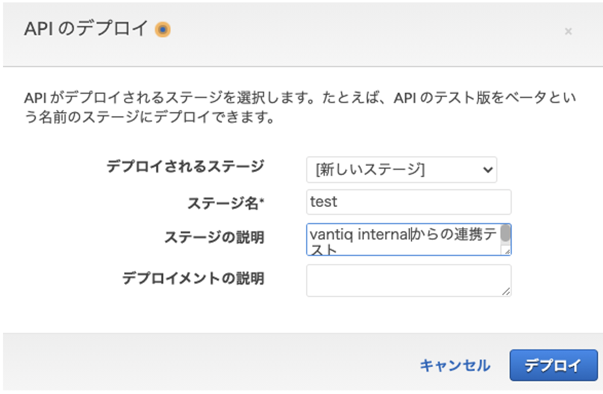
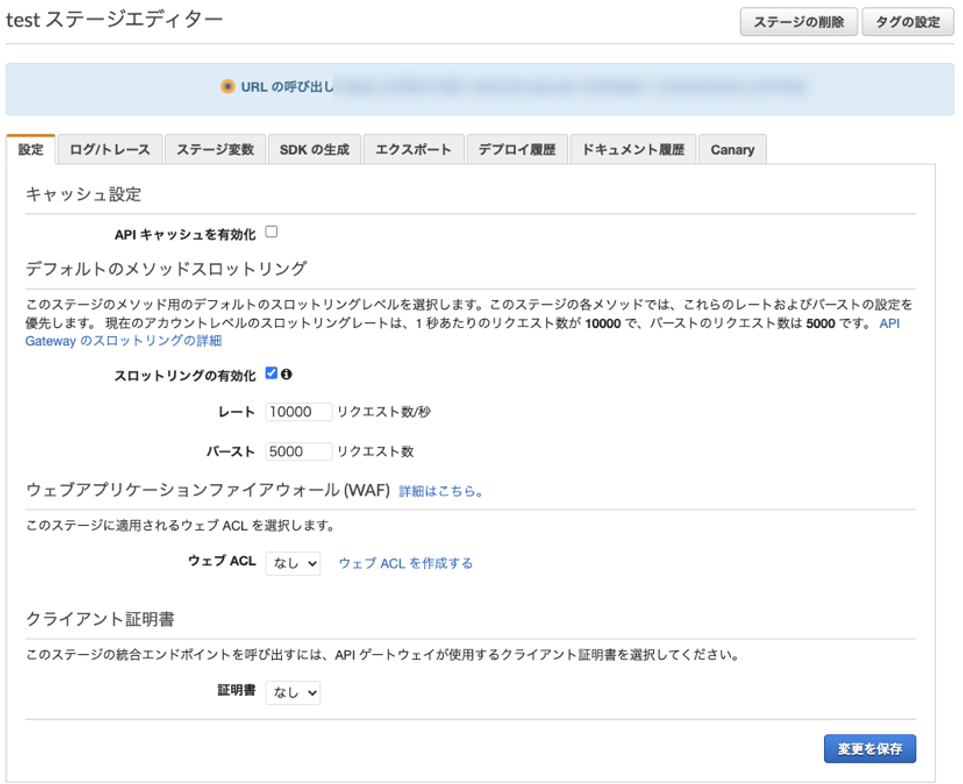


デプロイ後、APIエンドポイントをメモしておく。
例：`https://y39oxxxxxx.execute-api.ap-northeast-1.amazonaws.com/test`
 
### Vantiq Source (REMOTE)の作成

#### Schema Typeの作成（オプション）
プロパティのマッピングが容易になるので、Schema Typeを定義しておく。
`id` と `timestamp` はキーであるため、必須とした。
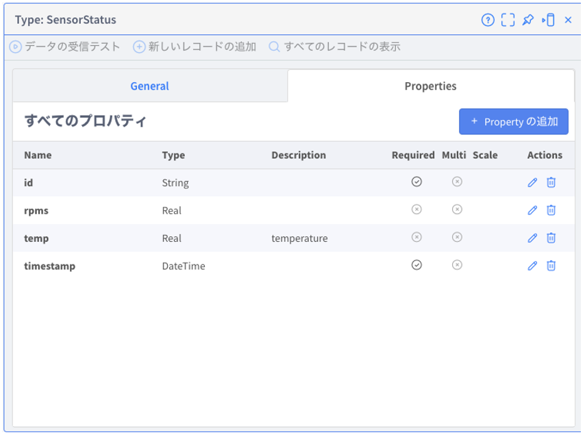


#### Sourceの作成
DynamoDB (API Gateway)に接続するSourceを作成する。
- Source Type: `REMOTE`
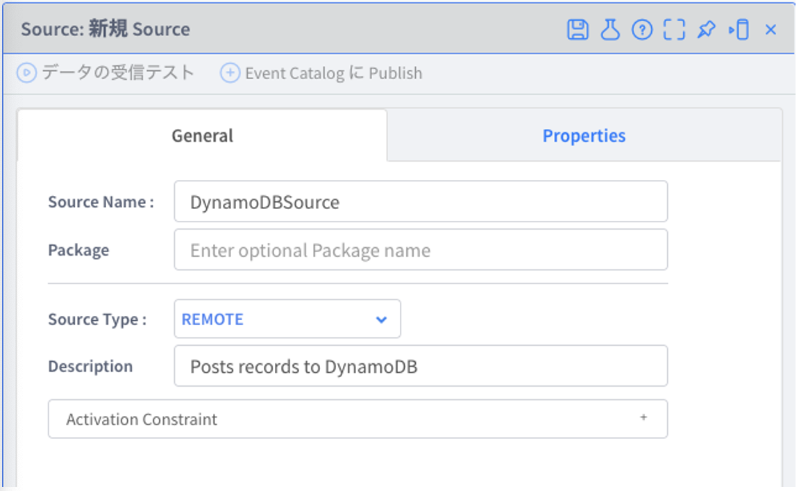
- Server URI: デプロイしたAPI Gatewayのエンドポイント
- content-type: application/json
- Header:  JSON
  - x-api-key:  生成したAPIキー
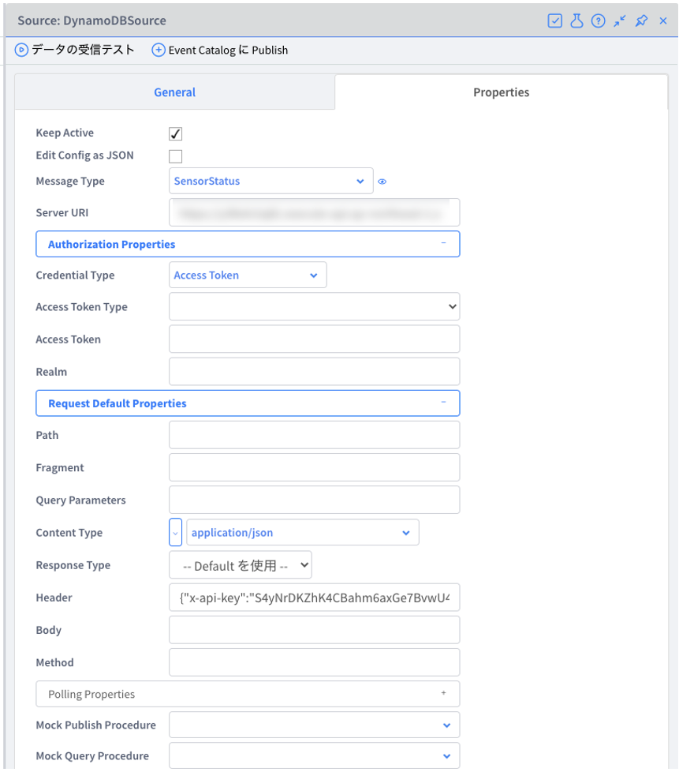

Edit Config As JSONで表示した場合
```json
{
    "pollingInterval": 0,
    "uri": "https://xxxxxxxx.execute-api.ap-northeast-1.amazonaws.com/test",
    "query": {},
    "requestDefaults": {
        "contentType": "application/json",
        "headers": {
            "x-api-key": "S4yNrDKZhK4CBahm6axxxxxxxxxxxx"
        }
    }
}
```

#### Procedureを作成 （オプション）
テーブルに挿入するAPIを呼び出すProcedureを作成する。
以下の例では”DynamoDB”のService prefixをつけて、多数のテーブルへの挿入をまとめてUtility化することを想定している。
```
PROCEDURE DynamoDB.insertSensorStatus(status SensorStatus)

var msg = {
  "TableName": "pump-status",
  "Item": {
    "id": {
      "S": status.id
    },
    "timestamp": {
      "S": status.timestamp
    },
    "temp" : {
      "N": status.temp.toString()    // DynamoDB API only accepts String Literal
    },
    "rpms" : {
      "N": status.rpms.toString()    // DynamoDB API only accepts String Literal
    }
  }
}

PUBLISH { body: msg } to SOURCE DynamoDBSource USING { method: "POST"}
```

#### 疎通テスト
Procedureの実行で、疎通テストをする。
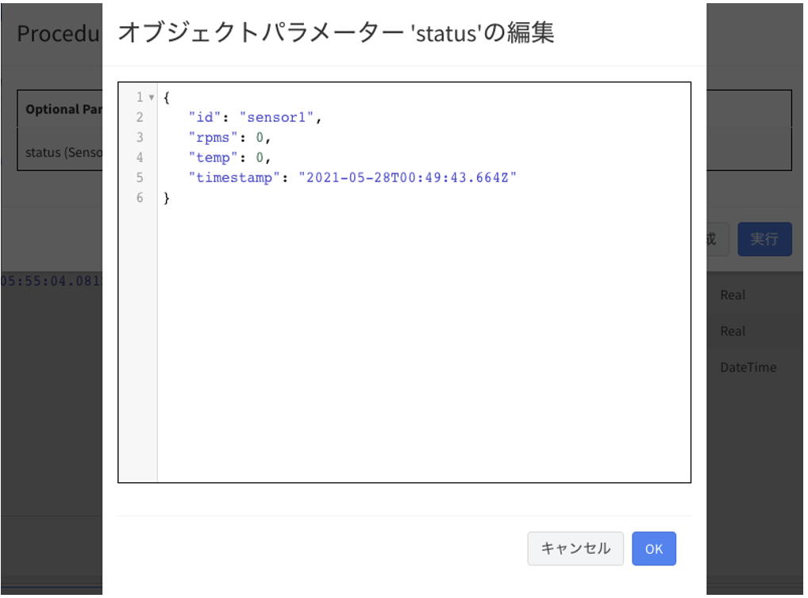


挿入されていることを確認する。
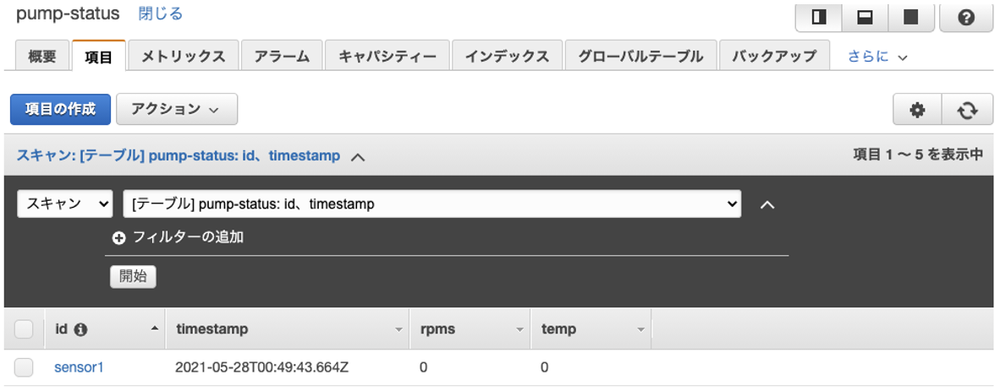


### その他

#### TTLを設定する場合
DynamoDBの場合、レコードを一括で削除することができない。TTLを設定して定期的に不要なレコードを削除させる。
以下のコード例は、現在日付から30日後のunix epoch timeを算出し、`ttl`列として追加している。 DynamoDB側で適宜TTL設定が必要。

```vail
var ttl = now().plusMillis(30 days)

var msg = {
  "TableName": "pump-status",
  "Item": { 
        "id": {
          "S": toString(status.PumpID)
        },
        "timestamp": {
          "S": status.ReceivedAt
        },
        "temp" : {
          "N": status.Temp.toString()    // DynamoDB API only accepts String Literal
        },
        "rpms" : {
          "N": status.RPMS.toString()    // DynamoDB API only accepts String Literal
        },
        "ttl" : {
            "N": date(ttl, "date", "epochMilliseconds").toString() // for  periodically deleting records
        }
    }
}
```
#### 汎用的なProcedureのサンプルコード
テーブル名`tableName`, キー列`keyCol`, タイムスタンプ列`tsCol`, JSONオブジェクト`obj`, TTL時間（ミリ秒）`ttl`を渡すことで、汎用的に使用できるProcedureのサンプルコード
DynamoDB側に、`id` = パーティションキー, `timestamp` = ソートキーでテーブルが作成されていることを想定。

```vail
PROCEDURE DynamoDB.insert(tableName String, keyCol String, tsCol String, obj Object, ttl Integer)
 
// include required columns
var record = {
  "TableName": tableName,
  "Item": { 
        "id": {
          "S": toString(obj[keyCol])
        },
        "timestamp": {
          "S": toString(obj[tsCol])
        },
        "ttl" : {
          "N": toString(date(now().plusMillis(ttl), "date", "epochMilliseconds"))    // for  periodically deleting records
        }
    }
}

// include other columns
deleteKey(obj, keyCol)
deleteKey(obj, tsCol)

// populate items from obj
record.Item = DynamoDB.convertToItem(obj, record.Item)

PUBLISH { body: record } to SOURCE DynamoDBSource USING { method: "POST"}
```
```vail
PROCEDURE DynamoDB.convertToItem(obj Object, item Object)

for prop in obj {
    if typeOf(prop.value) == "Integer" or typeOf(prop.value) == "Real" or typeOf(prop.value) == "Decimal"{
        item[prop.key] = {"N": toString(prop.value) }
    } 
    else if typeOf(prop.value) == "String" or typeOf(prop.value) == "DateTime"{
        item[prop.key] = {"S": toString(prop.value) }
    } 
    else if typeOf(prop.value) == "Boolean" {
        item[prop.key] = {"BOOL": toString(prop.value) }
    } 
    else if typeOf(prop.value) == "GeoJSON" or typeOf(prop.value) == "Object"{
        item[prop.key] = {"M": DynamoDB.convertToItem(prop.value, {} ) }
    } 
    else if typeOf(prop.value) == "List" {
               
        if typeOf(prop.value[0]) == "Integer" or typeOf(prop.value[0]) == "Real" 
          or typeOf(prop.value[0]) == "Decimal"{            
            var ns = []
            for n in prop.value {
                push(ns, toString(n)) 
            }
            item[prop.key] = {"NS": ns}
        } 
        else if typeOf(prop.value[0]) == "String"   {
            item[prop.key] = {"SS": prop.value }
        } 
        else if typeOf(prop.value[0]) == "Object" or typeOf(prop.value[0]) == "List" 
            or typeOf(prop.value[0]) == "GeoJSON" or typeOf(prop.value[0]) == "DateTime" {
            var ss = []
            for s in prop.value {
                push(ss, stringify(s)) 
            }
            item[prop.key] = {"SS": ss}
        } 
    }
}

return item
```

 
## Reference
•	https://blog.yuu26.com/api-gateway-dynamodb-json/
