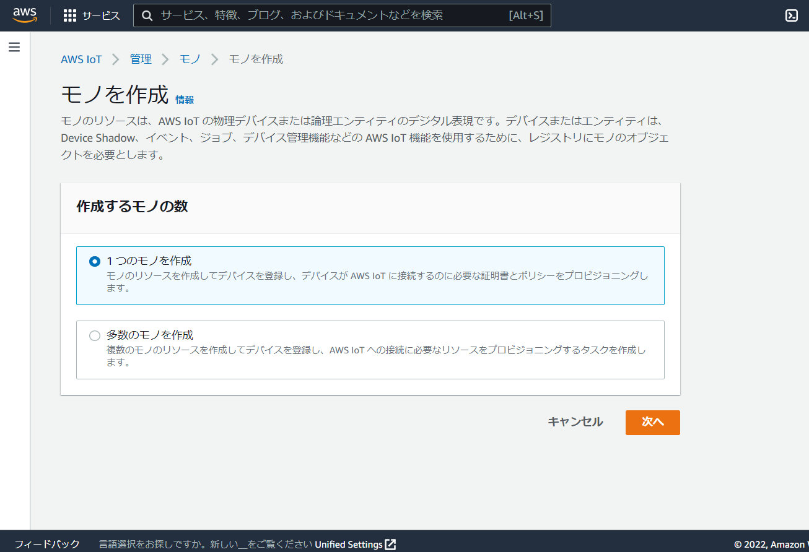
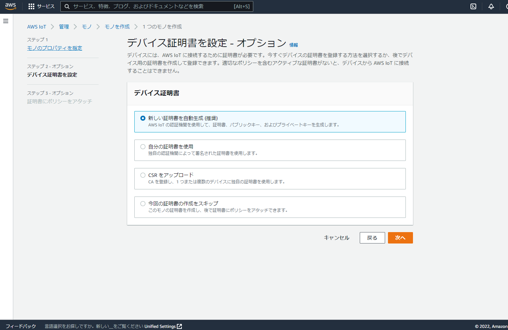
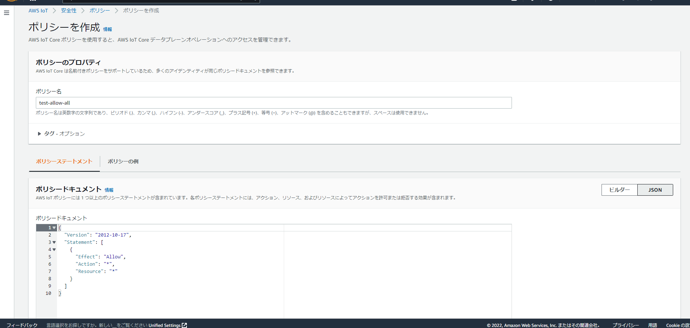

# はじめに
Vantiqから直接AWS IoTのAPIと連携する方法を説明する。  
Vantiqからは以下のような連携が可能である。  

- デバイスとのデータ(テレメトリー)の受信  
  MQTT Sourceに相互認証の設定入れ込むことで AWS IoT Core の MQTT に対して Pub/Sub 可能  
    
- プロパティ値(Registry)の読み書き  
  AWS Console | CLI | IoT API からのみ操作可能  
  AWS IoT API を呼び出すことで可能  

- プロパティ(制御支持）の送信  
  Device Shadowを利用する。  
  Device Shadow は HTTPS | MQTTをサポートしていて、Vantiqからはどちらも可能。  
  
本手順ではVantiqのProcedureから以下を行う方法について説明する。  
- 「モノ」の一覧取得
- 「モノ」の詳細(Registry、プロパティ)取得
- 「モノ」のプロパティ(制御支持、Device Shadow)の取得
- 「モノ」のプロパティの変更(Device ShadowへのPOST)

## 動作条件
Vantiq Server v1.33以降

# IoT Core の構成
Vantiq から AWS IoT Core のREST APIを実行するためにアカウントの Access key と Secret key を用意しておく。

## Vantiq割り当て用の「モノ」の作成  
Vantiq から AWS IoT Core の MQTT と接続を行うために、Vantiqに割り当てる用の「モノ」をAWSコンソールから作成する。  
AWS IoTの 管理 > モノ から「モノ」を以下のように作成する。  
- モノのプロパティを指定
  - モノの名前  
    `vantiq`
- デバイス証明書を設定  
  `新しい証明書を自動生成`  
    => 証明書と鍵ファイル、CAの証明書ファイルをダウンロードしておく
- 証明書にポリシーをアタッチ  
  以下のようなポリシーを作成し、アタッチ  
    ```json
    {
      "Version": "2012-10-17",
      "Statement": [
        {
          "Effect": "Allow",
          "Action": "*",
          "Resource": "*"
        }
      ]
    }
    ```

※上記ポリシーはすべてを許可しているが、本来は必要な権限のみ与えるようにすること。

`1つのモノを作成`を選択


Device Shadowはデフォルトの`シャドウがありません`を選択


`新しい証明書を自動生成(推奨)`を選択


ポリシーは`ポリシーを作成`をクリックし以下のような画面に遷移するのでそこで作成する。  
ポリシー名は任意(画像の例では`test-allow-all`で作成)。作成後、元の画面に戻り作成したポリシー名のチェックボックスにチェックを入れる。


## テスト用の「モノ」の作成
AWSコンソールから同様に作成する。  
- モノのプロパティを指定
  - モノの名前  
    `tempSensor1`
  - Device Shadow
    - `名前付きシャドウ`を選択
    - シャドウ名  
      `fun_switch`
- デバイス証明書を設定  
  `新しい証明書を自動生成`    
    => 証明書と鍵ファイルをダウンロードしておく
- 証明書にポリシーをアタッチ  
  テスト用のためモノ「Vantiq」で作成したポリシーをアタッチ  

Device Shadowでは`名前付きシャドウ`を選択し、シャドウ名を入力する。

    
# JKSファイルの作成
Vantiq のMQTT SourceからAWS IoT Core の MQTT へ接続する際にサーバ/クライアント証明を行うためにJKSファイルを作成する。  
作業環境には java(keytoolコマンド), openssl がインストールされている必要があり、本手順では以下のバージョンで確認を行った。   
参考:  
[はまりやすい難所！ 証明書ファイル（jksファイル）の作成方法 | 株式会社AMG Solution](https://amg-solution.jp/blog/13884)   
[Javaのkeytoolのキーストア（JKS）からPEM形式の証明書、秘密鍵に変換する方法 - Qiita](https://qiita.com/yasushi-jp/items/4aa690fbde11841686e5)  

```bash
$ java --version
openjdk 17.0.2 2022-01-18 LTS
OpenJDK Runtime Environment Zulu17.32+13-CA (build 17.0.2+8-LTS)
OpenJDK 64-Bit Server VM Zulu17.32+13-CA (build 17.0.2+8-LTS, mixed mode, sharing)

$ openssl version
OpenSSL 1.1.1f  31 Mar 2020
```

## truststore ファイルの作成

以下のコマンドでtruststoreファイルを作成する。コマンド実行時にパスワードを設定する必要が有るので任意のパスワードを設定する。  
**JKSファイルに設定したパスワードはMQTT Sourceに設定する必要が有るためメモしておくこと。**  
実行後「Trust this certificate?[no]: 」と入力を求められるため、yesを入力する。

```bash
# JKSファイルの生成(生成されるファイルの名前はmyTrustStore.jks)
$ keytool -import -storetype JKS -keystore myTrustStore.jks -storepass <任意のパスワード> -alias <任意のエイリアス名> -file <CA証明書ファイル>

# JKSファイルの内容の確認
$ keytool -list -v -keystore myTrustStore.jks -storetype JKS -storepass <JKSファイルに設定したパスワード>

```

## keystore ファイルの作成
ダウンロードしておいた「モノ」の証明書と秘密鍵ファイルを openssl コマンドでPKCS12形式のファイルに変換後、keytool コマンドでJKSファイルに変換する。  
パスワードはそれぞれ任意のものを設定すること。  
**JKSファイルに設定したパスワードはMQTT Sourceに設定する必要が有るためメモしておくこと。**  

```bash
# PKCS12ファイルの生成(生成されるファイルの名前はkeystore.p12)
$ openssl pkcs12 -export -in <モノの証明書(xxx-certificate.pem.crt)> --name vantiq -inkey <モノの秘密鍵(xxx-private.pem.key)> -out keystore.p12 -passout pass:<任意のパスワード>

# JKSファイルの生成(生成されるファイルの名前はkeystore.jks)
$ keytool -importkeystore -srckeystore keystore.p12 -srcstoretype PKCS12 -srcstorepass <PKCSファイル生成時に設定したパスワード> -destkeystore keystore.jks -deststoretype JKS -deststorepass <JKSファイルに設定する任意のパスワード> -destkeypass <JKSファイルに設定する任意のパスワード>

# JKSファイルの内容の確認
$ keytool -list -v -keystore keystore.jks -storetype JKS -storepass <JKSファイルに設定したパスワード>

```

# Vantiq リソースの作成

## Secretsの登録
以下の4つのSecretを登録する。  

- SourceTrustStore  
  以下のコマンドで出力されるtruststoreファイルのbase64エンコードした値を指定  
  ```bash
  $ cat myTrustStore.jks | base64 | tr -d "\n" ; echo
  ```

- SourceTrustStorePassword  
  myTrustStore.jksに設定したパスワード  

- SourceKeyStore  
  以下のコマンドで出力されるkeystoreファイルのbase64エンコードした値を指定
  ```bash
  $ cat keystore.jks | base64 | tr -d "\n" ; echo
  ```

- SourceKeyStorePassword  
  keystore.jksに設定したパスワード

## Sourceの作成

**デバイス接続エンドポイント**は 以下のようにAWS コンソールの **AWS IoT > 設定** のデバイスデータエンドポイント欄から確認できる。  
Source や Procedure の作成時に必要なためひかえておく。


### Remote Sourceの作成
以下の2種類作成する。

- Source Name  
  `AWSIoTAPI`
- Server URI  
  `https://iot.us-west-2.amazonaws.com`  
    ※上記はus-west-2の場合。  
    別リージョンの場合は[AWS IoT Core endpoints and quotas - AWS General Reference](https://docs.aws.amazon.com/general/latest/gr/iot-core.html#iot-core-control-plane-endpoints)を参照

- Source Name  
  `AWSIoTCoreDeviceShadow`
- Server URI  
  `https://<デバイス接続エンドポイント>`


### MQTT Sourceの作成
  
topics にはすべての「モノ」の名前付き shadow の更新が行われた際の発行先を指定している。  
本手順では Device Shadow の利用を行うことを想定している。  
ただし、Device Shadow は AWS IoT Core の MQTT の一部の Topic を予約済みとして利用しているため、作成した Source で AWS IoT Core の MQTT へのPub/Subが可能である。  
[予約済みトピック - AWS IoT Core](https://docs.aws.amazon.com/ja_jp/iot/latest/developerguide/reserved-topics.html)

実利用の際には topics 設計等にあわせて Source の分割などを行うこと。  
参考: [AWS IoT Core の MQTT トピックの設計](https://d1.awsstatic.com/whitepapers/ja_JP/Designing_MQTT_Topics_for_AWS_IoT_Core.pdf)


以下の Source を作成する。

- Source Name  
  `AWSIoTMQTT`
- Source Type  
  `MQTT`
- Config(Properties > ConfigをJSONとして編集)
```json
{
    "contentType": "application/json",
    "qos": "AT_LEAST_ONCE",
    "keepAliveInterval": 60,
    "connectionTimeout": 15,
    "cleanSession": true,
    "maxInflight": 10,
    "serverURIs": [
        "mqtts://<デバイス接続エンドポイント>:8883"
    ],
    "topics": [
        "$aws/things/+/shadow/name/+/update/documents"
    ],
    "trustStoreOptions": {
        "value": "@secrets(SourceTrustStore)",
        "password": "@secrets(SourceTrustStorePassword)"
    },
    "keyStoreOptions": {
        "value": "@secrets(SourceKeyStore)",
        "password": "@secrets(SourceKeyStorePassword)"
    }
}
```

以下のような Source を作成できる。


## AWS API 呼び出しに必要なSig v4処理およびheader作成Procedureの作成
署名についての詳細は[Signing AWS requests with Signature Version 4 - AWS General Reference](https://docs.aws.amazon.com/general/latest/gr/sigv4_signing.html)を参照  

- 署名に必要な2進、16進数変換 Procedure
```
PROCEDURE AWSAPIUtils.dec2sbin(dec Integer)
if (dec < -128 || dec > 127) {
    exception("Argument Error", format("Argument [dec] must be range between -128 and 127. [dec]={0}", dec))
}
var isNegative = false
if (dec < 0) {
    dec += 128
    isNegative = true
}
var bin = ""
var limit = dec == 0 ? 1 : Math.log2(dec) + 1
for (i in range(0, limit, 1)) {
    if (dec % 2 == 0) {
        bin = "0" + bin
    } else {
        bin = "1" + bin
    }
    dec = parseInt(dec / 2)
}
var length = length(bin)
if (length % 8 != 0) {
    bin = repeat("0", (8 - length % 8)) + bin
}
if (isNegative) {
    bin = "1" + bin.substring(1)
}
return bin
```

```
PROCEDURE AWSAPIUtils.dec2shex(dec Integer)
if (dec < -128 || dec > 127) {
    exception("Argument Error", format("Argument [dec] must be range between -128 and 127. [dec]={0}", dec))
}
var bin = AWSAPIUtils.dec2sbin(dec)
var result = ""
for (i in range(0, length(bin), 4)) {
    var tempStr = toString(parseInt(bin[i]) * 8 + parseInt(bin[i+1]) * 4 + parseInt(bin[i+2]) * 2 + parseInt(bin[i+3]))
    if (length(tempStr) == 2) {
        if (tempStr == "10") {
            result += "A"
        } else if (tempStr == "11") {
            result += "B"
        } else if (tempStr == "12") {
            result += "C"
        } else if (tempStr == "13") {
            result += "D"
        } else if (tempStr == "14") {
            result += "E"
        } else if (tempStr == "15") {
            result += "F"
        }
    } else {
        result += tempStr
    }
}
return result
```

- 署名 Procedure
```
PROCEDURE AWSAPIUtils.genSignatureVer4AWS(access_key, date, region, service_name, str_to_sign)

var k_secret = "AWS4" + access_key
var k_data = Hash.hmacSha256(k_secret, date)
var k_region = Hash.hmacSha256(k_data, region)
var k_service = Hash.hmacSha256(k_region, service_name)
var k_signing = Hash.hmacSha256(k_service, "aws4_request")

var bytes = Hash.hmacSha256(k_signing, str_to_sign)
var signature = ""

for (i in range(0, bytes.length())) {
    signature += AWSAPIUtils.dec2shex(bytes[i].intValue())
}

return signature.toLowerCase()
```

- API 呼び出しに必要なヘッダ作成 Procedure で上記3つの Procedure を処理の中で呼び出している
```
PROCEDURE AWSAPIUtils.genAWSAPIHeaders(task1, task2, task3, task4)
// Parameters
// -----------
// task1 {
//     "method": string
//     "request_parameters": string
//     "payload": string(json stringify)
//     "canonical_headers_map": {
//         "host": string
//         "x-amz-date": string(formated "yyyyMMdd'T'HHmmss'Z'")
//     }
//     "canonical_uri": string
// }
// task2 {
//     "datestamp": string(formated "yyyyMMdd")
//     "region": string
//     "service_name": string
//     "amzdate": string(formated "yyyyMMdd'T'HHmmss'Z'")
// }
// task3 {
//     "secret_key": string
// }
// task4 {
//     "access_key": string
// }

// Task1: Create a canonical request
var canonical_querystring = task1.request_parameters
var payload_hash_bytes = Hash.sha256(task1.payload)
var payload_hash = ""
for(i in range(0, payload_hash_bytes.length())){
    payload_hash += AWSAPIUtils.dec2shex(payload_hash_bytes[i].intValue())
}
payload_hash = payload_hash.toLowerCase()

var sorted_canonical_headers_list = []
for(h in task1.canonical_headers_map){
    sorted_canonical_headers_list.push(h.key)
}
if(task1.payload != ""){
    sorted_canonical_headers_list.push("x-amz-content-sha256")
}
sorted_canonical_headers_list = sorted_canonical_headers_list.sort()

var canonical_headers = ""
var signed_headers = ""
var headers_counter = 0
for(h in sorted_canonical_headers_list){
    var hf = h
    hf = hf.toLowerCase()
    var hf_value = hf == "x-amz-content-sha256" ? payload_hash : task1.canonical_headers_map[h]
    canonical_headers += hf + ":" + hf_value + "\n"
    signed_headers += hf
    if(headers_counter < sorted_canonical_headers_list.length() - 1){
        signed_headers += ";"
    }
    headers_counter++
}

var canonical_request = task1.method + "\n" + task1.canonical_uri + "\n" + canonical_querystring + "\n" + canonical_headers + "\n" + signed_headers + "\n" + payload_hash

//Task2: Create the string to sign
var algorithm = "AWS4-HMAC-SHA256"
var credential_scope = task2.datestamp + "/" + task2.region + "/" + task2.service_name + "/" + "aws4_request"
var canonical_request_hash = Hash.sha256(canonical_request)
var canonical_request_hash_hex = ""
for (i in range(0, canonical_request_hash.length())){
    canonical_request_hash_hex += AWSAPIUtils.dec2shex(canonical_request_hash[i].intValue())
}
canonical_request_hash_hex = canonical_request_hash_hex.toLowerCase()
var string_to_sign = algorithm + "\n" +  task2.amzdate + "\n" +  credential_scope + "\n" + canonical_request_hash_hex

// Task3: Calculate the signature
var signature = AWSAPIUtils.genSignatureVer4AWS(task3.secret_key, task2.datestamp, task2.region, task2.service_name, string_to_sign)


// TASK4: Add signing information to the request
var authorization_header = algorithm + " " + "Credential=" + task4.access_key + "/" + credential_scope + ", " +  "SignedHeaders=" + signed_headers + ", " + "Signature=" + signature
var headers = {
    "x-amz-date": task2.amzdate,
    "Authorization": authorization_header
}
if(task1.payload != ""){
    headers["x-amz-content-sha256"] = payload_hash
}

return headers
```

作成した AWSAPIUtils.genAWSAPIHeaders Procedure を AWS API を呼び出す Procedure内で利用していく。

## 「モノ」の一覧取得を行うProcedureの作成

登録してある「モノ」の一覧を取得する場合は AWS IoT API を呼び出す。  
参照: [ListThings - AWS IoT](https://docs.aws.amazon.com/iot/latest/apireference/API_ListThings.html)

```
PROCEDURE AWSIoTAPI.listThingsIoTCore()

var ACCESS_KEY = "<YOUR-AWS-ACCESS-KEY>"
var SECRET_KEY = "<YOUR-AWS-SECRET-KEY>"
var REGION = "us-west-2"
var HOST = "iot.us-west-2.amazonaws.com"

var date = now()
var amzdate = format("{0, date,yyyyMMdd'T'HHmmss'Z'}",date)
var datestamp = format("{0, date,yyyyMMdd}",date)

var task1 = {
    "method": "GET",
    "request_parameters": "",
    "payload": "",
    "canonical_headers_map": {
        "host": HOST,
        "x-amz-date": amzdate
    },
    "canonical_uri": "/things"
}
var task2 = {
    "datestamp": datestamp,
    "region": REGION,
    "service_name": "execute-api",
    "amzdate": amzdate
}
var task3 = {
    "secret_key": SECRET_KEY
}
var task4 = {
    "access_key": ACCESS_KEY
}

var path = "/things"
var headers = AWSAPIUtils.genAWSAPIHeaders(task1, task2, task3, task4)

SELECT FROM SOURCE AWSIoTAPI WITH method = "GET", path = path, headers = headers

```

実行すると以下のように「モノ」の一覧を取得できる。
```json
[
   {
      "nextToken": null,
      "things": [
         {
            "attributes": {},
            "thingArn": "arn:aws:iot:us-west-2:xxxxx:thing/tempSensor1",
            "thingName": "tempSensor1",
            "thingTypeName": null,
            "version": 1
         },
         {
            "attributes": {},
            "thingArn": "arn:aws:iot:us-west-2:xxxxx:thing/vantiq",
            "thingName": "vantiq",
            "thingTypeName": null,
            "version": 1
         }
      ]
   }
]
```

## 「モノ」の詳細(Registry、プロパティ)取得を行うProcedureの作成

この場合もAWS IoT API で取得することができる。  
参照: [DescribeThing - AWS IoT](https://docs.aws.amazon.com/iot/latest/apireference/API_DescribeThing.html)

```
PROCEDURE  AWSIoTAPI.describeThingIoTCore(thing_name)

var ACCESS_KEY = "<YOUR-AWS-ACCESS-KEY>"
var SECRET_KEY = "<YOUR-AWS-SECRET-KEY>"
var REGION = "us-west-2"
var HOST = "iot.us-west-2.amazonaws.com"

var date = now()
var amzdate = format("{0, date,yyyyMMdd'T'HHmmss'Z'}",date)
var datestamp = format("{0, date,yyyyMMdd}",date)

var task1 = {
    "method": "GET",
    "request_parameters": "",
    "payload": "",
    "canonical_headers_map": {
        "host": HOST,
        "x-amz-date": amzdate
    },
    "canonical_uri": "/things/" + thing_name
}
var task2 = {
    "datestamp": datestamp,
    "region": REGION,
    "service_name": "execute-api",
    "amzdate": amzdate
}
var task3 = {
    "secret_key": SECRET_KEY
}
var task4 = {
    "access_key": ACCESS_KEY
}

var path = "/things/" + thing_name
var headers = AWSAPIUtils.genAWSAPIHeaders(task1, task2, task3, task4)

SELECT FROM SOURCE AWSIoTAPI WITH method = "GET", path = path, headers = headers

```

引数の thing_name に作成した「モノ」の名前である `tempSensor1` を指定して実行すると以下のように取得できる。
```json
[
   {
      "attributes": {},
      "billingGroupName": null,
      "defaultClientId": "tempSensor1",
      "thingArn": "arn:aws:iot:us-west-2:xxxx:thing/tempSensor1",
      "thingId": "x-x-x-x-x",
      "thingName": "tempSensor1",
      "thingTypeName": null,
      "version": 1
   }
]
```

## 「モノ」のプロパティ(制御支持 - Device Shadow)の取得を行うProcedureの作成
AWS IoT Device Shadow では HTTPS/MQTTの両方をサポートしている。  
MQTTの場合はすでに作成してある AWSIoTMQTT で名前付き Shadow の Topic を指定しているため、Shadow で更新が行われた場合そのデータが Source によって取得される。  

Device Shadow の Topic についての詳細は[Device Shadow MQTT topics - AWS IoT Core](https://docs.aws.amazon.com/iot/latest/developerguide/device-shadow-mqtt.html)を参照  

ここでは HTTPS で「モノ」の Shadow の状態を取得する Procedure を作成する。

```
PROCEDURE AWSIoTAPI.getThingShadowIoTCore(thing_name, shadow_name)

var ACCESS_KEY = "<YOUR-AWS-ACCESS-KEY>"
var SECRET_KEY = "<YOUR-AWS-SECRET-KEY>"
var REGION = "us-west-2"
var HOST = "<デバイス接続エンドポイント>"

var date = now()
var amzdate = format("{0, date,yyyyMMdd'T'HHmmss'Z'}",date)
var datestamp = format("{0, date,yyyyMMdd}",date)

var task1 = {
    "method": "GET",
    "request_parameters": "name=" + shadow_name,
    "payload": "",
    "canonical_headers_map": {
        "x-amz-date": amzdate,
        "Host": HOST
    },
    "canonical_uri": "/things/" + thing_name + "/shadow"
}
var task2 = {
    "datestamp": datestamp,
    "region": REGION,
    "service_name": "iotdevicegateway",
    "amzdate": amzdate
}
var task3 = {
    "secret_key": SECRET_KEY
}
var task4 = {
    "access_key": ACCESS_KEY
}

var headers = AWSAPIUtils.genAWSAPIHeaders(task1, task2, task3, task4)
var path = "/things/" + thing_name + "/shadow?name=" + shadow_name 

SELECT FROM SOURCE AWSIoTCoreDeviceShadow WITH method = "GET", path = path, headers = headers
```

引数の thing_name に作成した「モノ」の名前である `tempSensor1` を、shadow_name に `fun_switch` を指定して実行すると以下のように取得できる。

```json
[
   {
      "state": {
         "desired": {
            "welcome": "aws-iot"
         },
         "reported": {
            "welcome": "aws-iot"
         }
      },
      "metadata": {
         "desired": {
            "welcome": {
               "timestamp": 1652162711
            }
         },
         "reported": {
            "welcome": {
               "timestamp": 1652162711
            }
         }
      },
      "version": 1,
      "timestamp": 1652232283
   }
]
```

## 「モノ」のプロパティの変更(Device ShadowへのPOST)を行うProcedureの作成
こちらに関してもAWS IoT Device Shadow では HTTPS/MQTT の両方をサポートしている。  
MQTT の場合はすでに作成してある AWSIoTMQTT で update topic に対して Publish を行うことで更新を行うことができる。
ここでは HTTPS で「モノ」の Shadow の状態を更新する Procedure を作成する。


```
PROCEDURE AWSIoTAPI.updateThingShadowIoTCore(thing_name, shadow_name)

var ACCESS_KEY = "<YOUR-AWS-ACCESS-KEY>"
var SECRET_KEY = "<YOUR-AWS-SECRET-KEY>"
var REGION = "us-west-2"
var HOST = "<デバイス接続エンドポイント>"

var body = {
  "state": {
    "desired": {
      "power": "on"
    },
    "reported": {
      "power": "on"
    }
  }
}

var date = now()
var amzdate = format("{0, date,yyyyMMdd'T'HHmmss'Z'}",date)
var datestamp = format("{0, date,yyyyMMdd}",date)

var task1 = {
    "method": "POST",
    "request_parameters": "name=" + shadow_name,
    "payload": stringify(body),
    "canonical_headers_map": {
        "host": HOST,
        "x-amz-date": amzdate
    },
    "canonical_uri": "/things/" + thing_name + "/shadow"
}
var task2 = {
    "datestamp": datestamp,
    "region": REGION,
    "service_name": "iotdevicegateway",
    "amzdate": amzdate
}
var task3 = {
    "secret_key": SECRET_KEY
}
var task4 = {
    "access_key": ACCESS_KEY
}

var headers = AWSAPIUtils.genAWSAPIHeaders(task1, task2, task3, task4)
var path = "/things/" + thing_name + "/shadow?name=" + shadow_name 

SELECT FROM SOURCE AWSIoTCoreDeviceShadow WITH method = "POST", path = path, headers = headers, body = body

```

作成してある AWSIoTMQTT Source の `データの受信テスト`を起動しておき、引数の thing_name に作成した「モノ」の名前である`tempSensor1` を、shadow_name に `fun_switch` を指定して実行すると以下のようなレスポンスが返ってくる。

```json
[
   {
      "state": {
         "desired": {
            "power": "on"
         },
         "reported": {
            "power": "on"
         }
      },
      "metadata": {
         "desired": {
            "power": {
               "timestamp": 1652233236
            }
         },
         "reported": {
            "power": {
               "timestamp": 1652233236
            }
         }
      },
      "version": 2,
      "timestamp": 1652233236
   }
]
```

Shadow が更新されたため、AWSIoTMQTT Source は以下のようなメッセージを受信していることが確認できる。

```json
{
   "previous": {
      "state": {
         "desired": {
            "welcome": "aws-iot"
         },
         "reported": {
            "welcome": "aws-iot"
         }
      },
      "metadata": {
         "desired": {
            "welcome": {
               "timestamp": 1652162711
            }
         },
         "reported": {
            "welcome": {
               "timestamp": 1652162711
            }
         }
      },
      "version": 1
   },
   "current": {
      "state": {
         "desired": {
            "welcome": "aws-iot",
            "power": "on"
         },
         "reported": {
            "welcome": "aws-iot",
            "power": "on"
         }
      },
      "metadata": {
         "desired": {
            "welcome": {
               "timestamp": 1652162711
            },
            "power": {
               "timestamp": 1652233236
            }
         },
         "reported": {
            "welcome": {
               "timestamp": 1652162711
            },
            "power": {
               "timestamp": 1652233236
            }
         }
      },
      "version": 2
   },
   "timestamp": 1652233236
}
```

## Shadow の更新を検知し、「モノ」の詳細を付与する
作成した Source と Procedure を組み合わせて、Shadow の更新をトリガーに更新データに対して「モノ」の詳細情報を付与したイベントの作成を行う Rule を作成してみる。  

データ確認用に/tempsensor/fun_switch/update Topic を作成しておく。

```
RULE OnDeviceShadowUpdate
WHEN EVENT OCCURS ON "/sources/AWSIoTMQTT" as msg

var payload = msg.value
var topic_name_split = split(msg.topic, "/")

var thing_details =  AWSIoTAPI.describeThingIoTCore(topic_name_split[2])

var publish_ev = {
    "thing_name": topic_name_split[2],
    "shadow_name": topic_name_split[5],
    "received_topic": msg.topic,
    "payload": payload,
    "thing_details": thing_details[0]
}

Publish publish_ev TO TOPIC "/tempsensor/fun_switch/update" 

```

Rule作成後、AWSIoTAPI.updateThingShadowIoTCore Procedure を引数の thing_name に作成した「モノ」の名前である `tempSensor1` を、shadow_name に `fun_switch` を指定して実行する。  
/tempsensor/fun_switch/update Topic に下記のようなデータが Publish されることが確認できる。  


```json
{
   "thing_name": "tempSensor1",
   "shadow_name": "fun_switch",
   "received_topic": "$aws/things/tempSensor1/shadow/name/fun_switch/update/documents",
   "payload": {
      "previous": {
         "state": {
            "desired": {
               "welcome": "aws-iot",
               "power": "off"
            },
            "reported": {
               "welcome": "aws-iot",
               "power": "on"
            }
         },
         "metadata": {
            "desired": {
               "welcome": {
                  "timestamp": 1652162711
               },
               "power": {
                  "timestamp": 1652235663
               }
            },
            "reported": {
               "welcome": {
                  "timestamp": 1652162711
               },
               "power": {
                  "timestamp": 1652235663
               }
            }
         },
         "version": 6
      },
      "current": {
         "state": {
            "desired": {
               "welcome": "aws-iot",
               "power": "on"
            },
            "reported": {
               "welcome": "aws-iot",
               "power": "on"
            }
         },
         "metadata": {
            "desired": {
               "welcome": {
                  "timestamp": 1652162711
               },
               "power": {
                  "timestamp": 1652235710
               }
            },
            "reported": {
               "welcome": {
                  "timestamp": 1652162711
               },
               "power": {
                  "timestamp": 1652235710
               }
            }
         },
         "version": 7
      },
      "timestamp": 1652235710
   },
   "thing_details": {
      "attributes": {},
      "billingGroupName": null,
      "defaultClientId": "tempSensor1",
      "thingArn": "arn:aws:iot:us-west-2:xxxx:thing/tempSensor1",
      "thingId": "x-x-x-x-x",
      "thingName": "tempSensor1",
      "thingTypeName": null,
      "version": 1
   }
}

```
