## Amazon MSKについて

https://aws.amazon.com/jp/msk/

Amazon MSK は、Apache Kafka をストリーミングデータの処理に使用するアプリケーションを簡単に構築および実行できようにする完全マネージド型のサービスです。 Apache Kafka は、リアルタイムのストリーミングデータパイプラインおよびアプリケーションを構築するためのオープンソースプラットフォームです。Amazon MSK では、ネイティブ Apache Kafka API を使用し、データレイクへの入力、データベースとの間での変更のストリーミング、機械学習および分析アプリケーションの強化を行うことができます。


## Amazon MSK構成

###  ネットワーク構成

Amazon MSKはパブリックエンドポイントをサポートしていません。 そのため、Amazon MSKとの連携には、VantiqプライベートクラウドまたはVantiq Edgeが必要となります。 Vantiqは、Amazon MSKのプライベートエンドポイントと同じVPCにあるか、以下のいずれかの構成でエンドポイントに到達できるようにする必要があります。
- VPC Peering
- VPC Transit Gateway
- AWS Direct Connect
- REST Proxy
- VPN

### セキュリティ構成

Amazon MSKは、3つの認証方法のいずれかを使用するように設定することができます。 2つはVantiqがサポートしています。

| #   | 認証方法 | Vantiq Support? | 備考 |
| --- | ------------------------- | :-------------: | -------------- |
|1|認証なし|Yes|
|2|SASL/SCRAM + TLS 認証|Yes|資格情報はAWS Secret Managerで管理する必要がある。
|3|TLS クライアント認証|No|Vantiqはクライアント認証をサポートしない。


## Amazon MSKサンプル構成の構築手順
2通りの構成例で説明していきます。

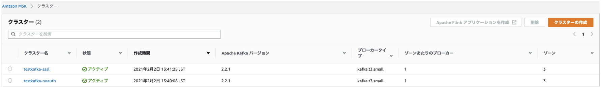

**testkafka-sasl** – SASL/SCRAMを有効にする構成例。

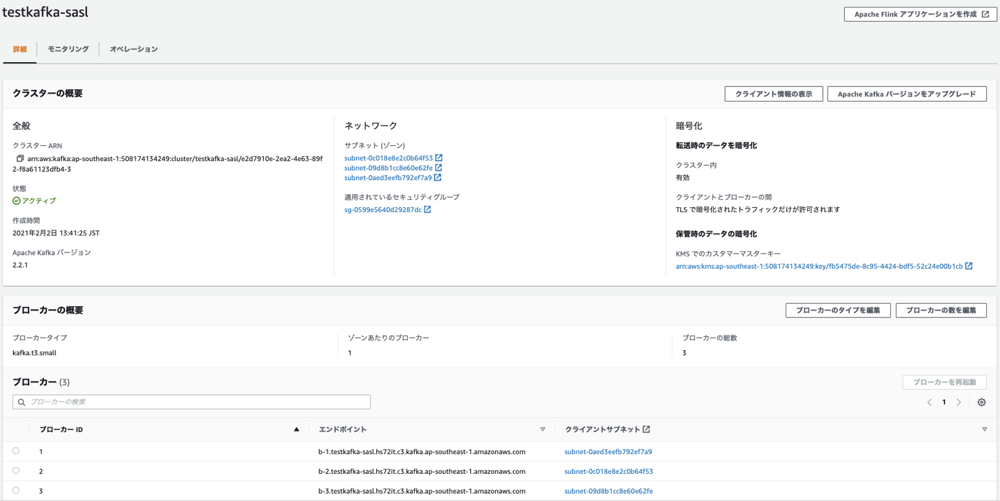

KMSでシークレットも合わせて作成しておきます。
```json
{
  "username": "test",
  "password": "12345"
}
```

**testkafka-noauth** – 認証を無効にする構成例。

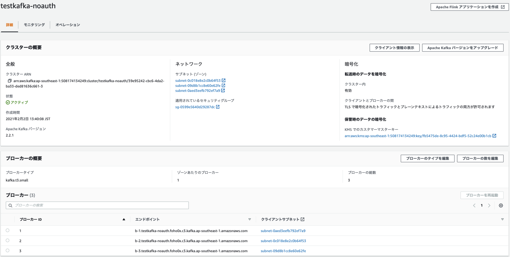


### ネットワーク構成
デフォルトでは、セキュリティグループはポート 9092, 9094, 9096, 2181 に対してインバウンド接続を許可しません。 クライアントからKafkaクラスタに接続するためのインバウンド接続を許可する必要があります。

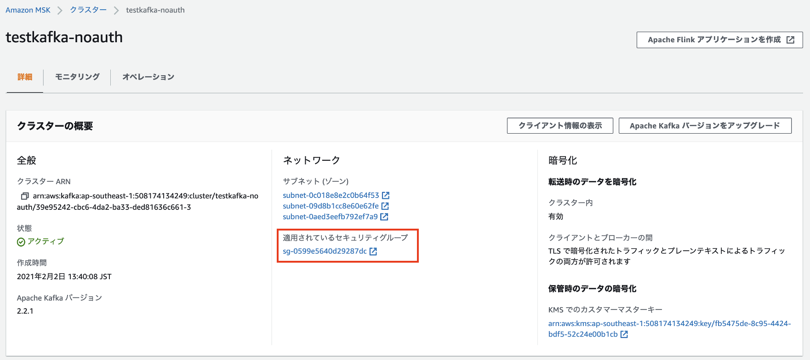

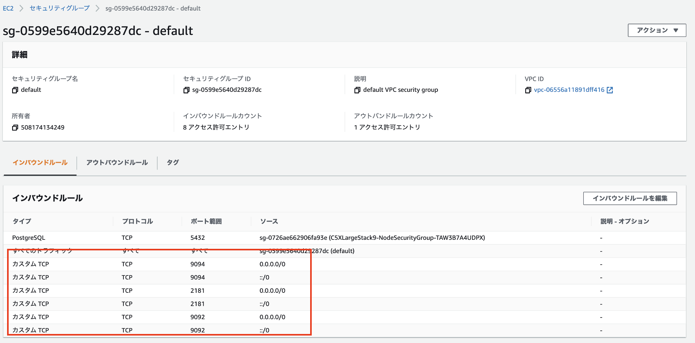


### kafkaインストール

KafkaをCLIから操作するために[kafka公式](http://kafka.apache.org/quickstart)に従い最新のKafkaをダウンロードし、ダウンロードしたファイルを展開します。
```sh
wget http://ftp.riken.jp/net/apache/kafka/2.8.0/kafka_2.13-2.8.0.tgz
tar -xzf kafka_2.13-2.8.0.tgz
cd kafka_2.13-2.8.0
```

### testkafka-saslの構成

#### users_jaas.confを準備する
このステップは[ユーザー名とパスワードの認証AWSシークレットマネージャー](https://docs.aws.amazon.com/ja_jp/msk/latest/developerguide/msk-password.html)を参考。
シークレットに保存されているユーザー認証情報を使用して JAAS 設定ファイル`users_jaas.conf`を作成します。
```
KafkaClient {
   org.apache.kafka.common.security.scram.ScramLoginModule required
   username="test"
   password="12345";
};
```
次のコマンドを使用して、この JAAS 設定ファイルを KAFKA_OPTS 環境パラメータとしてエクスポートします。
```sh
export KAFKA_OPTS=-Djava.security.auth.login.config=<path-to-jaas-file>/users_jaas.conf
```

#### client_sasl.propertiesの準備
SSL SASL認証で行うための設定を行います。JDKの中にあるKeystoreをkafka用に適当な場所(`/tmp`など)にコピーしておき、その上で、`client_sasl.properties`ファイルを作成します。
```sh
cp $JAVA_HOME/jre/lib/security/cacerts /tmp/kafka.client.truststore.jks
```
**client_sasl.properties**
```json
security.protocol=SASL_SSL
sasl.mechanism=SCRAM-SHA-512
ssl.truststore.location=/tmp/kafka.client.truststore.jks
```


#### testkafka-sasl configuration details / testkafka-saslの詳細を確認する
**testkafka-sasl**の詳細をaws cliで確認します。これ以降、`--cluster-arn`, `--region`は作成したインスタンスに合わせ適宜設定します。
```sh
$ aws kafka describe-cluster --region ap-southeast-1 \
  --cluster-arn arn:aws:kafka:ap-southeast-1:508174134249:cluster/testkafka-sasl/e2d7910e-2ea2-4e63-89f2-f8a61123dfb4-3
```
上記コマンドを実行すると、以下が戻ります。`ClusterInfo.ZookeeperConnectString`を書き留めておきます。
```json
{
    "ClusterInfo": {
        "BrokerNodeGroupInfo": {
            "BrokerAZDistribution": "DEFAULT",
            "ClientSubnets": [
                "subnet-0c018e8e2c0b64f53",
                "subnet-09d8b1cc8e60e62fe",
                "subnet-0aed3eefb792ef7a9"
            ],
            "InstanceType": "kafka.t3.small",
            "SecurityGroups": [
                "sg-0599e5640d29287dc"
            ],
            "StorageInfo": {
                "EbsStorageInfo": {
                    "VolumeSize": 10
                }
            }
        },
        "ClientAuthentication": {},
        "ClusterArn": "arn:aws:kafka:ap-southeast-1:508174134249:cluster/testkafka-sasl/e2d7910e-2ea2-4e63-89f2-f8a61123dfb4-3",
        "ClusterName": "testkafka-sasl",
        "CreationTime": "2021-02-02T04:41:25.128Z",
        "CurrentBrokerSoftwareInfo": {
            "KafkaVersion": "2.2.1"
        },
        "CurrentVersion": "K3P5ROKL5A1OLE",
        "EncryptionInfo": {
            "EncryptionAtRest": {
                "DataVolumeKMSKeyId": "arn:aws:kms:ap-southeast-1:508174134249:key/fb5475de-8c95-4424-bdf5-52c24e00b1cb"
            },
            "EncryptionInTransit": {
                "ClientBroker": "TLS",
                "InCluster": true
            }
        },
        "EnhancedMonitoring": "DEFAULT",
        "OpenMonitoring": {
            "Prometheus": {
                "JmxExporter": {
                    "EnabledInBroker": false
                },
                "NodeExporter": {
                    "EnabledInBroker": false
                }
            }
        },
        "LoggingInfo": {
            "BrokerLogs": {
                "CloudWatchLogs": {
                    "Enabled": false
                },
                "Firehose": {
                    "Enabled": false
                },
                "S3": {
                    "Enabled": false
                }
            }
        },
        "NumberOfBrokerNodes": 3,
        "State": "ACTIVE",
        "Tags": {
            "user": "kono"
        },
        "ZookeeperConnectString": "z-1.testkafka-sasl.hs72it.c3.kafka.ap-southeast-1.amazonaws.com:2181,z-2.testkafka-sasl.hs72it.c3.kafka.ap-southeast-1.amazonaws.com:2181,z-3.testkafka-sasl.hs72it.c3.kafka.ap-southeast-1.amazonaws.com:2181"
    }
}
```
#### testkafka-sasl Create Topic / testkafka-saslにTopicを作成する
この例では, `AWSKafkaTutorialTopic`という名前のTopicを作成します。
```sh
$ bin/kafka-topics.sh --create \
  --zookeeper "z-1.testkafka-sasl.hs72it.c3.kafka.ap-southeast-1.amazonaws.com:2181,z-2.testkafka-sasl.hs72it.c3.kafka.ap-southeast-1.amazonaws.com:2181,z-3.testkafka-sasl.hs72it.c3.kafka.ap-southeast-1.amazonaws.com:2181" \
  --replication-factor 2 \
  --partitions 1 \
  --topic AWSKafkaTutorialTopic
```

BrokerのEndpointを調べます。
```sh
$ aws kafka get-bootstrap-brokers \
  --cluster-arn arn:aws:kafka:ap-southeast-1:508174134249:cluster/testkafka-sasl/e2d7910e-2ea2-4e63-89f2-f8a61123dfb4-3 \
  --region ap-southeast-1
```
上記コマンドで、以下が戻ります。
```json
{
    "BootstrapBrokerStringSaslScram": "b-1.testkafka-sasl.hs72it.c3.kafka.ap-southeast-1.amazonaws.com:9096,b-3.testkafka-sasl.hs72it.c3.kafka.ap-southeast-1.amazonaws.com:9096,b-2.testkafka-sasl.hs72it.c3.kafka.ap-southeast-1.amazonaws.com:9096"
}
```

#### testkafka-sasl Connection Test – Producer / Producerの接続テスト

```sh
./kafka-console-producer.sh \
  --broker-list "b-1.testkafka-sasl.hs72it.c3.kafka.ap-southeast-1.amazonaws.com:9096,b-3.testkafka-sasl.hs72it.c3.kafka.ap-southeast-1.amazonaws.com:9096,b-2.testkafka-sasl.hs72it.c3.kafka.ap-southeast-1.amazonaws.com:9096" \
  --producer.config client_sasl.properties \
  --topic AWSKafkaTutorialTopic
>test message 1
>test message 23
>test message 44
>test meesagege 23
```

#### testkafka-sasl Connection Test – Consumer / Consumerの接続テスト
```sh
./kafka-console-consumer.sh \
  --bootstrap-server "b-1.testkafka-sasl.hs72it.c3.kafka.ap-southeast-1.amazonaws.com:9096,b-3.testkafka-sasl.hs72it.c3.kafka.ap-southeast-1.amazonaws.com:9096,b-2.testkafka-sasl.hs72it.c3.kafka.ap-southeast-1.amazonaws.com:9096"
  --consumer.config client.properties \
  --topic AWSKafkaTutorialTopic \
  --from-beginning
test message 1
test message 23
test message 44
```

### testkafka-noauthの構成
#### testkafka-noauth configuration details / testkafka-noauthの詳細を確認する
testkafka-noauthの詳細をaws cliで確認します。これ以降、`--cluster-arn`, `--region`は作成したインスタンスに合わせ適宜設定します。
```sh
$ aws kafka describe-cluster --region ap-southeast-1 \
  --cluster-arn arn:aws:kafka:ap-southeast-1:508174134249:cluster/testkafka-noauth/39e95242-cbc6-4da2-ba33-ded81636c661-3
```
上記コマンドを実行すると、以下が戻ります。`ClusterInfo.ZookeeperConnectString`を書き留めておきます。
```json
{
    "ClusterInfo": {
        "BrokerNodeGroupInfo": {
            "BrokerAZDistribution": "DEFAULT",
            "ClientSubnets": [
                "subnet-0c018e8e2c0b64f53",
                "subnet-09d8b1cc8e60e62fe",
                "subnet-0aed3eefb792ef7a9"
            ],
            "InstanceType": "kafka.t3.small",
            "SecurityGroups": [
                "sg-0599e5640d29287dc"
            ],
            "StorageInfo": {
                "EbsStorageInfo": {
                    "VolumeSize": 10
                }
            }
        },
        "ClusterArn": "arn:aws:kafka:ap-southeast-1:508174134249:cluster/testkafka-noauth/39e95242-cbc6-4da2-ba33-ded81636c661-3",
        "ClusterName": "testkafka-noauth",
        "CreationTime": "2021-02-02T04:40:08.918Z",
        "CurrentBrokerSoftwareInfo": {
            "KafkaVersion": "2.2.1"
        },
        "CurrentVersion": "K3P5ROKL5A1OLE",
        "EncryptionInfo": {
            "EncryptionAtRest": {
                "DataVolumeKMSKeyId": "arn:aws:kms:ap-southeast-1:508174134249:key/fb5475de-8c95-4424-bdf5-52c24e00b1cb"
            },
            "EncryptionInTransit": {
                "ClientBroker": "TLS_PLAINTEXT",
                "InCluster": true
            }
        },
        "EnhancedMonitoring": "DEFAULT",
        "OpenMonitoring": {
            "Prometheus": {
                "JmxExporter": {
                    "EnabledInBroker": false
                },
                "NodeExporter": {
                    "EnabledInBroker": false
                }
            }
        },
        "LoggingInfo": {
            "BrokerLogs": {
                "CloudWatchLogs": {
                    "Enabled": false
                },
                "Firehose": {
                    "Enabled": false
                },
                "S3": {
                    "Enabled": false
                }
            }
        },
        "NumberOfBrokerNodes": 3,
        "State": "ACTIVE",
        "Tags": {
            "user": "kono"
        },
        "ZookeeperConnectString": "z-1.testkafka-noauth.foho0x.c3.kafka.ap-southeast-1.amazonaws.com:2181,z-3.testkafka-noauth.foho0x.c3.kafka.ap-southeast-1.amazonaws.com:2181,z-2.testkafka-noauth.foho0x.c3.kafka.ap-southeast-1.amazonaws.com:2181"
    }
}
```

### testkafka-noauth - Create Topic
この例では, `AWSKafkaTutorialTopic`という名前のTopicを作成します。
```sh
$ bin/kafka-topics.sh --create --zookeeper "z-1.testkafka-noauth.foho0x.c3.kafka.ap-southeast-1.amazonaws.com:2181,z-3.testkafka-noauth.foho0x.c3.kafka.ap-southeast-1.amazonaws.com:2181,z-2.testkafka-noauth.foho0x.c3.kafka.ap-southeast-1.amazonaws.com:2181" --replication-factor 2 --partitions 1 --topic AWSKafkaTutorialTopic
```

BrokerのEndpointを調べます。

```sh
$ aws kafka get-bootstrap-brokers  --region ap-southeast-1 --cluster-arn arn:aws:kafka:ap-southeast-1:508174134249:cluster/testkafka-noauth/39e95242-cbc6-4da2-ba33-ded81636c661-3
```
上記コマンドで、以下が戻ります。
```json
{
    "BootstrapBrokerString": "b-2.testkafka-noauth.foho0x.c3.kafka.ap-southeast-1.amazonaws.com:9092,b-1.testkafka-noauth.foho0x.c3.kafka.ap-southeast-1.amazonaws.com:9092,b-3.testkafka-noauth.foho0x.c3.kafka.ap-southeast-1.amazonaws.com:9092",
    "BootstrapBrokerStringTls": "b-2.testkafka-noauth.foho0x.c3.kafka.ap-southeast-1.amazonaws.com:9094,b-1.testkafka-noauth.foho0x.c3.kafka.ap-southeast-1.amazonaws.com:9094,b-3.testkafka-noauth.foho0x.c3.kafka.ap-southeast-1.amazonaws.com:9094"
}
```


### Testkafka-noauth  - Connection Test – Producer / Producerの接続テスト

```sh
$ bin/kafka-console-producer.sh --broker-list "b-2.testkafka-noauth.foho0x.c3.kafka.ap-southeast-1.amazonaws.c:9092,b-1.testkafka-noauth.foho0x.c3.kafka.ap-southeast-1.amazonaws.com:9092,b-3.testkafka-noauth.foho0x.c3.kafka.ap-southeast-1.amazonaws.com:9092" --topic AWSKafkaTutorialTopic
>test message 1
>test message 23
>test message 44
>test meesagege 23
```

### Testkafka-noauth  - Connection Test – Consumer / Consumerの接続テスト
```sh
$ bin/kafka-console-consumer.sh --bootstrap-server "b-2.testkafka-noauth.foho0x.c3.kafka.ap-southeast-1.amazonaws.com:9092,b-1.testkafka-noauth.foho0x.c3.kafka.ap-southeast-1.amazonaws.com:9092,b-3.testkafka-noauth.foho0x.c3.kafka.ap-southeast-1.amazonaws.com:9092" --topic AWSKafkaTutorialTopic --from-beginning
test message 1
test message 23
test message 44
```


## Vantiqの構成

### Kafka Source Configuration (No Auth)

Configuration
```json
{
    "consumer.topics": [
        "AWSKafkaTutorialTopic"
    ],
    "bootstrap.servers": "sb://b-1.testkafka-noauth.foho0x.c3.kafka.ap-southeast-1.amazonaws.com:9092,sb://b-2.testkafka-noauth.foho0x.c3.kafka.ap-southeast-1.amazonaws.com:9092,sb://b-3.testkafka-noauth.foho0x.c3.kafka.ap-southeast-1.amazonaws.com:9092"
}
```
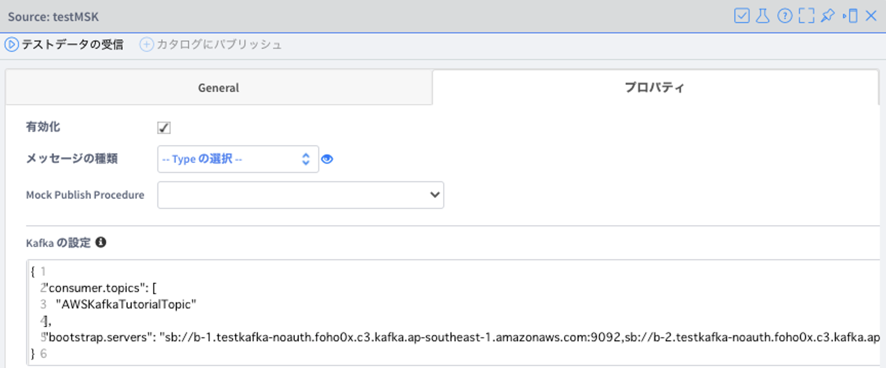

Test Publish Sample

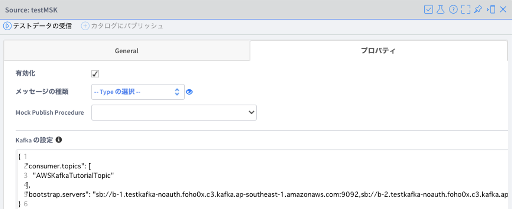

Test Subscribe

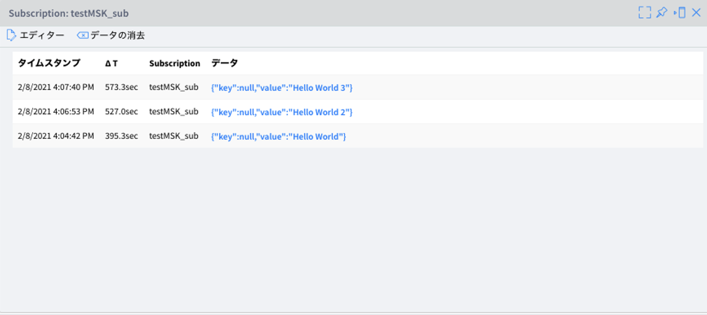


### Kafka Source Configuration (Sasl/Scram)
```json
{
    "bootstrap.servers": "sb://b-1.testkafka-sasl.hs72it.c3.kafka.ap-southeast-1.amazonaws.com:9096,sb://b-3.testkafka-sasl.hs72it.c3.kafka.ap-southeast-1.amazonaws.com:9096,sb://b-2.testkafka-sasl.hs72it.c3.kafka.ap-southeast-1.amazonaws.com:9096",
    "sasl.jaas.config": "org.apache.kafka.common.security.scram.ScramLoginModule required username=\"test\" password=\"12345\";",
    "sasl.mechanism": "SCRAM-SHA-512",
    "security.protocol": "SASL_SSL",
    "consumer.topics": [
        "AWSKafkaTutorialTopic"
    ]
}
```
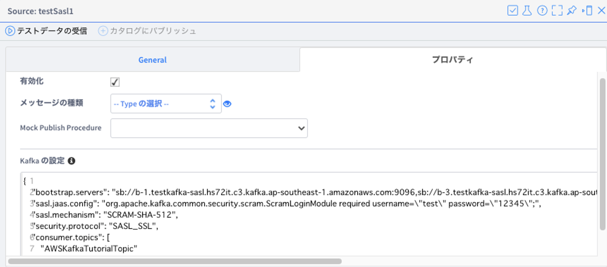

Test Publish Message

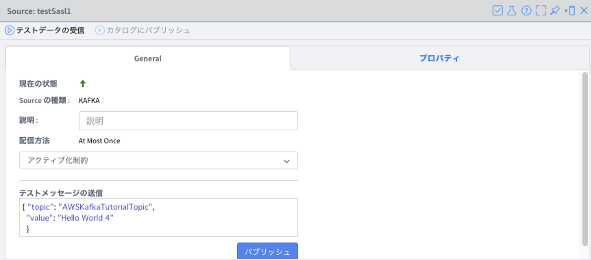


Test Subscribe

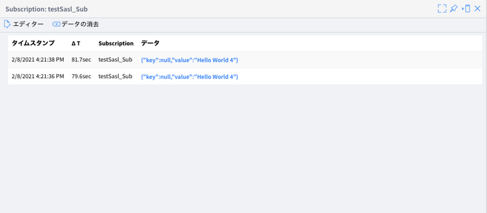
