# 外部接続 : Azure Event Hubs (Microsoft Azure Services)
## Table Of Contents
- [ユーザー アカウントの作成方法](#createUser)
- [AMQP (Source) の接続方法](#AMQP)
- [Kafka (Source) の接続方法](#KAFKA)
- [プロトコル変換について](#TRNSPROT)
- [Shared Access Key について](#SAKEY)
- [サンプル Project](#EPROJ)

<h2 id="createUser">1. ユーザー アカウントの作成方法 on Azure Event Hubs</h2>

### 1.1 名前空間の作成
参考 URL: [Azure portal を使用したイベント ハブの作成](https://docs.microsoft.com/ja-jp/azure/event-hubs/event-hubs-create)
1. Event Hubs 名前空間がないので「Event Hubs 名前空間の作成」ボタンを押下 (下図)
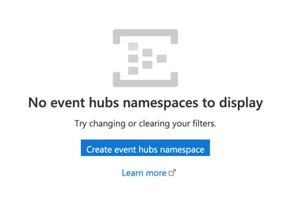

### 1.2 名前空間の設定
以下の項目を適宜設定する
|項目|内容|
---|---
|サブスクリプション|It depends.|
|リソースグループ|既に存在する場合は選択、そうでない場合は新規作成|
|名前空間の名前|Unique で分かりやすい名前をつける e.g., connectingtest|
|場所|東日本 or 西日本|
|価格レベル|Standard を選択。Basic だと Kafka が利用不可|
|スループット・ユニット|It depends.|
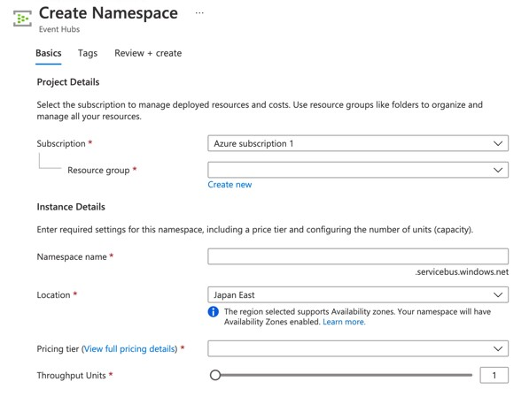

### 1.3 他の設定(Optional)
上記の画像に「機能」「タグ」のタブが存在するが、今回は Default で構わない  
次に「確認及び作成」タブに移動し設定を終える → 「デプロイが終了しました」という文言が表示するまでしばらく待つ (下図)

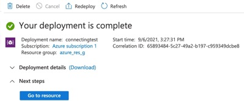

### 1.4 Event Hubs 設定
検索窓の右にある「＋ イベントハブ」をクリック (上図) すると下記の設定項目が表示されるので記入する (下図)

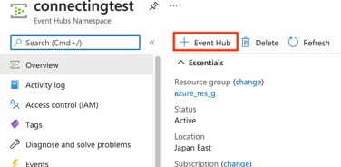

|項目|内容|
---|---
|名前|Unique な名前 e.g., eh_topic|
|パーティション数|Default|
|メッセージの保存期間|Default|
|キャプチャ|Default|
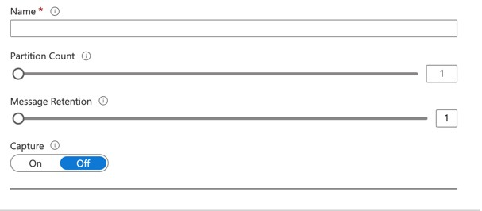

<h2 id="AMQP">2. AMQP (Source) の接続方法 on Vantiq IDE</h2>

### 2.1 AMQP (Source) 設定
以下の項目を自分の環境に合わせて設定する。またこの Source は Publisher/Subscriber 共通で利用。
|項目|内容|
---|---
|① password|[Shared Access Key] (#SAKEY) (主キー)|
|② namespace name|名前空間の名前 e.g., connectingtest|
|③ Event Hub Topics Name|e.g., eh_topic|
|④ SharedAccessKeyName 名|e.g., RootManageSharedAccessKey (default) 本番では変更推奨|
```
{
    "contentType": "application/json",
    "enabledSaslMechanisms": [
        "PLAIN"
    ],
    "password": "<①>",
    "passwordType": "string",
    "serverURIs": [
        "amqps://<②>.servicebus.windows.net:5671"
    ],
    "topics": [
        "③/ConsumerGroups/$default/Partitions/0"
    ],
    "username": "<④>"
}
```
### 2.2 VAIL 設定
以下の項目を自分の環境に合わせて設定する
|項目|内容|
---|---
|1: SOURCE 名|e.g., EH_AMQP_PUB|
|2: topic|● Event Hub Topics Name<br>● 2.1 AMQP (Source) 設定での ③ e.g., eh_topic|
```
PROCEDURE eh_amqp_pub()
var msg = {"message": {"content": "ABCDEFGHIJKRLMN"}}
PUBLISH msg to SOURCE <①> USING { "topic": "<②>" }
```
- Payload は以下の構造を用いる
```
{
  "message": {
    "key": "value"
  }
}
```
### 2.3 動作確認
VAIL を実行しその結果を受け取る (下図)  

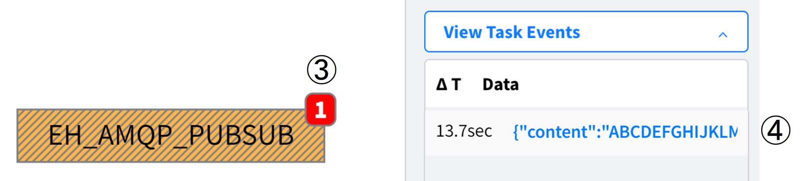

<h2 id="KAFKA">3. Kafka (Source) の接続方法 on Vantiq IDE</h2>

### 3.1 Kafka (Source) 設定
以下の項目を自分の環境に合わせて記入する
|項番:項目|内容|
---|---
|①: 名前空間の名前|e.g., connectingtest|
|②: Password|※ (下記参照)|
|③: Event Hub Topic Name|e.g,. eh_topic|
```
{
    "bootstrap.servers": "sb://<①>.servicebus.windows.net:9093",
    "sasl.jaas.config": "org.apache.kafka.common.security.plain.PlainLoginModule required username=\"$ConnectionString\" password=\"<②>\";",
    "sasl.mechanism": "PLAIN",
    "security.protocol": "SASL_SSL",
    "consumer.group.id": "$Default",
    "consumer.topics": [
        "<③>"
    ]
}
```
※ Password 詳細フォーマット
|項目|内容|
---|---
|①|名前空間の名前 e.g., connectingtest|
|②|[Shared Access Key Name] (#SAKEY) e.g., RootManageSharedAccessKey|
|③|[Shared Access Key] (#SAKEY) (主キー)|
- Endpoint=sb://①.servicebus.windows.net/;SharedAccessKeyName=②;SharedAccessKey=③;

#### 具体例
```
{
    "bootstrap.servers": "sb://connectingtest.servicebus.windows.net:9093",
    "sasl.jaas.config": "org.apache.kafka.common.security.plain.PlainLoginModule required username=\"$ConnectionString\" password=\"Endpoint=sb://connectingtest.servicebus.windows.net/;SharedAccessKeyName=RootManageSharedAccessKey;SharedAccessKey=xxxxxxxxxxxxxxxxxxxxxxxxxxxxxxxxxxxxxxxxxx=\";",
    "sasl.mechanism": "PLAIN",
    "security.protocol": "SASL_SSL",
    "consumer.group.id": "$Default",
    "consumer.topics": [
        "eh_topic"
    ]
}
```

### 3.2 VAIL 設定
以下の項目を自分の環境に合わせて記入する
|項番:項目|内容|
---|---
|①: Source 名|It depends. e.g., KAFKA_PUBSUB|
|②: topic|e.g., eh_topic|

Publish 対象のデータの "`key`" は省略可能
```
PROCEDURE eh_kafka_pub()
PUBLISH {"value":"hello world", "key": "dummy" } to SOURCE <①> USING { "topic": "②" }
```
### 3.3 動作確認
VAIL を実行しデータを受信(①)することを確認する (下図)  
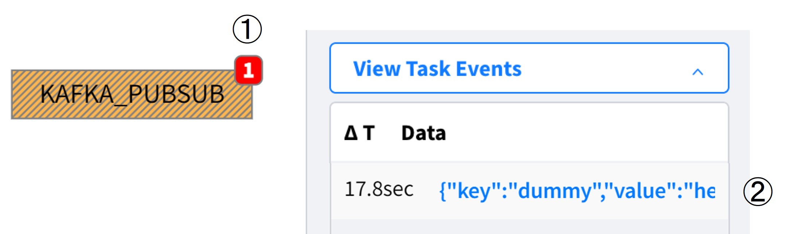

<h2 id="TRNSPROT">4. プロトコル変換について</h2>

- AMQP で 1回の Publish であっても Kafka Source ででも同時に受信できる (下図)  
注意: &lt;Source Name&gt;、&lt;Topic Name&gt; には適当な値を設定する必要あり
```
PROCEDURE eh_amqp_pub()
var msg = {"message": {"content": "ABCDEFGHIJKRLMN"}}
PUBLISH msg to SOURCE <Source Name> { "topic": "<Topic Name>" }
```
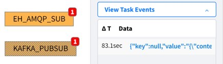

- しかし受信した JSON データの構造は以下の様になるので注意  
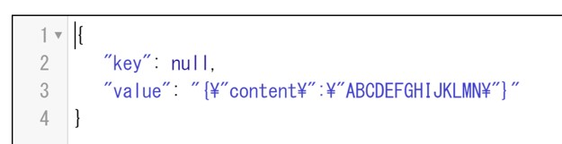

<h2 id="SAKEY">5. Shared Acces Key について</h2>

1. Top Menu から「共通アクセスポリシー」を選択 (下 左図)
2. リストアップされたポリシーから使用するキーを選択 e.g., RootManageSharedAccessKey ← Default
3. 「主キー」をコピー (下 右図)

|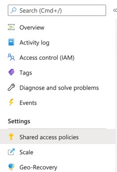|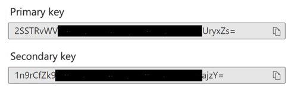|
---|---


<h2 id="EPROJ">サンプル Project on Vantiq IDE</h2>

[extConnAzure](../../conf/extConnAzure.zip)
