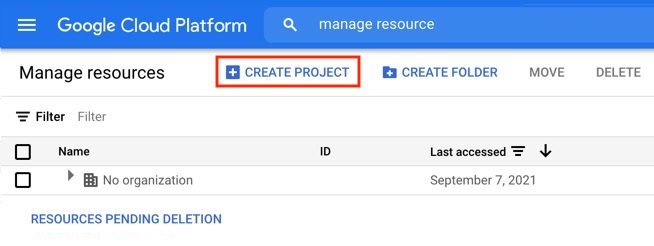
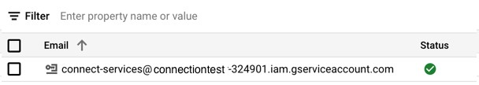
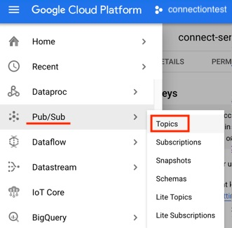
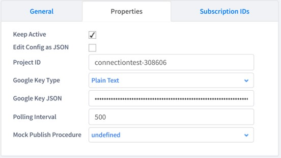
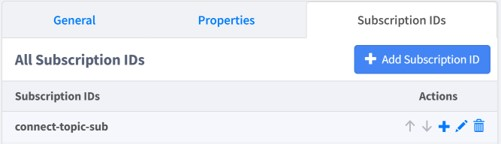
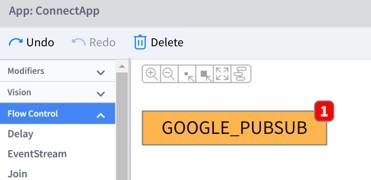

# 外部接続 : Google Cloud Pub/Sub (Google Cloud Platform)
## Table of Contents
- [ユーザー アカウントの作成方法](#createUser)
- [REMOTE（Source）の接続方法](#REMOTE)
- [サンプル プロジェクト](#EPROJ)

<h2 id="createUser">1. ユーザー アカウントの作成方法 on Google Cloud Pub/Sub</h2>

### 1.1 プロジェクトの作成
作業手順
|手順|内容|
---|---
||①:「プロジェクトを作成」リンクをクリック|
||②: 左上のメニューから<br>「ホーム > ダッシュボード」を選択|
||③: ダッシュボードが表示される|

### 1.2 サービス アカウント設定
- Google Key JSON を作る

作業手順
|手順|内容|
---|---
||①: MENU: IMAと管理 > サービス アカウント 選択|
||②: 「＋サービスアカウントを作成」リンクをクリック|
||③: サービス アカウント名: It depends.<br>e.g., connect-services<br><br>④「作成」ボタンを押下|
||⑤: 以下の権限を付与する<br>● Pub/Sub 管理者<br>● Pub/Sub 編集者<br>● Pub/Sub パブリッシャ<br>● Pub/Sub サブスクライバ<br><br>一番下の「完了」ボタンを押す|
||⑥: 一覧から作ったばかりのサービスアカウントをクリック|
||⑦: 以下の手順でJSONを取得<br>●「キー」タブを選択<br>● 一番下の「鍵を追加」を押下|
||⑧: 以下の手順でJSONを取得<br>● JSONを選択して「作成」押下<br>● JSONのダウンロードが自動で始まる|

### 1.3 Topic/Subscription の作成
作業手順
|手順|内容|
---|---
||①: 左上メニュー「Pub/Sub > トピック」を選択|
||②: 「+トピックを作成」を押下|
||③: 「トピックID」の設定 e.g., connect-topic<br>④: 「トピックを作成」を押下<br>自動でサブスクリプションも作成される<br>e.g., connect-topic-sub（Sourceの定義時に必要）|

<h2 id="REMOTE">2. REMOTE（Source）の接続方法 on Vantiq IDE</h2>

### 2.1 SOURCE の設定
作業手順
|手順|内容|
---|---
||①: Source Name: It depends e.g., GOOGLE_PUBSUB<br>②: Source Type: GCPS を選択|
||■ Properties タブを選択<br>③: Project ID It depends.<br>④: Google Key JSON（ダウンロードしたJSON）<br>⑤: Polling Interval; e.g., 500|
||■ Subscription IDs タブを選択<br>⑥: Add Subscription ID を押下して設定<br>e.g., connect-topic-sub|

### 2.2 動作確認
- **PUBLISHER**: 以下の項目を適宜書き換える

|項番:項目|内容|
---|---
|①: topicID|e.g., connect-topic|
|②: SOURCE の名称| e.g., GOOGLE_P: UBSUB|
```
PROCEDURE google_pub()
var topicID = "<①>"
PUBLISH { topicID: topicID, message: "Hello World!"} TO SOURCE <②>
```
- 実行結果



- **SUBSCRIBER**: 以下の項目を適宜書き換える  

|項番:項目|内容|
---|---
|①: SOURCE の名称| e.g., GOOGLE_PUBSUB|
```
RULE google_sub
WHEN MESSAGE ARRIVES FROM <①> AS msg
log.info("Received a message from {} with data: {}",[msg.subscriptionId, msg.data])
```
- 実行結果


<h2 id="EPROJ">サンプル プロジェクト on Vantiq IDE</h2>

- [extConnGCPS](../../conf/extConnGCPS.zip)
