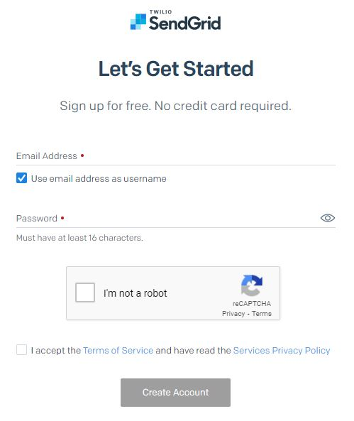
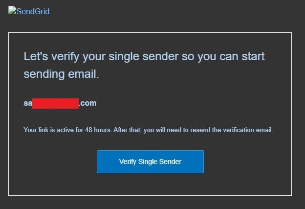

## SendGridアカウント登録手順
- ここでは SendGrid を用いた Vantiq との**接続テストを目的**としているため Free Plan を用いて環境を構築している

## Table Of Contents
- [SendGrid 関連の設定](#sendgrid)
  - [SendGrid のサイトにアクセスする](#site)
  - [ログイン情報の入力](#login)
  - [個人情報の入力](#pinfo)
  - [メール送信環境の準備](#rdyemail)
  - [Single Sender の情報を入力](#inputss)
  - [確認メールを受信](#rcvconf)
  - [確認画面の表示](#confirm)
  - [メール転送のテスト](#sendemail)
  - [転送方法の選択](#select)
  - [SMTP Relay でメールの転送を確認する](#smtp)
  - [トラッキングの無効化](#disablet)
  - [メールの送受信を確認](#checksr)
- [Vantiq IDEの設定](#vantiq-ide)
  - [GenericEmailSenderの設定](#genericemailsender)
  - [それ以外のEmail Sourceの設定](#emailsource)

<h2 id="sendgrid">1. SendGrid 関連の設定</h2>
<h3 id="site">1.1 SendGrid の[サイト]にアクセスする</h3>

- [SendGrid](https://sendgrid.com/)

- 右上または右下の「Start For Free」ボタンをクリックする

<h3 id="login">1.2. ログイン情報の入力</h3>

以下の項目を記入する
|項目|内容|
---|---
|Email Address|会員登録用のメールアドレス|
|Password|パスワード（16文字以上）|
- 以下の項目のチェックボックスにチェックを入れる
  - I'm not a robot
  - I accept the Terms of Service and have read the Service Privacy Policy

- 作業を終えたら「Create Account」ボタンをクリック
<h3 id="pinfo">1.3. 個人情報の入力</h3>

以下の項目を記入する

|項目|内容|
---|---
|First Name|名|
|Last Name|姓|
|Company Name|会社名|
|Company Website|会社のURL|
|Country Code|Japan(+81)|
|What is your role?|仕事の役割|
|How many emails do you send per month?|ひと月で送るメールの総数|
|How many employees work at your company?|社員数|

- 全て記入し終えたら「Get Started!」ボタンをクリック

<h3 id="rdyemail">1.4. メール送信環境の準備</h3>

電子メールを送信する前に、送信者IDを作成する必要がある。これを行う方法は2つあるが Single Sernder の作成が効率的

- 「Create a single sender」ボタンをクリック

<h3 id="inputss">1.5. Single Sender の情報を入力</h3>

以下の項目を記入する
|項目|内容
---|---
|From Name|転送元の姓名|
|From Email Address|転送元のメール アドレス|
|Reply To|返信先のメール アドレス|
<<<<<<< Updated upstream
|Company Address|会社の住所|
|City|市区町村|
|Country|Japan|
|Nickname|ニックネーム|
=======
|Companyy Address|会社の住所|
|City|市区町村|
|Country|Japan(+81)|
|Nicname|ニックネーム|
>>>>>>> Stashed changes

- 全て入力後「Create」ボタンをクリック

<h3 id="rcvconf">1.6. 確認メールを受信</h3>

- 「Create」ボタンをクリック後、確認メールを受信

<<<<<<< Updated upstream
- 「Verify Single Sender」をクリック
=======
- 「Verify Single Sernder」をクリック
>>>>>>> Stashed changes
- 2 way 認証の画面が表示されるのでメッセージ通りに進める

<h3 id="confirm">1.7. 確認画面の表示</h3>

- ボタンをクリック後、以下の画面が表示される

- 「Return to Single Sender Verification」ボタンをクリック

<h3 id="sendemail">1.8. メール転送のテスト</h3>

- Integrate using our Web API or SMTP Relay の「Start」ボタンをクリック

<h3 id="select">1.9. 転送方法の選択</h3>

- SMTP Relay の「Choose」ボタンをクリック

<h3 id="smtp">1.10. SMTP Relay でメールの転送を確認する</h3>

以下の項目を記入する
|項目|内容
---|---
|My First API Key Name|API KEY の名称 ・入力後「Create Key」ボタンをクリック ・**作成後の Key をコピーしておく**|
|I've updated my settings|チェックボックスにチェックを入れる|

<<<<<<< Updated upstream
- 全て入力した後「Next: Verify Integration」ボタンをクリック
=======
- 全て入力した跡「Next: Verify Integration」ボタンをクリック
>>>>>>> Stashed changes
- このままではトラッキングするように URL が書き換えられるので、これを無効にする

<h3 id="disablet">1.11. トラッキングの無効化</h3>

- 上記の作業から画面遷移した画面を残しておきたいので、以下の作業は別タブにて行う。
- 左のメールから Settings>Tracking を選択（下 左図）
<<<<<<< Updated upstream
- Open Tracking, Click Tracking の両方とも Disabled に変更 (下 右図)
=======
- Open Tracking, Click Tracking の両方とも Disabled に変更（下 右図）
>>>>>>> Stashed changes

|メニュー選択|設定項目|
---|---
|||

<h3 id="checksr">1.12. メールの送受信を確認</h3>

<<<<<<< Updated upstream
- 一旦上記の作業まで終了したらメールが転送できるかどうかを [Vantiq IDE](#vantiq-ide) を用いてチェックする。
=======
- 一旦上記の作業まで終了したらメールが転送できるかどうかを [Vantiq IDE](#vantiq) を用いてチェックする。
>>>>>>> Stashed changes
- 動作確認を終えたらこの画面に戻ってくること

- メールを受信後「Verify Integration」ボタンをクリック
- 成功すれば以下の結果が得られる

<h2 id="vantiq-ide">2. Vantiq IDE の設定</h2>

<h3 id="genericemailsender">2.1. GenericEmailSenderの設定</h3>

Namespace への招待を発行するのに使われるGenericEmailSenderの設定です。GenericEmailSenderは **system admin** のみ構成可能です。
- system のアカウントでログインする
- 検索窓から`GenericEmailSender`を検索して Project Contents Dock に登録する

- `GenericEmailSender` を以下の内容で書き換える

|項目|内容|
---|---
|host|smtp.sendgrid.net|
|port|587|
|username|apikey|
|password|コピーしておいた API KEY の値|
|passwordType|string|
|from|管理者のメール アドレス|
<<<<<<< Updated upstream

=======

>>>>>>> Stashed changes

- 動作確認: Namespace への invite を用いて動作確認をする
- 以下の項目を書き込む

|項目|内容|
---|---
|Invite Destination|Invite 先のメール アドレス|
|Invite Source|GenericEmailSender|
|Privileges|It depends.|

- 全て設定し終えたら「Send Invite」ボタンをクリックする

<h3 id="emailsource">2.2. それ以外のEmail Sourceの設定</h3>

- GenericEmailSender以外の一般的なEmail Sourceの設定です。

- Source を新規作成
- Source Type に EMAIL を選択

- 後は以下と同様の内容を設定する

