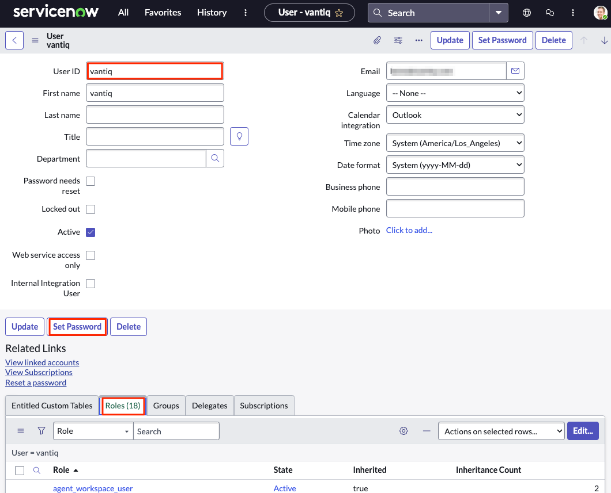
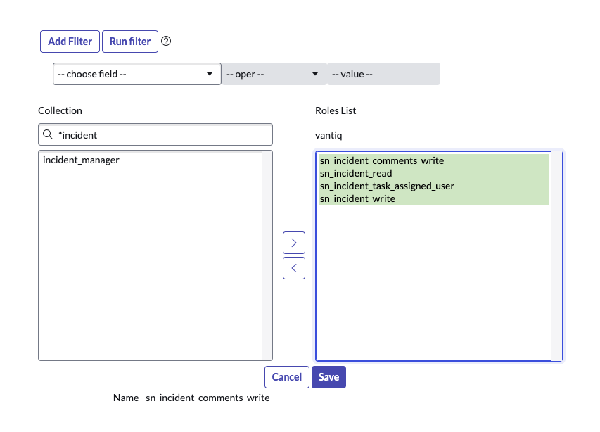
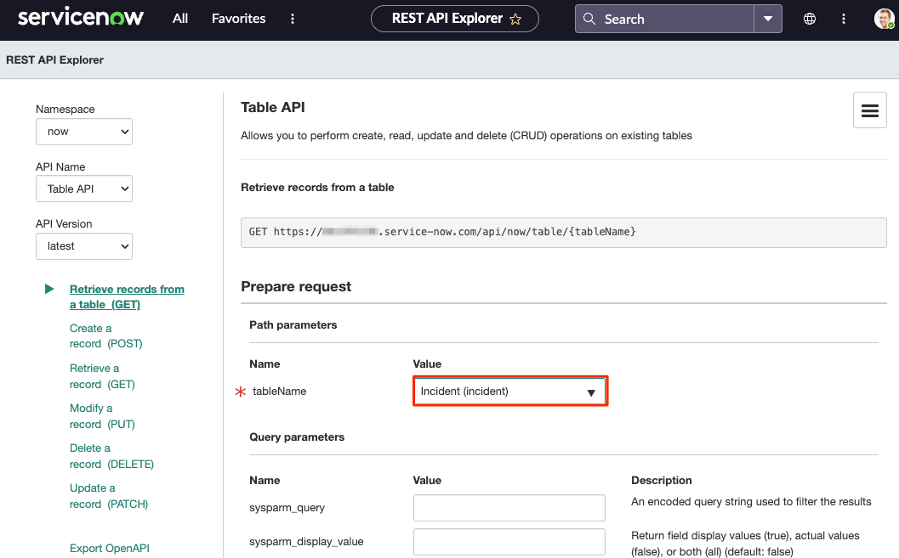
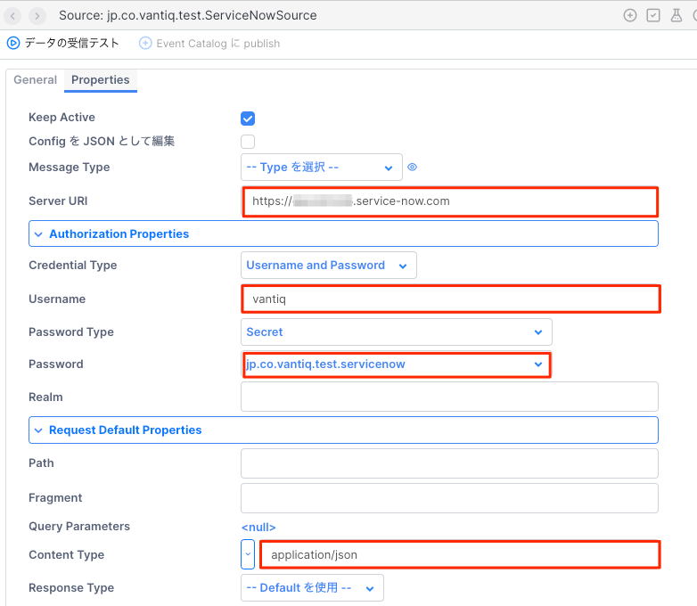
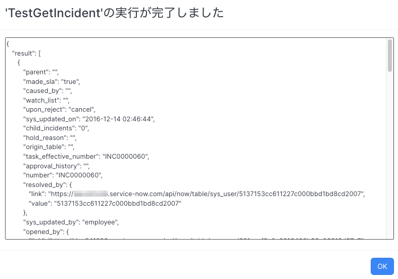
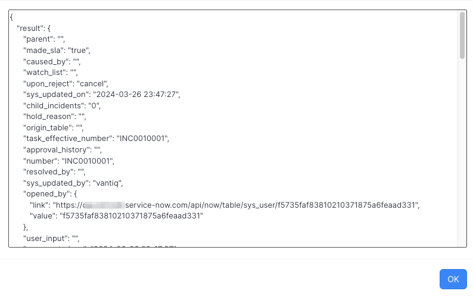
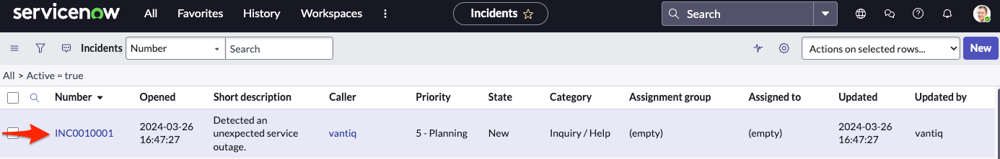

# ServiceNowとの連携

ServiceNow APIを使用してインシデントを起票するサンプルです。

以下の手順は Developer Instanceを使用して作成しました。 既存の環境を使用する場合は適宜読み替えてください。
参考：[【ServiceNow】Developer Instanceを作成しよう](https://qiita.com/d_karunwork82/items/dcf9453eb442936c68b2)

## Userの作成
インシデント起票用のユーザーを作成します。

1. [すべて] > [ユーザー管理] > [ユーザー]に移動します。
2. 新規をクリックし、ユーザーを作成します。
3. パスワードを設定し、初回ログインまで済ませておきます。



4. インシデント起票、読込みに必要なロールを設定します。



これでユーザーの準備は完了です。


## ServiceNow に接続する Source の作成

1. [すべて] メニューから [REST API エクスプローラー] に移動します。
2. `tableName` に `Incident`を指定します。



3. 画面下部の [cURL] から、必要なエンドポイントとパラメータ情報を取得します。これを参考に Source を設定します。

```sh
curl "https://<instance_id>.service-now.com/api/now/table/incident?sysparm_limit=1" \
--request GET \
--header "Accept:application/json" \
--user '<user>':'<password>'
```

4. Vantiq IDE のメニューから [追加] >> [Source] と移動し、[新規Source]から Sourceを作成します。

- General タブ
  - Source Name: 任意の名前 `ServiceNowSource`
  - Package: 任意のパッケージ
  - Source Type: `REMOTE`
- Properties タブ
  - Server URI : `https://<instance_id>.service-now.com`
  - Credential Type: Username and Password
  - Username:  前ステップで作成したユーザーのID
  - Password Type: `Secret`
  - Password :  -- 新規 Secret を追加 -- から、Secretを作成する
    - Secret Name: 任意の名前
    - Secret : 前ステップで作成したユーザーのパスワード
  - Content-Type: `application/json`




5. 作成したSourceを使用して Incident レコードを取得する Procedure を作成します。 packageは任意で設定してください。

```vail
package jp.co.vantiq.test
PROCEDURE TestGetIncident()

var path = "/api/now/table/incident"
var query = {
	"sysparm_limit" : 1
}

SELECT ONE * from Source jp.co.vantiq.test.ServiceNowSource WITH path = path, query = query

```

実行して結果が返ればOKです。




## インシデント起票する Procedure の作成

作成した Source を使用して Incident レコードを作成する Procedure を作成します。 packageは任意で設定してください。 `body` には最低限のフィールドのみ指定しています。

```
package jp.co.vantiq.test

PROCEDURE createIncident()

var path = "/api/now/table/incident"
var body = {
	"short_description": "Detected an unexpected service outage."
}

// POSTリクエストを出し、作成されたレコードを受け取る
SELECT ONE * from Source jp.co.vantiq.test.ServiceNowSource WITH method = "POST", path = path, body = body
```

実行して結果が返り、Incident テーブルにデータが作成されていればOKです。






## 備考
2024/3/26現在、Washington DCバージョンからClient Credentials Flowをサポートしているようですが、本記事ではこの方法は用いていません。[参照リンク](https://www.servicenow.com/community/developer-blog/up-your-oauth2-0-game-inbound-client-credentials-with-washington/ba-p/2816891)


## 参照

- [REST API エクスプローラーにアクセスする](https://docs.servicenow.com/ja-JP/bundle/vancouver-api-reference/page/integrate/inbound-rest/task/t_GetStartedAccessExplorer.html)
- [既存のインシデントを取得する](https://docs.servicenow.com/ja-JP/bundle/vancouver-api-reference/page/integrate/inbound-rest/task/t_GetStartedRetrieveExisting.html)
- [インシデントレコードを作成する](https://docs.servicenow.com/ja-JP/bundle/vancouver-api-reference/page/integrate/inbound-rest/task/t_GetStartedCreateInt.html)