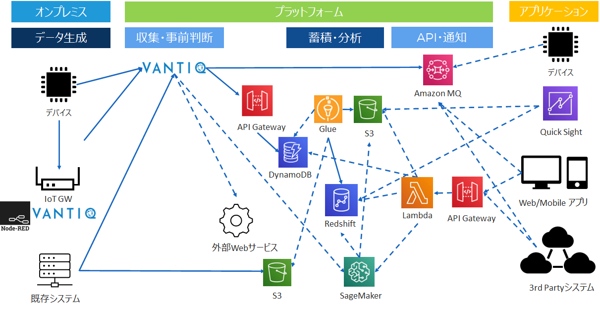
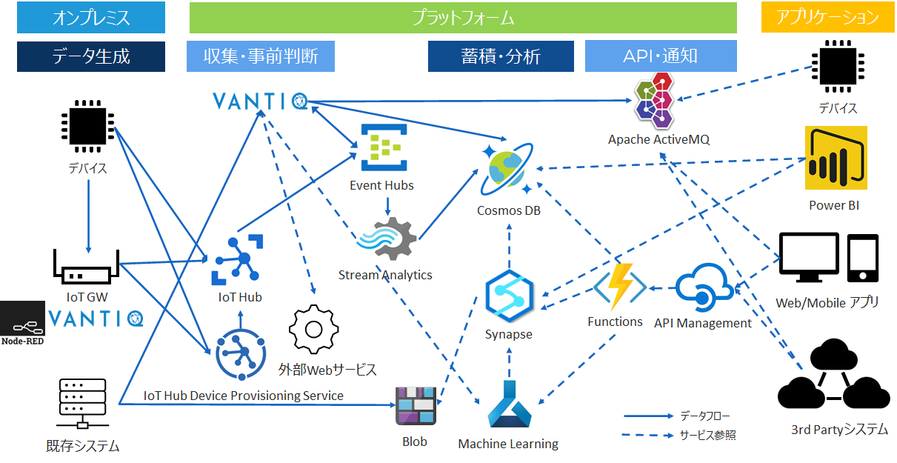

## 各Cloudサービス + Vantiqのシステム構成例
- Vantiqはストリームデータに特化した複合イベント処理エンジンである。一般的な[ラムダアーキテクチャ](https://docs.microsoft.com/ja-jp/azure/architecture/data-guide/big-data/#lambda-architecture)、[カッパアーキテクチャ](https://docs.microsoft.com/ja-jp/azure/architecture/data-guide/big-data/#kappa-architecture)等のパターンにおいて、Speed Layer（Hot Path）に位置付けられる。

#### 参考
- [ビッグ データ アーキテクチャ](https://docs.microsoft.com/ja-jp/azure/architecture/data-guide/big-data/)

### AWS系のシステム構成例

その1

その2 (IoT Coreを構成)

#### VantiqとAWSサービスの接続
- [Amazon MQ]()
- [DynamoDB](docs/jp/vantiq-aws-dynamodb.md)
- [Amazon Managed Streaming For Kafka (MSK)](docs/jp/vantiq-aws-msk.md)

### Azure系のシステム構成例
その1

その2 (IoT Hubを構成)

#### VantiqとAzureサービスの接続
- [EventHubs]()

#### 参考
- [ビッグ データ アーキテクチャにおけるリアルタイム分析](https://docs.microsoft.com/ja-jp/azure/architecture/solution-ideas/articles/real-time-analytics)
- [Azure IoT 参照アーキテクチャ](https://docs.microsoft.com/ja-jp/azure/architecture/reference-architectures/iot)
- [高度な分析アーキテクチャ](https://docs.microsoft.com/ja-jp/azure/architecture/solution-ideas/articles/advanced-analytics-on-big-data)

### GCP系

#### VantiqとGCPサービスの接続
- [GCP Pub/Sub]()

### その他の外部サービスとVantiqの接続
- [REST API for Vantiq Topic (HTTPS, WebSocket)]()
- [SendGrid]()
- [Azure FaceAPI]()
