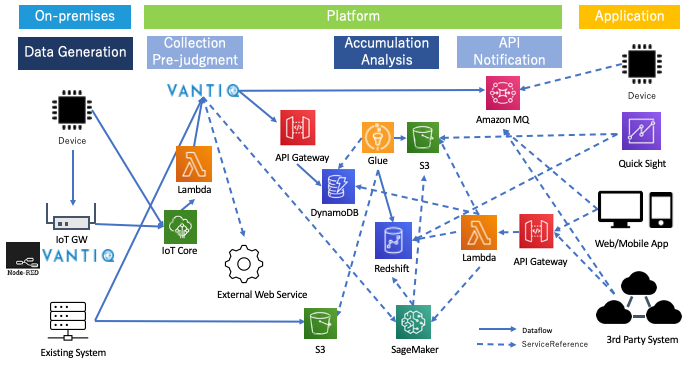
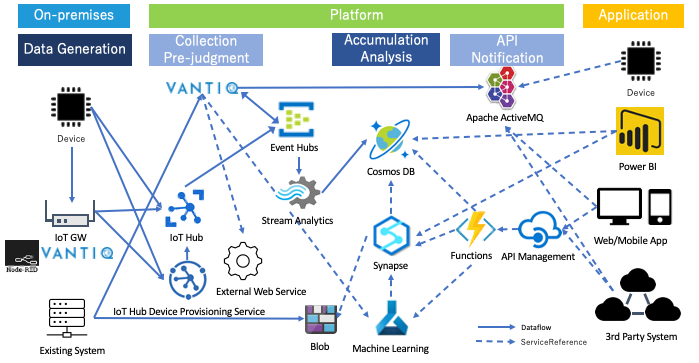

[Japanese Version here](readme.md)

## System configuration examples of each Cloud Service + Vantiq
- Vantiq is a Complex Event Processing engine that specializes in Stream Data. It is positioned in a Speed Layer (Hot Path) in the general [Lambda architecture](https://docs.microsoft.com/en-us/azure/architecture/data-guide/big-data/#lambda-architecture), [Kappa architecture](https://docs.microsoft.com/en-us/azure/architecture/data-guide/big-data/#kappa-architecture) etc. pattern.

#### Reference
- [Big data architectures](https://docs.microsoft.com/en-us/azure/architecture/data-guide/big-data/)

### Examples of AWS-based System Configuration

Part 1  

Part 2 (Configure IoT Core)  

#### Connect Vantiq to AWS Service
- [Amazon MQ](docs/en/vantiq-aws-AmazonMQ.md)
- [DynamoDB](docs/en/vantiq-aws-dynamodb.md)
- [Amazon Managed Streaming For Kafka (MSK)](docs/en/vantiq-aws-msk.md)
- [AWS IoT Core](docs/en/vantiq-aws-iotcore.md)
- [From Devices to Vantiq](../vantiq-devices-integration/readme_en.md)

### Examples of Azure-based System Configuration
Part 1  

Part 2 (Configure IoT Hub)  

#### Connect Vantiq to Azure Service  
- [Cosmos DB](docs/en/vantiq-azure-CosmosDB.md)
- [EventHubs](docs/en/vantiq-azure-EventHubs.md)
- [From Devices to Vantiq](../vantiq-devices-integration/readme_en.md)

#### References
- [Real Time Analytics on Big Data Architecture](https://docs.microsoft.com/en-us/azure/architecture/solution-ideas/articles/real-time-analytics)
- [Azure IoT reference architecture](https://docs.microsoft.com/en-us/azure/architecture/reference-architectures/iot)
- [Advanced analytics architecture](https://docs.microsoft.com/en-us/azure/architecture/solution-ideas/articles/advanced-analytics-on-big-data)

### GCP-based

#### Connect Vantiq to GCP Service
- [GCP Pub/Sub](docs/en/vantiq-gcp-PubSub.md)

### Connect other External Services to Vantiq
- [REST API for Vantiq Topic (HTTPS, WebSocket)](../vantiq-devices-integration/conf/vantiq-restapi-mqtt-amqp-python-sample)
- [SendGrid](docs/en/vantiq-sendgrid.md)
- [Azure FaceAPI]()  
- [Design Patterns Combined with API Gateway](./docs/en/vantiq-apigw.md)
- [PostgREST](./docs/en/vantiq-PostgREST.md)
