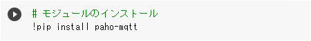

# Google Colaboratory の基礎

Google Research が提供する Google Colab（正式名称「Colaboratory」）の基礎について説明します。

## 目次

- [Google Colaboratory の基礎](#google-colaboratory-の基礎)
  - [目次](#目次)
  - [Google Colab の概要](#google-colab-の概要)
    - [Google Colab の特徴](#google-colab-の特徴)
    - [Google Colab 利用時の注意点](#google-colab-利用時の注意点)
    - [Google Colab のよくある質問](#google-colab-のよくある質問)
    - [用語解説](#用語解説)
  - [コードセルの実行や停止方法](#コードセルの実行や停止方法)
    - [コードセルの実行方法](#コードセルの実行方法)
    - [コードセルの停止方法](#コードセルの停止方法)
  - [Colab ノートブックの保存や共有方法](#colab-ノートブックの保存や共有方法)
    - [Google Colab で作成した Colab ノートブックの保存方法](#google-colab-で作成した-colab-ノートブックの保存方法)
    - [Google Colab で作成したノートブックの共有方法](#google-colab-で作成したノートブックの共有方法)
    - [Github の Google Colab を開く方法](#github-の-google-colab-を開く方法)
  - [Python ライブラリについて](#python-ライブラリについて)
    - [ライブラリのインポート方法](#ライブラリのインポート方法)
    - [外部ライブラリのインストール方法](#外部ライブラリのインストール方法)

## Google Colab の概要

Google Colab は静的なウェブページではなく、 Colab ノートブックという、コードを記述して実行することができるインタラクティブな環境です。  
Colab ノートブックを使用すると、実行可能な Python コードとリッチテキスト（画像、HTML、LaTeX なども可）を1つのドキュメントとして記述できます。  

### Google Colab の特徴

Google Colab には下記のような特徴があります。

- 環境構築が不要で Webブラウザ上で Python を実行できる。
- GPU や TPU を無料で利用することができる。
- 機械学習やデータ分析、教育などに特に適している。
- 作成したコードを簡単に共有することができる。
- Github や Google ドライブに保存することができる。
- Python の主要ライブラリがプリインストールされている。
- プリインストールされていないライブラリは別途インストールすることができる。
- これらの機能が無料で利用できる。（※有料プランもあり）

### Google Colab 利用時の注意点

Google Colab を利用する際は、事前に Google にログインする必要があります。

### Google Colab のよくある質問

下記の公式ページを参考にしてください。

:link: [よくある質問 - Google Colab](https://research.google.com/colaboratory/faq.html)

### 用語解説

#### Colab ノートブック

実行可能な Python コードとリッチテキストが1つにまとまったセルのリストです。  

> ##### 執筆者の個人的な感想
> イメージとしては、 Google Colab は **Python インタプリタ** のようなもので、 Python インタプリタに **コードセル** の内容を渡して実行していくような感じです。

#### コードセル

コードセルは、 Python コードを記述するセルです。  
1つのコードセルで実行したコードの結果は、その後の他のコードセルで利用することができます。  

#### テキストセル

テキストセルは、マークダウン構文を使用してテキストを記述するセルです。  

また、 LaTeX を使用してテキスト セルに数式を追加し、 MathJax でレンダリングすることもできます。  
ステートメントを **\$** 記号のペアで囲むと利用できます。  

##### 例

|コード|表示|
|---|---|
|`$\sqrt{3x-1}+(1+x)^2$`|$\sqrt{3x-1}+(1+x)^2$|

## コードセルの実行や停止方法

作成したコードセルの実行や停止方法は下記のとおりです。

### コードセルの実行方法

コードセルの左端にある「再生」アイコンをクリックすると、コードセル内の Python コードの実行ができます。  
また **`Ctrl` + `Enter`** または **`Cmd` + `Enter`** を入力することでも実行することができます。  

### コードセルの停止方法

コードセルの左端にある「停止」アイコンをクリックすると、実行中のコードセル内の Python コードの停止ができます。  

## Colab ノートブックの保存や共有方法

作成した Colab ノートブックの保存や共有方法は下記のとおりです。

### Google Colab で作成した Colab ノートブックの保存方法

作成した Colab ノートブックは、下記のいずれかに保存することができます。

- GitHub（※Public リポジトリのみ）
- Google ドライブ

### Google Colab で作成したノートブックの共有方法

作成した Colab ノートブックは、 **Github** や **Google ドライブ** に保存しすることで、共有できるようになります。  
通常通り URL などで共有を行うか、 Colab ノートブック（.ipyng ファイル）をダウンロードして共有することもできます。

### Github の Google Colab を開く方法

Github 上に保存されている Google Colab を開くには、 Google Colab が保存されている Github のページを開き、ページ内にある下記のボタンをクリックします。

## Python ライブラリについて

Google Colab には、主要ライブラリがプリインストールされています。  
利用方法や外部ライブラリのインストールは下記のとおりです。

### ライブラリのインポート方法

プリインストールされている Python ライブラリのインポートを行う際は、通常の Python コードと同様に `import` 文をコードセルに記述します。  

### 外部ライブラリのインストール方法

プリインストールされていない外部のライブラリをインストールする際は、 `!` をつけてコマンドを記述すると実行できるようになります。

外部ライブラリは、一定期間が経つと破棄されてしまいます。  
破棄された場合は再度、外部ライブラリのインストールを行ってください。  
また、外部ライブラリも含めて保存したい場合は、 Google ドライブに Colab ノートブロックを保存してください。
