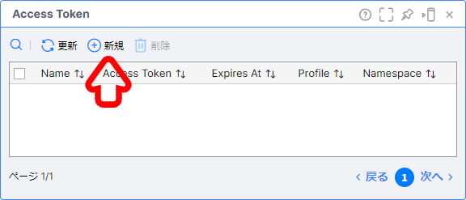
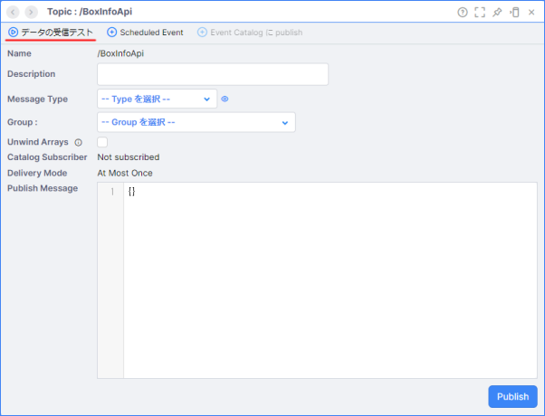
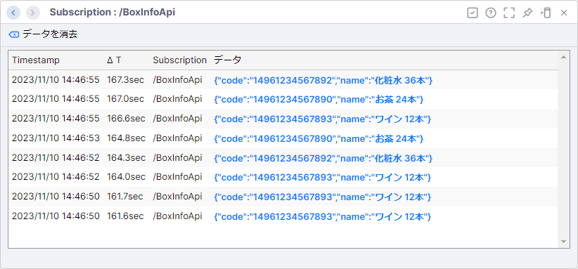
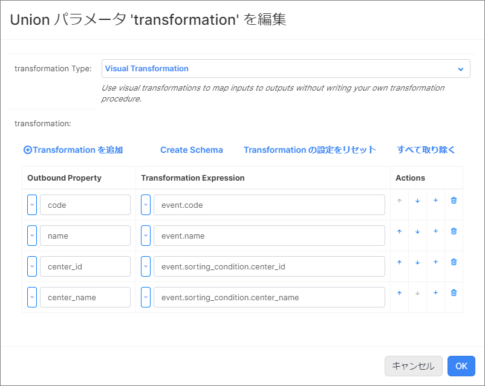
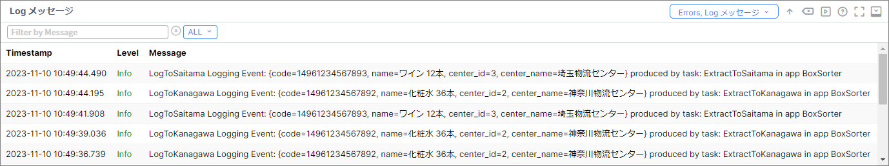

# ボックスソーター（入門編・Transformation）

## 実装の流れ

下記の流れで実装していきます。

1. 【準備】Namespace の作成と Project のインポート、データジェネレータの準備
1. 【動作確認】既存のアプリケーションが正しく動作するか確認する
1. 【App Builder】ボックスソーターアプリの改修
1. 【動作確認】送信結果のデータフォーマットを確認する

> リソース名やタスク名は任意のものに変更しても構いません。

## 目次

- [ボックスソーター（入門編・Transformation）](#ボックスソーター入門編transformation)
  - [実装の流れ](#実装の流れ)
  - [目次](#目次)
  - [アプリケーションが前提とする受信内容](#アプリケーションが前提とする受信内容)
  - [1.【準備】Namespace の作成と Project のインポート](#1準備namespace-の作成と-project-のインポート)
    - [Namespace の作成](#namespace-の作成)
    - [Project のインポート](#project-のインポート)
  - [2.【準備】データジェネレータの準備](#2準備データジェネレータの準備)
    - [Vantiq Access Token の発行](#vantiq-access-token-の発行)
    - [Google Colaboratory の設定](#google-colaboratory-の設定)
  - [3. 【動作確認】既存のアプリケーションが正しく動作するか確認する](#3-動作確認既存のアプリケーションが正しく動作するか確認する)
  - [4. 【App Builder】ボックスソーターアプリの改修](#4-app-builderボックスソーターアプリの改修)
    - [1. App を開く](#1-app-を開く)
    - [2. Transformation Activity の追加](#2-transformation-activity-の追加)
    - [3. Filter Activity の修正](#3-filter-activity-の修正)
  - [5.【動作確認】送信結果が正しく仕分けされているか確認する](#5動作確認送信結果が正しく仕分けされているか確認する)
  - [Project のエクスポート](#project-のエクスポート)
  - [ワークショップの振り返り](#ワークショップの振り返り)
  - [参考情報](#参考情報)
    - [プロジェクトファイル](#プロジェクトファイル)

## アプリケーションが前提とする受信内容

```json
{
    "code": "14961234567890",
    "name": "お茶 24本"
}
```

## 1.【準備】Namespace の作成と Project のインポート

### Namespace の作成

アプリケーションを実装する前に新しく Namespace を作成し、作成した Namespace に切り替えます。  

詳細は下記をご確認ください。  
[Vantiq の Namespace と Project について](/vantiq-introduction/apps-development/vantiq-basic/namespace/namespace.md)

### Project のインポート

Namespace の切り替えが出来たら、 Project のインポートを行います。  
**ボックスソーター（入門編・REST API）** の Project をインポートしてください。  

詳細は下記を参照してください。  
[Project の管理について - Project のインポート](/vantiq-introduction/apps-development/vantiq-basic/project/project.md#project-のインポート)

## 2.【準備】データジェネレータの準備

Google Colaboratory を使用して、ダミーデータの生成します。  
Google Colaboratory を利用するにあたり、事前に **Vantiq Access Token** を発行する必要があります。  

**Vantiq Access Token** は Namespace ごとに発行する必要があります。

### Vantiq Access Token の発行

1. メニューバーの `管理` -> `Advanced` -> `Access Tokens` -> `+ 新規` をクリックし Token の新規作成画面を開く

   

1. 以下の内容を設定し、保存する

   |項目|設定値|備考|
   |-|-|-|
   |Name|BoxDataToken|左記以外の名前でも問題ありません。|

   

1. 発行された `Access Token` をクリックして、クリップボードにコピーしておく

   

### Google Colaboratory の設定

1. 下記のリンクから **データジェネレータ** のページを開く

   - [BoxSorterDataGenerator (Beginner)](/vantiq-google-colab/docs/jp/box-sorter_data-generator_beginner.ipynb)

      > Google Colaboratory を利用する際は Google アカウントへのログインが必要になります。

1. Github のページ内に表示されている、下記の `Open in Colab` ボタンをクリックして、 Google Colaboratory を開く

   

1. `# 設定情報` に以下の内容を入力する

   |項目|設定値|備考|
   |-|-|-|
   |url|https://{VantiqのURL(FQDN)}/api/v1/resources/topics//BoxInfoApi|SSL化されていないサーバーの場合は、 `https://` を `http://` に置き換えてください。|
   |accesstoken|7tFxPj4JuNFnuwmGcEadU_6apA1r3Iji2N7AZS5HuVU=|上記で発行した Access Token|

   

1. 上から順に1つずつ `再生ボタン` を押していく  
   実行が終わるのを待ってから、次の `再生ボタン` を押してください。  

   

## 3. 【動作確認】既存のアプリケーションが正しく動作するか確認する

**Topic** の **データの受信テスト** からデータが正しく受信できているか確認します。  

1. 画面左側の **Project Contents** から **/BoxInfoApi Topic** を開きます。
   
   

1. 左上の **データの受信テスト** をクリックします。

   

1. データが受信できていることを確認します。

   

## 4. 【App Builder】ボックスソーターアプリの改修

この手順からアプリケーションの改修を開始します。  

### 1. App を開く

1. 画面左側の **Project Contents** から **BoxSorter App** を開きます。

   

### 2. Transformation Activity の追加

**Transformation Activity** を追加して、データフォーマットの整形をします。  

1. **Modifiers** の中から `Transformation` を選択し、 `AttachCondition` と `Filter Activity` の間の **矢印** の上にドロップします。

1. 不要な **矢印** を選択し、 **Delete** キーを押下します。

1. 上記の作業を繰り返し、すべての **Filter Activity** を配置し直します。

   

1. `Transformation` タスクをクリックし、 `Configuration` の `クリックして編集` を開く。  
   `transformation (Union)` の `<null>` をクリックして、以下の内容を入力し、 `OK` をクリックする

   |Outbound Property|Transformation Expression|
   |-|-|
   |code|event.code|
   |name|event.name|
   |center_id|event.sorting_condition.center_id|
   |center_name|event.sorting_condition.center_name|

   

### 3. Filter Activity の修正

**Transformation Activity** を利用して、イベントのデータフォーマットを変更したため、後続タスクの **Filter Activity** の条件式を修正する必要があります。

1. 各 `Filter Activity` を選択し、 `Configuration` の `クリックして編集` を開く。  
   `condition (Union)` の `条件式` をクリックして、以下の内容を入力し、 `OK` をクリックする

   |物流センター|設定項目|設定値|
   |-|-|-|
   |東京物流センター|condition|event.center_id == 1|
   |神奈川物流センター|condition|event.center_id == 2|
   |埼玉物流センター|condition|event.center_id == 3|

## 5.【動作確認】送信結果が正しく仕分けされているか確認する

Log 画面から `LogStream` のログデータを確認します。  

1. Log メッセージ 画面を表示する
   1. 画面右下の `Debugging` をクリックする

   1. 右側の `Errors` をクリックし、 `Log メッセージ` にチェックを入れる

1. 各物流センターごとに正しく仕分け指示が表示されていることを確認する

   **例: 各物流センターごとに Log メッセージ が表示されている**

   

## Project のエクスポート

作成したアプリケーションを Project ごとエクスポートします。  

詳細は下記を参照してください。  
[Project の管理について - Project のエクスポート](/vantiq-introduction/apps-development/vantiq-basic/project/project.md#project-のエクスポート)

## ワークショップの振り返り

1. **Project**
   1. Namespace に Project をインポートする方法を学習しました。
1. **Vantiq Access Token** 
   1. Namespace ごとに Vantiq Access Token が必要なことを学習しました。
1. **App**
   1. App の修正方法を学習しました。
   1. **Transformation Activity** を用いて、データフォーマットの変換方法を学習しました。

## 参考情報

### プロジェクトファイル

- [ボックスソーター（入門編・Transformation）の実装サンプル（Vantiq 1.37）](./../data/box_sorter_beginner_transform_1.37.zip)

以上
