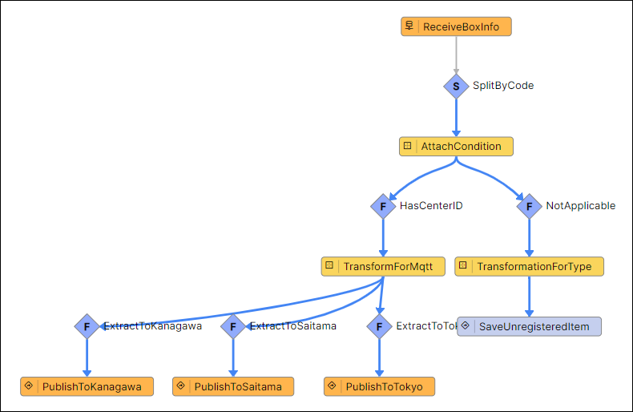

# 荷物仕分けアプリケーション (SaveToType)

荷物仕分けアプリケーション (Standard) を利用して、 Type にデータを保存する方法について学習します。

## 荷物仕分けアプリケーション (SaveToType) の学習概要

開発した荷物仕分けアプリケーションを通じて、追加の Activity Pattern について学びます。  

今回のセッションでは、 `sorting_condition` Type に登録されていない荷物コードがブローカーから送られてきます。  
荷物コードが登録されていない荷物を管理するために、新たに Type を作成し、最新のデータを保存します。

今回のセッションでは、これらの追加改修を行っていきます。  

> **注意**  
> 荷物仕分けアプリケーション (Standard) を実施していない場合は、先に 荷物仕分けアプリケーション (Standard) を実施してください。  
> - [荷物仕分けアプリケーション (Standard)](./../boxsorter-standard/readme.md)

### 学習目的

このワークショップの目的は下記のとおりです。

#### 主目的

1. ActivityPattern の **SaveToType** の使い方を理解する。

## Vantiqで実装する荷物仕分け (Box Sorter) アプリケーション 概要

このアプリケーションを実装していきます。  
詳細は次のステップで説明しますが、 `AttachCondition` タスクから分岐した処理の実装を行います。

### 荷物仕分けアプリケーションで利用する Activity Pattern の紹介

このワークショップでは下記の Activity Pattern を利用します。
> 荷物仕分けアプリケーション (Beginner) や 荷物仕分けアプリケーション (Standard) で紹介したものは割愛します。  
>
> 詳細は下記を参照してください。  
> - [荷物仕分けアプリケーション (Beginner)](./../boxsorter-beginner/readme.md)
> - [荷物仕分けアプリケーション (Standard)](./../boxsorter-standard/readme.md)

#### SaveToType Activity

イベントを Type に保存します。  
保存方法は `INSERT` もしくは `UPSERT` になります。  
`UPSERT` を利用する場合は、 Type の設定で `Natural Key` を事前に設定しておく必要があります。  

## 必要なマテリアル

### 商品マスタデータ

- [sorting_condition.csv](./../data/sorting_condition.csv)

### プロジェクトファイル

- [荷物仕分けアプリ (Standard) の実装サンプル（Vantiq 1.34）](./../data/box_sorter_standard_1.34.zip)
- [荷物仕分けアプリ (Standard) の実装サンプル（Vantiq 1.36）](./../data/box_sorter_standard_1.36.zip)

### ドキュメント

- [手順](./instruction.md)
