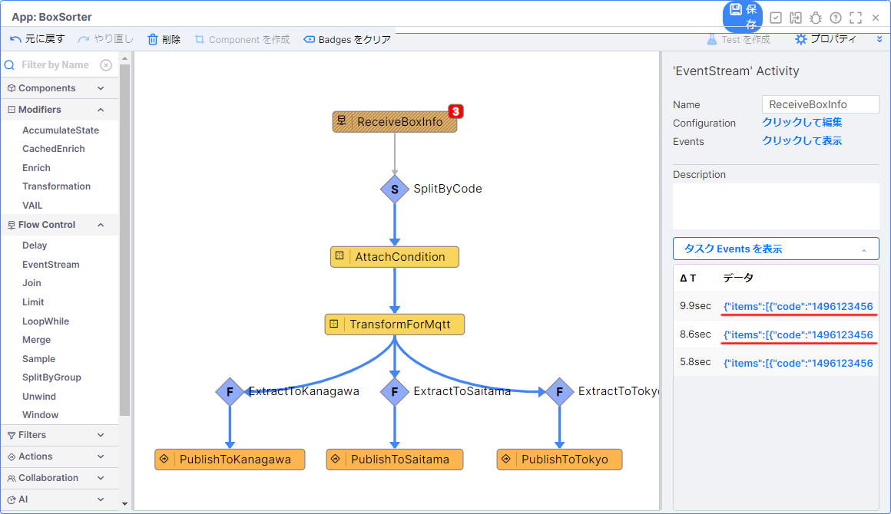
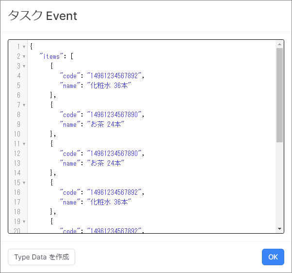

# 荷物仕分けアプリケーション開発 (Unwind)

## 目次

- [荷物仕分けアプリケーション開発 (Unwind)](#荷物仕分けアプリケーション開発-unwind)
  - [目次](#目次)
  - [0. 事前準備](#0-事前準備)
    - [プロジェクトの準備](#プロジェクトの準備)
    - [入力用 MQTTブローカーの確認](#入力用-mqttブローカーの確認)
    - [Google Colaboratory の設定](#google-colaboratory-の設定)
    - [MQTT Source の確認](#mqtt-source-の確認)
  - [1. サブスクライブしたメッセージの確認](#1-サブスクライブしたメッセージの確認)
  - [2. SplitbByCode タスクのエラー原因の確認](#2-splitbbycode-タスクのエラー原因の確認)
  - [3. 配列の並列分散処理の追加実装（Unwind Activity）](#3-配列の並列分散処理の追加実装unwind-activity)
  - [4. 仕訳処理が正しく行われていることを確認する](#4-仕訳処理が正しく行われていることを確認する)
  - [追加課題](#追加課題)
  - [実装サンプル](#実装サンプル)

## 0. 事前準備

### プロジェクトの準備

荷物仕分けアプリケーション (Standard) のプロジェクトを開きます。  

> **補足**  
> 荷物仕分けアプリケーション (Standard) のプロジェクトが存在しない場合などは、プロジェクトファイルをインポートしてください。

### 入力用 MQTTブローカーの確認

入力には以下の MQTTブローカーを使用します。

|項目|設定値|備考|
|-|-|-|
|Server URI|mqtt://public.vantiq.com:1883|-|
|Topic|/workshop/jp/yourname/boxinfo|`yourname` の箇所に任意の値を入力する ※英数字のみ|
>この MQTTブローカーはワークショップ用のパブリックなブローカーです。認証は不要です。  
>上記以外の MQTTブローカーを利用しても問題ありません。

### Google Colaboratory の設定

1. 下記のリンクから **データジェネレータ** のページを開く

   - [BoxSorterDataGenerator (Unwind)](/vantiq-google-colab/docs/jp/box-sorter_data-generator_unwind.ipynb)

   > Google Colaboratory を利用する際は Google アカウントへのログインが必要になります。

1. Github のページ内に表示されている、下記の `Open in Colab` ボタンをクリックして、 Google Colaboratory を開く

   

1. `# MQTTブローカー設定` に以下の内容を入力する

   |項目|設定値|備考|
   |-|-|-|
   |broker|public.vantiq.com|※変更不要です。|
   |port|1883|※変更不要です。|
   |topic|/workshop/jp/**yourname**/boxinfo|`yourname` の箇所に任意の値を入力します。（※英数字のみ）|
   |client_id||※変更不要です。|
   |username||※変更不要です。|
   |password||※変更不要です。|

1. 上から順に1つずつ `再生ボタン` を押していく  
   実行が終わるのを待ってから、次の `再生ボタン` を押してください。  

   1. `# ライブラリのインストール`（※初回のみ）
   1. `# ライブラリのインポート`（※初回のみ）
   1. `# MQTTブローカー設定`
   1. `# 送信データ設定`
   1. `# MQTT Publisher 本体`

1. エラーが発生していないことを確認し、 `# MQTT Publisher 本体` の左側の `停止ボタン` を押して、一旦、停止させておく

### MQTT Source の確認

Source の設定を行い、メッセージがサブスクライブできるか確認します。  

1. `BoxInfoMqtt` Source のペインを開く

1. 以下の内容が設定されているか確認をする

   |設定順|項目|設定値|設定箇所|
   |-|-|-|-|
   |1|Source Name|BoxInfoMqtt|-|
   |2|Source Type|MQTT|-|
   |3|Server URI|mqtt://public.vantiq.com:1883|`Server URI` タブ|
   |4|Topic|/workshop/jp/yourname/boxinfo <br> ※`yourname` の箇所には疎通確認時に設定した値を使用する|`Topic` タブ|

1. メッセージをサブスクライブできることを確認する
   1. `BoxInfoMqtt` Source のペインの `データの受信テスト`(Test Data Receipt) をクリックする
   1. Google Colaboratory の `# MQTT Publisher 本体` を実行し、メッセージを送信する
   1. `Subscription:BoxInfoMqtt` に Google Colaboratory から送信した内容が表示されることを確認する

      

## 1. サブスクライブしたメッセージの確認

Google Colaboratory からパブリッシュしたメッセージを確認します。  

1. `BoxSorter` App のペインを開く
1. `ReceiveBoxInfo` タスクをクリックし、 `タスク Events を表示` をクリックする
1. メッセージを何件かクリックして `タスク Event` を表示する
   
   

1. 入力データのフォーマットを確認する
   
   |  |  |
   |-|-|

## 2. SplitbByCode タスクのエラー原因の確認

現状のアプリケーションでは、 `SplitByCode` タスク以降の処理がなされていません。  
まずは処理がされていない原因を調べます。

`SplitByCode` タスクでは、 `event.code` をもとにグルーピングを行っています。  
ですが、現在の入力データでは、 `items` という配列の中に `code` が存在しています。  
したがって、 `event.code` のデータが見当たらないため、グルーピングができず、以降の処理が破棄されてたのです。  

## 3. 配列の並列分散処理の追加実装（Unwind Activity）

`ReceiveBoxInfo` タスクと `SplitByCode` タスクの間に `Unwind` Activity を追加し、 配列の並列分散処理を実装します。  

1. `BoxSorter` App のペインを開く
1. `ReceiveBoxInfo` タスクと `SplitByCode` タスクの間の矢印に重なるように `Unwind` Activity を追加する
   1. 下記の内容を設定し、保存する  

      `'Filter' Activity`
      |項目|設定値|
      |-|-|
      |Name|Unwind|

      `Configuration`
      |項目|設定値|
      |-|-|
      |unwindProperty|items|

   1. `Unwind` の `タスク Events を表示` をクリックし、配列のデータが個々のイベントに別れていることを確認する。

## 4. 仕訳処理が正しく行われていることを確認する

アプリケーション全体の動作を確認し、正しく仕訳処理が行われていることを確認します。  

以上

## 追加課題

今回のワークショップでは、 MQTT ブローカーから飛んでくるデータが必ず配列になっていました。  
では、 MQTT ブローカーから飛んでくるデータに配列のデータと配列ではないデータが混ざっている場合はどうなるでしょうか？  

下記のいずれかのジェネレーターを利用して、アプリケーションの実装を行ってみましょう。  

- Google Colab
  - [BoxSorterDataGenerator (Unwind Ex)](/vantiq-google-colab/docs/jp/box-sorter_data-generator_unwind_ex.ipynb)
- Pyehon
  - [BoxSorterDataGenerator (Unwind Ex)](/vantiq-google-colab/docs/jp/box-sorter_data-generator_unwind_ex.py)


入力データは下記を参考にしてください。

**配列のデータ**

```json
{
   "items": [
      {
         "code": "14961234567893"
         , "name": "ワイン 12本"
      }
      , {
         "code": "14961234567892"
         , "name": "化粧水 36本"
      }
   ]
   , "time": "2023-10-16 15:37:30"
}
```

**配列ではないデータ**

```json
{
   "code": "14961234567893"
   , "name": "ワイン 12本"
   , "time": "2023-10-16 15:37:30"
}
```

## 実装サンプル

- [荷物仕分けアプリ (Unwind) の実装サンプル（Vantiq 1.37）](./../data/box_sorter_unwind_1.37.zip)
