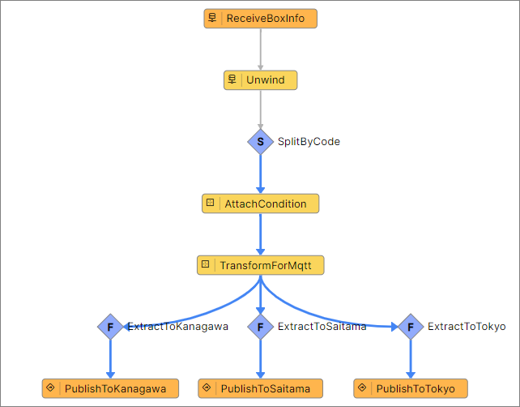

# 荷物仕分けアプリケーション (Unwind)

荷物仕分けアプリケーション (Standard) を利用して、配列データを並列処理する方法について学習します。

## 荷物仕分けアプリケーション (Unwind) の学習概要

開発した荷物仕分けアプリケーションを通じて、追加の Activity Pattern について学びます。  

今回のセッションでは、荷物のデータが配列としてブローカーから送られてきます。  
この配列のデータをバラして、並列処理を行う追加改修を行います。  

> **注意**  
> 荷物仕分けアプリケーション (Standard) を実施していない場合は、先に 荷物仕分けアプリケーション (Standard) を実施してください。  
> - [荷物仕分けアプリケーション (Standard)](./../boxsorter-standard/readme.md)

### 学習目的

このワークショップの目的は下記のとおりです。

#### 主目的

1. ActivityPattern の **Unwind** の使い方を理解する。

## Vantiqで実装する荷物仕分け (Box Sorter) アプリケーション 概要

このアプリケーションを実装していきます。  
詳細は次のステップで説明しますが、 `ReciveBoxInfo` タスクから分岐した処理の実装を行います。

### 荷物仕分けアプリケーションで利用する Activity Pattern の紹介

このワークショップでは下記の Activity Pattern を利用します。
> 荷物仕分けアプリケーション (Beginner) や 荷物仕分けアプリケーション (Standard) で紹介したものは割愛します。  
>
> 詳細は下記を参照してください。  
> - [荷物仕分けアプリケーション (Beginner)](./../boxsorter-beginner/readme.md)
> - [荷物仕分けアプリケーション (Standard)](./../boxsorter-standard/readme.md)

#### Unwind Activity

配列が含まれる1つのイベントを複数のイベントに分割して並列処理を行います。  
分割してから個々のイベントととして並列処理するようになるため、負荷分散になります。  

> **注意**  
> `Unwind` Activity で配列を分割する際は、 `1000件` を上限として利用するようにしてください。

## 必要なマテリアル

### 各自で準備する Vantiq 以外の要素

以下のものを事前にご用意ください。

- MQTTブローカー
  - Vantiq から仕分け結果を送信する先として使用します。
  - お好きなブローカーをご利用ください。  
    AmazonMQ などマネージドなものを使っても、 ActiveMQ や Mosquitto をご自身でインストールして準備しても構いません。
  - :globe_with_meridians:[The Free Public MQTT Broker by HiveMQ](https://www.hivemq.com/public-mqtt-broker/) のように無料で使用できるブローカーもございます。
  - Vantiq やご自身のクライアントからアクセスできる必要がありますのでインターネット接続できる必要があります。

以下のいずれかを事前にご用意ください。

- Google Colab
  - Google アカウント（※Google Colaboratory を利用するために使用します）
  - [BoxSorterDataGenerator (Unwind)](/vantiq-google-colab/docs/jp/box-sorter_data-generator_unwind.ipynb)
- Python
  - Python 実行環境
  - [BoxSorterDataGenerator (Unwind)](/vantiq-google-colab/docs/jp/box-sorter_data-generator_unwind.py)
- MQTTクライアント
  - ご自身の環境から MQTTブローカーに接続し、メッセージをパブリッシュしたりサブスクライブするのに使用します。
  - お好きなクライアントをご利用ください（:globe_with_meridians:[MQTTX](https://mqttx.app/) など）。

### 商品マスタデータ

- [sorting_condition.csv](./../data/sorting_condition.csv)

### プロジェクトファイル

- [荷物仕分けアプリ (Standard) の実装サンプル（Vantiq 1.34）](./../data/box_sorter_standard_1.34.zip)
- [荷物仕分けアプリ (Standard) の実装サンプル（Vantiq 1.36）](./../data/box_sorter_standard_1.36.zip)

### ドキュメント

- [手順](./instruction.md)
