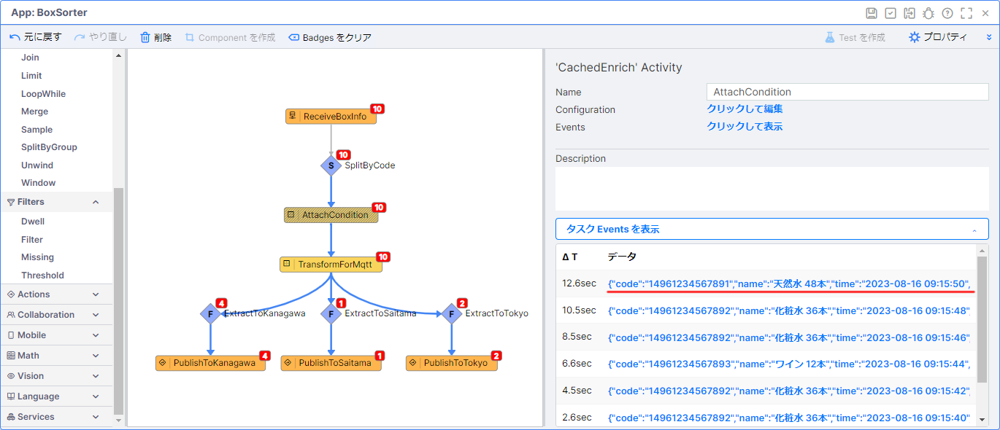
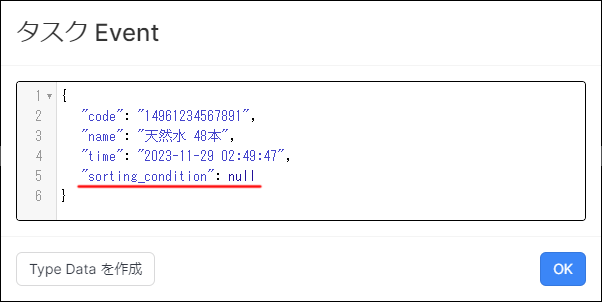

# 荷物仕分けアプリケーション開発 (SaveToType)

## 目次

- [荷物仕分けアプリケーション開発 (SaveToType)](#荷物仕分けアプリケーション開発-savetotype)
  - [目次](#目次)
  - [0. 事前準備](#0-事前準備)
    - [プロジェクトの準備](#プロジェクトの準備)
    - [入力用 MQTTブローカーの確認](#入力用-mqttブローカーの確認)
    - [Google Colaboratory の設定](#google-colaboratory-の設定)
    - [MQTT Source の確認](#mqtt-source-の確認)
  - [1. サブスクライブしたメッセージの確認](#1-サブスクライブしたメッセージの確認)
  - [2. center\_id エラーの修正](#2-center_id-エラーの修正)
  - [3. 未登録データの仕分け処理の追加実装](#3-未登録データの仕分け処理の追加実装)
  - [4. 未登録データ用の Type の作成](#4-未登録データ用の-type-の作成)
  - [5. 未登録データを Type に保存](#5-未登録データを-type-に保存)
  - [6. SaveToType Activity で発生したエラーの原因を調べる](#6-savetotype-activity-で発生したエラーの原因を調べる)
  - [7. SaveToType Activity で発生したエラーを修正する](#7-savetotype-activity-で発生したエラーを修正する)
  - [8. Type に未登録データが保存されているか確認する](#8-type-に未登録データが保存されているか確認する)
  - [実装サンプル](#実装サンプル)

## 0. 事前準備

### プロジェクトの準備

荷物仕分けアプリケーション (Standard) のプロジェクトを開きます。  

> **補足**  
> 荷物仕分けアプリケーション (Standard) のプロジェクトが存在しない場合などは、プロジェクトファイルをインポートしてください。

### 入力用 MQTTブローカーの確認

入力には以下の MQTTブローカーを使用します。

|項目|設定値|備考|
|-|-|-|
|Server URI|mqtt://public.vantiq.com:1883|-|
|Topic|/workshop/jp/yourname/boxinfo|`yourname` の箇所に任意の値を入力する ※英数字のみ|
>この MQTTブローカーはワークショップ用のパブリックなブローカーです。認証は不要です。  
>上記以外の MQTTブローカーを利用しても問題ありません。

### Google Colaboratory の設定

1. 下記のリンクから **データジェネレータ** のページを開く

   - [BoxSorterDataGenerator (SaveToType)](/vantiq-google-colab/docs/jp/box-sorter_data-generator_savetype.ipynb)

   > Google Colaboratory を利用する際は Google アカウントへのログインが必要になります。

1. Github のページ内に表示されている、下記の `Open in Colab` ボタンをクリックして、 Google Colaboratory を開く

   

1. `# MQTTブローカー設定` に以下の内容を入力する

   |項目|設定値|備考|
   |-|-|-|
   |broker|public.vantiq.com|※変更不要です。|
   |port|1883|※変更不要です。|
   |topic|/workshop/jp/**yourname**/boxinfo|`yourname` の箇所に任意の値を入力します。（※英数字のみ）|
   |client_id||※変更不要です。|
   |username||※変更不要です。|
   |password||※変更不要です。|

1. 上から順に1つずつ `再生ボタン` を押していく  
   実行が終わるのを待ってから、次の `再生ボタン` を押してください。  

   1. `# ライブラリのインストール`（※初回のみ）
   1. `# ライブラリのインポート`（※初回のみ）
   1. `# MQTTブローカー設定`
   1. `# 送信データ設定`
   1. `# MQTT Publisher 本体`

1. エラーが発生していないことを確認し、 `# MQTT Publisher 本体` の左側の `停止ボタン` を押して、一旦、停止させておく

### MQTT Source の確認

Source の設定を行い、メッセージがサブスクライブできるか確認します。  

1. `BoxInfoMqtt` Source のペインを開く

1. 以下の内容が設定されているか確認をする

   |設定順|項目|設定値|設定箇所|
   |-|-|-|-|
   |1|Source Name|BoxInfoMqtt|-|
   |2|Source Type|MQTT|-|
   |3|Server URI|mqtt://public.vantiq.com:1883|`Server URI` タブ|
   |4|Topic|/workshop/jp/yourname/boxinfo <br> ※`yourname` の箇所には疎通確認時に設定した値を使用する|`Topic` タブ|

1. メッセージをサブスクライブできることを確認する
   1. `BoxInfoMqtt` Source のペインの `データの受信テスト`(Test Data Receipt) をクリックする
   1. Google Colaboratory の `# MQTT Publisher 本体` を実行し、メッセージを送信する
   1. `Subscription:BoxInfoMqtt` に Google Colaboratory から送信した内容が表示されることを確認する

      

## 1. サブスクライブしたメッセージの確認

Google Colaboratory からパブリッシュしたメッセージを確認します。  

1. `BoxSorter` App のペインを開く
1. `AttachCondition` タスクをクリックし、 `タスク Events を表示` をクリックする
1. メッセージの中から `天然水` を探し、クリックして `タスク Event` を表示する
   
   

1. `sorting_condition` を確認する
   
   

   > **補足**  
   > `sorting_condition` Type に `天然水` のデータが存在しないため、 CachedEnrich Activity で追加された `sorting_condition` の値は `null` になっています。

## 2. center_id エラーの修正

現状のアプリケーションでは、 `sorting_condition` Type に登録されていない荷物コードが存在する場合、センター仕分け用の Filter Activity でエラーが出てしまします。  
まずはこのエラーを修正します。  

1. `BoxSorter` App のペインを開く
1. `AttachCondition` タスクと `TransformForMqtt` タスクの間の `矢印` の上に `Filter` Activity を `ドラッグ＆ドロップ` する。  
   
   

   1. 追加した `Filter` Activity に下記の内容を設定し、保存する  

      `'Filter' Activity`
      |項目|設定値|
      |-|-|
      |Name|HasCenterID|

      `Configuration`
      |項目|設定値|
      |-|-|
      |condition|event.sorting_condition != null|

1. エラーが出力されないことを確認する

## 3. 未登録データの仕分け処理の追加実装

`AttachCondition` タスクの後続タスクとして `Filter` Activity を追加し、 `sorting_condition` Type に登録されていないデータを集約します。  

1. `BoxSorter` App のペインを開く
1. `AttachCondition` タスクをクリックし、 `Filter` Activity を追加する  
   1. 下記の内容を設定し、保存する  

      `'Filter' Activity`
      |項目|設定値|
      |-|-|
      |Name|NotApplicable|

      `Configuration`
      |項目|設定値|
      |-|-|
      |condition|event.sorting_condition == null|

   1. `NotApplicable` の `タスク Events を表示` をクリックし、 `sorting_condition` Type に登録されていないデータが集約されていることを確認する

## 4. 未登録データ用の Type の作成

荷物コードが未登録のデータを Type に保存し、後から確認できるようにします。  
まずは未登録データを保存するための Type を作成します。  

1. `unregistered_item` Type を作成する
   1. メニューバーの `追加` -> `Type...` -> `+ 新規 Type` をクリックして Type の新規作成画面を開き、以下の内容を入力して `OK` をクリックする

      `Type を作成`
      |項目|設定値|
      |-|-|
      |Name|unregistered_item|
      |Role|standard|

   1. `unregistered_item` のペインが表示されるので、タブごとに以下の設定を行い保存する

      `Properties タブ`
      |プロパティ名|データ型|Required|
      |-|-|-|
      |code|String|✅|
      |name|String|✅|
      |timestamp|DateTime|✅|

      `Indexes タブ`
      |項目|設定値|Is Unigue|
      |-|-|-|
      |Key|code|✅|

      `Natural Keys タブ`
      |項目|設定値|
      |-|-|
      |Key|code|

## 5. 未登録データを Type に保存

`unregistered_item` Type の作成ができたので、実際に未登録データを Type に保存する処理を実装します。

1. `BoxSorter` App のペインを開く
1. `NotApplicable` タスクをクリックし、 `SaveToType` Activity を追加する  
   1. 下記の内容を設定し、保存する  

      `'SaveToType' Activity`
      |項目|設定値|
      |-|-|
      |Name|SaveUnregisteredItem|

      `Configuration`
      |項目|設定値|
      |-|-|
      |type|unregistered_item|
      |upsert|✅|

   1. エラーが発生せずに未登録データが Type に保存されていることを確認する

   > **補足**  
   > 今回の実装方法ではエラーが発生します。  
   > 次のステップでは、この変更によって生じたエラーの解消を行います。  
   > エラーが頻発するとシステムに負荷がかかるため、 Google Colaboratory のデータジェネレータを一旦、停止させてください。

## 6. SaveToType Activity で発生したエラーの原因を調べる

`SaveUnregisteredItem` タスクではエラーが発生しました。  

エラーの内容を確認すると次のように書かれています。  

```
The generated rule: SaveUnregisteredItem failed because: The property: unregistered_item.time is not defined.
```

これは、

```
unregistered_item Type に time というプロパティ（カラム）が存在しない。
```

という意味になります。

`unregistered_item` Type に設定されているプロパティは、下記のとおりなので、エラーメッセージのとおり、 `time` プロパティは存在しません。

|プロパティ名|データ型|Required|
|-|-|-|
|code|String|✅|
|name|String|✅|
|timestamp|DateTime|✅|

一方、 `NotApplicable` の `タスク Events を表示` をクリックし、送られてきているデータを確認すると、下記のようになっています。  
event データには `time` というプロパティが存在しています。  

```json
{
    "code": "14961234567891",
    "name": "天然水 48本",
    "time": "2023-08-17 07:45:45",
    "sorting_condition": null
}
```

`SaveToType` Activity を利用する場合は、 event データを Type のプロパティに合わせる必要があります。  
そのため、今回の実装方法ではエラーが発生してしまったということです。

## 7. SaveToType Activity で発生したエラーを修正する

`SaveUnregisteredItem` タスクで発生しているエラーの理由が分かったので、実際に修正していきます。

1. `BoxSorter` App のペインを開く
1. `NotApplicable` タスクと `SaveUnregisteredItem` タスクの間の `矢印` の上に `Transformation` Activity を `ドラッグ＆ドロップ` する。  

   1. 追加した `Transformation` Activity に下記の内容を設定し、保存する  

      `'Transformation' Activity`
      |項目|設定値|
      |-|-|
      |Name|TransformationForType|

      `Configuration`
      |項目|設定値|
      |-|-|
      |transformation|※下記の `transformation` を参照|

      `transformation`
      |項目|設定値|
      |-|-|
      |code|event.code|
      |name|event.name|
      |timestamp|toDate(replace(event.time, " ", "T") + "Z")|

1. エラーが出力されないことを確認する

> **補足**  
> Q：`unregistered_item` Type の `timestamp` プロパティの名前を `time` に変えてもエラー修正できるのではないか？  
>
> A：`unregistered_item` Type の `timestamp` プロパティの名前を `time` に変えただけでは、型エラーなどが発生してしまうため、 `Transformation` Activity を用いて型変換などもあわせて行っています。  

## 8. Type に未登録データが保存されているか確認する

`unregistered_item` Type に荷物コードが未登録のデータが登録されているか確認します。

1. `unregistered_item` Type のペインを開く
1. `すべてのレコードを表示` をクリックし、 `Type unregistered_item のすべてのオブジェクト` を開く  
1. 最新の未登録データが登録されていることを確認する

以上

## 実装サンプル

- [荷物仕分けアプリ (SaveToType) の実装サンプル（Vantiq 1.34）](./../data/box_sorter_savetype_1.34.zip)
- [荷物仕分けアプリ (SaveToType) の実装サンプル（Vantiq 1.36）](./../data/box_sorter_savetype_1.36.zip)
