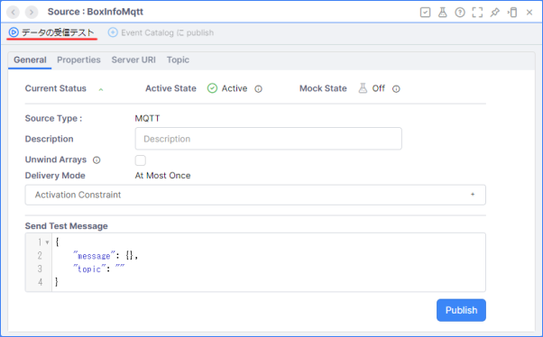
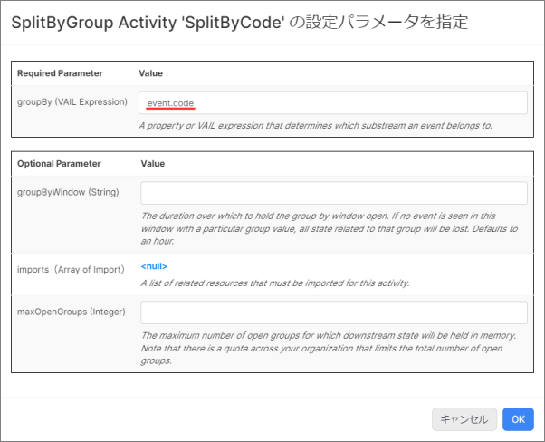
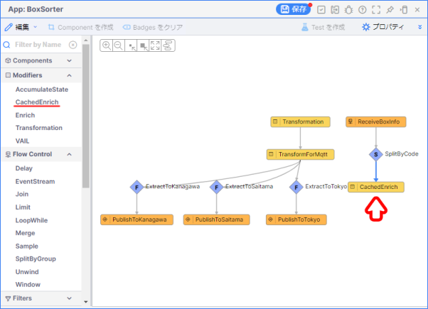
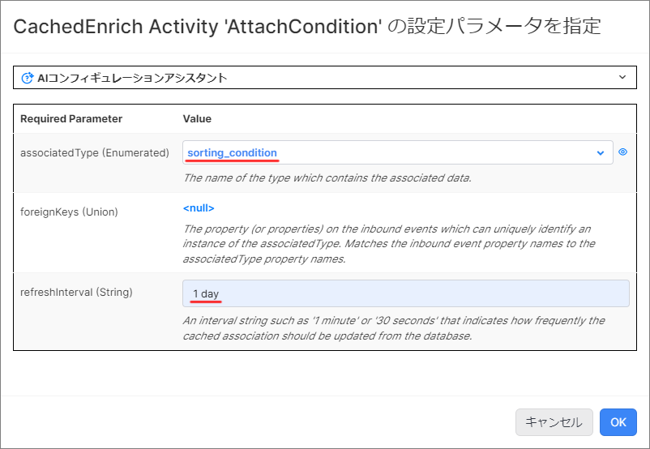

# ボックスソーター（CachedEnrich）

## 実装の流れ

下記の流れで実装していきます。

1. 【準備】Namespace の作成と Project のインポート、データジェネレータの準備
1. 【動作確認】既存のアプリケーションの動作確認
1. 【App Builder】ボックスソーターアプリの改修
1. 【動作確認】仕分け結果の確認

> リソース名やタスク名は任意のものに変更しても構いません。

## 目次

- [ボックスソーター（CachedEnrich）](#ボックスソーターcachedenrich)
  - [実装の流れ](#実装の流れ)
  - [目次](#目次)
  - [アプリケーションが前提とする受信内容](#アプリケーションが前提とする受信内容)
  - [1. Namespace の作成と Project のインポート](#1-namespace-の作成と-project-のインポート)
    - [1-1. Namespace の作成](#1-1-namespace-の作成)
    - [1-2. Project のインポート](#1-2-project-のインポート)
  - [2. データジェネレータの準備](#2-データジェネレータの準備)
    - [2-1. Google Colaboratory の設定](#2-1-google-colaboratory-の設定)
  - [3. 既存のアプリケーションの動作確認](#3-既存のアプリケーションの動作確認)
    - [3-1. Source ペインの表示](#3-1-source-ペインの表示)
    - [3-2. Source のデータ受信テスト](#3-2-source-のデータ受信テスト)
  - [4. App Builder を用いたボックスソーターアプリの改修](#4-app-builder-を用いたボックスソーターアプリの改修)
    - [4-1. 【App Builder】App ペインの表示](#4-1-app-builderapp-ペインの表示)
    - [4-2. 【Event】アプリケーションの動作確認](#4-2-eventアプリケーションの動作確認)
    - [4-3. 【SplitByGroup】イベントのグルーピング処理](#4-3-splitbygroupイベントのグルーピング処理)
    - [4-4. 【CachedEnrich】メモリ上での処理に変更](#4-4-cachedenrichメモリ上での処理に変更)
  - [5. 仕分け結果の確認](#5-仕分け結果の確認)
  - [Project のエクスポート](#project-のエクスポート)
  - [ワークショップの振り返り](#ワークショップの振り返り)
  - [参考情報](#参考情報)
    - [プロジェクトファイル](#プロジェクトファイル)

## アプリケーションが前提とする受信内容

```json
{
    "code": "14961234567890",
    "name": "お茶 24本",
    "time": "2023-11-14 07:58:37"
}
```

## 1. Namespace の作成と Project のインポート

### 1-1. Namespace の作成

アプリケーションを実装する前に新しく Namespace を作成し、作成した Namespace に切り替えます。  

詳細は下記をご確認ください。  
[Vantiq の Namespace と Project について](/vantiq-introduction/apps-development/vantiq-basic/namespace/readme.md)

### 1-2. Project のインポート

Namespace の切り替えが出来たら、 Project のインポートを行います。  
**ボックスソーター（MQTT）** の Project をインポートしてください。  

詳細は下記を参照してください。  
[Project の管理について - Project のインポート](/vantiq-introduction/apps-development/vantiq-basic/project/readme.md#project-のインポート)

## 2. データジェネレータの準備

Google Colaboratory を使用して、ダミーデータの生成します。  

ダミーデータを送受信するあたって、以下の MQTTブローカーを使用します。
|項目|設定値|備考|
|-|-|-|
|Server URI|mqtt://public.vantiq.com:1883|-|
|Topic|/workshop/jp/**yourname**/boxinfo|`yourname` の箇所に任意の値を入力する ※英数字のみ|
>この MQTTブローカーはワークショップ用のパブリックなブローカーです。認証は不要です。  
>上記以外の MQTTブローカーを利用しても問題ありません。

### 2-1. Google Colaboratory の設定

1. 下記のリンクから **データジェネレータ** のページを開きます。

   - [BoxSorterDataGenerator（MQTT）](/vantiq-google-colab/code/box-sorter_data-generator_mqtt.ipynb)

   > Google Colaboratory を利用する際は Google アカウントへのログインが必要になります。

1. Github のページ内に表示されている、下記の `Open in Colab` ボタンをクリックして、 Google Colaboratory を開きます。

   

1. `# MQTTブローカー設定` に以下の内容を入力します。

   |項目|設定値|備考|
   |-|-|-|
   |broker|public.vantiq.com|※変更不要です。|
   |port|1883|※変更不要です。|
   |topic|/workshop/jp/**yourname**/boxinfo|`yourname` の箇所に任意の値を入力します。（※英数字のみ）|
   |client_id||※変更不要です。|
   |username||※変更不要です。|
   |password||※変更不要です。|

1. 上から順に1つずつ `再生ボタン` を押していきます。  
   実行が終わるのを待ってから、次の `再生ボタン` を押してください。  

   1. `# ライブラリのインストール`（※初回のみ）
   1. `# ライブラリのインポート`（※初回のみ）
   1. `# MQTTブローカー設定`
   1. `# 送信データ設定`
   1. `# MQTT Publisher 本体`

## 3. 既存のアプリケーションの動作確認

**Source** の **データの受信テスト** からデータが正しく受信できているか確認します。  

### 3-1. Source ペインの表示

1. 画面左側の **Project Contents** から `BoxInfoMqtt` Source を開きます。
   
   

### 3-2. Source のデータ受信テスト

1. 左上の `データの受信テスト` をクリックします。

   

1. データが受信できていることを確認します。

   

   > **補足説明**  
   > データの受信が出来ない場合は下記の点を確認してください。
   > - MQTT ブローカーが正常に動いているか？
   > - データジェネレータが正常に動作しているか？
   > - `BoxInfoMqtt` Source の `Server URL` の設定が正しいか？
   > - `BoxInfoMqtt` Source の `Topic` の設定が正しいか？

## 4. App Builder を用いたボックスソーターアプリの改修

この手順からアプリケーションの改修を開始します。  

### 4-1. 【App Builder】App ペインの表示

1. 画面左側の **Project Contents** から `BoxSorter` App を開きます。

   

### 4-2. 【Event】アプリケーションの動作確認

1. 既存のアプリケーションが正しく動作しているか確認します。

   

### 4-3. 【SplitByGroup】イベントのグルーピング処理

今回、 **Enrich Activity** に代わり **CachedEnrich Activity** を利用します。  
事前に **SplitByGroup Activity** を用いて、イベントをグルーピングする必要があります。  

#### SplitByGroup Activity の実装

1. **Flow Control** の中から `SplitByGroup` を選択し、 `ReceiveBoxInfo` タスクと `AttachCondition` タスクの間の **矢印** の上にドロップします。

   

1. `SplitByGroup` タスクをクリックし、 `タスク名` の設定を行います。

   |項目|設定値|
   |-|-|
   |Name|SplitByCode|

1. `Configuration` の `クリックして編集` を開き、以下の内容を入力し、 `OK` をクリックします。

   |Required Parameter|Value|
   |-|-|
   |groupBy (VAIL Expression)|event.code|

   

1. **App** を保存し、アプリケーションが正しく動作していることを確認します。

### 4-4. 【CachedEnrich】メモリ上での処理に変更

Type のデータをメモリ上に展開し、メモリ上でのマスタデータの結合処理を可能にします。  
既に実装されている **Enrich Activity** を **CachedEnrich Activity** に変更します。  

#### Enrich Activity の削除

1. `AttachCondition` タスクを選択し、 **Delete** キーを押下します。

   

#### CachedEnrich Activity の実装

1. **Modifiers** の中から `CachedEnrich` を選択し、 `SplitByCode` タスクの上にドロップします。

   

1. `Transformation` を選択し、 `CachedEnrich` タスクの上にドロップします。

   

1. `CachedEnrich` タスクをクリックし、 `タスク名` を設定します。

   |項目|設定値|
   |-|-|
   |Name|AttachCondition|

1. `Configuration` の `クリックして編集` を開き、以下の内容を入力します。  
   **Enrich Activity** とほぼ同じ内容を設定します。

   |Required Parameter|Value|
   |-|-|
   |associatedType (Enumerated)|sorting_condition|
   |refreshInterval (String)|1 day|

   

1. `foreignKeys (Union)` の `<null>` クリックします。  
   `+ 外部キーのプロパティを追加する` をクリックし、以下の内容を入力し、 `OK` をクリックします。  
   
   |Associated Type Property|Foreign Key Expression|
   |-|-|
   |code|event.code|

   

1. **App** を保存し、 `タスク Events を表示` から、マスタデータのデータがイベントに追加されていることを確認します。

## 5. 仕分け結果の確認

送信用の MQTT ブローカーからデータをサブスクライブし、仕分け結果を確認します。  
MQTT クライアントで送信先の Topic をサブスクライブしておき、正しく仕分けされるか確認します。  

手順は、 [ボックスソーター（MQTT）| 5. 仕分け結果の確認](./../mqtt/instruction.md#5-仕分け結果の確認) と同様です。

## Project のエクスポート

作成したアプリケーションを Project ごとエクスポートします。  

詳細は下記を参照してください。  
[Project の管理について - Project のエクスポート](/vantiq-introduction/apps-development/vantiq-basic/project/readme.md#project-のエクスポート)

## ワークショップの振り返り

1. **App**
   1. **CachedEnrich Activity** を用いて、メモリ上に Type のデータを展開して処理する方法を学習しました。
   1. **SplitByGroup Activity** を用いて、イベントデータをグルーピングする方法を学習しました。

## 参考情報

### プロジェクトファイル

- [ボックスソーター（CachedEnrich）の実装サンプル（Vantiq 1.37）](./../data/box_sorter_cachedenrich_1.37.zip)

以上
