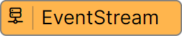
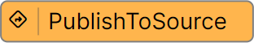

# ボックスソーター（MQTT）

ボックスソーターアプリを改修して、 MQTT でデータを送受信する方法を体験します。  
（※記事作成時の Vantiq バージョン： r1.40.2）  

> **注意**  
> ボックスソーター（Transformation）を実施していない場合は、先にそちらを実施してください。  
> - [ボックスソーター（Transformation）](./../transform/readme.md)

## ボックスソーターの全体のイメージ

1. バーコードリーダーで荷物のバーコードを読み取る。
1. 読み取った結果を MQTTブローカーに送信する。
1. Vantiq は MQTTブローカーから読み取り結果を取得する。
1. Vantiq はその結果を元に仕分け処理を行う。
1. Vantiq は仕分け指示を MQTTブローカーに送信する。
1. 制御システムは仕分け指示を MQTTブローカーから取得する。
1. 制御システムは仕分け指示に従ってソーターを制御する。

:globe_with_meridians: [実物のイメージはこちら](https://www.youtube.com/watch?v=1LvaiA3N0E8&t=282s)

ワークショップではVantiqの担当部分である No.3〜5 を実装します。
> No.1〜2 は、 Google Colaboratory を利用し、 MQTTブローカーに読み取り結果のサンプル情報を送信することで代用します。  
> Google Colaboratory の詳細は [こちら](/vantiq-google-colab/docs/colab_basic_knowledge.md) で解説しています。

## Vantiq で利用するリソースなどの解説

Vantiq リソースや各用語について解説します。

### MQTT

オーバーヘッドの多い **HTTP** プロトコルに変わり、通信量がより少ない **MQTT** プロトコルを利用してデータの送受信を行います。  
また、通信プロトコルの変更に伴い **Topic** ではなく **Soruce** を利用してデータの送受信を行います。

詳細は下記を御覧ください。  
[MQTT について](./about_mqtt.pdf)

### Source

Vantiq では、外部システムとの接続ポイントとして、 Source というリソースが用意されています。  
Source を利用することで、様々な通信プロトコルを用いたデータの送受信が可能となります。

## Vantiq で実装するアプリケーションの概要

App Builder を用いて、アプリケーションを作成していきます。  
アプリケーションの完成イメージは下記のとおりです。  

## アプリケーションの開発で利用する Activity Pattern の紹介

このワークショップでは下記の Activity Pattern を利用します。
> 他のワークショップで紹介したものは割愛します。  

### EventStream Activity

App を利用する際に必ずルートタスクとして設定されている Activity Pattern が **EventStream** になります。  
**EventStream** はデータの入り口となります。  
今回は **Inbound** ではなく、 **Source** からデータを受け取ります。  

### PublishToSource Activity

**Source** 経由でイベントデータを外部に送信するための Activity Pattern になります。  

## 必要なマテリアル

### 各自で準備する Vantiq 以外の要素

以下のものを事前にご用意ください。

- MQTTブローカー
  - Vantiq から仕分け結果を送信する先として使用します。
  - お好きなブローカーをご利用ください。  
    AmazonMQ などマネージドなものを使っても、 ActiveMQ や Mosquitto をご自身でインストールして準備しても構いません。
  - :globe_with_meridians:[The Free Public MQTT Broker by HiveMQ](https://www.hivemq.com/public-mqtt-broker/) のように無料で使用できるブローカーもございます。
  - Vantiq やご自身のクライアントからアクセスできる必要がありますのでインターネット接続できる必要があります。

以下のいずれかを事前にご用意ください。

- Google Colab
  - Google アカウント（※Google Colaboratory を利用するために使用します）
  - [BoxSorterDataGenerator（MQTT）](/vantiq-google-colab/code/box-sorter_data-generator_mqtt.ipynb)
- Python
  - Python 実行環境
  - [BoxSorterDataGenerator（MQTT）](/vantiq-google-colab/code/box-sorter_data-generator_mqtt.py)
- MQTTクライアント
  - ご自身の環境から MQTTブローカーに接続し、メッセージをパブリッシュしたりサブスクライブするのに使用します。
  - お好きなクライアントをご利用ください（:globe_with_meridians:[MQTTX](https://mqttx.app/) など）。

### 商品マスタデータ

- [com.example.sorting_condition.csv](./../data/com.example.sorting_condition.csv)

### プロジェクトファイル

- [ボックスソーター（Transformation）の実装サンプル（Vantiq 1.40）](./../data/box_sorter_transform_1.40.zip)
- [ボックスソーター（Transformation）の実装サンプル（Vantiq 1.39）](./../data/box_sorter_transform_1.39.zip)

### ドキュメント

- [手順](./instruction.md)
