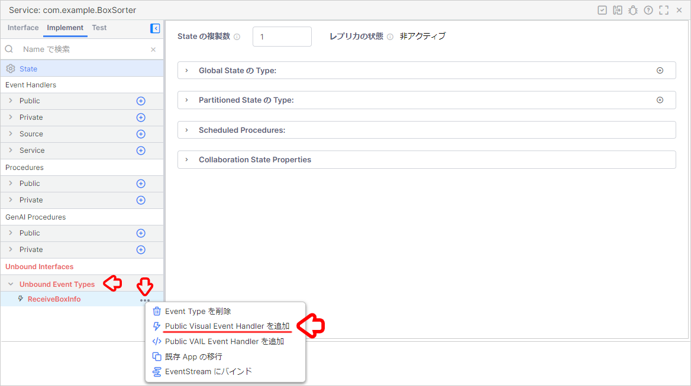

# ボックスソーター（REST API）

## アプリケーションが想定している受信内容

```json
{
    "code": "14961234567890",
    "name": "お茶 24本"
}
```

## 目次

- [ボックスソーター（REST API）](#ボックスソーターrest-api)
  - [アプリケーションが想定している受信内容](#アプリケーションが想定している受信内容)
  - [目次](#目次)
  - [1. Namespace の作成と Project の保存](#1-namespace-の作成と-project-の保存)
  - [2. データジェネレータの準備](#2-データジェネレータの準備)
    - [2-1. Vantiq Access Token の発行](#2-1-vantiq-access-token-の発行)
    - [2-2. Google Colaboratory の設定](#2-2-google-colaboratory-の設定)
  - [3. Service の作成](#3-service-の作成)
    - [3-1. Service の作成](#3-1-service-の作成)
    - [3-2. Inbound Event の作成](#3-2-inbound-event-の作成)
    - [3-3. Public Visual Event Handler の作成](#3-3-public-visual-event-handler-の作成)
    - [3-4. データの受信テスト](#3-4-データの受信テスト)
  - [4. Type を用いたマスタデータの作成](#4-type-を用いたマスタデータの作成)
    - [4-1. Type の作成](#4-1-type-の作成)
    - [4-2. マスタデータのインポート](#4-2-マスタデータのインポート)
  - [5. Service Builder を用いたアプリケーションの開発](#5-service-builder-を用いたアプリケーションの開発)
    - [5-1. 【Service Builder】Service ペインの表示](#5-1-service-builderservice-ペインの表示)
    - [5-2. 【Enrich】仕分け条件の追加](#5-2-enrich仕分け条件の追加)
    - [5-4. 【Filter】仕分け処理の実装](#5-4-filter仕分け処理の実装)
    - [5-5. 【LogStream】仕分け指示のログ出力の実装](#5-5-logstream仕分け指示のログ出力の実装)
  - [6. 仕分け結果の確認](#6-仕分け結果の確認)
    - [6-1. Log メッセージ画面の表示](#6-1-log-メッセージ画面の表示)
    - [6-2. Log の確認](#6-2-log-の確認)
  - [Project のエクスポート](#project-のエクスポート)
  - [ワークショップの振り返り](#ワークショップの振り返り)
  - [参考情報](#参考情報)
    - [プロジェクトファイル](#プロジェクトファイル)

## 1. Namespace の作成と Project の保存

アプリケーションを実装する前に新しく Namespace を作成し、作成した Namespace に切り替えます。  
あわせてプロジェクトの保存も行っておきます。  

詳細は下記をご確認ください。  
[Vantiq の Namespace と Project について](/vantiq-introduction/apps-development/vantiq-basic/namespace/readme.md)

## 2. データジェネレータの準備

Google Colaboratory を使用して、ダミーデータの生成します。  
Google Colaboratory を利用するにあたり、事前に **Vantiq Access Token** を発行する必要があります。  

### 2-1. Vantiq Access Token の発行

1. メニューバーの `管理` -> `Advanced` -> `Access Tokens` -> `+ 新規` をクリックします。

   

1. 以下の内容を設定し、保存します。

   |項目|設定値|備考|
   |-|-|-|
   |Name|BoxDataToken|左記以外の名前でも問題ありません。|

   

1. 発行された `Access Token` をクリックして、クリップボードにコピーしておきます。

   

### 2-2. Google Colaboratory の設定

1. 下記のリンクから **データジェネレータ** のページを開きます。

   - [BoxSorterDataGenerator（REST API）](/vantiq-google-colab/code/box-sorter_data-generator_rest-api.ipynb)

      > Google Colaboratory を利用する際は Google アカウントへのログインが必要になります。

1. Github のページ内に表示されている、下記の `Open in Colab` ボタンをクリックして、 Google Colaboratory を開きます。

   

1. `# 設定情報` に以下を参考にして、必要な内容を入力します。

   |項目|設定値|備考|
   |-|-|-|
   |url|https://dev.vantiq.com/api/v1/resources/services/com.example.BoxSorter/ReceiveBoxInfo|SSL化されていないサーバーの場合は、 `https://` を `http://` に置き換えてください。|
   |accesstoken|7tFxPj4JuNFnuwmGcEadU_6apA1r3Iji2N7AZS5HuVU=|上記で発行した Access Token|

   

1. 上から順に1つずつ `再生ボタン` を押していきます。  
   実行が終わるのを待ってから、次の `再生ボタン` を押してください。  

   

## 3. Service の作成

アプリケーションの基礎となる Service を作成します。  

### 3-1. Service の作成

1. メニューバーの `追加` -> `Service...` -> `+ 新規 Service` をクリックし Service の新規作成画面を開きます。
   
   

1. 以下の内容を設定し、 `作成` をクリックします。

   |項目|設定値|
   |-|-|
   |Name|BoxSorter|
   |Package|com.example|

   

### 3-2. Inbound Event の作成

1. `Interface` タブの中にある `Inbound` の右側の `＋` をクリックします。

   

1. 以下の内容を設定し、保存します。

   |項目|設定値|備考|
   |-|-|-|
   |Name|ReceiveBoxInfo|※データジェネレータに設定したエンドポイントの URL と同じものを指定してください。|

   

### 3-3. Public Visual Event Handler の作成

1. `Implement` タブを開き、 `Unbound Event Types` をクリックして、アコーディオンを開きます。  
   `ReceiveBoxInfo` の右側の `…` をクリックして、 `Public Visual Event Handler を追加` をクリックします。

   

1. Service を保存します。

   

### 3-4. データの受信テスト

データを受信するとタスクの右上にバッジが表示され、カウントアップされます。  
データを確認するのは下記の操作を行います。  

1. `Event Stream` タスクをクリックします。  
   画面右下の `タスク Events を表示` をクリックします。

   

1. 表示された青字の JSON Object をクリックします。  

   

1. 想定通りのデータが受信できているか確認します。  

   

   > **補足：データの流れについて**  
   > ここまでの手順で、  
   > `Interface` の `Inbound Event` の `ReceiveBoxInfo Event Type` で受け取ったデータは、  
   > `Implement` の `Public Event Handler` の `ReceiveBoxInfo Event Handler` に紐づけられています。  
   > `ReceiveBoxInfo Event Handler` に紐づけられたデータは、ルートタスクである `EventStream Activity` に送られます。  

## 4. Type を用いたマスタデータの作成

このアプリケーションが受け取るデータの内容は、以下のように `code` と `name` だけが含まれています。

```json
{
    "code": "14961234567890",
    "name": "お茶 24本"
}
```

仕分けをしていくにあたり、その判断材料となる情報を追加する必要があります。  

Vantiq では **Enrich Activity** という Activity Pattern が用意されており、イベントに対して Type に保存されたレコードの内容を追加することができます。  

そのためには、あらかじめ仕分けの判断材料となる情報を保持した Type が必要となります。  
Type を作成し、 CSV ファイルのインポートを行います。  

> **補足：Type の更新方法について**  
> マスタデータなどのデータを Type へインポートする方法は CSV ファイルでのインポート以外にも、 REST API を用いて Type を更新する方法などもあります。  

### 4-1. Type の作成

1. メニューバーの `追加` -> `Type...` -> `+ 新規 Type` をクリックして Type の新規作成画面を開きます。

   

1. 以下の内容を入力して `作成` をクリックします。

   |項目|設定値|
   |-|-|
   |Name|sorting_condition|
   |Package|com.example|
   |Role|standard|

   

1. `com.example.sorting_condition` のペインが表示されるので、以下の設定を行い、保存します。

   **Properties タブ**
   |プロパティ名|データ型|Required|
   |-|-|-|
   |code|String|✅|
   |center_id|Integer|✅|
   |center_name|String|✅|

   

   

   

### 4-2. マスタデータのインポート

1. メニューバーの `Projects` -> `インポート...` を開き、 `Select Import Type:` を `Data` に設定します。

   

1. `インポートする CSV ファイルまたは JSON ファイルをここにドロップ` の箇所に [com.example.sorting_condition.csv](./../data/com.example.sorting_condition.csv) をドロップし `インポート` をクリックします。

   

   > **注意：選択ボックスについて**  
   > Type にレコードをインポートする際は `Data` を選択する必要があります。  
   > デフォルトは `Projects` になっているので注意してください。  

   > **注意：ファイル名について**  
   > インポートする CSV ファイルのファイル名と作成した Type のリソース名が完全に一致している必要があります。  
   > ファイル名が異なる場合は、 CSV ファイルを Type のリソース名にあわせてリネームしてください。  

1. `com.example.sorting_condition` Type のペインを開き、上部にある `すべてのレコードを表示` をクリックしてインポートが成功しているか確認します。

   

   

## 5. Service Builder を用いたアプリケーションの開発

この手順からアプリケーション開発を開始します。  
`EventStream` Activity で取得したデータをイベントとして、処理を実装していきます。  

### 5-1. 【Service Builder】Service ペインの表示

1. 画面左側の **Project Contents** から `ReceiveBoxInfo` Event Handler を開きます。

   

### 5-2. 【Enrich】仕分け条件の追加

**Enrich Activity** を使用して、 Type のデータをイベントに追加します。

#### Enrich Activity の実装

1. Service ペイン左側の `Modifiers` の中から `Enrich` を選択し、 `EventStream` タスクの上にドロップします。

   

1. `Configuration` の `クリックして編集` を開き、以下の設定を行いアプリケーションを保存します。

   <details>
   <summary>Vantiq Version 1.35 以前の場合</summary>

   |項目|設定値|
   |-|-|
   |associatedType|com.example.sorting_condition|

   `foreignKeys` の `<null>` をクリックし、下記の設定を行います。

   1. `+ アイテムの追加` をクリックします。

      |項目|設定値|備考|
      |-|-|-|
      |Value|code|この項目に設定したプロパティがクエリの条件になる|
   </details>
   
   <details>
   <summary>Vantiq Version 1.36 以降の場合</summary>
   
   |項目|設定値|
   |-|-|
   |associatedType|com.example.sorting_condition|

   `foreignKeys` の `<null>` をクリックし、下記の設定を行います。

   

   1. `+ 外部キーのプロパティを追加する` をクリックして、下記の設定を行います。

      |項目|設定値|備考|
      |-|-|-|
      |Associated Type Property|code|Type 側のプロパティ|
      |Foreign Key Expression|event.code|イベント側のプロパティ|

      
   </details>

   > **補足：条件について**  
   > ここで設定した条件は VAIL で書くとすると  
   >
   > ```JavaScript
   > SELECT ONE FROM com.example.sorting_condition WHERE code == event.code
   > ```
   >
   > ということになります。

1. `AttachCondition` タスクをクリックし、 `タスク Events を表示` から、 Enrich の動作確認を行います。  
   下記のようなイベントになっていることを確認します。

   ```json
   {
       "code": "14961234567890",
       "name": "お茶 24本",
       "sorting_condition": {
           "_id": "649d30c7c32b66791581af76",
           "center_id": 1,
           "center_name": "東京物流センター",
           "code": "14961234567890",
           "ars_namespace": "BoxSorter",
           "ars_version": 1,
           "ars_createdAt": "2023-06-29T07:20:39.157Z",
           "ars_createdBy": "e9cc46d7-77cc-4929-8261-40ddceb8b143"
       }
   }
   ```

   > `_id` や `ars_***` はシステム側で自動生成されるプロパティのため、この例と同じにはなりません。

   `sorting_condition` というプロパティが追加されており、物流センターに関する情報を追加することができました。

### 5-4. 【Filter】仕分け処理の実装

特定の物流センターのイベントのみが通過できるフローを実装することで、仕分けを行います。  
今回は「東京」「神奈川」「埼玉」の3つの物流センター単位で仕分けをしますので、 **Filter Activity** を設定したタスクを3つ実装します。

物流センターとその ID は以下の関係になっています。
|物流センター|物流センターID|
|-|-|
|東京|1|
|神奈川|2|
|埼玉|3|

この物流センターID `center_id` で仕分けをします。

#### Filter Activity の実装

1. Service ペイン左側の `Filters` の中から `Filter` を選択し、 `AttachCondition` タスクの上にドロップします。  
   この作業を3回繰り返し、3つの **Filter Activity** を配置します。

   

1. 各 **Filter Activity** の `タスク名` の設定と `Configuration` の `クリックして編集` から `condition (Union)` に条件式の設定を行い、アプリケーションを保存します。  

   1. 東京物流センター

      |項目|設定値|
      |-|-|
      |Name|ExtractToTokyo|
      |condition (Union)|event.sorting_condition.center_id == 1|

   1. 神奈川物流センター

      |項目|設定値|
      |-|-|
      |Name|ExtractToKanagawa|
      |condition (Union)|event.sorting_condition.center_id == 2|

   1. 埼玉物流センター

      |項目|設定値|
      |-|-|
      |Name|ExtractToSaitama|
      |condition (Union)|event.sorting_condition.center_id == 3|

1. 各 **Filter Activity** で `タスク Events を表示` を行い、それぞれ適切なイベントのみが通過しているか確認します。

   - 東京物流センター： `ExtractToTokyo`

     ```json
     {
         "code": "14961234567890",
         "name": "お茶 24本",
         "sorting_condition": {
             "_id": "649d30c7c32b66791581af76",
             "center_id": 1,
             "center_name": "東京物流センター",
             "code": "14961234567890",
             "ars_namespace": "BoxSorter",
             "ars_version": 1,
             "ars_createdAt": "2023-06-29T07:20:39.157Z",
             "ars_createdBy": "e9cc46d7-77cc-4929-8261-40ddceb8b143"
         }
     }
     ```

   - 神奈川物流センター： `ExtractToKanagawa`

     ```json
     {
         "code": "14961234567892",
         "name": "化粧水 36本",
         "sorting_condition": {
             "_id": "649d30c7c32b66791581af77",
             "center_id": 2,
             "center_name": "神奈川物流センター",
             "code": "14961234567892",
             "ars_namespace": "BoxSorter",
             "ars_version": 1,
             "ars_createdAt": "2023-06-29T07:20:39.200Z",
             "ars_createdBy": "e9cc46d7-77cc-4929-8261-40ddceb8b143"
         }
     }
     ```

   - 埼玉物流センター： `ExtractToSaitama`

     ```json
     {
         "code": "14961234567893",
         "name": "ワイン 12本",
         "sorting_condition": {
             "_id": "649d30c7c32b66791581af78",
             "center_id": 3,
             "center_name": "埼玉物流センター",
             "code": "14961234567893",
             "ars_namespace": "BoxSorter",
             "ars_version": 1,
             "ars_createdAt": "2023-06-29T07:20:39.244Z",
             "ars_createdBy": "e9cc46d7-77cc-4929-8261-40ddceb8b143"
         }
     }
     ```

### 5-5. 【LogStream】仕分け指示のログ出力の実装

ここまでの実装で仕分けができるようになりましたので、その結果を **Log メッセージ** に表示します。

#### LogStream Activity の実装

1. Service ペイン左側の `Actions` の中から `LogStream` を選択し、各 **Filter Activity** の上にドロップします。  
   この作業を3回繰り返し、3つの **LogStream Activity** を配置します。

   

1. 各 **LogStream Activity** の `タスク名` の設定と `Configuration` の `クリックして編集` から `level` の設定を行い、アプリケーションを保存します。  

   1. 東京物流センター

      |項目|設定値|
      |-|-|
      |Name|LogToTokyo|
      |level (Enumerated)|info|

   1. 神奈川物流センター

      |項目|設定値|
      |-|-|
      |Name|LogToKanagawa|
      |level (Enumerated)|info|

   1. 埼玉物流センター

      |項目|設定値|
      |-|-|
      |Name|LogToSaitama|
      |level (Enumerated)|info|

## 6. 仕分け結果の確認

データジェネレータからダミーデータを送信しておき、正しく仕分けされるか確認します。

### 6-1. Log メッセージ画面の表示

1. 画面右下の `Debugging` をクリックします。

1. 右側の `Errors` をクリックし、 `Log メッセージ` にチェックを入れます。

### 6-2. Log の確認

1. 各物流センターごとに正しく仕分け指示が表示されていることを確認します。

   **例: 各物流センターごとに Log メッセージ が表示されている**

   

## Project のエクスポート

作成したアプリケーションを Project ごとエクスポートします。  
Project のエクスポートを行うことで、他の Namespace にインポートしたり、バックアップとして管理することが出来ます。  

詳細は下記を参照してください。  
[Project の管理について - Project のエクスポート](/vantiq-introduction/apps-development/vantiq-basic/project/readme.md#project-のエクスポート)

## ワークショップの振り返り

1. **全体**
   1. Vantiq の利用方法を体験しました。
1. **Type** 
   1. **Type** を作成し、マスタデータをインポートしました。
   1. **すべてのレコードを表示** からデータが正しくインポートできているか確認しました。
1. **Service**
   1. **Service Builder** を用いて GUI ベースでアプリケーションを開発しました。
   1. **タスクイベントの表示** からイベントデータを逐次確認する方法を学習しました。
   1. **Enrich Activity** を用いて **Type** のデータをイベントデータに結合しました。
   1. **Filter Activity** を用いてセンターIDごとにイベントを仕分けしました。
   1. **LogStream Activity** を用いてデータの確認方法を学習しました。

## 参考情報

### プロジェクトファイル

- [ボックスソーター（REST API）の実装サンプル（Vantiq r1.40）](./../data/box_sorter_restapi_1.40.zip)
- [ボックスソーター（REST API）の実装サンプル（Vantiq r1.37）](./../data/box_sorter_restapi_1.37.zip)
- [ボックスソーター（REST API）の実装サンプル（Vantiq r1.34）](./../data/box_sorter_restapi_1.34.zip)

> **注意：プロジェクトのバージョンについて**  
> Vantiq r1.40 以前のプロジェクトファイルは Service 非対応の古いサンプルになります。  
> ドキュメント記載の手順と異なりますので注意してください。  

以上
