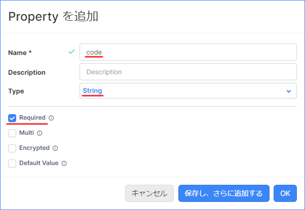
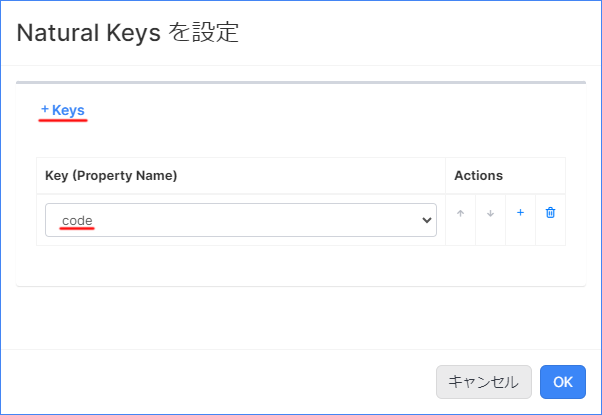
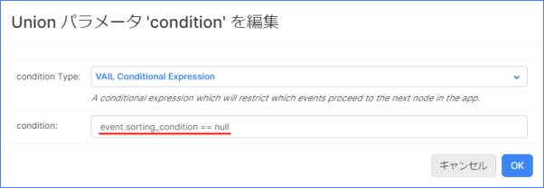
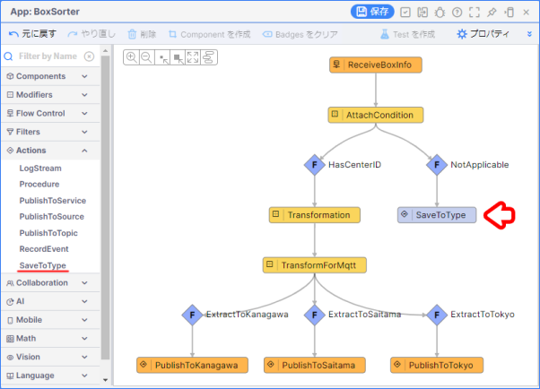
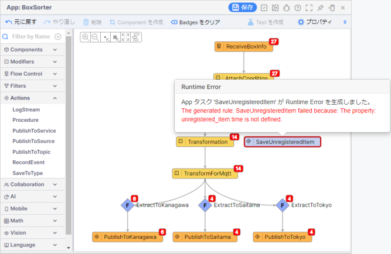
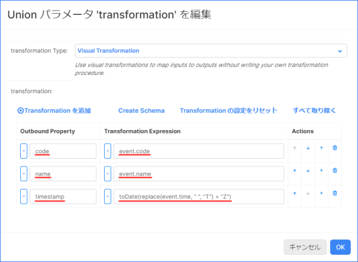
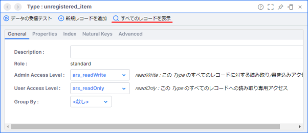
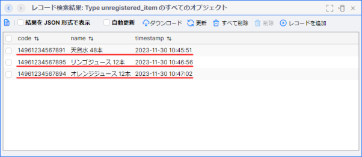

# ボックスソーター（中級編・SaveToType）

## 実装の流れ

下記の流れで実装していきます。

1. 【準備】Namespace の作成と Project のインポート、データジェネレータの準備
1. 【動作確認】既存のアプリケーションの動作確認
1. 【App Builder】既存のアプリケーションの修正
1. 【Type】未登録データ保存容の Type の作成
1. 【App Builder】ボックスソーターアプリの改修
1. 【動作確認】仕分け結果の確認

> リソース名やタスク名は任意のものに変更しても構いません。

## 目次

- [ボックスソーター（中級編・SaveToType）](#ボックスソーター中級編savetotype)
  - [実装の流れ](#実装の流れ)
  - [目次](#目次)
  - [アプリケーションが前提とする受信内容](#アプリケーションが前提とする受信内容)
  - [1. Namespace の作成と Project のインポート](#1-namespace-の作成と-project-のインポート)
    - [1-1. Namespace の作成](#1-1-namespace-の作成)
    - [1-2. Project のインポート](#1-2-project-のインポート)
  - [2. データジェネレータの準備](#2-データジェネレータの準備)
  - [3. 既存のアプリケーションの動作確認](#3-既存のアプリケーションの動作確認)
  - [4. App Builder を用いたボックスソーターアプリの修正](#4-app-builder-を用いたボックスソーターアプリの修正)
    - [4-1. サブスクライブしたメッセージの確認](#4-1-サブスクライブしたメッセージの確認)
    - [4-2. center\_id エラーの修正](#4-2-center_id-エラーの修正)
  - [5. 未登録データ保存用の Type の作成](#5-未登録データ保存用の-type-の作成)
    - [5-1. Type の新規作成](#5-1-type-の新規作成)
    - [5-2. Type の設定](#5-2-type-の設定)
  - [6. App Builder を用いたボックスソーターアプリの改修](#6-app-builder-を用いたボックスソーターアプリの改修)
    - [6-1. 未登録データの仕分け処理の追加実装](#6-1-未登録データの仕分け処理の追加実装)
    - [6-2. 未登録データを Type に保存](#6-2-未登録データを-type-に保存)
    - [6-3. SaveToType Activity で発生したエラーの原因を調べる](#6-3-savetotype-activity-で発生したエラーの原因を調べる)
    - [6-4. SaveToType Activity で発生したエラーを修正する](#6-4-savetotype-activity-で発生したエラーを修正する)
  - [7. Type に未登録データが保存されているか確認する](#7-type-に未登録データが保存されているか確認する)
  - [ワークショップの振り返り](#ワークショップの振り返り)
  - [参考情報](#参考情報)
    - [NaturalKey について](#naturalkey-について)
    - [プロジェクトファイル](#プロジェクトファイル)

## アプリケーションが前提とする受信内容

```json
{
    "code": "14961234567890",
    "name": "お茶 24本",
    "time": "2023-11-14 07:58:37"
}
```

## 1. Namespace の作成と Project のインポート

### 1-1. Namespace の作成

アプリケーションを実装する前に新しく Namespace を作成し、作成した Namespace に切り替えます。  

詳細は下記をご確認ください。  
[Vantiq の Namespace と Project について](/vantiq-introduction/apps-development/vantiq-basic/namespace/readme.md)

### 1-2. Project のインポート

Namespace の切り替えが出来たら、 Project のインポートを行います。  
**ボックスソーター（初級編・MQTT）** の Project をインポートしてください。  

詳細は下記を参照してください。  
[Project の管理について - Project のインポート](/vantiq-introduction/apps-development/vantiq-basic/project/readme.md#project-のインポート)

## 2. データジェネレータの準備

Google Colaboratory を使用して、ダミーデータの生成します。  

**データジェネレータ** は下記のものを利用します。

- [BoxSorterDataGenerator (SaveToType)](/vantiq-google-colab/code/box-sorter_data-generator_savetype.ipynb)

設定方法は下記を参照してください。  
[ボックスソーター（中級編・CachedEnrich) - 2. データジェネレータの準備](/vantiq-introduction/apps-development/boxsorter/cachedenrich/instruction.md#2-データジェネレータの準備)

> **注意点**  
> データジェネレータの種類が **ボックスソーター（初級編・MQTT）** とは異なるので注意してください。

## 3. 既存のアプリケーションの動作確認

**Source** の **データの受信テスト** からデータが正しく受信できているか確認します。  

詳細は下記を参照してください。  
[ボックスソーター（中級編・CachedEnrich) - 3. 既存のアプリケーションの動作確認](/vantiq-introduction/apps-development/boxsorter/cachedenrich/instruction.md#3-既存のアプリケーションの動作確認)

## 4. App Builder を用いたボックスソーターアプリの修正

アプリケーションでエラーが発生しているので、まずは既存アプリケーションの修正を行います。

### 4-1. サブスクライブしたメッセージの確認

Google Colaboratory からパブリッシュしたメッセージを確認します。  

1. `BoxSorter` App のペインを開きます。

1. `AttachCondition` タスクをクリックし、 `タスク Events を表示` をクリックします。

1. メッセージの中から `天然水` を探し、クリックして `タスク Event` を表示します。
   
   

1. `sorting_condition` を確認します。
   
   

   > **補足**  
   > `sorting_condition` Type に `天然水` のデータが存在しないため、 CachedEnrich Activity で追加された `sorting_condition` の値は `null` になっています。

### 4-2. center_id エラーの修正

現状のアプリケーションでは、 `sorting_condition` Type に登録されていない荷物コードが存在する場合、センター仕分け用の Filter Activity でエラーが出てしまします。  
まずはこのエラーを修正します。  

1. `BoxSorter` App のペインを開きます。

1. App ペイン左側の `Filters` の中から `Filter` を選択し、 `AttachCondition` タスクと `Transformation` タスクの間の **矢印** の上にドロップします。  

   

1. `Filter` タスクをクリックし、 `タスク名` の設定を行います。

   |項目|設定値|
   |-|-|
   |Name|HasCenterID|

1. `Configuration` の `クリックして編集` を開きます。  
   `condition (Union)` の `<null>` をクリックして、以下の内容を入力し、 `OK` をクリックします。

   |項目|設定値|
   |-|-|
   |condition|event.sorting_condition != null|

   

1. エラーが出力されないことを確認します。

## 5. 未登録データ保存用の Type の作成

荷物コードが未登録のデータを Type に保存し、後から確認できるようにします。  
まずは未登録データを保存するための Type を作成します。  

### 5-1. Type の新規作成

1. メニューバーの `追加` -> `Type...` -> `+ 新規 Type` をクリックして Type の新規作成画面を開きます。

   

1. 以下の内容を入力して `OK` をクリックします。

   |項目|設定値|
   |-|-|
   |Name|unregistered_item|
   |Role|standard|

   

### 5-2. Type の設定

1. `unregistered_item` のペインが表示されるので、タブごとに以下の設定を行い、保存します。

   **Properties タブ**
   |プロパティ名|データ型|Required|
   |-|-|-|
   |code|String|✅|
   |name|String|✅|
   |timestamp|DateTime|✅|

   

   

   

   > **補足説明**  
   > プロパティの設定が終わったら、 Type を保存してください。

   **Indexes タブ**
   |項目|設定値|Is Unigue|
   |-|-|-|
   |Key|code|✅|

   

   

   **Natural Keys タブ**
   |項目|設定値|
   |-|-|
   |Key|code|

   

   

1. Type を保存します。  

## 6. App Builder を用いたボックスソーターアプリの改修

準備が整ったので、ボックスソーターアプリの改修を行っていきます。

### 6-1. 未登録データの仕分け処理の追加実装

`AttachCondition` タスクの後続タスクとして **Filter Activity** を追加し、 `sorting_condition` Type に登録されていないデータを集約します。  

#### Filter Activity の実装

1. `BoxSorter` App のペインを開きます。

1. App ペイン左側の `Filters` の中から `Filter` を選択し、 `AttachCondition` タスクの上にドロップします。

   

1. `Filter` タスクをクリックし、タスク名を設定します。

   |項目|設定値|
   |-|-|
   |Name|NotApplicable|

1. `Configuration` の `クリックして編集` を開きます。  
   `condition (Union)` の `<null>` をクリックし、以下の設定を行いアプリケーションを保存します。

   |項目|設定値|
   |-|-|
   |condition|event.sorting_condition == null|

   

1. `NotApplicable` の `タスク Events を表示` をクリックし、 `sorting_condition` Type に登録されていないイベントが集約されていることを確認します。

### 6-2. 未登録データを Type に保存

`unregistered_item` Type の作成ができたので、実際に未登録データを Type に保存する処理を実装します。

#### SaveToType Activity の実装

1. `BoxSorter` App のペインを開きます。

1. App ペイン左側の `Actions` の中から `SaveToType` を選択し、 `NotApplicable` タスクの上にドロップします。  

   

1. `SaveToType` タスクをクリックし、 `タスク名` の設定を行います。

   |項目|設定値|
   |-|-|
   |Name|SaveUnregisteredItem|

1. `Configuration` の `クリックして編集` を開き、以下の内容を入力し、 `OK` をクリックします。

   |項目|設定値|
   |-|-|
   |type (Enumerated)|unregistered_item|
   |upsert (Boolean)|✅|

   

1. エラーが発生せずに未登録データが Type に保存されていることを確認します。

   > **補足**  
   > 今回の実装方法ではエラーが発生します。  
   > 次のステップでは、この変更によって生じたエラーの解消を行います。  
   > エラーが頻発するとシステムに負荷がかかるため、 Google Colaboratory のデータジェネレータを一旦、停止させてください。

### 6-3. SaveToType Activity で発生したエラーの原因を調べる

`SaveUnregisteredItem` タスクではエラーが発生しました。  

エラーの内容を確認すると次のように書かれています。  

```
The generated rule: SaveUnregisteredItem failed because: The property: unregistered_item.time is not defined.
```



これは、

```
unregistered_item Type に time というプロパティ（カラム）が存在しない。
```

という意味になります。

`unregistered_item` Type に設定されているプロパティは、下記のとおりなので、エラーメッセージのとおり、 `time` プロパティは存在しません。

|プロパティ名|データ型|Required|
|-|-|-|
|code|String|✅|
|name|String|✅|
|timestamp|DateTime|✅|

一方、 `NotApplicable` の `タスク Events を表示` をクリックし、送られてきているデータを確認すると、下記のようになっています。  
event データには `time` というプロパティが存在しています。  

```json
{
    "code": "14961234567891",
    "name": "天然水 48本",
    "time": "2023-08-17 07:45:45",
    "sorting_condition": null
}
```

`SaveToType` Activity を利用する場合は、 event データを Type のプロパティに合わせる必要があります。  
そのため、今回の実装方法ではエラーが発生してしまったということです。

### 6-4. SaveToType Activity で発生したエラーを修正する

`SaveUnregisteredItem` タスクで発生しているエラーの理由が分かったので、実際に修正していきます。

#### Transformation Activity の実装

1. `BoxSorter` App のペインを開きます。

1. App ペイン左側の `Modifiers` の中から `Transformation` を選択し、 `NotApplicable` タスクと `SaveUnregisteredItem` タスクの間の **矢印** の上にドロップします。

   

1. `Transformation1` タスクをクリックし、タスク名を設定します。

   |項目|設定値|
   |-|-|
   |Name|TransformationForType|

1. `Configuration` の `クリックして編集` を開きます。  
   `transformation (Union)` の `<null>` をクリックし、以下の設定を行いアプリケーションを保存します。

   |項目|設定値|
   |-|-|
   |code|event.code|
   |name|event.name|
   |timestamp|toDate(replace(event.time, " ", "T") + "Z")|

   

1. エラーが出力されないことを確認する

> **補足**  
> Q：`unregistered_item` Type の `timestamp` プロパティの名前を `time` に変えてもエラー修正できるのではないか？  
>
> A：`unregistered_item` Type の `timestamp` プロパティの名前を `time` に変えただけでは、型エラーなどが発生してしまうため、 `Transformation` Activity を用いて型変換などもあわせて行っています。  

## 7. Type に未登録データが保存されているか確認する

`unregistered_item` Type に荷物コードが未登録のデータが登録されているか確認します。

1. `unregistered_item` Type のペインを開きます。

1. `すべてのレコードを表示` をクリックし、 `Type unregistered_item のすべてのオブジェクト` を開きます。

   

1. 最新の未登録データが登録されていることを確認します。

   

## ワークショップの振り返り

1. **App**
   1. **SaveToType Activity** を用いて、イベントを Type に保存する方法を学習しました。

## 参考情報

### NaturalKey について

- [Type の NaturalKey とは？](/vantiq-apps-development/docs/jp/reverse-lookup.md#type-の-naturalkey-とは)

### プロジェクトファイル

- [ボックスソーター（中級編・SaveToType）の実装サンプル（Vantiq 1.37）](./../data/box_sorter_savetotype_1.37.zip)

以上
