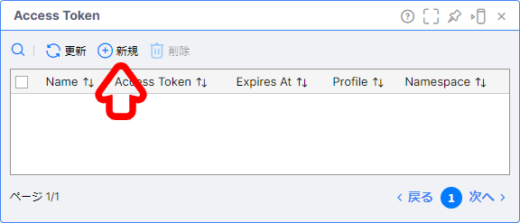
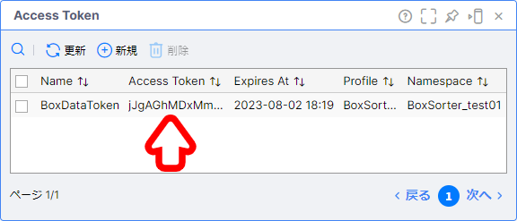
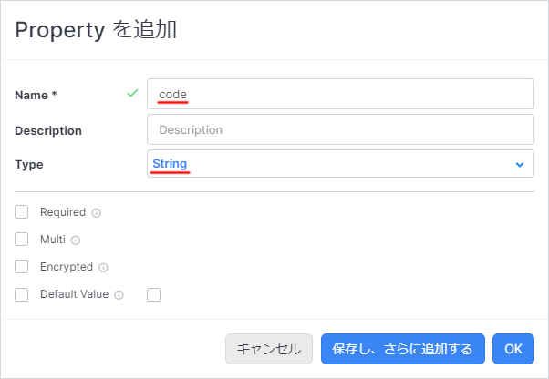
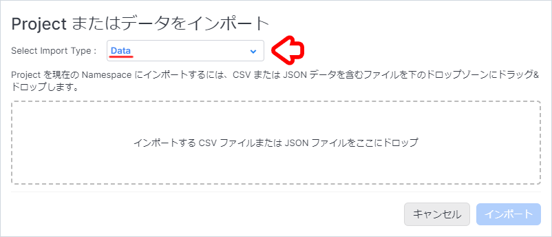

# Box Sorter (Short ver)

## Expected Incoming Data

```json
{
    "code": "14961234567890",
    "name": "Green Tea, 24 bottles"
}
```

## Table of Contents

- [Box Sorter (Short ver)](#box-sorter-short-ver)
  - [Expected Incoming Data](#expected-incoming-data)
  - [Table of Contents](#table-of-contents)
  - [1. Creating a Namespace and Saving the Project](#1-creating-a-namespace-and-saving-the-project)
  - [2. Preparing the Data Generator](#2-preparing-the-data-generator)
    - [2-1. Issuing a Vantiq Access Token](#2-1-issuing-a-vantiq-access-token)
    - [2-2. Configuring Google Colaboratory](#2-2-configuring-google-colaboratory)
  - [3. Creating the Service](#3-creating-the-service)
    - [3-1. Creating the Service](#3-1-creating-the-service)
    - [3-2. Creating the Inbound Event](#3-2-creating-the-inbound-event)
    - [3-3. Creating the Public Visual Event Handler](#3-3-creating-the-public-visual-event-handler)
    - [3-4. Testing Data Reception](#3-4-testing-data-reception)
  - [4. Creating Master Data Using a Type](#4-creating-master-data-using-a-type)
    - [4-1. Creating the Type](#4-1-creating-the-type)
    - [4-2. Importing Master Data](#4-2-importing-master-data)
  - [5. Developing the Application with Service Builder](#5-developing-the-application-with-service-builder)
    - [5-1. \[Service Builder\] Displaying the Service Pane](#5-1-service-builder-displaying-the-service-pane)
    - [5-2. \[Enrich\] Adding the Sorting Condition](#5-2-enrich-adding-the-sorting-condition)
    - [5-3. \[Transformation\] Formatting Event Data](#5-3-transformation-formatting-event-data)
    - [5-4. \[Filter\] Implementing the Sorting Logic](#5-4-filter-implementing-the-sorting-logic)
    - [5-5. \[LogStream\] Implementing Log Output for Sorting Instructions](#5-5-logstream-implementing-log-output-for-sorting-instructions)
  - [6. Verifying the Sorting Results](#6-verifying-the-sorting-results)
    - [6-1. Displaying the Log Messages Screen](#6-1-displaying-the-log-messages-screen)
    - [6-2. Checking the Log](#6-2-checking-the-log)
  - [Exporting the Project](#exporting-the-project)
  - [Workshop Review](#workshop-review)
  - [References](#references)
    - [Project File](#project-file)

## 1. Creating a Namespace and Saving the Project

Before implementing the application, create a new Namespace and switch to it.  
We will also save the project at this time.  

For more details, please see the following link:
[About Vantiq Namespaces and Projects](/vantiq-introduction/apps-development/vantiq-basic/namespace/readme_en.md)

## 2. Preparing the Data Generator

We will use Google Colaboratory to generate dummy data.  
To use Google Colaboratory, you must first issue a **Vantiq Access Token**.  

### 2-1. Issuing a Vantiq Access Token

1. From the menu bar, click `Admin` -> `Advanced` -> `Access Tokens` -> `+ New`.

   

1. Enter the following settings and save.

   |Item|Value|Notes|
   |-|-|-|
   |Name|BoxDataToken|A different name is also acceptable.|

   

1. Click on the issued `Access Token` to copy it to your clipboard.

   

### 2-2. Configuring Google Colaboratory

1. Open the **Data Generator** page from the link below.

   - [BoxSorterDataGenerator (REST API)](/vantiq-google-colab/code/box-sorter_data-generator_rest-api_en.ipynb)

      > You must be logged into a Google account to use Google Colaboratory.

1. On the GitHub page, click the `Open in Colab` button to open Google Colaboratory.

   

1. In the `# Configuration` section, enter the required information as shown below.

   |Item|Value|Notes|
   |-|-|-|
   |url|https://dev.vantiq.com/api/v1/resources/services/com.example.BoxSorter/ReceiveBoxInfo|If the server is not SSL-enabled, replace `https://` with `http://`.|
   |accesstoken|7tFxPj4JuNFnuwmGcEadU_6apA1r3Iji2N7AZS5HuVU=|The Access Token you issued in the previous step.|

   

1. Click the `Play button` for each cell, starting from the top.  
   Wait for each execution to complete before clicking the next `Play button`.

   

## 3. Creating the Service

We will create the Service that forms the foundation of our application.  

### 3-1. Creating the Service

1. From the menu bar, click `Add` -> `Service...` -> + `New Service` to open the new service creation screen.
   
   

1. Enter the following settings and click `Create`.

   |Item|Value|
   |-|-|
   |Name|BoxSorter|
   |Package|com.example|

   

### 3-2. Creating the Inbound Event

1. In the `Interface` tab, click the `+` icon to the right of `Inbound`.

   

1. Enter the following settings and save.

   |Item|Value|Notes|
   |-|-|-|
   |Name|ReceiveBoxInfo|* Must match the endpoint URL set in the data generator.|

   

### 3-3. Creating the Public Visual Event Handler

1. Click the `Implement` tab and click `Unbound Event Types` to expand the accordion.  
   Click the `...` icon to the right of `ReceiveBoxInfo`, then click `Add Public Visual Event Handler`.

   

1. Save the Service.

   

### 3-4. Testing Data Reception

When data is received, a badge with a counter will appear in the top-right corner of the task.  
To check the data, perform the following steps:  

1. Click the `Event Stream` task.  
   In the bottom-right of the screen, click `View Task Events`.

   

1. Click the blue JSON Object link that appears.

   

1. Verify that the data was received as expected.

   

   > **Note: About the Data Flow**  
   > In the steps completed so far:  
   > Data received by the `ReceiveBoxInfo Event Type` in the `Interface`'s `Inbound Event`...  
   is linked to the `ReceiveBoxInfo Event Handler` in the `Implement`'s `Public Event Handler`.  
   > The data linked to the ReceiveBoxInfo Event Handler is then sent to the root task, the EventStream Activity.  

## 4. Creating Master Data Using a Type

The data this application receives only contains `code` and `name`, as shown below:

```json
{
    "code": "14961234567890",
    "name": "Green Tea, 24 bottles"
}
```

To perform sorting, we need to add information that will serve as the basis for the sorting decision.  

Vantiq provides an Activity Pattern called **Enrich Activity**, which can add the contents of a record stored in a Type to an event.

To do this, we first need a Type that holds the information for our sorting decisions.  
We will create a Type and import a CSV file into it.

> **Note: How to Update a Type**  
> In addition to importing master data and other data into Type using a CSV file, you can also update Type using the REST API.  

### 4-1. Creating the Type

1. From the menu bar, click `Add` -> `Type...` -> `+ New Type` to open the new type creation screen.

   

1. Enter the following information and click `Create`.

   |Item|Value|
   |-|-|
   |Name|sorting_condition|
   |Package|com.example|
   |Role|standard|

   

1. When the `com.example.sorting_condition` pane appears, apply the following settings and save.

   **Properties Tab**
   |Property Name|Data Type|
   |-|-|
   |code|String|
   |center_id|Integer|
   |center_name|String|

   

   

   

### 4-2. Importing Master Data

1. From the menu bar, open `Projects` -> `Import...` and set `Select Import` `Type:` to `Data`.

   

1. Drag and drop the [com.example.sorting_condition_en.csv](./../data/com.example.sorting_condition_en.csv) file into the `Drop a CSV or JSON file here to import` area and click `Import`.

   > **Caution**  
   > Please rename the CSV file name from `com.example.sorting_condition_en.csv` to `com.example.sorting_condition.csv` in advance.

   

   > **Caution: Regarding the selection box**  
   > You must select `Data` when importing records into a Type.  
   > Be aware that the default is `Projects`.

   > **Caution: Regarding the filename**  
   > The name of the CSV file being imported must exactly match the resource name of the Type.  
   > If the filename is different, please rename the CSV file to match the Type's resource name.

1. Open the `com.example.sorting_condition` Type pane and click `Show All Records` at the top to confirm the import was successful.

   

   

## 5. Developing the Application with Service Builder

From this step, we will begin developing the application.  
We will implement the logic using the data obtained from the `EventStream` Activity as an event.  

### 5-1. [Service Builder] Displaying the Service Pane

1. From the **Project Contents** on the left, open the `ReceiveBoxInfo` Event Handler.

   

### 5-2. [Enrich] Adding the Sorting Condition

Use the **Enrich Activity** to add data from the Type to the event.

#### Implementing the Enrich Activity

1. From the `Modifiers` section in the left pane of the Service Builder, select `Enrich` and drop it onto the `EventStream` task.

   

1. Open the `Configuration` by clicking `Click to edit`, apply the following settings, and save the application.

   |Item|Value|
   |-|-|
   |associatedType|com.example.sorting_condition|

   Click `<null>` under `foreignKeys` and apply the settings below.

   

   1. Click `+ Add a foreign key property` and configure the following:

      |Item|Value|Notes|
      |-|-|-|
      |Associated Type Property|code|The property on the Type side.|
      |Foreign Key Expression|event.code|The property on the event side.|

      

   > **Note: About the Condition**  
   > The condition set here is equivalent to the following in VAIL:
   >
   > ```JavaScript
   > SELECT ONE FROM com.example.sorting_condition WHERE code == event.code
   > ```

1. Click the `AttachCondition` task and use `View Task Events` to verify the Enrich activity's behavior.  
   Confirm that the event looks like the following:  

   ```json
   {
       "code": "14961234567890",
       "name": "Green Tea, 24 bottles",
       "sorting_condition": {
           "_id": "649d30c7c32b66791581af76",
           "center_id": 1,
           "center_name": "Tokyo Logistics Center",
           "code": "14961234567890",
           "ars_namespace": "BoxSorter",
           "ars_version": 1,
           "ars_createdAt": "2023-06-29T07:20:39.157Z",
           "ars_createdBy": "e9cc46d7-77cc-4929-8261-40ddceb8b143"
       }
   }
   ```

   > The `_id` and `ars_***` properties are auto-generated by the system and will not be the same as in this example.

   A `sorting_condition` property has been added, and we have successfully attached information about the logistics center.

### 5-3. [Transformation] Formatting Event Data

Add a **Transformation Activity** to format the event data so it contains only the necessary fields.

#### Implementing the Transformation Activity

1. From the `Modifiers` section in the left pane, select `Transformation` and drop it onto the `Enrich` task.

   

1. Click the `Transformation` task and open its `Configuration` by clicking `Click to edit`.  
   Click `<null>` under `transformation (Union)`, enter the following, and click `OK`.

   |Outbound Property|Transformation Expression|
   |-|-|
   |code|event.code|
   |name|event.name|
   |center_id|event.sorting_condition.center_id|
   |center_name|event.sorting_condition.center_name|

   

### 5-4. [Filter] Implementing the Sorting Logic

We will implement the sorting logic by creating a flow that only allows events for specific logistics centers to pass through.  
For this workshop, we will sort by three logistics centers: "Tokyo," "Kanagawa," and "Saitama."  
Therefore, we will implement three tasks configured with the **Filter Activity**.

The logistics centers and their IDs are as follows:

|Logistics Center|Center ID|
|-|-|
|Tokyo|1|
|Kanagawa|2|
|Saitama|3|

We will sort using the `center_id`.

#### Implementing the Filter Activity

1. From the `Filters` section in the left pane, select `Filter` and drop it onto the `Transformation` task.  
   Repeat this process three times to place three **Filter Activity** tasks.

   

1. Set the `Task Name` of each **Filter Activity** and set the condition expression in `Condition (Union)` by clicking `Click to edit` in `Configuration`, then save the application.

   1. Tokyo Logistics Center

      |Item|Value|
      |-|-|
      |Name|ExtractToTokyo|
      |condition (Union)|event.center_id == 1|

   1. Kanagawa Logistics Center

      |Item|Value|
      |-|-|
      |Name|ExtractToKanagawa|
      |condition (Union)|event.center_id == 2|

   1. Saitama Logistics Center

      |Item|Value|
      |-|-|
      |Name|ExtractToSaitama|
      |condition (Union)|event.center_id == 3|

1. For each **Filter Activity**, use `View Task Events` to verify that only the appropriate events are passing through.

   - Tokyo Logistics Center: `ExtractToTokyo`

     ```json
     {
         "code": "14961234567890",
         "name": "Green Tea, 24 bottles",
         "sorting_condition": {
             "_id": "649d30c7c32b66791581af76",
             "center_id": 1,
             "center_name": "Tokyo Logistics Center",
             "code": "14961234567890",
             "ars_namespace": "BoxSorter",
             "ars_version": 1,
             "ars_createdAt": "2023-06-29T07:20:39.157Z",
             "ars_createdBy": "e9cc46d7-77cc-4929-8261-40ddceb8b143"
         }
     }
     ```

   - Kanagawa Logistics Center: `ExtractToKanagawa`

     ```json
     {
         "code": "14961234567892",
         "name": "Skincare Lotion, 36 bottles",
         "sorting_condition": {
             "_id": "649d30c7c32b66791581af77",
             "center_id": 2,
             "center_name": "Kanagawa Logistics Center",
             "code": "14961234567892",
             "ars_namespace": "BoxSorter",
             "ars_version": 1,
             "ars_createdAt": "2023-06-29T07:20:39.200Z",
             "ars_createdBy": "e9cc46d7-77cc-4929-8261-40ddceb8b143"
         }
     }
     ```

   - Saitama Logistics Center: `ExtractToSaitama`

     ```json
     {
         "code": "14961234567893",
         "name": "Wine, 12 bottles",
         "sorting_condition": {
             "_id": "649d30c7c32b66791581af78",
             "center_id": 3,
             "center_name": "Saitama Logistics Center",
             "code": "14961234567893",
             "ars_namespace": "BoxSorter",
             "ars_version": 1,
             "ars_createdAt": "2023-06-29T07:20:39.244Z",
             "ars_createdBy": "e9cc46d7-77cc-4929-8261-40ddceb8b143"
         }
     }
     ```

### 5-5. [LogStream] Implementing Log Output for Sorting Instructions

Now that we have implemented the sorting logic, we will display the results in the **Log Messages**.

#### Implementing the LogStream Activity

1. From the `Actions` section in the left pane, select `LogStream` and drop it onto each **Filter Activity** task.  
   Repeat this process three times to place three **LogStream Activity** tasks.

   

1. Configure the `Task Name` for each **LogStream Activity** and save the application.

   1. Tokyo Logistics Center

      |Item|Value|
      |-|-|
      |Name|LogToTokyo|

   1. Kanagawa Logistics Center

      |Item|Value|
      |-|-|
      |Name|LogToKanagawa|

   1. Saitama Logistics Center

      |Item|Value|
      |-|-|
      |Name|LogToSaitama|

## 6. Verifying the Sorting Results

Send dummy data from the data generator to verify that the sorting is working correctly.

### 6-1. Displaying the Log Messages Screen

1. Click `Debugging` in the bottom-right corner of the screen.

1. Click `Errors` on the right side and check the box for `Log Messages`.

### 6-2. Checking the Log

1. Confirm that the correct sorting instructions are displayed for each logistics center.

   **Example: Log Messages are displayed for each logistics center**

   

## Exporting the Project

Export the application you created as a Project.  
By exporting the Project, you can import it into other Namespaces or manage it as a backup.

For more details, please see the following link: [About Project Management - Exporting a Project](/vantiq-introduction/apps-development/vantiq-basic/project/readme_en.md#exporting-a-project)

## Workshop Review

1. **Overall**
   1. Experienced the Vantiq development process.
1. **Type** 
   1. Created a **Type** and imported master data.
   1. Confirmed that data was imported correctly using **Show All Records**.
1. **Service**
   1. Developed an application using the GUI-based **Service Builder**.
   1. Learned how to sequentially check event data using **View Task Events**.
   1. Joined data from a **Type** to event data using **Enrich Activity**.
   1. Formatted data using **Transformation Activity**.
   1. Sorted events by center ID using **Filter Activity**.
   1. Learned how to check data using **LogStream Activity**.

## References

### Project File

- [BoxSorter (Short ver) Implementation Sample (Vantiq r1.42)](./../data/box_sorter_short_1.42.zip)

That's all.
