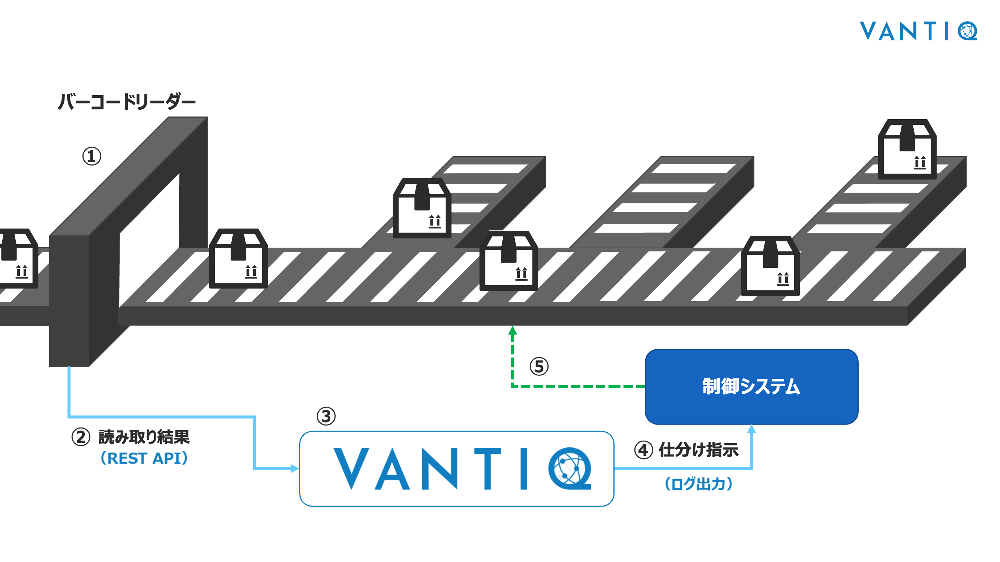
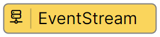
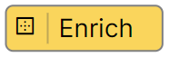
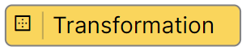
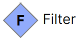
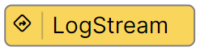

# ボックスソーター（Short ver）

荷物を仕分けするアプリケーションの開発を通じて、 Vantiq の操作方法を体験します。  
（※記事作成時の Vantiq バージョン： r1.43.4）  

> **補足：荷物仕分けシステムの名前について**  
> 物流センターで利用されている荷物仕分けシステムは下記の様に呼ばれています。
>
> - ボックスソーター (Box sorter)
> - スライドシューソーター (Sliding shoe sorter)
> - サーフィンソーター (Surfing Sorter)

## ボックスソーターの全体のイメージ

1. バーコードリーダーで荷物のバーコードを読み取る。
1. 読み取った結果を REST API を用いて Vantiq に送信する。
1. Vantiq はその結果を元に仕分けを行う。
1. Vantiq は仕分け指示を制御システムに送信する。
1. 制御システムは仕分け指示に従ってソーターを制御する。

:globe_with_meridians: [実物のイメージはこちら](https://www.youtube.com/watch?v=1LvaiA3N0E8&t=282s)

ワークショップでは Vantiq の担当部分である No.3〜4 を実装します。

> No.1〜2 は、 Google Colaboratory を利用し、 TOPIC に読み取り結果のサンプル情報を送信することで代用します。  
> Google Colaboratory の詳細は [こちら](/vantiq-google-colab/colab_basic_knowledge/readme.md) で解説しています。

## Vantiq で利用するリソースなどの解説

Vantiq リソースや各用語について解説します。

### Package

Package とは、アプリケーションを目的に合わせてグループ化するための機能です。  
Package を用いて、アプリケーションをグルーピングしておくことで、他のプロジェクトへの再利用がしやすくなります。  

Package 名を命名する際は、一意な名前を付けるようにしましょう。  

### Service

Serviceとは、特定の機能をカプセル化し、インターフェースを通じて他のリソースにその機能を提供するリソースです。  
Service単位で機能を実装することにより、再利用性やメンテナンスを高めることができます。  
また、これにより依存関係が最小化できアーキテクチャを疎結合することができるため、システムの拡張性、柔軟性を向上させることができます。  

Serviceでのアプリケーション（Event Handler）の作成は、あらかじめ用意されている処理のパターン（Activity Pattern）を組み合わせて開発を行います。  
用意されたパターンにない独自の機能が必要な場合は、 VAIL という言語を用いてプログラミングすることも可能なため、柔軟な実装ができます。  

### Type

Vantiq 内部でデータを保存するために利用します。  
内部的には NoSQL の MongoDB を利用しています。  
Activity Pattern や VAIL からデータの読み書きが出来ます。  
外部から REST API を用いて、データの読み書きをすることも出来ます。  

主にマスタデータの保存やデータの一時的な保存に利用されることが多いです。  

> **注意：データベースの特徴について**  
> Type は NoSQL のため、 RDB とは異なり、リレーションシップやトランザクション処理は出来ません。  

## Vantiq で実装するアプリケーションの概要

Service Builder を用いて、アプリケーションを作成していきます。  
アプリケーションの完成イメージは下記のとおりです。  

## アプリケーションの開発で利用する Activity Pattern の紹介

このワークショップでは下記の Activity Pattern を利用します。

### EventStream Activity

アプリケーションを作成する際に必ずルートタスクとして設定されている Activity Pattern が **EventStream** になります。  
**EventStream** はデータの入り口となります。  
Vantiq 内部からのデータを受け取ったり、 外部からの HTTP POST されたデータを受け取ることができます。  

### Enrich Activity

イベントに対して Type に保存されているレコードを追加します。  
イベントが通過するたびに Type へのアクセスが発生するため、パフォーマンスの低下には注意してください。  

### Transformation Activity

イベントのデータ整形やフォーマットを変換するために **Transformation** を用います。  

入力データや出力データのスキーマが未定な場合やスキーマが変更になった場合にも活用することができ、スキーマに対して柔軟な対応が可能になります。  

### Filter Activity

**Filter** に設定した条件に合致するイベントのみを通過させます。  
条件に合致しなかったイベントは破棄されるため、注意してください。  
複数の **Filter** を利用することで、 `if / else if / else` の様に分岐させることや `Switch 文` の様に用いることができます。

### LogStream Activity

イベントデータをログに出力します。  
今回は仕分け指示が正しく行われているかを確認するために利用します。  

## 必要なマテリアル

### 各自で準備する Vantiq 以外の要素

以下のいずれかを事前にご用意ください。

- Google Colab
  - Google アカウント（※Google Colaboratory を利用するために使用します）
  - [BoxSorterDataGenerator（REST API）](/vantiq-google-colab/code/box-sorter_data-generator_rest-api.ipynb)
  - [BoxSorterDataGenerator（REST API・複数送信用）](/vantiq-google-colab/code/box-sorter_data-generator_rest-api_multi.ipynb)
- Python
  - Python 実行環境
  - [BoxSorterDataGenerator（REST API）](/vantiq-google-colab/code/box-sorter_data-generator_rest-api.py)
  - [BoxSorterDataGenerator（REST API・複数送信用）](/vantiq-google-colab/code/box-sorter_data-generator_rest-api_multi.py)

### 商品マスタデータ

- [com.example.sorting_condition.csv](./../data/com.example.sorting_condition_en.csv)

## ワークショップの手順

アプリケーション開発の詳細は下記のリンクをご確認ください。  

- [手順](./instruction.md)
