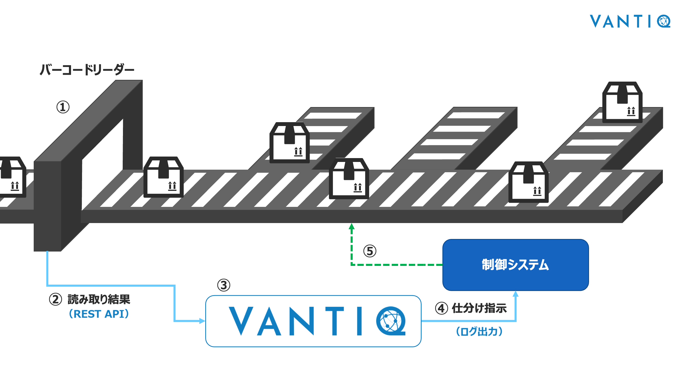
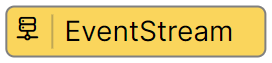
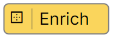
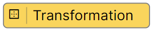

# Box Sorter (Short ver)

Experience how to operate Vantiq by developing an application that sorts packages.  
(* Vantiq version at the time of article creation: r1.43.4)

> **Note: About the name of the package sorting system**  
> Package sorting systems used in logistics centers are referred to as follows:
>
> - Box sorter
> - Sliding shoe sorter
> - Surfing Sorter

## Overall Image of the Box Sorter

1. Read the barcode on the package.
1. Send the scanned information to Vantiq via REST API.
1. Identify shipping centers based on barcode and center information.
1. Sends the sorting instruction to the control system.
1. The control system manipulates sorters according to the sorting instruction.

:globe_with_meridians: [See the actual image here](https://www.youtube.com/watch?v=1LvaiA3N0E8&t=282s)

This workshop covered step 3 and 4, which are Vantiq's responsibilities.

> Step 1 and 2 are simulated in Google Colaboratory, for example by sending scanned messages to your Namespace.

## Explanation of Resources Used in Vantiq

This section explains Vantiq resources and various terminologies.

### Package

A Package is a feature that allows you to group applications according to their purpose.  
By grouping applications using Packages, it becomes easier to reuse them in other projects.  

When naming a Package, ensure it has a unique name.

### Service

A Service is a resource that encapsulates specific functionalities and provides them to other resources through an interface.  
By implementing features on a Service-by-Service basis, reusability and maintainability can be enhanced.  
This also minimizes dependencies and enables a loosely coupled architecture, thereby improving system scalability and flexibility.  

Application (Event Handler) development within a Service is done by combining predefined processing patterns called Activity Patterns.  
If unique functionality not covered by the predefined patterns is required, it is possible to program using a language called VAIL, allowing for flexible implementation.  

### Type

Type is used to store data internally within Vantiq.  
Internally, it utilizes MongoDB, a NoSQL database.  
Data can be read from and written to Types from Activity Patterns and VAIL.  
Data can also be read from and written to externally using a REST API.  

It is primarily used for storing master data and temporary data.  

> **Note: Characteristics of the database**  
> Since Type is a NoSQL database, unlike RDBs, it does not support relationships or transaction processing.  

## Overview of the Application Implemented in Vantiq

We will create an application using the Service Builder. The completed application will look like the following:  

## Introduction to Activity Patterns Used in Application Development

This workshop will utilize the following Activity Patterns.

### EventStream Activity

The **EventStream** Activity Pattern is always set as the root task when creating an application.  
**EventStream** serves as the data entry point.  
It can receive data from within Vantiq or HTTP POST data from external sources.  

### Enrich Activity

This activity adds records stored in a Type to an event.  
Since Type is accessed every time an event passes through, be mindful of potential performance degradation.

### Transformation Activity

**Transformation** is used to format or convert the data in an event.  

It can also be utilized when input or output data schemas are undetermined or when schemas change, allowing for flexible adaptation to schemas.  

### Filter Activity

The **Filter** activity only allows events that match the configured condition to pass through.  
Note that events that do not match the condition will be discarded.  
By using multiple Filters, you can create branches similar to `if / else if / else` or use them like a `Switch statement`.

### LogStream Activity

This activity outputs event data to the log.  
In this workshop, it will be used to confirm that sorting instructions are being executed correctly.  

## Required Materials

### Elements Other Than Vantiq to Prepare Yourself

Please prepare one of the following in advance:

- Google Colab
  - Google Account (used to access Google Colaboratory)
  - [BoxSorterDataGenerator (REST API)](/vantiq-google-colab/code/box-sorter_data-generator_rest-api_en.ipynb)
  - [BoxSorterDataGenerator (REST API - for multiple transmissions)](/vantiq-google-colab/code/box-sorter_data-generator_rest-api_multi_en.ipynb)
- Python
  - Python
  - [BoxSorterDataGenerator (REST API)](/vantiq-google-colab/code/box-sorter_data-generator_rest-api_en.py)
  - [BoxSorterDataGenerator (REST API - for multiple transmissions)](/vantiq-google-colab/code/box-sorter_data-generator_rest-api_multi_en.py)

### Product Master Data

- [com.example.sorting_condition.csv](./../data/com.example.sorting_condition_en.csv)

## Workshop Procedures

Please refer to the link below for details on application development.  

- [Step-by-Step guide](./instruction_en.md)
