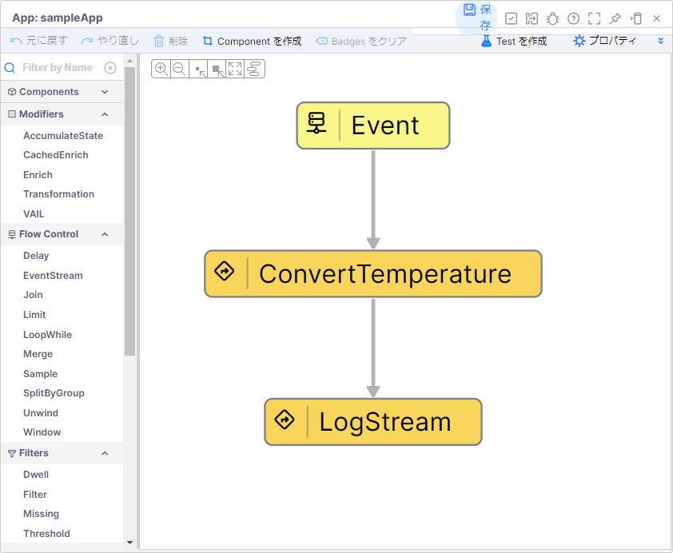
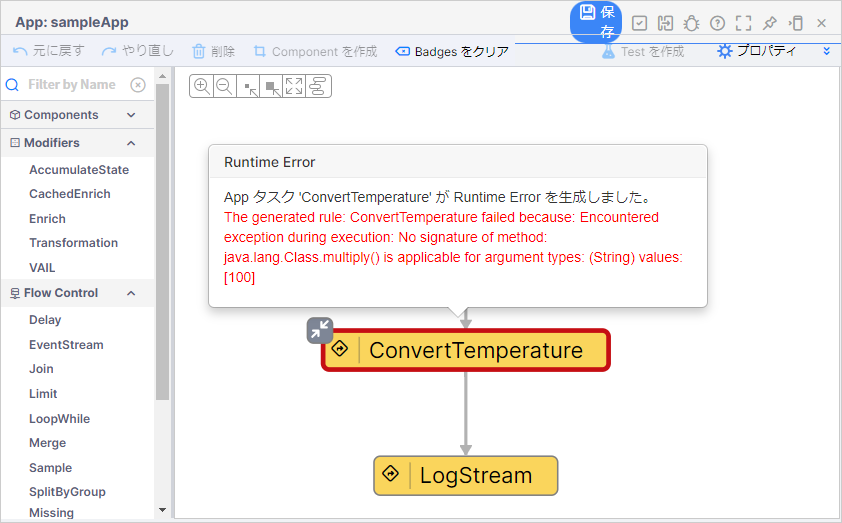
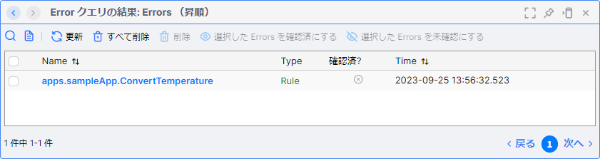
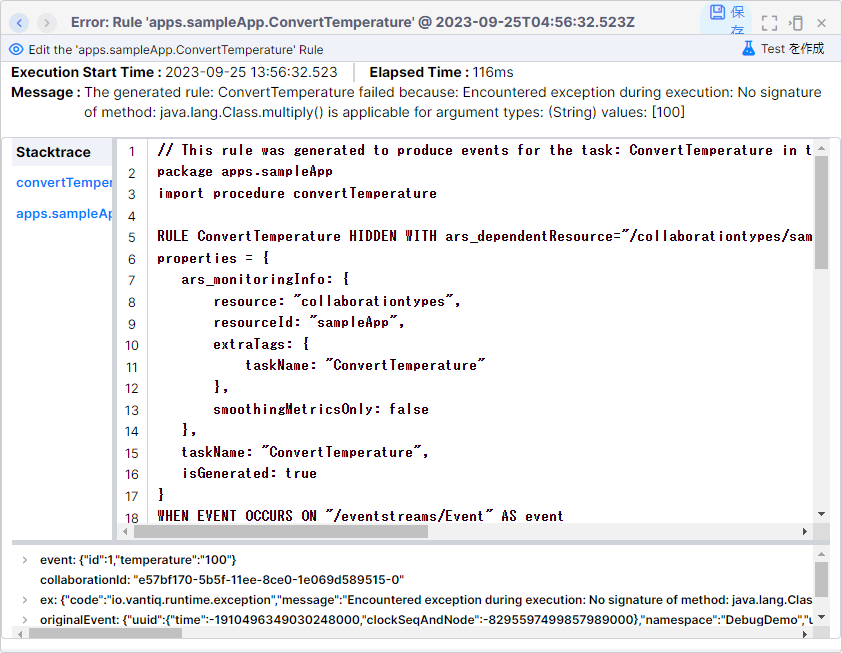
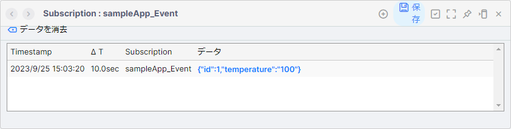
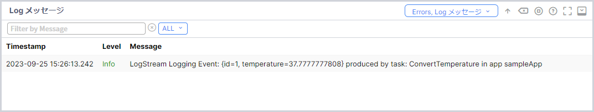
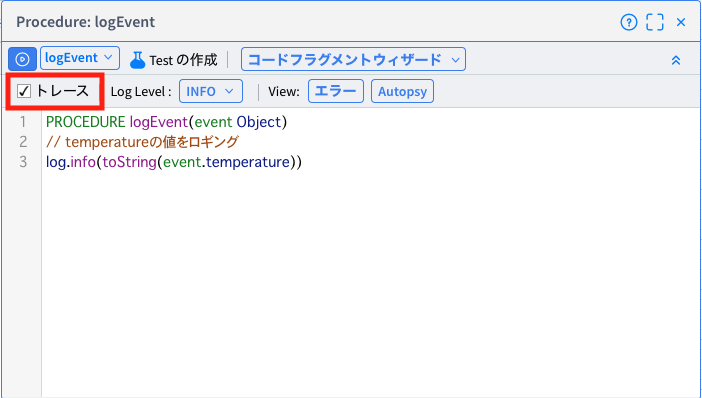

# Vantiq アプリのデバッグ方法

このセッションでは、デバッグ用のサンプルアプリケーションの実装を通じて、アプリのデバッグ方法を学習します。

## デバッグ対象のアプリの説明



このアプリケーションは、華氏で送られてきたデータを摂氏に変換して、ログに出力するシンプルなアプリケーションです。  

設定の詳細は以下の通りです。

### Event タスクの設定

|項目|値|
| :-- | :-- |
|アクティビティパターン|EventStream|
|inboudResource|topics|
|inboudResource|/debug/sample/app|

### ConvertTemperature タスクの設定

|項目|値|
| :-- | :-- |
|アクティビティパターン|Procedure|
|procedure|convertTemperature|

ConvertTemperature タスクで呼び出している `convertTemperature Procedure` の内容

```JavaScript
PROCEDURE convertTemperature(event Object)
// 華氏から摂氏へ変換
event.temperature = 5 / 9 * (event.temperature - 32)
return event
```

### LogStream タスクの設定

|項目|値|
| :-- | :-- |
|アクティビティパターン|LogStream|

### 実装サンプル

- [デバッグアプリの実装サンプル（Vantiq 1.34）](./data/debug_1.34.zip)
- [デバッグアプリの実装サンプル（Vantiq 1.37）](./data/debug_1.37.zip)

## 送信されるデータ

`/debug/sample/app` Topic に次のデータが送信され、アプリケーションが動作するというシナリオです。  
アプリケーションは temperature の値である `"100"` を変換しようとしています。

```JSON
{
    "id": 1,
    "temperature": "100"
}
```

## デバッグの流れ

### 1. エラーの発生

Topic からデータを送信すると、アプリケーションの ConvertTemperature タスクでエラーが発生します。  

エラーの内容は以下の方法で確認することができます。  

1. エラーが起きたタスクにカーソルを当てる  
   
1. 開発画面下部のエラー出力部  
   
1. メニューの `Test` → `エラー` から確認  
   
1. メニュー部のエラーリストのアイコンをクリック  
   

上記の `2.` ～ `4.` で表示されたリストからエラー名をクリックすると、エラーの詳細を確認できます。  
詳細では、エラーメッセージのほか、スタックトレースやエラー発生時に処理したイベントや変数の内容を確認することができます。  

### 2. エラー内容の確認



エラーメッセージを見ると以下のような内容になっています。

`The generated rule: ConvertTemperature failed because: Encountered exception during execution: No signature of method: java.lang.Class.multiply() is applicable for argument types: (String) values: [100]`

また `event` を見ると `{"id":1,"temperature":"100"}` とあり、どうやら送信されてきているイベントに含まれる temperature の型が一致していないようです。

### 3. 送信されてきたデータの確認

アプリケーションのタスクを右クリックし `Task Eventの表示` をクリックするとそのタスクの Subscription が表示されます。  
ここにはタスクで処理した結果が出力されていきます。  

まずは、エラーが発生している ConvertTemperature タスクの前にある Event タスクの出力結果を確認してみます。  
下記のイベントが ConvertTemperature タスクの入力値になっていることが分かります。



やはり temperature の値が Integer 型ではなく String 型になっているようです。

### 4. Procedureを修正

エラーとなっている ConvertTemperature タスクで呼び出されている Procedure を確認すると、 `event.temperature = 5 / 9 * (event.temperature - 32)` となっています。  
String 型の temperature の値を計算式でそのまま利用しようとしています。  
これがエラーの原因です。  

エラーの原因が分かったので、 Procedure を修正します。  
String 型を Integer 型に変換する処理を追加します。  

#### 修正前の Procedure

```JavaScript
PROCEDURE convertTemperature(event Object)
// 華氏から摂氏へ変換
event.temperature = 5 / 9 * (event.temperature - 32)
return event
```

#### 修正後の Procedure

```javascript
PROCEDURE convertTemperature(event Object)
// 華氏から摂氏へ変換
event.temperature = 5 / 9 * (toInteger(event.temperature) - 32)
return event
```

### 5. 動作確認

古いエラーを消し、再度アプリケーションの動作を確認します。  
開発画面下部のログ出力部分に表示されたので、アプリケーションのバグが修正されたことがわかります。



### 修正後の実装サンプル

- [デバッグアプリの修正後の実装サンプル（Vantiq 1.34）](./data/debug_answer_1.34.zip)
- [デバッグアプリの修正後の実装サンプル（Vantiq 1.37）](./data/debug_answer_1.37.zip)

# Autopsy

Vantiq のデバッグ機能の一つである `Autopsy` についての解説です。

Vantiq の性質上、データを貯めずに処理を行うため、場合によっては後から何が起こっていたのか？ということを追跡するのが困難な場合があります。  
しかし、この機能を有効化しておくことで後からどのような値のデータを処理し、どの段階でエラーになったのかなどを確認でき、問題を解剖するのに役立ちます。


## 1. Autopsy有効化

Procdure 、Rule に対して使用することができ、 `トレース` にチェックを入れることで有効になります。  
エラーの発生の有無に関わらず、 `どのように Procedure / Rule が実行されたのか` ということを記録に残します。  



## 2. Autopsy確認

Autopsy を有効にした Procedure または Rule の `View` にある `Autopsy` をクリック、またはメニューの `Test` → `Autopsy` から確認することができます。


緑のボタンをクリックしていくことで一行ずつステップでどう実行されたかを確認でき、その時の変数の内容も確認できます。  
これによって1行単位で詳細に過去の処理内容を解剖してみていくことができます。　　

## Autopsyの注意点

Autopsy は便利な機能ではありますが、処理した全てのイベントを記録します。  
大量の Procedue / Rule で有効にしてしまうと、そのアプリで処理するイベントの量によってはストレージの圧迫やパフォーマンスの悪化に繋がりますので、必要最低限の Procedure / Rule で有効にするようにしてください。
