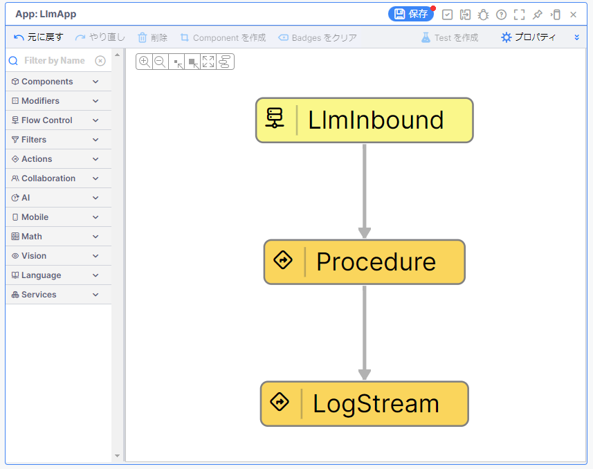

# LLM（AccumulateState Activity）

Vantiq で LLM（大規模言語モデル） を利用し、会話を継続する方法を学習します。  

## Vantiq で実装するアプリケーションの概要

App Builder を用いて、アプリケーションを作成していきます。  
アプリケーションの完成イメージは下記のとおりです。  

## アプリケーションの開発で利用する Activity Pattern の紹介

このワークショップでは下記の Activity Pattern を利用します。

### Procedure Activity

**Procedure Activity** を利用すると VAIL でコーディングした Procedure を App で利用で呼び出せます。  

## 必要なマテリアル

### 各自で準備する Vantiq 以外の要素

以下のいずれかを事前にご用意ください。

- :globe_with_meridians:[OpenAI API Key](https://platform.openai.com/api-keys)

### プロジェクトファイル

- [LLM（SubmitPrompt VAIL）の実装サンプル（Vantiq 1.37）](./../data/llm_submitprompt-vail_1.37.zip)

## ワークショップの手順

アプリケーション開発の詳細は下記のリンクをご確認ください。  

- [手順](./instruction.md)
