# LLM（SubmitPrompt Activity）

## 実装の流れ

下記の流れで実装していきます。

1. 【準備】Namespace の作成と Project の保存
1. 【Secret】各種 LLM の API Key の設定
1. 【LLM】LLM の設定
1. 【Type】スキーマの作成
1. 【Topic】App 用のエンドポイントの作成
1. 【App Builder】LLM アプリケーションの実装
1. 【動作確認】Log メッセージの確認

> リソース名やタスク名は任意のものに変更しても構いません。

## 目次

- [LLM（SubmitPrompt Activity）](#llmsubmitprompt-activity)
  - [実装の流れ](#実装の流れ)
  - [目次](#目次)
  - [1. Namespace の作成と Project の保存](#1-namespace-の作成と-project-の保存)
  - [2. Secret を用いた API Key の管理](#2-secret-を用いた-api-key-の管理)
    - [2-1. Secret の作成](#2-1-secret-の作成)
  - [3. LLM の設定](#3-llm-の設定)
    - [3-1 LLM の追加](#3-1-llm-の追加)
    - [3-2 プロジェクトへの追加](#3-2-プロジェクトへの追加)
  - [4. スキーマの作成](#4-スキーマの作成)
    - [4-1. Type (schema) の作成](#4-1-type-schema-の作成)
    - [4-2. Property の追加](#4-2-property-の追加)
  - [5. Topic を用いた Vantiq エンドポイントの作成](#5-topic-を用いた-vantiq-エンドポイントの作成)
    - [5-1. Topic の作成](#5-1-topic-の作成)
  - [6. App Builder を用いた App の開発](#6-app-builder-を用いた-app-の開発)
    - [6-1. 【App Builder】アプリケーションの作成](#6-1-app-builderアプリケーションの作成)
    - [6-2. 【EventStream】Topic データの取得](#6-2-eventstreamtopic-データの取得)
    - [6-3. 【SubmitPrompt】LLM との会話機能の実装](#6-3-submitpromptllm-との会話機能の実装)
    - [6-4. 【LogStream】ログ出力の実装](#6-4-logstreamログ出力の実装)
  - [7. LLM との会話](#7-llm-との会話)
    - [7-1. Log メッセージ画面の表示](#7-1-log-メッセージ画面の表示)
    - [7-2. /Inbound Topic ペインの表示](#7-2-inbound-topic-ペインの表示)
    - [7-3. メッセージの送信](#7-3-メッセージの送信)
    - [7-4. アプリケーションとログの確認](#7-4-アプリケーションとログの確認)
  - [Project のエクスポート](#project-のエクスポート)
  - [ワークショップの振り返り](#ワークショップの振り返り)
  - [参考情報](#参考情報)
    - [プロジェクトファイル](#プロジェクトファイル)

## 1. Namespace の作成と Project の保存

アプリケーションを実装する前に新しく Namespace を作成し、作成した Namespace に切り替えます。  
あわせてプロジェクトの保存も行っておきます。  

詳細は下記をご確認ください。  
[Vantiq の Namespace と Project について](/vantiq-introduction/apps-development/vantiq-basic/namespace/readme.md)

## 2. Secret を用いた API Key の管理

Secret を用いて、 各種 LLM サービスで発行した API Key を管理します。  

### 2-1. Secret の作成

1. メニューバーの `管理` -> `Advanced` -> `Secrets` -> `+ 新規` をクリックし Secret の新規作成画面を開きます。

   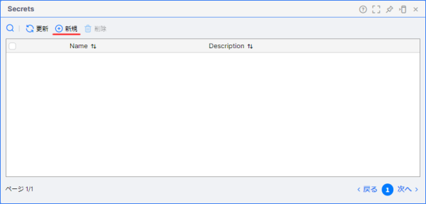

1. 以下の内容を設定し、保存します。

   |項目|設定値|
   |-|-|
   |Name|LlmApyKey|
   |Secret|※各種 LLM サービスで発行した API Key|

   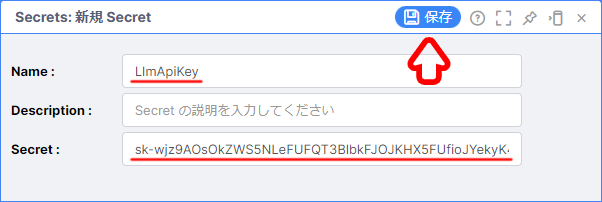

## 3. LLM の設定

LLM の設定を行っていきます。  
LLM の追加を行っただけでは、プロジェクトへの追加はされないので注意してください。

### 3-1 LLM の追加

1. メニューバーの `追加` -> `LLMs` -> `+ 新規` をクリックし LLM の追加画面を開きます。

   

1. 以下の内容を設定し、 `OK` をクリックします。

   |項目|設定値|
   |-|-|
   |LLM Name|GenerativeLLM|
   |Type|Generative|
   |Model Name|gpt-3.5-turbo|
   |API Key Secret|LlmApiKey|

   

### 3-2 プロジェクトへの追加

1. 追加した LLM にチェックを入れ、 `Project に追加` をクリックします。

   

## 4. スキーマの作成

Type を使って Topic で使用するデータフォーマットを指定します。

### 4-1. Type (schema) の作成

1. メニューバーの `追加` -> `Type` -> `+ 新規 Type` をクリックし Type の作成画面を開きます。

   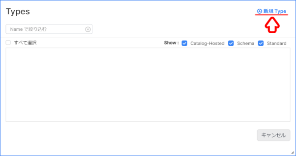

1. 以下の内容を設定し、保存します。

   |項目|設定値|
   |-|-|
   |Name|LlmSchema|
   |Role|schema|

   

### 4-2. Property の追加

1. `LlmSchema` のペインが表示されるので、以下の設定を行い、保存します。

   **Properties タブ**
   |プロパティ名|データ型|Required|
   |-|-|-|
   |message|String|-|

   

   

   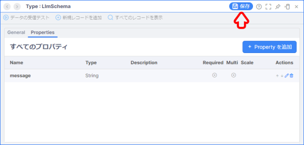

## 5. Topic を用いた Vantiq エンドポイントの作成

Vantiq 内部で利用するエンドポイントを Topic を用いて作成します。  

### 5-1. Topic の作成

1. メニューバーの `追加` -> `Advanced` -> `Topic...` -> `+ 新規 Topic` をクリックし Topic の新規作成画面を開きます。
   
   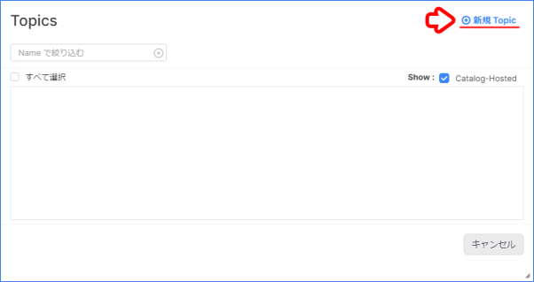

1. 以下の内容を設定し、保存します。

   |項目|設定値|
   |-|-|
   |Name|/Inbound|
   |Message Type|LlmSchema|

   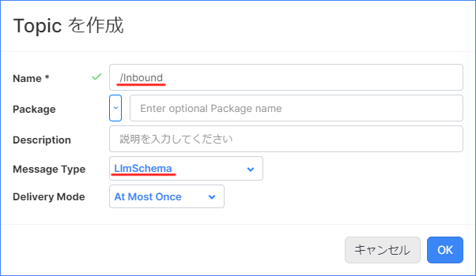

## 6. App Builder を用いた App の開発

この手順からアプリケーション開発を開始します。  

### 6-1. 【App Builder】アプリケーションの作成

App Builder を用いて、 App を新規作成します。

#### App の新規作成

1. メニューバーの `追加` -> `Advanced` -> `App...` -> `+ 新規 App` をクリックしアプリケーションの新規作成画面を開きます。
   
   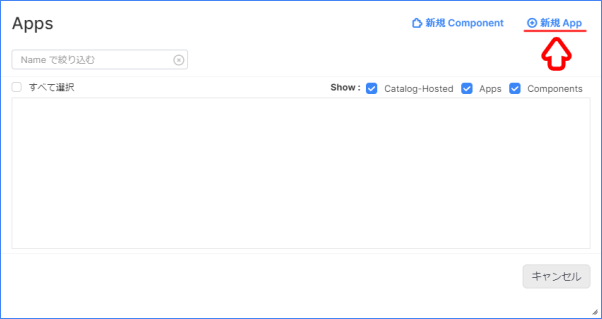

1. 以下の内容を設定し、保存します。

   |項目|設定値|
   |-|-|
   |Name|LlmApp|

   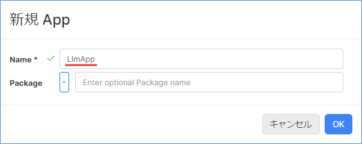

### 6-2. 【EventStream】Topic データの取得

**EventStream Activity** を使って Topic からデータを受け取れるようにします。  

#### EventStream の設定

1. `Initiate` タスクをクリックし、以下の内容を設定します。  

   |項目|設定値|
   |-|-|
   |Name|LlmInbound|

   

1. `Configuration` の `クリックして編集` から以下の内容を入力し、 `OK` をクリックし、アプリケーションを保存します。

   |Required Parameter|Value|
   |-|-|
   |inboundResource (Enumerated)|topics|
   |inboundResourceId (String)|/Inbound|

   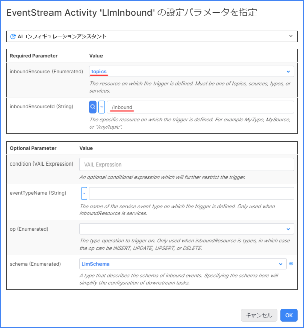

### 6-3. 【SubmitPrompt】LLM との会話機能の実装

**SubmitPrompt Activity** を使用して、 LLM との会話機能の実装を行います。

#### SubmitPrompt Activity の実装

1. App ペイン左側の `AI` の中から `SubmitPrompt` を選択し、 `LlmInbound` タスクの上にドロップします。

   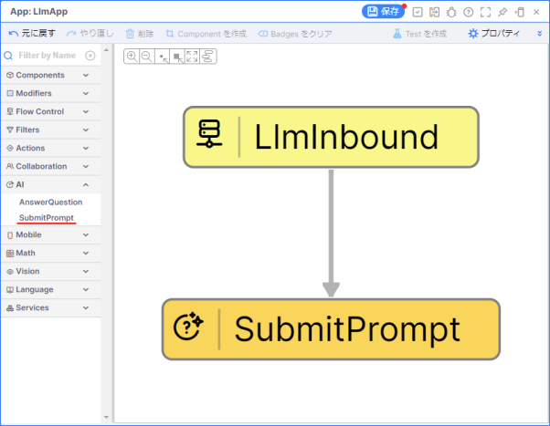

1. `SubmitPrompt` タスクをクリックし、 `Configuration` の `クリックして編集` を開き、以下の設定を行いアプリケーションを保存します。

   |Required Parameter|Value|
   |-|-|
   |llm (Enumerated)|LLM (gpt-3.5-turbo)|
   |prompt (VAIL Expression)|event.message|

   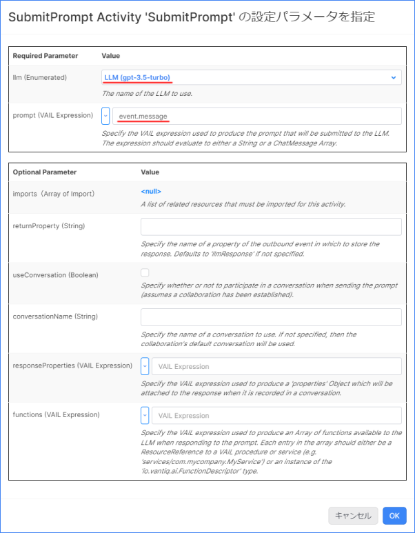

### 6-4. 【LogStream】ログ出力の実装

LLM との会話をログに出力して、結果を確認できるようにします。  

#### LogStream Activity の実装

1. App ペイン左側の `Actions` の中から `LogStream` を選択し、 `SubmitPrompt` タスクの上にドロップします。  

   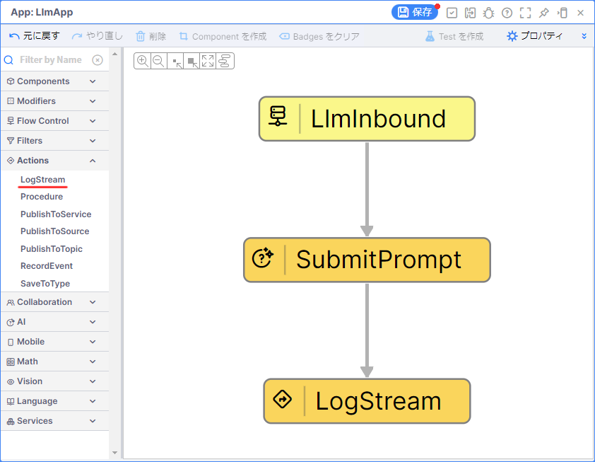

   > **補足**  
   > `Downstream イベント` は `event` を選択します。  
   >
   > 

## 7. LLM との会話

Topic からメッセージを送信し、 LLM との会話を行ってみます。  

### 7-1. Log メッセージ画面の表示

1. 画面右下の `Debugging` をクリックします。

1. 右側の `Errors` をクリックし、 `Log メッセージ` にチェックを入れます。

### 7-2. /Inbound Topic ペインの表示

1. 画面左側の `Project Contents` から `/Inbound` Topic を開きます。

   

### 7-3. メッセージの送信

1. `/Inbound` Topic ペインから任意のメッセージを入力し、 `Publish` をクリックします。

   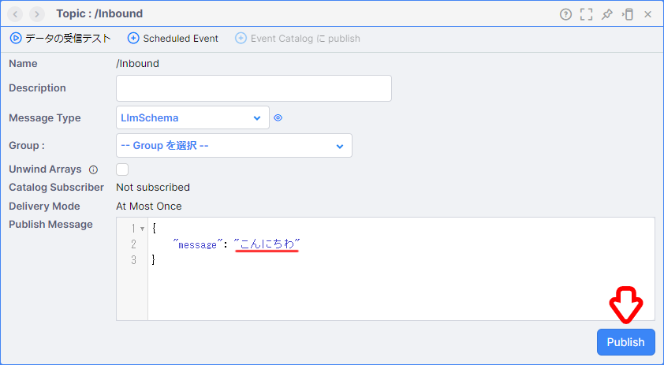

### 7-4. アプリケーションとログの確認

1. アプリケーションが正しく動いているか確認します。

   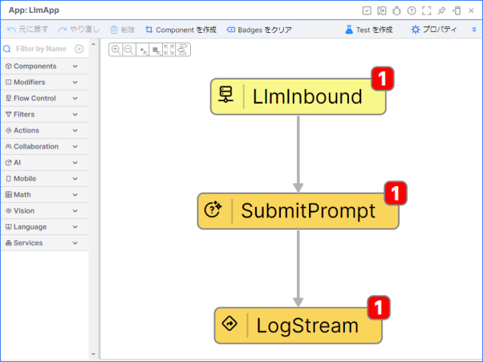

1. LLM との会話の結果をログ画面で確認します。

   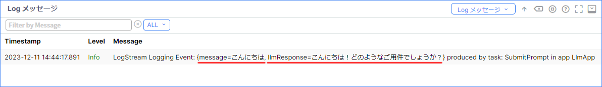

## Project のエクスポート

作成したアプリケーションを Project ごとエクスポートします。  
Project のエクスポートを行うことで、他の Namespace にインポートしたり、バックアップとして管理することが出来ます。  

詳細は下記を参照してください。  
[Project の管理について - Project のエクスポート](/vantiq-introduction/apps-development/vantiq-basic/project/readme.md#project-のエクスポート)

## ワークショップの振り返り

1. **Secret**
   1. **Secret** を用いることで API Key などを安全に管理できることを学習しました。
1. **LLM** 
   1. **LLM** を用いて LLM の追加を行う方法を学習しました。
1. **Type** 
   1. **Type** を用いてスキーマの設定を行う方法を学習しました。
1. **Topic** 
   1. **Topic** を用いて Vantiq アプリケーション用のエンドポイントを作成する方法を学習しました。
1. **App**
   1. **SubmitPrompt Activity** を用いて LLM と対話する方法を学習しました。

## 参考情報

### プロジェクトファイル

- [LLM（SubmitPrompt Activity）の実装サンプル（Vantiq 1.37）](./../data/llm_submitprompt-activity_1.37.zip)

以上
