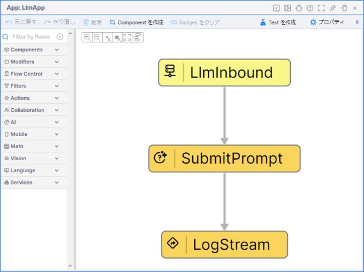

# LLM（SubmitPrompt Activity）

Vantiq で LLM（大規模言語モデル） を利用する方法を学習します。  
このセッションでは、 LLM との対話を行うアプリケーションの実装を行います。  

## Vantiq で利用するリソースなどの解説

Vantiq リソースや各用語について解説します。

アプリケーション開発ワークショップ（初級編）が未実施の場合

### Topic

Vantiq 内部でデータの受け渡しに利用するエンドポイントになります。  
また、外部からデータを受け渡す際の REST API のエンドポイントとして用いることもできます。

### Type

Vantiq 内部でデータを保存するために利用します。  
内部的には NoSQL の MongoDB を利用しています。  
Activity Pattern や VAIL からデータの読み書きが出来ます。  
外部から REST API を用いて、データの読み書きをすることも出来ます。  

主にマスタデータの保存やデータの一時的な保存に利用されることが多いです。  

> **注意**  
> Type は NoSQL のため、 RDB とは異なり、リレーションシップやトランザクション処理は出来ません。  

### App (App Builder)

App は GUI でアプリケーションの作成ができるツールになります。  
あらかじめ用意されている処理のパターンを組み合わせて開発を行います。  
用意されたパターンで対応できない場合は、プログラミングも可能なため柔軟な実装ができます。

### LLM

LLM を利用する際に必要となるリソースです。  
一部の LLM は予めインテグレーションされているため、簡単に LLM の利用ができます。  

### Type（Schema）

Type では データ型のみを定義する Schema が利用できます。
スキーマを作成し、 Topic に設定して利用します。

### Secret

Secret リソースを用いることで、 API Key や Token など安全に管理することができます。  

## Vantiq で実装するアプリケーションの概要

App Builder を用いて、アプリケーションを作成していきます。  
アプリケーションの完成イメージは下記のとおりです。  

## アプリケーションの開発で利用する Activity Pattern の紹介

このワークショップでは下記の Activity Pattern を利用します。

アプリケーション開発ワークショップ（初級編）が未実施の場合

### EventStream Activity

App を利用する際に必ずルートタスクとして設定されている Activity Pattern が **EventStream** になります。  
**EventStream** はデータの入り口となります。  
**EventStream** の入力元に **Topic** を指定することで、 Vantiq 内部からのデータを受け取ったり、 外部からの HTTP POST されたデータを受け取ることができます。

### LogStream Activity

イベントデータをログに出力します。  
今回は仕分け指示が正しく行われているかを確認するために利用します。

### SubmitPrompt Activity

指定した LLM にプロンプ​​トを送信することができます。

## 必要なマテリアル

### 各自で準備する Vantiq 以外の要素

以下のいずれかを事前にご用意ください。

- :globe_with_meridians:[OpenAI API Key](https://platform.openai.com/api-keys)

## ワークショップの手順

アプリケーション開発の詳細は下記のリンクをご確認ください。  

- [手順](./instruction.md)
