# LLM（SubmitPrompt Procedure）

## 実装の流れ

下記の流れで実装していきます。

1. 【準備】Namespace の作成と Project のインポート
1. 【Secret】各種 LLM の API Key の設定
1. 【LLM】LLM の設定
1. 【Procedure】VAIL を用いた Procedure の作成
1. 【App Builder】LLM アプリケーションの改修
1. 【動作確認】Log メッセージの確認

> リソース名やタスク名は任意のものに変更しても構いません。

## 目次

- [LLM（SubmitPrompt Procedure）](#llmsubmitprompt-procedure)
  - [実装の流れ](#実装の流れ)
  - [目次](#目次)
  - [1. Namespace の作成と Project のインポート](#1-namespace-の作成と-project-のインポート)
    - [1-1. Namespace の作成](#1-1-namespace-の作成)
    - [1-2. Project のインポート](#1-2-project-のインポート)
  - [2. Secret を用いた API Key の管理](#2-secret-を用いた-api-key-の管理)
    - [2-1. Secret の作成](#2-1-secret-の作成)
  - [3. LLM の設定](#3-llm-の設定)
    - [3-1. LLM ペインの表示](#3-1-llm-ペインの表示)
    - [3-2. API Key Secret の設定](#3-2-api-key-secret-の設定)
  - [4. 既存のアプリケーションの動作確認](#4-既存のアプリケーションの動作確認)
  - [5. Procedure の作成](#5-procedure-の作成)
    - [5-1. Procedure の作成](#5-1-procedure-の作成)
    - [5-2. Procedure の実行](#5-2-procedure-の実行)
  - [6. App Builder を用いた App の改修](#6-app-builder-を用いた-app-の改修)
    - [6-1. 【App Builder】App ペインの表示](#6-1-app-builderapp-ペインの表示)
    - [6-2. 【SubmitPrompt】既存のタスクの削除](#6-2-submitprompt既存のタスクの削除)
    - [6-3. 【Procedure】プロシージャの呼び出し](#6-3-procedureプロシージャの呼び出し)
    - [6-4. 【LogStream】ログタスクの修正](#6-4-logstreamログタスクの修正)
  - [7. LLM との会話](#7-llm-との会話)
    - [7-1. Log メッセージ画面の表示](#7-1-log-メッセージ画面の表示)
    - [7-2. /Inbound Topic ペインの表示](#7-2-inbound-topic-ペインの表示)
    - [7-3. メッセージの送信](#7-3-メッセージの送信)
    - [7-4. アプリケーションとログの確認](#7-4-アプリケーションとログの確認)
  - [Project のエクスポート](#project-のエクスポート)
  - [ワークショップの振り返り](#ワークショップの振り返り)
  - [参考情報](#参考情報)
    - [プロジェクトファイル](#プロジェクトファイル)

## 1. Namespace の作成と Project のインポート

### 1-1. Namespace の作成

アプリケーションを実装する前に新しく Namespace を作成し、作成した Namespace に切り替えます。  

詳細は下記をご確認ください。  
[Vantiq の Namespace と Project について](/vantiq-introduction/apps-development/vantiq-basic/namespace/readme.md)

### 1-2. Project のインポート

Namespace の切り替えが出来たら、 Project のインポートを行います。  
**LLM（SubmitPrompt Activity）** の Project をインポートしてください。  

詳細は下記を参照してください。  
[Project の管理について - Project のインポート](/vantiq-introduction/apps-development/vantiq-basic/project/readme.md#project-のインポート)

## 2. Secret を用いた API Key の管理

Secret はネームスペースごとに管理されているため、改めて Secret を作成します。  

### 2-1. Secret の作成

1. メニューバーの `管理` -> `Advanced` -> `Secrets` -> `+ 新規` をクリックし Secret の新規作成画面を開きます。

   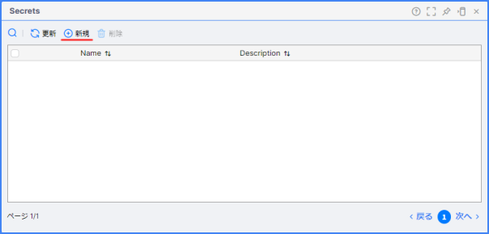

1. 以下の内容を設定し、保存します。

   |項目|設定値|
   |-|-|
   |Name|LlmApyKey|
   |Secret|※各種 LLM サービスで発行した API Key|

   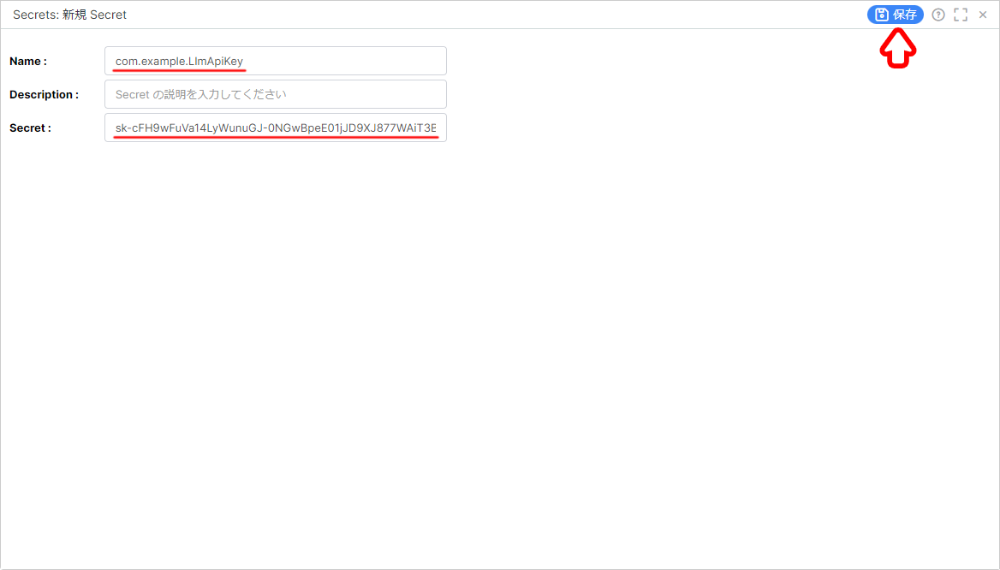

## 3. LLM の設定

LLM の設定を行います。  
Secret の設定をし直す必要があります。  

### 3-1. LLM ペインの表示

1. 画面左側の **Project Contents** から `LLM` ペインを開きます。

   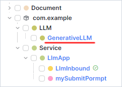

### 3-2. API Key Secret の設定

1. `LLM` をクリックし、編集画面を開きます。

   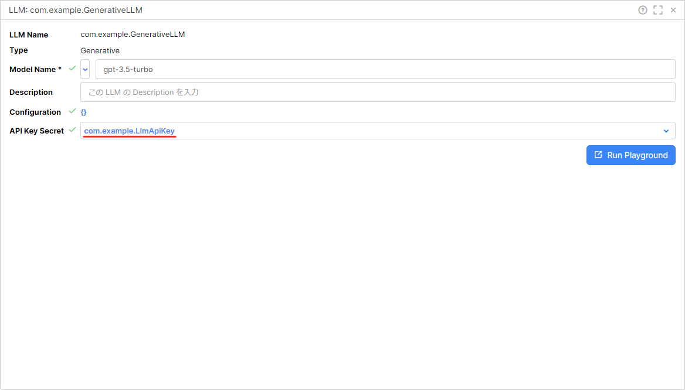

1. 以下の内容を設定し、 `OK` をクリックします。

   |項目|設定値|
   |-|-|
   |API Key Secret|LlmApiKey|

   

## 4. 既存のアプリケーションの動作確認

`/Inbound` Topic からメッセージを送信し、アプリケーションが正しく動作するか確認します。  

詳細は下記を参照してください。  
[LLM（SubmitPrompt Activity） - 7. LLM との会話](/vantiq-introduction/apps-development/llm/submitprompt-activity/instruction.md#7-llm-との会話)

## 5. Procedure の作成

Procedure を作成します。  

### 5-1. Procedure の作成

1. メニューバーの `追加` -> `Advanced` -> `Procedure...` -> `+ 新規 Procedure` をクリックします。

   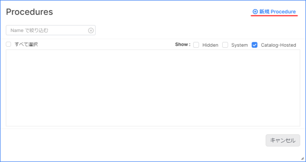

1. 下記の内容を入力し、保存します。

   ```JavaScript
   PROCEDURE submitPormpt(prompt)

   var response = io.vantiq.ai.LLM.submitPrompt("LLM", prompt)

   return response
   ```

   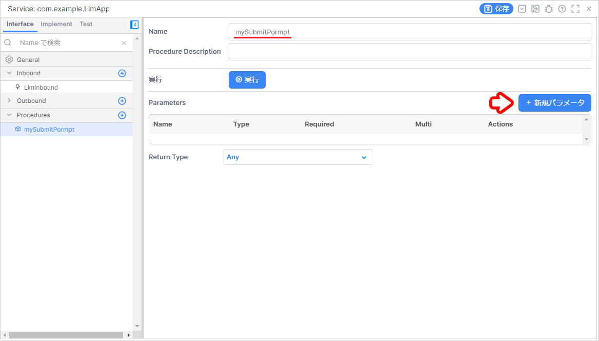

### 5-2. Procedure の実行

1. ペイン左上の `実行ボタン` をクリックし、プロシージャを実行してみます。

   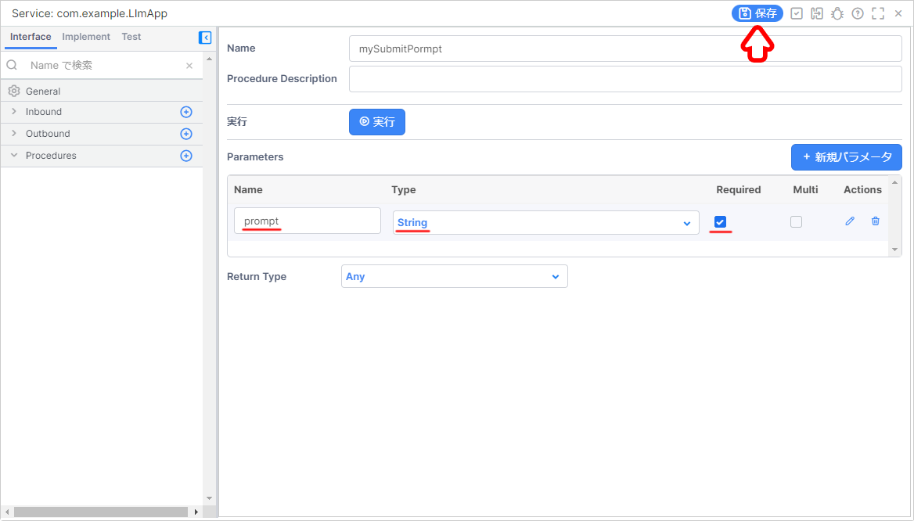

1. 引数に適当な文字を入力して `実行` をクリックします。

   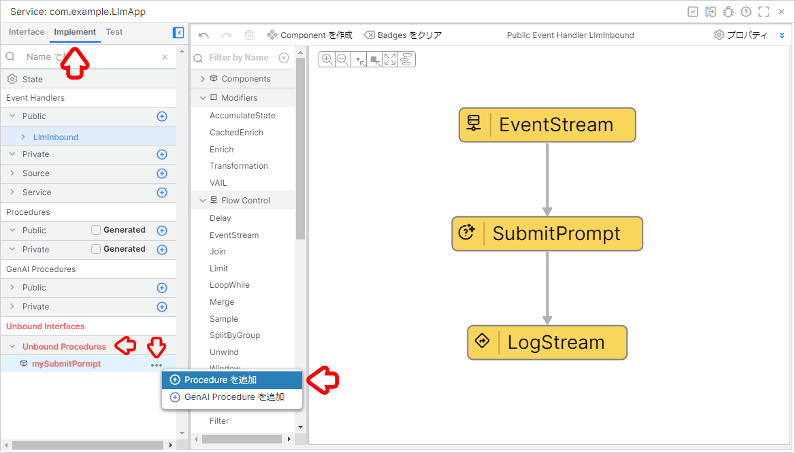

1. 実行結果を確認し、 `OK` をクリックします。

   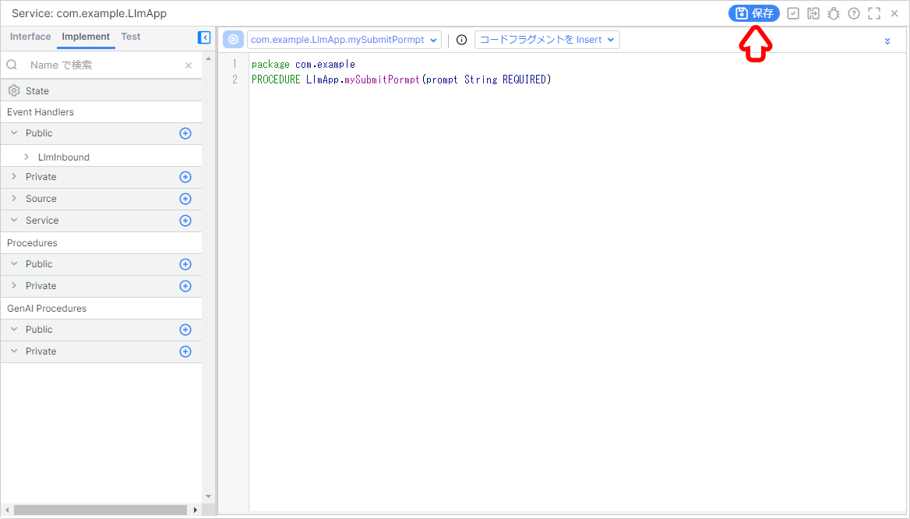

## 6. App Builder を用いた App の改修

この手順からアプリケーションの改修を開始します。  

今回は **SubmitPrompt Activity** に変わり **Procedure Activity** を利用します。  
そのために必要な改修を行っていきます。  

### 6-1. 【App Builder】App ペインの表示

#### App ペインの表示

1. 画面左側の **Project Contents** から `LlmApp` ペインを開きます。

   

### 6-2. 【SubmitPrompt】既存のタスクの削除

**SubmitPrompt Activity** を削除します。  

#### SubmitPrompt の削除

1. `SubmitPrompt` タスクを選択し、 `Delete` キーを押下して削除します。

   

### 6-3. 【Procedure】プロシージャの呼び出し

#### Procedure Activity の実装

1. App ペイン左側の `Actions` の中から `Procedure` を選択し、 `LlmInbound` タスクの上にドロップします。  

   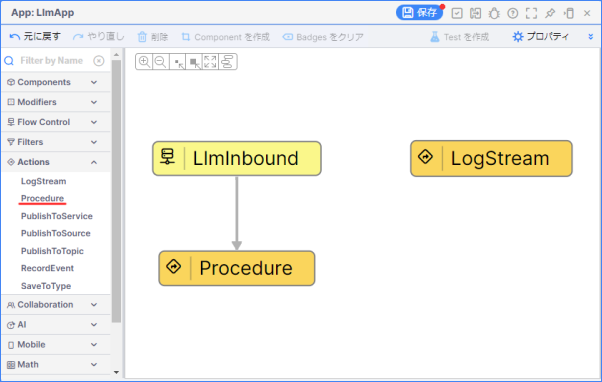

1. `Procedure` タスクをクリックし、 `Configuration` の `クリックして編集` から以下の内容を入力します。

   |Required Parameter|Value|
   |-|-|
   |procedure (Enumerated)|submitPrompt|

   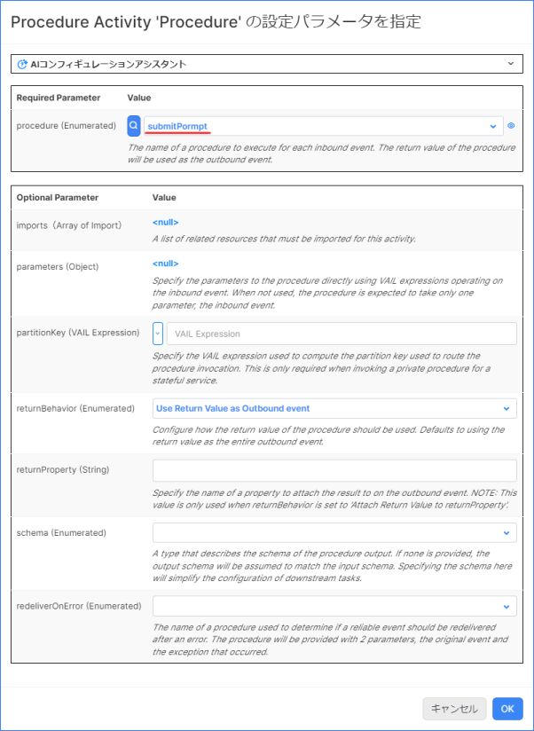

1. `parameters (Object)` の `<null>` をクリックします。

   

1. 以下の設定を行いアプリケーションを保存します。

   |Parameter|VAIL Expression|
   |-|-|
   |prompt|event.message|

   

### 6-4. 【LogStream】ログタスクの修正

LLM との会話をログに出力して、結果を確認できるよう `LogStream` タスクを修正します。  

#### LogStream の修正

1. `LogStream` タスクを選択し、 `Procedure` タスクの上にドロップして、アプリケーションを保存します。  

   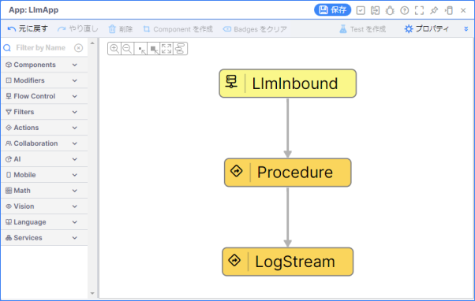

   > **補足**  
   > `Downstream イベント` は `event` を選択します。  
   >
   > 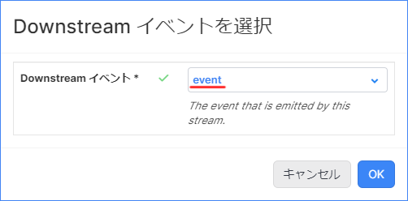

## 7. LLM との会話

Topic からメッセージを送信し、 LLM との会話を行ってみます。  

### 7-1. Log メッセージ画面の表示

1. 画面右下の `Debugging` をクリックします。

1. 右側の `Errors` をクリックし、 `Log メッセージ` にチェックを入れます。

### 7-2. /Inbound Topic ペインの表示

1. 画面左側の `Project Contents` から `/Inbound` Topic を開きます。

   

### 7-3. メッセージの送信

1. `/Inbound` Topic ペインから任意のメッセージを入力し、 `Publish` をクリックします。

   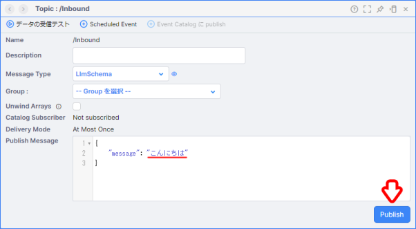

### 7-4. アプリケーションとログの確認

1. アプリケーションが正しく動いているか確認します。

   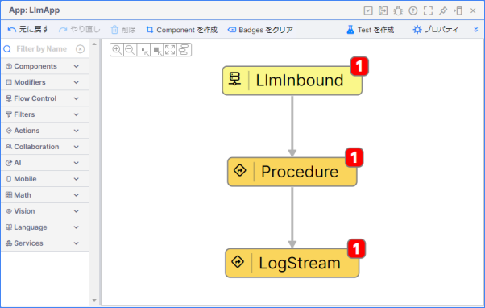

1. LLM との会話の結果をログ画面で確認します。

   

## Project のエクスポート

作成したアプリケーションを Project ごとエクスポートします。  
Project のエクスポートを行うことで、他の Namespace にインポートしたり、バックアップとして管理することが出来ます。  

詳細は下記を参照してください。  
[Project の管理について - Project のエクスポート](/vantiq-introduction/apps-development/vantiq-basic/project/readme.md#project-のエクスポート)

## ワークショップの振り返り

1. **Secret**
   1. **Secret** を用いた場合、既存のアプリケーションをインポートしても再設定する必要があり、 API Key などを安全に管理できることを学習しました。
   1. **Procedure** を利用し、独自言語である VAIL を用いた柔軟なアプリ開発ができることを学習しました。
1. **App**
   1. **Procedure Activity** を利用し、作成した Procedure を呼び出す方法を学習しました。

## 参考情報

### プロジェクトファイル

- [LLM（SubmitPrompt Procedure）の実装サンプル（Vantiq 1.37）](./../data/llm_submitprompt-procedure_1.37.zip)

以上
