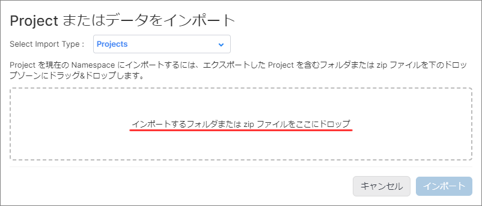
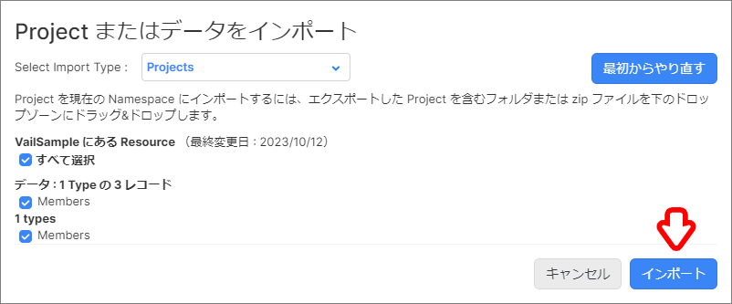

# Type のインポート方法

本項では Type のインポート方法について解説します。  

## 目次

- [Type のインポート方法](#type-のインポート方法)
  - [目次](#目次)
  - [Type のインポート](#type-のインポート)
    - [インポート](#インポート)
  - [Type の追加](#type-の追加)
    - [追加](#追加)

## Type のインポート

Project ファイルとして Type のインポートを行います。  

### インポート

1. ナビゲーションバーの `Projects` → `インポート...` をクリックします。

1. `インポートするフォルダまたは zip ファイルをここにドロップ` の破線の範囲内にインポートしたい Project の `フォルダ` または `zip ファイル` をドロップします。  

   

1. インポートする Project に誤りが無いか確認し、 `インポート` をクリックします。  

   

1. `OK` をクリックします。  

   

## Type の追加

インポートした Type をプロジェクトに追加します。  

### 追加

1. メニューバーの `追加` -> `Type...` をクリックします。

1. 追加したい Type にチェックを入れ、 `選択した項目を追加` をクリックします。

   

以上で、 Type の追加は完了です。
