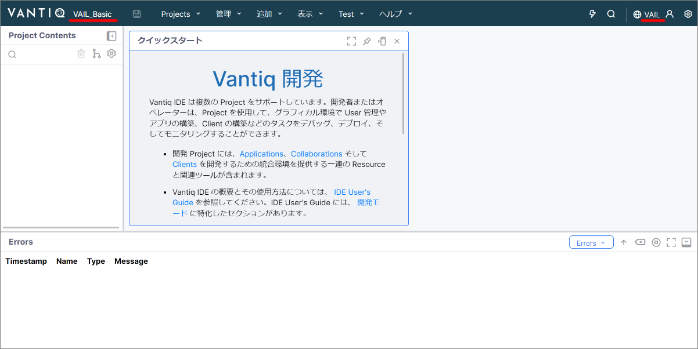
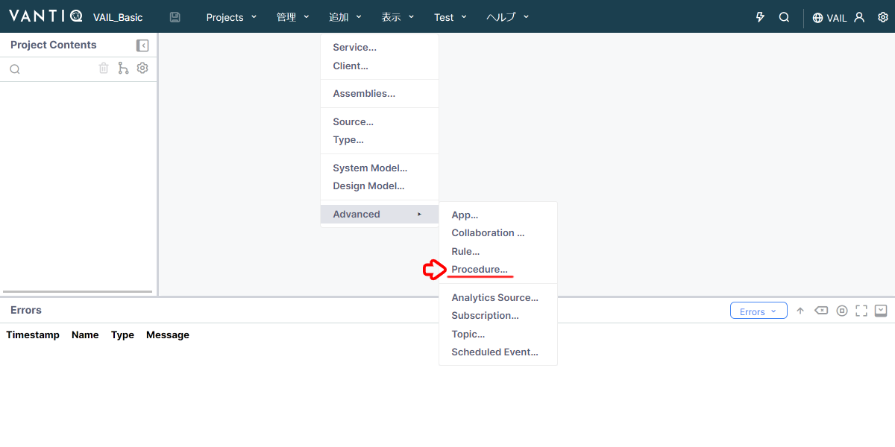
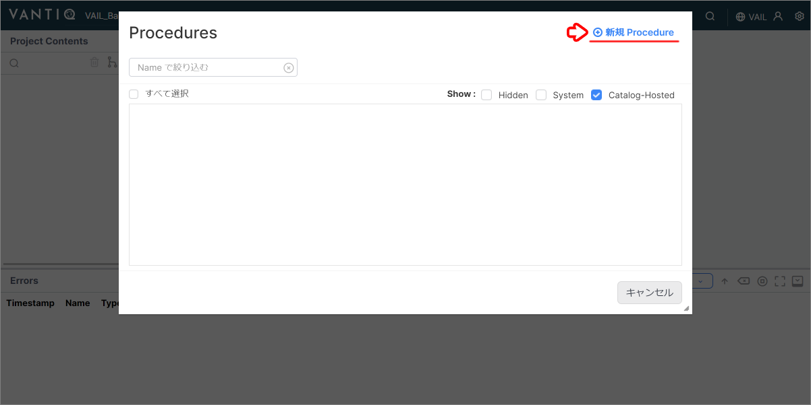
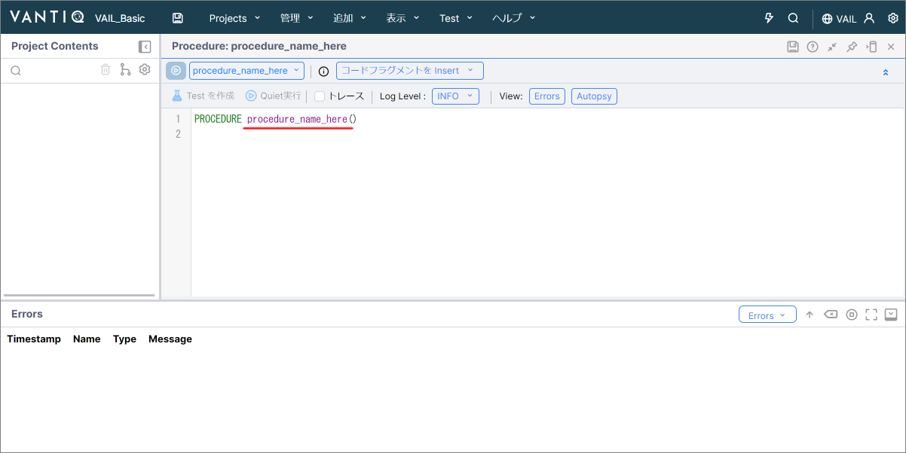
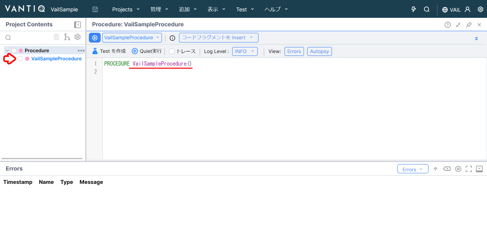
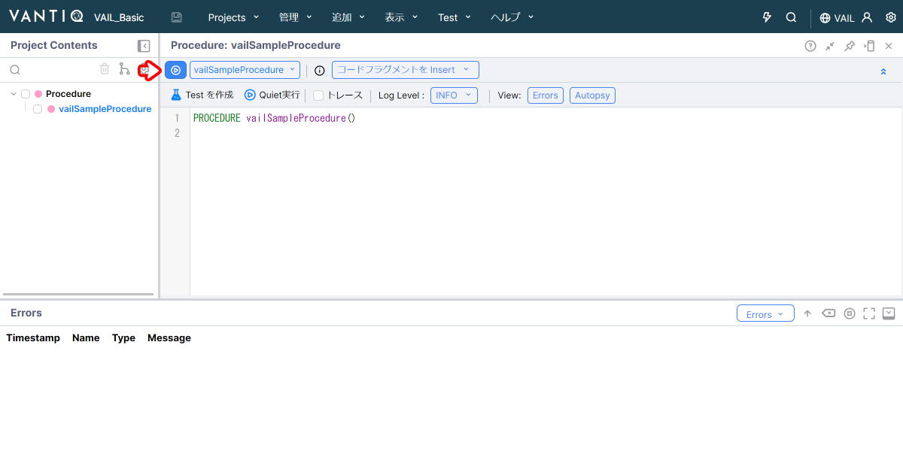
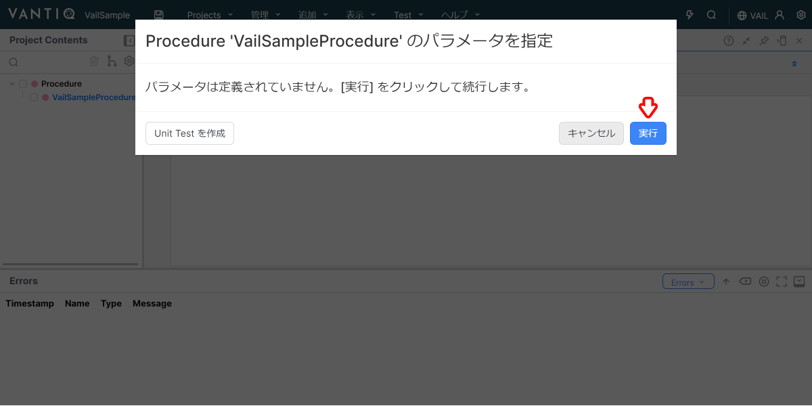
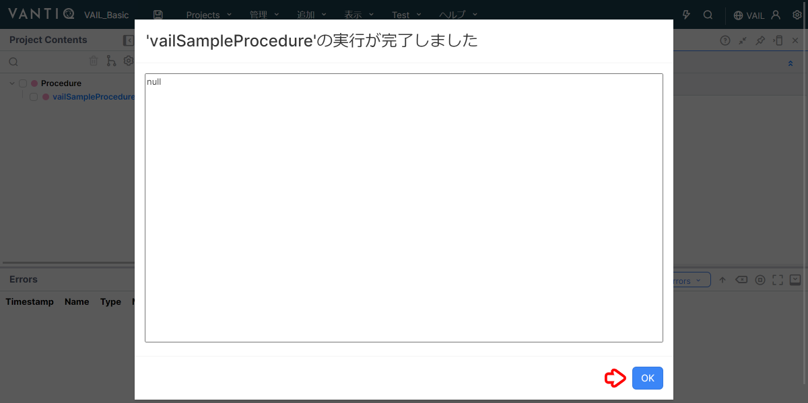

# VAIL 入門（基礎）

Vantiq アプリケーション開発時に使用する独自言語である `VAIL` の基本についての解説です。

詳細事項に関しては :globe_with_meridians:[リファレンス](https://dev.vantiq.co.jp/docs/system/rules/index.html) をご参照ください。

## 目次

- [VAIL 入門（基礎）](#vail-入門基礎)
  - [目次](#目次)
  - [Procedure の作成](#procedure-の作成)
  - [Procedure の実行](#procedure-の実行)
  - [コメントアウト](#コメントアウト)
  - [変数](#変数)
  - [データ型](#データ型)
  - [演算子](#演算子)
  - [比較](#比較)
  - [if文](#if文)
  - [for文](#for文)
    - [UNTIL](#until)
    - [Type](#type)
  - [配列](#配列)
  - [Try catch](#try-catch)

## Procedure の作成

VAIL を使うにあたって、まずは Procedure を用意します。  

1. 任意の Namespace に 任意の名前で Project を作成します。  

   

1. ナビゲーションバーから `追加` → `Advanced` → `Procedure...` をクリックします。  

   

1. `＋ 新規 Procedure` をクリックします。  

   

1. Procedure の雛形が作成されます。  

   

1. Procedure 名を任意の名前に変更し、保存します。（例：VailSampleProcedure）  

   

   > 補足  
   > Procedure が保存されると、画面左側の Project Contents に作成した Procedure が表示されます。

## Procedure の実行

作成した Procedure の実行方法について解説します。  

1. Procedure ペインの左上の `実行ボタン` をクリックします。  

   

1. Procedure の引数が設定されていない場合は、そのまま `実行` をクリックします。  

   

1. 実行結果が表示されます。  
   `OK` をクリックして画面を閉じます。  

   

   > **補足**  
   > `return` が存在しない場合は、最後に利用された変数の値が出力されます。

## コメントアウト

他の言語と同様に VAIL でもコメントアウトを記述できます。  

```JavaScript
PROCEDURE VailSampleProcedure()

// 1行ずつ、
// コメントを書くことができます

/*
複数行まとめてコメントを書くことができます
1. xxxxxxxx
2. yyyyyyy
3. wwwww
*/
```

## 変数

VAIL では変数の宣言に `var` を用います。  
また、変数宣言と値の代入を同時に行うこともできます。  

> **補足**  
> JavaScript like ですが `;` は使用しません。

```JavaScript
PROCEDURE VailSampleProcedure()

var a
var b = 0
```

## データ型

VAIL では下記のデータ型が利用できます。  

```JavaScript
PROCEDURE VailSampleProcedure()

// String
var a = "Hello"

// Interger
var b = 1

// Real
var c = 1.23

// Boolean
var d = true

// DateTime
var e = now()

// Object
// keyに "" があってもなくても動作します
var d = {
    "id": 1,
    "value": 100
}
var e = {
    id: 1,
    value: 100
}
```

## 演算子

VAIL では下記の演算子が利用できます。  

```JavaScript
PROCEDURE VailSampleProcedure()

var a = 2
var b = 3
var c = "Hello"

var d = a + b  // 5
var e = a * b  // 6
var f = a ** b // 8
var g = f / 2  // 4
var h = b % a  // 1
var i = c + " World " + a // Hello World 2

a += 1 // 3
b -= 1 // 2
```

<details>
<summary>実際に確認してみよう！</summary>

上記の演算子が正しく動いているか Log に出力して、確認してみましょう。  

```JavaScript
PROCEDURE VailSampleProcedure()

var a = 2
var b = 3
var c = "Hello"

var d = a + b  // 5
log.info("d: " + d)

var e = a * b  // 6
log.info("e: " + e)

var f = a ** b // 8
log.info("f: " + f)

var g = f / 2  // 4
log.info("g: " + g)

var h = b % a  // 1
log.info("h: " + h)

var i = c + " World " + a // Hello World 2
log.info("i: " + i)

a += 1 // 3
log.info("a: " + a)

b -= 1 // 2
log.info("b: " + b)
```

</details>

## 比較

VAIL では下記の比較演算子が利用できます。  

```JavaScript
3 == 3 // true
3 == "3" // false

"foo" == "hoge" // false
"foo" != "hoge" // true

true AND true // true
true and true // true
true && true // true

true OR false // true
true or false // true
true || false // true

NOT true // false
!true // false
```

<details>
<summary>実際に確認してみよう！</summary>

上記の比較演算子が正しく動いているか Log に出力して、確認してみましょう。  

```JavaScript
PROCEDURE VailSampleProcedure()

var a = 3 == 3 // true
log.info("a: " + a)

var b = 3 == "3" // false
log.info("a: " + b)

var c = "foo" == "hoge" // false
log.info("a: " + c)

var d = "foo" != "hoge" // true
log.info("d: " + d)

var e = true AND true // true
log.info("e: " + e)

var f = true and true // true
log.info("f: " + f)

var g = true && true // true
log.info("g: " + g)

var h = true OR false // true
log.info("h: " + h)

var i = true or false // true
log.info("i: " + i)

var j = true || false // true
log.info("j: " + j)

var k = NOT true // false
log.info("k: " + k)

var l = !true // false
log.info("l: " + l)
```

</details>

## if文

VAIL での if 文は下記のとおりです。  
なお、条件部分は括弧付き、括弧なしのどちらでも動作します。  

括弧なし

```JavaScript
PROCEDURE VailSampleProcedure()

var a = 10
if a > 11 {
    log.info("hoge")
} else if a > 9 {
    log.info("fuga")
}
```

括弧あり

```JavaScript
PROCEDURE VailSampleProcedure()

var a = 10
if (a > 11) {
    log.info("hoge")
} else if (a > 9) {
    log.info("fuga")
}
```

結果

```JavaScript
fuga
```

> **注意**  
> VAIL は論理演算子のショートカットを行わないことがあります。  
> 以下の例では右辺も評価されるため、エラーとなります。 
>  
> ```JavaScript
> PROCEDURE VailSampleProcedure()
>
> var stack = ["first"]
> // stack の最後の2要素を比べて同じであれば pop する
> if length(stack) > 1 && compare(stack[-2], stack[-1]) {
>     pop(stack)    
> }
> ```
>
> 以下の様に実装すると安全です。
> 
> ```JavaScript
> PROCEDURE VailSampleProcedure()
>
> var stack = ["first"]
> // stack の最後の2要素を比べて同じであれば pop する
> if length(stack) > 1 {
>   if compare(stack[-2], stack[-1]) {
>       pop(stack)    
>   }
> }
> ```
>
> 参照: https://dev.vantiq.co.jp/docs/system/rules/index.html#logical-operators

## for文

VAIL での for 文は Python の for 文と似ています。  
なお、 if 文と同様に条件部分は括弧付き、括弧なしのどちらでも動作します。 

```JavaScript
PROCEDURE VailSampleProcedure()

var a = 1
for i in range(0, 5, 1) {
    a = a * 2
}

return a
```

> **補足**  
> range 関数： range(from, to, increment)

結果

```JavaScript
32
```

### UNTIL

`UNTIL`を使うと条件に一致した時点でループから抜けます。  

```JavaScript
PROCEDURE VailSampleProcedure()

var a = 1
for i in range(0, 5, 1) UNTIL i == 2 {
    a = a * 2
}

return a
```

結果

```JavaScript
8
```

### Type

Type からレコードを取得し、レコードごとに処理を実行することもできます。  

<details>
<summary>Member Type のレコード</summary>

サンプルとなる Member Type のレコードは下記のとおりです。  

|id|name|age|
|:---:|:---|---:|
|0|Suzuki|21|
|1|Yamada|35|
|3|Tanaka|23|

</details>

```JavaScript
PROCEDURE VailSampleProcedure()

var targetAge
for member in SELECT FROM Members {
    if(member.name == "Tanaka"){
        targetAge = member.age // 23
    }
}

return targetAge
```

結果

```JavaScript
23
```

> **サンプル**  
> サンプルとして用いた Type は [こちら](./data/VailSample_Type.zip) から、ダウンロードできます。  
> Project にインポートして利用してください。  

## 配列

VAIL でも配列が利用できます。  

```JavaScript
PROCEDURE VailSampleProcedure()

var myArray = [1,2,3,"Apple","Peach"]
var firstElement = myArray[0] // 1
var lastElement = myArray[-1] // "Peach"
myArray[10] = "Banana"

return myArray
```

結果

```JavaScript
[
    1,
    2,
    3,
    "Apple",
    "Peach",
    null,
    null,
    null,
    null,
    null,
    "Banana"
]
```

## Try catch

VAIL では例外処理も利用できます。

```JavaScript
PROCEDURE VailSampleProcedure()

var results = []
try {
    var a = toInteger("Hello") // エラーになるソースコード
    push(results, a)
} catch(error) {
    // tryブロック内の処理でエラーが発生した際に実行される
    var a = "Hello, catch: " + error
    push(results, a)
} finally {
    /* tryブロック内の処理でのエラーが発生の有無に関わらず実行される
        finallyブロックは無くてもOK
    */
    var a = "Hello, finally"
    push(results, a)
}

return results
```

上記のコードはエラーが発生するため、 `catch` 、 `finally` 内のソースコードのみが実行されます。

結果

```JavaScript
[
    "Hello, catch: [code:io.vantiq.runtime.exception, message:Encountered exception during execution: For input string: \"Hello\", params:[For input string: \"Hello\"]]",
    "Hello, finally"
]
```
