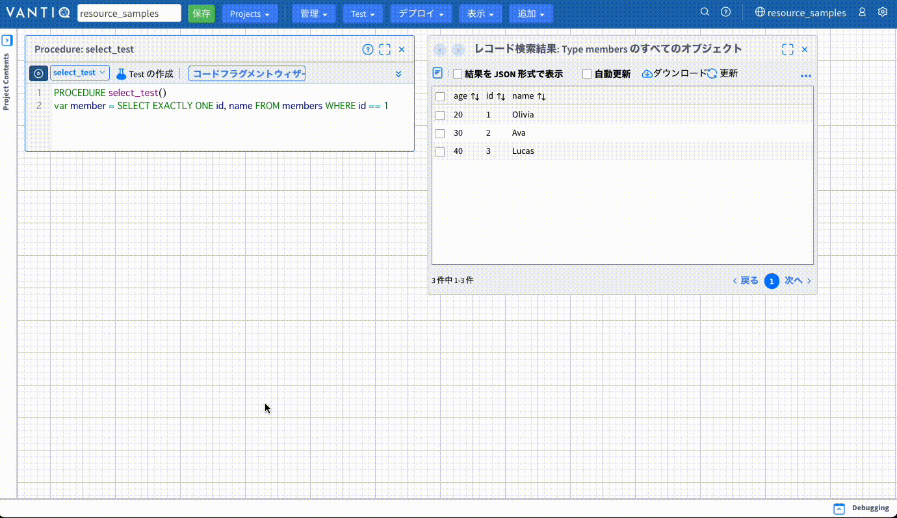
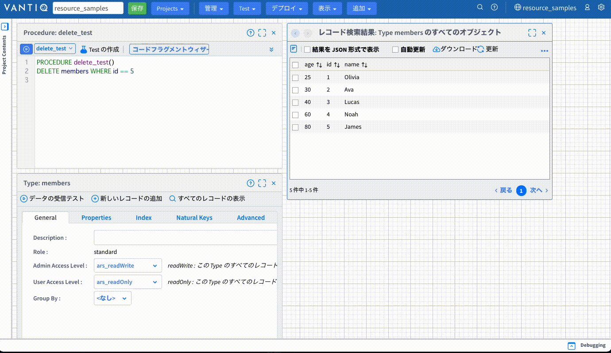

# VAIL 入門（Type の操作）

**VAIL** を用いて Type のデータを操作する方法を解説します。  

## 目次

- [VAIL 入門（Type の操作）](#vail-入門type-の操作)
  - [目次](#目次)
  - [データ操作](#データ操作)
    - [Members Type](#members-type)
    - [保持しているデータ](#保持しているデータ)
    - [サンプル](#サンプル)
  - [SELECT (取得)](#select-取得)
    - [全件、全プロパティを取得](#全件全プロパティを取得)
    - [全件、特定のプロパティを取得](#全件特定のプロパティを取得)
    - [WHEREによる絞り込み](#whereによる絞り込み)
    - [該当するレコードが1件のみと予めわかっている場合](#該当するレコードが1件のみと予めわかっている場合)
  - [INSERT (追加)](#insert-追加)
    - [レコードの追加](#レコードの追加)
  - [UPDATE (更新)](#update-更新)
    - [レコードの更新](#レコードの更新)
  - [UPSERT (既存レコードがない場合はINSERT、既存がある場合はUPDATE)](#upsert-既存レコードがない場合はinsert既存がある場合はupdate)
    - [レコードの追加](#レコードの追加-1)
    - [レコードの更新](#レコードの更新-1)
    - [省略表記の場合](#省略表記の場合)
  - [DELETE (削除)](#delete-削除)
    - [レコードの削除](#レコードの削除)
  - [Bulk INSERT (一括追加), Bulk UPSERT (一括追加/更新)](#bulk-insert-一括追加-bulk-upsert-一括追加更新)
    - [Bulk INSERT (一括追加)](#bulk-insert-一括追加)
    - [Bulk UPSERT (一括追加/更新)](#bulk-upsert-一括追加更新)
  - [実装サンプル](#実装サンプル)

## データ操作

Vantiq では下記の SQL のようなクエリを使用して Type に保存されているデータの操作を行うことができます。

- SELECT
- INSERT
- UPDATE
- UPSERT
- DELETE

このセッションでは、以下の `Members` という Type がある仮定で説明を行います。

### Members Type

Members Type のプロパティは次のとおりです。

| プロパティ | 型 | 必須 | ナチュラルキー |　インデックス | ユニーク |
| :---: | :---: | :---: | :---: | :---: | :---: |
| id | Integer | ◯ | ◯ | ◯ | ◯ |
| name | String | ◯ | - | - | - |
| age | Integer | - | - | - | - |

### 保持しているデータ

Members Type で保持しているレコードは次のとおりです。

|id|name|age|
|:---:|:---|---:|
|0|Suzuki|21|
|1|Yamada|35|
|3|Tanaka|23|
|4|Yamada|42|

### サンプル

Type のサンプルは [こちら](./data/vail_type_type.zip) からダウンロードできます。  
Project にインポートして利用してください。  

Type のインポート方法は [こちら](./../type_import/readme.md) から参照してください。

## SELECT (取得)

### 全件、全プロパティを取得

Members Type から全レコード、全プロパティを取得します。  

```JavaScript
PROCEDURE select1()

var members = SELECT * FROM Members

return members
```

> **Point**  
> `var members = SELECT FROM members`  
> というように `SELECT` と `FROM` の間の `*` を省略することもできます。

**結果**

```JavaScript
[
    {
        "_id": "64c8bc976807117ef26b0b53",
        "age": 23,
        "id": 3,
        "name": "Tanaka",
        "ars_namespace": "VAIL",
        "ars_version": 1,
        "ars_createdAt": "2023-08-01T08:04:39.264Z",
        "ars_createdBy": "e9cc46d7-77cc-4929-8261-40ddceb8b143"
    },
    {
        "_id": "64c8bc976807117ef26b0b54",
        "age": 35,
        "id": 1,
        "name": "Yamada",
        "ars_namespace": "VAIL",
        "ars_version": 1,
        "ars_createdAt": "2023-08-01T08:04:39.264Z",
        "ars_createdBy": "e9cc46d7-77cc-4929-8261-40ddceb8b143"
    },
    {
        "_id": "64c8bc976807117ef26b0b55",
        "age": 21,
        "id": 0,
        "name": "Suzuki",
        "ars_namespace": "VAIL",
        "ars_version": 1,
        "ars_createdAt": "2023-08-01T08:04:39.264Z",
        "ars_createdBy": "e9cc46d7-77cc-4929-8261-40ddceb8b143"
    },
    {
        "_id": "64d1d48e6807117ef2841fb4",
        "id": 4,
        "name": "Yamada",
        "age": 42,
        "ars_namespace": "VAIL",
        "ars_version": 1,
        "ars_createdAt": "2023-08-08T05:37:18.438Z",
        "ars_createdBy": "e9cc46d7-77cc-4929-8261-40ddceb8b143"
    }
]
```

> **補足**  
> `_id`、`ars_*` はシステムが自動で付与するプロパティです。

### 全件、特定のプロパティを取得

Member Type から全レコードの `name` プロパティのみを取得します。  

```JavaScript
PROCEDURE select2()

var members = SELECT name FROM Members

return members
```

**結果**

```JavaScript
[
    {
        "_id": "64c8bc976807117ef26b0b53",
        "name": "Tanaka"
    },
    {
        "_id": "64c8bc976807117ef26b0b54",
        "name": "Yamada"
    },
    {
        "_id": "64c8bc976807117ef26b0b55",
        "name": "Suzuki"
    },
    {
        "_id": "64d1d48e6807117ef2841fb4",
        "name": "Yamada"
    }
]
```

> **補足**  
> `_id` はこの場合でも含まれてしまいます。
>
> システムプロパティを含みたくない場合は、 `Utils.stripSystemProperties(object)` を用います。  
>
> ```JavaScript
> PROCEDURE select3()
> 
> var members = SELECT name FROM Members
> var new_members = []
> for(member in members){
>     var new_member = Utils.stripSystemProperties(member)
>     push(new_members, new_member)
> }
> 
> return new_members
> ```
>
> **結果**
>
> ```JavaScript
> [
>     {
>         "name": "Tanaka"
>     },
>     {
>         "name": "Yamada"
>     },
>     {
>         "name": "Suzuki"
>     },
>     {
>         "name": "Yamada"
>     }
> ]
> ```

### WHEREによる絞り込み

SELECT 文を使用する際に WHERE 句を使った絞り込みができます。  

WHERE 句の条件に合致するレコードのみを取得します。  

```JavaScript
PROCEDURE select4()

var members = SELECT id, name FROM Members WHERE id == 1

return members
```

**結果**

```JavaScript
[
    {
        "_id": "64c8bc976807117ef26b0b54",
        "id": 1,
        "name": "Yamada"
    }
]
```

### 該当するレコードが1件のみと予めわかっている場合

WHERE 句の条件に合致するレコードが、1件だけだとわかっている場合は `SELECT ONE` を使用します。  
通常の `SELECT` は **配列** が戻り値になりますが、 `SELECT ONE` を使用した場合は **Object** が返り値となります。  

```JavaScript
PROCEDURE select5()

var member = SELECT ONE id, name FROM Members WHERE id == 1

return member
```

**結果**

```JavaScript
{
    "_id": "64c8bc976807117ef26b0b54",
    "id": 1,
    "name": "Yamada"
}
```

#### エラーになる場合

該当するレコードが複数件存在する場合はエラーとなます。  

```JavaScript
PROCEDURE select6()

var member = SELECT ONE id, name FROM Members WHERE name == "Yamada"

return member
```

**Error**

```Error
HTTP Status 400 () （WHILE executing Procedure 'VailSampleProcedure'）:

com.accessg2.ag2rs.data.duplicate.object.found: More than one instance of type: Members__VAIL with qual: {name=Yamada} was found.
```

#### Null になる場合

該当するレコードが1件も存在しない場合は `null` が返り値となります。  

```JavaScript
PROCEDURE select7()

var member = SELECT ONE id, name FROM Members WHERE id == 2

return member
```

**結果**

```JavaScript
null
```

#### 明示的にエラーを発生させたい場合

該当する必須の関連データが存在しない場合 `null` を返すのではなく明示的にエラーにしたい場合があります。（例:デバイスから送信されたイベントにセンサーのマスタデータを紐付けたい場合など）

その場合は `SELECT EXACTLY ONE` を使用することでレコードが存在しない場合にエラーを発生させることができます。

```JavaScript
PROCEDURE select8()

var member = SELECT EXACTLY ONE id, name FROM Members WHERE id == 2

return member
```

**Error**

```Error
HTTP Status 400 () （WHILE executing Procedure 'VailSampleProcedure'）:

io.vantiq.resource.not.found: The requested instance ('{id=2}') of the Members resource could not be found.
```



## INSERT (追加)


### レコードの追加

Members Type に以下のレコードが追加されます。  

|id|name|age|
|:---:|:---:|:---:|
|5|Noah|50|

```JavaScript
PROCEDURE insert1()

var member = {
    id: 5,
    name: "Sato",
    age: 50
}
INSERT Members(member)
```

**結果**

```JavaScript
{
    "id": 5,
    "name": "Sato",
    "age": 50,
    "ars_namespace": "VAIL",
    "ars_version": 1,
    "ars_createdAt": "2023-08-08T06:14:14.325Z",
    "ars_createdBy": "e9cc46d7-77cc-4929-8261-40ddceb8b143",
    "_id": "64d1dd3697788056d6075c07"
}
```

なお、上記の INSERT 文は次のように書くこともできます。

```JavaScript
PROCEDURE insert2()

INSERT Members(id: 6, name: "Sato", age: 50)
```

#### 必須プロパティについて

今回の Members Type では `age` プロパティは必須項目ではありません。  
そのため、以下のように実行しても処理は成功します。  
必須項目を抜いたり、ユニーク設定をしている項目で既存レコードと重複がある場合はエラーになります。  

```JavaScript
PROCEDURE insert3()

var member = {
    id: 7,
    name: "Nakamura"
}
INSERT Members(member)
```

**結果**

```JavaScript
{
    "id": 7,
    "name": "Nakamura",
    "ars_namespace": "VAIL",
    "ars_version": 1,
    "ars_createdAt": "2023-08-08T06:25:45.460Z",
    "ars_createdBy": "e9cc46d7-77cc-4929-8261-40ddceb8b143",
    "_id": "64d1dfe96da9080881f0be7e"
}
```

## UPDATE (更新)


### レコードの更新

WHERE句の条件に合致するレコードを全て更新します。  

Members Type の更新されるレコード
|id|name|age|
|:---:|:---:|:---:|
|6|Nakamura|60|

```JavaScript
PROCEDURE update1()

UPDATE Members(age: 60) WHERE id == 7
```

**結果**

```JavaScript
{
    "age": 60,
    "ars_modifiedAt": "2023-08-08T06:27:42.723Z",
    "ars_modifiedBy": "e9cc46d7-77cc-4929-8261-40ddceb8b143"
}
```

#### Object 表記の場合

UPDATE 文は WHERE 句が必須ですが、 INSERT 文のように更新するプロパティを Object で記述することもできます。  

```JavaScript
PROCEDURE update2()

var member = {
    name: "Taro Yamada",
    age: 70
}
UPDATE Members(member) WHERE id == 4
```

**結果**

```JavaScript
{
   "name": "Taro Yamada",
   "age": 70,
   "ars_modifiedAt": "2023-08-08T06:36:27.030Z",
   "ars_modifiedBy": "e9cc46d7-77cc-4929-8261-40ddceb8b143"
}
```

## UPSERT (既存レコードがない場合はINSERT、既存がある場合はUPDATE)


### レコードの追加

Natural Key（ナチュラルキー）を基準として（今回の場合は `id`）、既存レコードがない場合は INSERT され、ある場合は UPDATE されます。  
ナチュラルキーが設定されていない Type に対して UPSERT は使用できません。

`id` が `10` のレコードが存在しない場合に次のVAILを実行するとINSERTされます。

Membets Type に追加されるレコード
|id|name|age|
|:---:|:---:|:---:|
|10|Kaneko|80|

```JavaScript
PROCEDURE upsert1()

var member = {
    id: 10,
    name: "Kaneko",
    age: 80
}
UPSERT Members(member)
```

**結果**

```JavaScript
{
    "id": 10,
    "name": "Kaneko",
    "age": 80,
    "ars_namespace": "VAIL",
    "ars_version": 1,
    "ars_createdAt": "2023-08-08T09:00:04.415Z",
    "ars_createdBy": "e9cc46d7-77cc-4929-8261-40ddceb8b143",
    "_id": "64d2041497788056d60768d6"
}
```

### レコードの更新

`id 1` のように既にレコードが存在する場合は UPDATE されます。  

Membets Type の更新されるレコード
|id|name|age|
|:---:|:---:|:---:|
|1|Yamada|25|

```JavaScript
PROCEDURE upsert2()

var member = {
    id: 1,
    age: 25
}
UPSERT Members(member)
```

**結果**

```JavaScript
{
    "id": 1,
    "age": 25,
    "ars_modifiedAt": "2023-08-08T09:03:06.312Z",
    "ars_modifiedBy": "e9cc46d7-77cc-4929-8261-40ddceb8b143",
    "ars_createdBy": "e9cc46d7-77cc-4929-8261-40ddceb8b143",
    "ars_createdAt": "2023-08-01T08:04:39.264Z",
    "ars_namespace": "VAIL",
    "ars_version": 1,
    "_id": "64c8bc976807117ef26b0b54"
}
```

UPSERT 文で使用する Object には `ナチュラルキーに設定されたプロパティ` と `更新したい全てのプロパティ` が必要です。  

### 省略表記の場合

INSERT 、 UPDATE のように次のように記述することもできます。  

```JavaScript
PROCEDURE upsert3()

UPSERT Members(id: 1, age: 28)
```

**結果**

```JavaScript
{
    "id": 1,
    "age": 28,
    "ars_modifiedAt": "2023-08-08T09:06:02.554Z",
    "ars_modifiedBy": "e9cc46d7-77cc-4929-8261-40ddceb8b143",
    "ars_createdBy": "e9cc46d7-77cc-4929-8261-40ddceb8b143",
    "ars_createdAt": "2023-08-01T08:04:39.264Z",
    "ars_namespace": "VAIL",
    "ars_version": 2,
    "_id": "64c8bc976807117ef26b0b54"
}
```

## DELETE (削除)



### レコードの削除

WHERE句の条件に合致するレコードを全て削除します。

Members Type から削除されるレコード
|id|name|age|
|:---:|:---:|:---:|
|5|Sato|50|

```JavaScript
PROCEDURE delete1()

DELETE Members WHERE id == 5
```

**結果**

```JavaScript
1
```

## Bulk INSERT (一括追加), Bulk UPSERT (一括追加/更新)

**INSERT** や **UPSERT** では、一括でデータの追加や更新ができる **Bulk INSERT** や **Bulk UPSERT** が利用できます。  

### Bulk INSERT (一括追加)

通常の **INSERT 文** と同様に記述し、値を配列で渡します。

```javaScript
PROCEDURE bulk1()

var members = [
    {
        id: 11,
        name: "Watanabe",
        age: 38
    }, {
        id: 12,
        name: "Sasaki",
        age: 27
    }, {
        id: 13,
        name: "Kobayashi",
        age: 28
    }
]
INSERT Members(members)
```

**結果**

```JavaScript
{
    "id": 11,
    "name": "Watanabe",
    "age": 38,
    "ars_namespace": "VAIL",
    "ars_version": 1,
    "ars_createdAt": "2023-08-08T09:16:58.113Z",
    "ars_createdBy": "e9cc46d7-77cc-4929-8261-40ddceb8b143",
    "_id": "64d2080a6da9080881f0c97c"
}
```

### Bulk UPSERT (一括追加/更新)

通常の **UPSERT 文** と同様に記述し、値を配列で渡します。

```JavaScript
PROCEDURE bulk2()

var members = [
    {
        id: 11,
        name: "Watanabe",
        age: 28
    }, {
        id: 12,
        name: "Sasaki",
        age: 17
    }, {
        id: 13,
        name: "Kobayashi",
        age: 18
    }
]
UPSERT Members(members)
```

**結果**

```JavaScript
{
    "id": 13,
    "name": "Kobayashi",
    "age": 18,
    "ars_modifiedAt": "2023-08-08T09:18:29.389Z",
    "ars_modifiedBy": "e9cc46d7-77cc-4929-8261-40ddceb8b143",
    "ars_createdBy": "e9cc46d7-77cc-4929-8261-40ddceb8b143",
    "ars_createdAt": "2023-08-08T09:16:58.113Z",
    "ars_namespace": "VAIL",
    "ars_version": 1,
    "_id": "64d2080a6da9080881f0c97a"
}
```

## 実装サンプル

- [VAIL 入門（Type）の実装サンプル（Vantiq 1.37）](./data/vail_type_1.37.zip)
