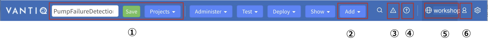
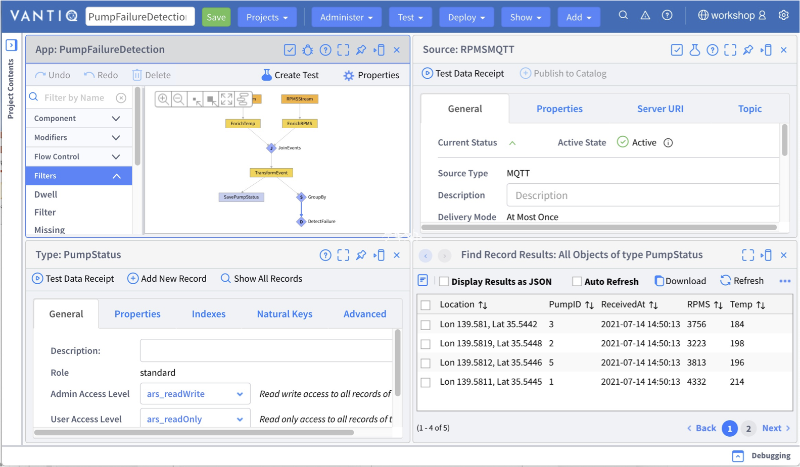
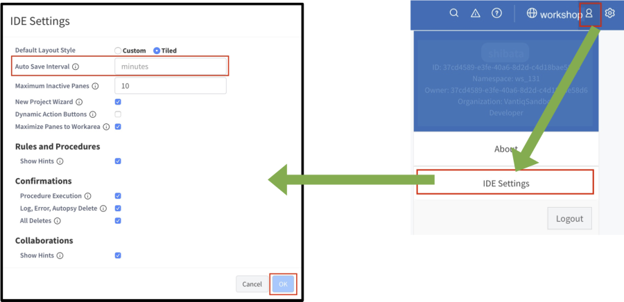
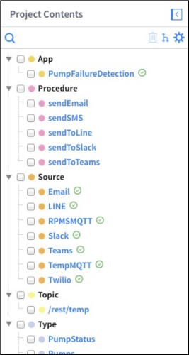
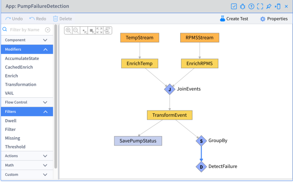
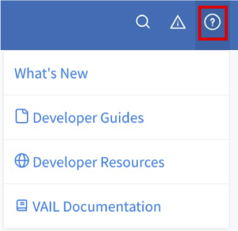

# Vantiq で開発する上での基本事項

このセッションでは Vantiq で開発する上での基本的な事項について解説します。

## 目次

- [Vantiq で開発する上での基本事項](#vantiq-で開発する上での基本事項)
  - [目次](#目次)
  - [ナビゲーション バーについて](#ナビゲーション-バーについて)
  - [開発画面の 2種類のレイアウトについて](#開発画面の-2種類のレイアウトについて)
  - [タイルの例（2×2）](#タイルの例22)
  - [カスタムの例](#カスタムの例)
  - [Namespace と Project の関係について](#namespace-と-project-の関係について)
  - [Project の保存と各 Resource の保存について](#project-の保存と各-resource-の保存について)
  - [Project の自動保存について](#project-の自動保存について)
  - [Resource の表示方法について](#resource-の表示方法について)
  - [ショートカットキー](#ショートカットキー)
  - [リファレンスについて](#リファレンスについて)
  - [関連リソース](#関連リソース)

## ナビゲーション バーについて

1. Project 関連。Project の作成・保存・切り替えなどを行う
1. Resource の追加
1. 発生したエラーの一覧
1. リファレンスなどの開発に関する情報
1. Namespace 名。Namespace の切り替えはここから行う
1. 自分のアカウント情報。自分のアカウントに関する情報の確認・編集や IDE 設定を行う

## 開発画面の 2種類のレイアウトについて

Vantiq の開発画面には、「タイル」と「カスタム」の 2種類のレイアウトがあります。  
画面、右上の _歯車_ アイコンをクリックし、「レイアウト\.\.\.」から選択することができます。

## タイルの例（2×2）

## カスタムの例

## Namespace と Project の関係について

各 Resource は Namespace ごとに保存されます。  
そのため Namespace 内の各 Project で、 Namespace 内に存在する全ての Resource を共通で使うことができます。

## Project の保存と各 Resource の保存について

- Project の保存
  - Project のレイアウトの状態やその Project でどの Resource を扱うのかを保存します。
  - 画面左上の緑の「 _保存_ 」をクリックして保存します。  

    
  （「PumpFailureDetection」という Project 名で保存する例）

- 各 Resource の保存
  - Type や Source などの各 Resource を作成すると Namespace に保存されます。
  - 各 Resource 編集ダイアログの _保存_ ボタンをクリックして保存します。  

  

> **注意点**  
> 例えば Type を新規作成し、 Project の保存をせずにブラウザーのリロードをしてしまうと、  
> Project の保存をしていないために作成した Type が Project に追加されていない状態になってしまいます。  
> しかし、 Type の作成自体はされているため、作成した Type は Namespace には保存されているという状態になります。  
> この場合、 Type の新規作成画面から作成した Type を選択し、 Project に追加してください。

## Project の自動保存について

Project の自動保存の設定をしておくことで、不意な状況で変更内容が失われることを防ぐことができます。  
画面右上の人型アイコンから IDE 設定ウィンドウを開いて設定します。

## Resource の表示方法について

画面左の「Project Contents」に Project に紐付く Resource が一覧で表示されます。  
表示したい Resource 名をクリックするとウィンドウが開きます。

## ショートカットキー

AppBuilder において、ショートカットキーが使用できます。

|コマンド|Widnows|Mac|
|:---:|:---:|:---:|
|Undo changes|`Ctrl` + `Z`|`Cmd` + `Z`|
|Redo changes|`Shift` + `Ctrl` + `Z`|`Shift` + `Cmd` + `Z`|
|Save changes|`Ctrl` + `S`|`Cmd` + `S`|

## リファレンスについて

ナビゲーション バーの「_?_」アイコンからリファレンスを開くことができます。

|メニュー項目名|機能|
|:------|:---:|
|新機能|最新バージョンの新着情報|
|開発者ガイド|リファレンス|
|開発者リソース|CLI や SDK などの開発リソース|
|VAIL ドキュメント|VAIL のリファレンス|

## 関連リソース

- Vantiq Academy (要ログイン)
  - [2.2: Vantiq 開発 アーキテクチャ](https://community.vantiq.com/courses/%e3%82%a2%e3%83%97%e3%83%aa%e3%82%b1%e3%83%bc%e3%82%b7%e3%83%a7%e3%83%b3%e9%96%8b%e7%99%ba%e8%80%85-level-1-%e3%82%b3%e3%83%bc%e3%82%b9-%e6%97%a5%e6%9c%ac%e8%aa%9e/lessons/lesson-2-vantiq-%e9%96%8b%e7%99%ba%e3%83%97%e3%83%a9%e3%83%83%e3%83%88%e3%83%95%e3%82%a9%e3%83%bc%e3%83%a0/topic/2-2-vantiq-%e9%96%8b%e7%99%ba-%e3%82%a2%e3%83%bc%e3%82%ad%e3%83%86%e3%82%af%e3%83%81%e3%83%a3/)
  - [2.3: Vantiq IDE (Modelo)](https://community.vantiq.com/courses/%e3%82%a2%e3%83%97%e3%83%aa%e3%82%b1%e3%83%bc%e3%82%b7%e3%83%a7%e3%83%b3%e9%96%8b%e7%99%ba%e8%80%85-level-1-%e3%82%b3%e3%83%bc%e3%82%b9-%e6%97%a5%e6%9c%ac%e8%aa%9e/lessons/lesson-2-vantiq-%e9%96%8b%e7%99%ba%e3%83%97%e3%83%a9%e3%83%83%e3%83%88%e3%83%95%e3%82%a9%e3%83%bc%e3%83%a0/topic/2-3-vantiq-ide-modelo-copy-2/)
