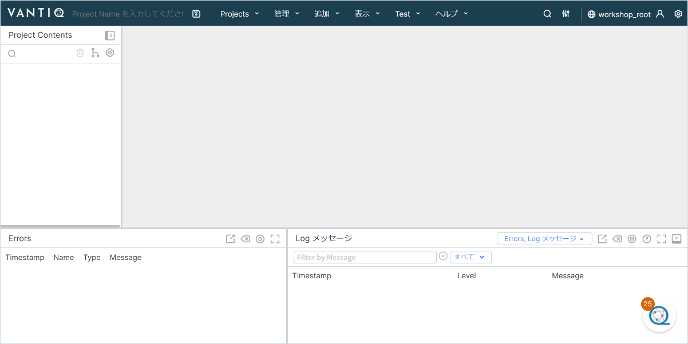
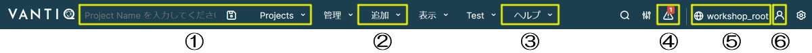
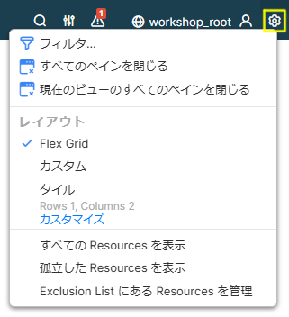
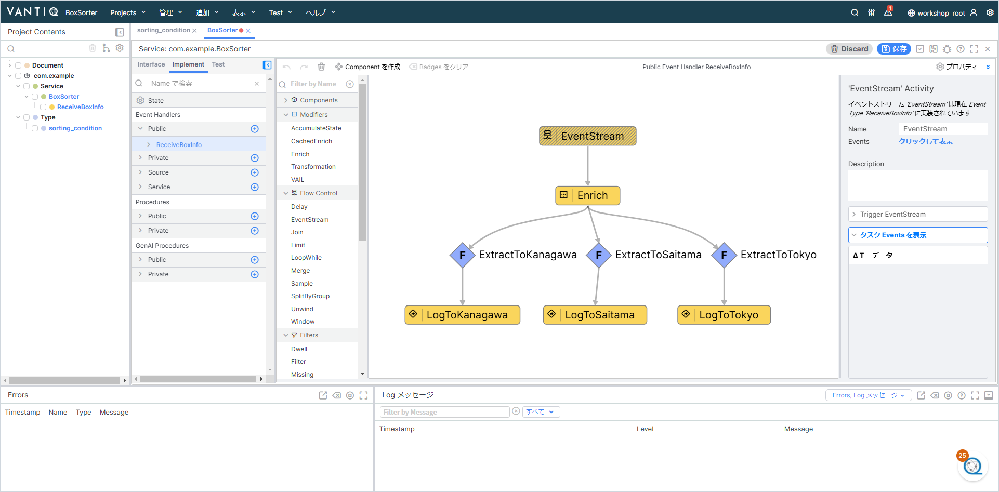
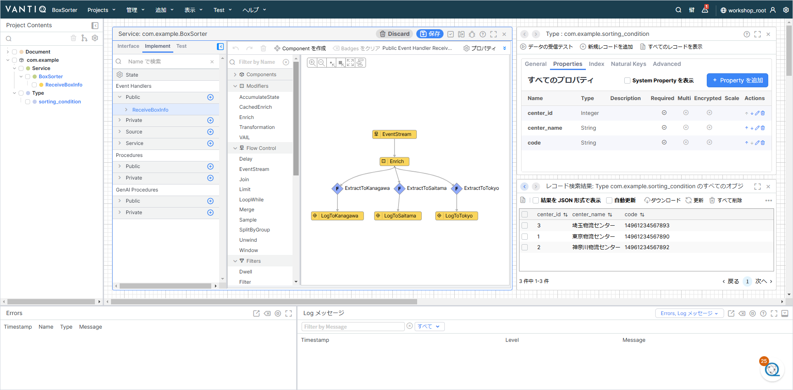
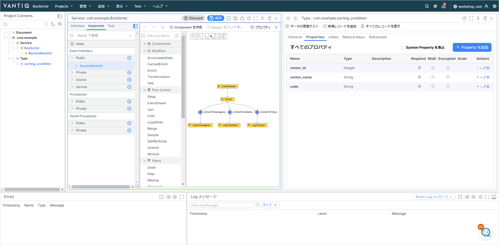
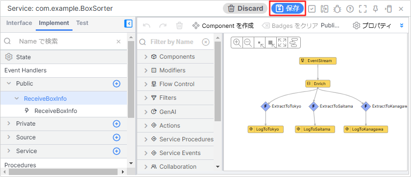
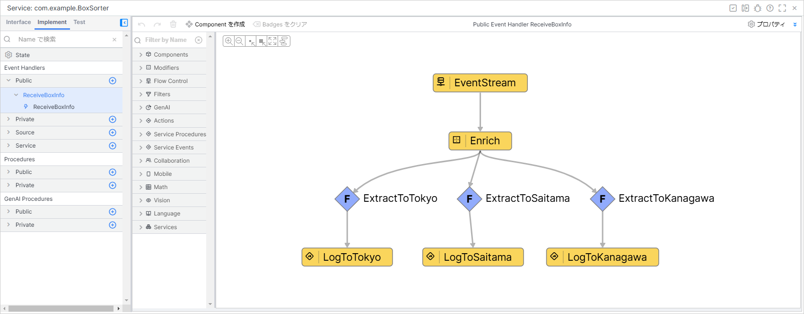
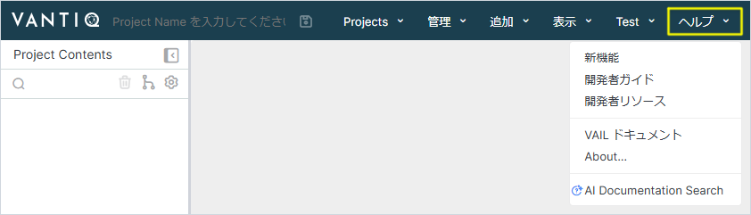

# Vantiq で開発する上での基本事項

このセッションでは Vantiq で開発する上での基本的な事項について解説します。  
（※記事作成時の Vantiq バージョン： r1.40.4）  

## 目次

- [Vantiq で開発する上での基本事項](#vantiq-で開発する上での基本事項)
  - [目次](#目次)
  - [開発画面](#開発画面)
  - [ナビゲーションバーについて](#ナビゲーションバーについて)
  - [開発画面のレイアウトについて](#開発画面のレイアウトについて)
    - [Flex Grid](#flex-grid)
    - [カスタム](#カスタム)
    - [タイル（Rows 1, Columns 2 の例）](#タイルrows-1-columns-2-の例)
  - [Namespace と Project の関係について](#namespace-と-project-の関係について)
  - [Project の保存と各 Resource の保存について](#project-の保存と各-resource-の保存について)
  - [Resource の表示方法について](#resource-の表示方法について)
  - [ショートカットキー](#ショートカットキー)
  - [リファレンスについて](#リファレンスについて)

## 開発画面

Vantiq の開発画面は次のようになっています。  

## ナビゲーションバーについて

Vantiq の操作はナビゲーションバーから行うものが多いです。  
ナビゲーションバーは大きく分けて次のように別れています。  

1. Project 関連  
   Project の作成・保存・切り替えなどを行う
1. Resource の追加
1. リファレンスなどの開発に関する情報
1. 発生したエラーの一覧
1. Namespace 名  
   Namespace の切り替えはここから行う
1. 自分のアカウント情報  
   自分のアカウントに関する情報の確認・編集や IDE 設定を行う

## 開発画面のレイアウトについて

Vantiq の開発画面の表示方法は複数のレイアウトがあります。  
画面、右上の `歯車` アイコンをクリックし、 `レイアウト` から選択することができます。

### Flex Grid

メニュー直下にペイン切り替え用のタブが表示されるのが特徴です。  
画面を広く使うことができるため、 Service Builder を利用する際に便利なレイアウトです。

### カスタム

方眼用紙に並べるように自由にペインを配置できるのが特徴です。  
ダッシュボードやジェネレーターなどの一覧性を重視するときに便利なレイアウトです。  
背景に表示されているグリッドは非表示にすることも出来ます。  

### タイル（Rows 1, Columns 2 の例）

指定したグリッドサイズに応じて画面が分割されるのが特徴です。  
複数のペインを並べて表示したいときに便利なレイアウトです。  

## Namespace と Project の関係について

各 Resource は Namespace ごとに保存されます。  
そのため Namespace 内の各 Project で、 Namespace 内に存在する全ての Resource を共通で使うことができます。  

## Project の保存と各 Resource の保存について

- Project の保存
  - Project のレイアウトの状態やその Project でどの Resource を扱うのかを保存します。
  - Project に名前をつけて保存しておくと、自動的に変更内容が保存されるようになります。
  - 画面左上の入力ボックスに任意の Project 名を入力し `フロッピーディスク` アイコンをクリックして保存します。  

    
  （「BoxSorter」という Project 名で保存する例）

- 各 Resource の保存
  - Type や Source などの各 Resource を作成すると Namespace に保存されます。
  - 各 Resource 編集ダイアログの `フロッピーディスク` ボタンをクリックして保存します。  

  

> **注意点**  
> 例えば Type を新規作成し、 Project の保存をせずにブラウザーのリロードをしてしまうと、  
> Project の保存をしていないために作成した Type が Project に追加されていない状態になってしまいます。  
> しかし、 Type の作成自体はされているため、作成した Type は Namespace には保存されているという状態になります。  
> この場合、 Type の新規作成画面から作成した Type を選択し、 Project に追加してください。

## Resource の表示方法について

画面左の「Project Contents」に Project に紐付く Resource が一覧で表示されます。  
表示したい Resource 名をクリックするとウィンドウが開きます。

## ショートカットキー

Service Builder において、ショートカットキーが使用できます。

|コマンド|Widnows|Mac|
|:---:|:---:|:---:|
|Undo changes|`Ctrl` + `Z`|`Cmd` + `Z`|
|Redo changes|`Shift` + `Ctrl` + `Z`|`Shift` + `Cmd` + `Z`|
|Save changes|`Ctrl` + `S`|`Cmd` + `S`|

## リファレンスについて

ナビゲーションバーの `ヘルプ` からリファレンスを開くことができます。

|メニュー項目名|機能|
|:------|:---:|
|新機能|最新バージョンの新着情報|
|開発者ガイド|リファレンス|
|開発者リソース|CLI や SDK などの開発リソース|
|VAIL ドキュメント|VAIL のリファレンス|
