# 主要な Activity Pattern の紹介

よく使う主要な Activity Pattern について紹介します。  
その他の Activity Pattern や詳しい内容はリファレンスを参照してください。  

:globe_with_meridians: [App Builder Reference Guide](https://dev.vantiq.com/docs/system/apps/)

## 目次

- [主要な Activity Pattern の紹介](#主要な-activity-pattern-の紹介)
  - [目次](#目次)
  - [主要な Activity Pattern の一覧](#主要な-activity-pattern-の一覧)
  - [Enrich, Cached Enrich](#enrich-cached-enrich)
    - [Enrich, Cashed Enrich 例](#enrich-cashed-enrich-例)
  - [Join](#join)
    - [Join 例](#join-例)
  - [Transformation](#transformation)
    - [Transformation 例](#transformation-例)
  - [SplitByGroup](#splitbygroup)
  - [Dwell](#dwell)
    - [Dwell 例](#dwell-例)
  - [SaveToType](#savetotype)
  - [ComputeStatistics](#computestatistics)
    - [ComputeStatistics 例](#computestatistics-例)
  - [Unwind](#unwind)
    - [Unwind 例](#unwind-例)
  - [Procedure](#procedure)
    - [Procedure 例](#procedure-例)
  - [VAIL](#vail)
    - [VAIL 例](#vail-例)
  - [Filter](#filter)
    - [Filter 例](#filter-例)
  - [AccumulateState](#accumulatestate)
    - [AccumulateState 例: 通過したイベント数をカウントしてみる❶](#accumulatestate-例-通過したイベント数をカウントしてみる)
    - [AccumulateState 例: 通過したイベント数をカウントしてみる❷](#accumulatestate-例-通過したイベント数をカウントしてみる-1)
    - [AccumulateState 例: 通過したイベント数をカウントしてみる❸](#accumulatestate-例-通過したイベント数をカウントしてみる-2)

## 主要な Activity Pattern の一覧

- Enrich, Cached Enrich
- Join  
- Transformation  
- SplitByGroup  
- Dwell  
- SaveToType  
- ComputeStatistics
- Unwind  
- Procedure  
- VAIL
- Filter  
- AccumulateState

## Enrich, Cached Enrich

- イベントに Type に保存されたデータを追加する
- `Cached Enrich` は Type の値キャッシュしておくことによりパフォーマンスを向上させた `Enrich` です。  
  その代わり Type の値を変更しても、次に Type の値を取得するタイミングまではイベントに追加される値として反映されません。
  - `Cached Enrich` を使用する場合は事前に `SplitByGroup` を使用してストリームを分割しておく必要があります。

:globe_with_meridians: [Enrich | App Builder Reference Guide](https://dev.vantiq.com/docs/system/apps/#enrich)  
:globe_with_meridians: [Cached Enrich | App Builder Reference Guide](https://dev.vantiq.com/docs/system/apps/#cached-enrich)

### Enrich, Cashed Enrich 例

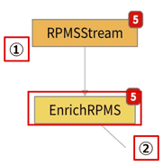

① 入力となる前のタスクの出力  

```JSON
{
👉  "RPMSensorID": "rpmSensor3",
    "RPM": 3222,
    "Time": "2020-03-19T04:42:24.021Z"
}
```

*Type とイベントが持つ共通のプロパティ (`RPMSensorID`) を Key として設定する*  

② `Enrich` の出力  

```JSON
{
    "RPMSensorID": "rpmSensor3",            # ① "RPMStream" タスクの出力結果
    "RPM": 3222,                            # ① "RPMStream" タスクの出力結果
    "Time": "2020-03-19T04:42:24.021Z",     # ① "RPMStream" タスクの出力結果
    "Pumps": {                              # これ以降はイベントに追加された Type が持つデータ
        "_id": "5e70949fc714e2125bbb8854",
        "Location": {
            "coordinates": [
                139.581,
                35.5442
            ],
            "type": "Point"
        },
        "PumpID": 3,
👉      "RPMSensorID": "rpmSensor3",
        "TempSensorID": "tempSensor3",
        "ars_namespace": "Test",
        "ars_version": 1,
        "ars_createdAt": "2020-03-17T09:13:03.371Z",
        "ars_createdBy": "446b7d1d-2d7a-45f0-b74c-ba60866ced11"
    }
}
```

## Join

- 複数のストリームのイベント同士を結合する
- タイムスタンプが異なるイベント同士でも結合することができる
- 左側に位置するストリームのイベントが基準となる

:globe_with_meridians: [Join | App Builder Reference Guide](https://dev.vantiq.com/docs/system/apps/#join)

### Join 例

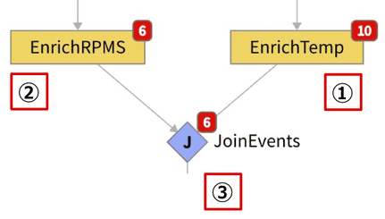

① 入力となる前のタスクの出力①  

```JSON
{
    "TempSensorID": "tempSensor2",
    "Temp": 184,
    "Time": "2020-03-19T05:18:22.020Z",
    "Pumps": {
        "_id": "5e70949fc714e2125bbb8853",
        "Location": {
            "coordinates": [
                139.5819,
                35.5448
            ],
            "type": "Point"
        },
👉      "PumpID": 2,
            - 略 -
```

② 入力となる前のタスクの出力②  

```JSON
{
    "RPMSensorID": "rpmSensor2",
    "RPM": 3971,
    "Time": "2020-03-19T05:18:28.022Z",
    "Pumps": {
        "_id": "5e70949fc714e2125bbb8853",
        "Location": {
            "coordinates": [
                139.5819,
                35.5448
            ],
            "type": "Point"
        },
👉      "PumpID": 2,
            - 略 -
```  

*結合する 2つのイベントが共通して持つプロパティ (`PumpID`) を Key とする*  

③ `Join` の出力

```JSON
{
    "EnrichTemp": {
        "TempSensorID": "tempSensor2",
        "Temp": 184,
        "Time": "2020-03-19T05:18:22.020Z",
        "Pumps": {
            "_id": "5e70949fc714e2125bbb8853",
            "Location": {
                "coordinates": [
                    139.5819,
                    35.5448
                ],
                "type": "Point"
            },
👉          "PumpID": 2,
                - 略 -
        }
    },
    "EnrichRPM": {
        "RPMSensorID": "rpmSensor2",
        "RPM": 3971,
        "Time": "2020-03-19T05:18:28.022Z",
        "Pumps": {
            "_id": "5e70949fc714e2125bbb8853",
            "Location": {
                "coordinates": [
                    139.5819,
                    35.5448
                ],
                "type": "Point"
            },
👉          "PumpID": 2,
                - 略 -
        }
    }
}
```

## Transformation

- イベントの変換を行うことができる
- 項目の追加・削除、`Procedure` の呼び出しなどをして変換する

:globe_with_meridians: [Transformation | App Builder Reference Guide](https://dev.vantiq.com/docs/system/apps/#transformation)

### Transformation 例

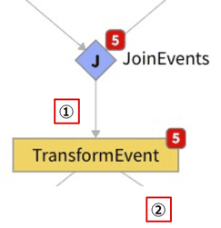

① 入力となる前のタスクの出力  

```JSON
{
    "EnrichTemp": {
        "TempSensorID": "tempSensor2",
        "Temp": 184,
        "Time": "2020-03-19T05:18:22.020Z",
        "Pumps": {
            "_id": "5e70949fc714e2125bbb8853",
            "Location": {
                "coordinates": [
                    139.5819,
                    35.5448
                ],
                "type": "Point"
            },
            "PumpID": 2,
                - 略 -
        }
    },
    "EnrichRPM": {
        "RPMSensorID": "rpmSensor2",
        "RPM": 3971,
        "Time": "2020-03-19T05:18:28.022Z",
        "Pumps": {
            "_id": "5e70949fc714e2125bbb8853",
            "Location": {
                "coordinates": [
                    139.5819,
                    35.5448
                ],
                "type": "Point"
            },
            "PumpID": 2,
                - 略 -
        }
    }
}
```

② 必要な項目のみに変換  

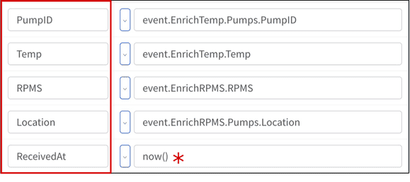＊ Procedure 呼び出し  

`Transformation` の出力  

```JSON
{
👉  "Location": {
        "coordinates": [
            139.581,
            35.5442
        ],
        "type": "Point"
    },
👉  "PumpID": 3,
👉  "RPM": 3152,
👉  "ReceivedAt": "2020-03-19T06:05:14.245Z",
👉  "Temp": 194
}
```

## SplitByGroup

- グループごとにストリームを分割する
- `Dwell`、`ComputeStatistics`、`AccumulateState` などイベントごとではなく特定のグループごとに処理する必要があるアクティビティの前などで使用する

:globe_with_meridians: [Split By Group | App Builder Reference Guide](https://dev.vantiq.com/docs/system/apps/#split-by-group)


## Dwell

- 設定した条件に合致するイベントを、設定した期間継続して検出した場合にイベントを発行する

:globe_with_meridians: [Dwell | App Builder Reference Guide](https://dev.vantiq.com/docs/system/apps/#dwell)

### Dwell 例

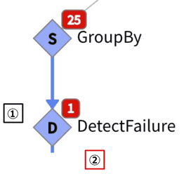

① 温度が 200度以上、回転数が 4000回以上が 20秒継続したらイベント発行と設定  
② `Dwell` の出力

```JSON
{
    "Location": {
        "coordinates": [
            139.5819,
            35.5448
        ],
        "type": "Point"
    },
    "PumpID": 2,
👉  "RPM": 4034,
    "ReceivedAt": "2020-03-19T11:59:33.227Z",
👉  "Temp": 210
}
```

## SaveToType

- Type にイベントを保存・更新する
- 更新させる場合は `Upsert` 設定を行う

:globe_with_meridians: [SaveToType | App Builder Reference Guide](https://dev.vantiq.com/docs/system/apps/#savetotype)

## ComputeStatistics

- タスクを通過するイベントに含まれる 1つのプロパティの統計を行う
- 統計処理はメモリ上で行われ、タスクの出力としては入力されたイベントがそのまま出力される
- 統計内容を取得するには、自動生成される統計内容へのアクセス用Procedureを使用する
- 統計の項目はイベント数、最小値、最大値、中央値、平均値、標準偏差

:globe_with_meridians: [Compute Statistics | App Builder Reference Guide](https://dev.vantiq.com/docs/system/apps/#compute-statistics)

### ComputeStatistics 例

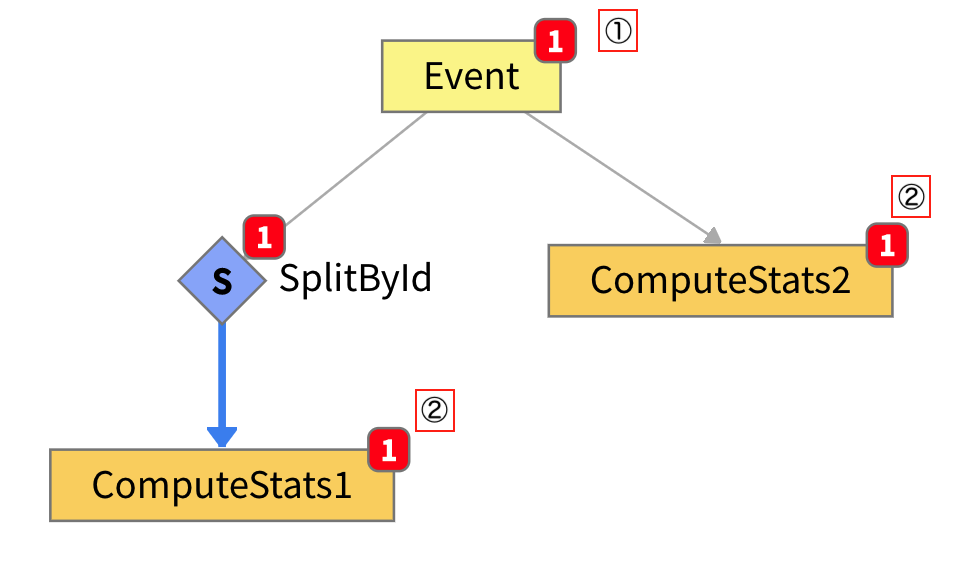

① 入力となる前のタスクの出力  

```JSON
{
    "TempSensorID": "tempSensor2",
    "Time": "2021-10-04T06:48:19.218Z",
    "Temp": 211,
    "PumpID": "pumpId2"
}
```

② `ComputeStatistics` の出力（①の内容と同じ）

```JSON
{
    "TempSensorID": "tempSensor2",
    "Time": "2021-10-04T06:48:19.218Z",
    "Temp": 211,
    "PumpID": "pumpId2"
}
```

③統計内容へのアクセス用Procedure

- `<タスク名>StateGet`、`<タスク名>StateReset`、`<タスク名>StateGetUpdate` という Procedure が自動で生成される
- 統計内容の取得には任意の場所の VAIL コード（Procedure 内、Rule 内、 Transform タスクなど）から、 `<タスク名>StateGet` を実行する
- 事前に `SplitByGroup` を使っている場合、統計内容はパーティションごとに保持されるため実行時の引数に `partitionKey` が必要となり、この値には `SplitByGroup` の `groupBy` プロパティで使用した値を入力する
- 使用していない場合はグローバルとなる


④ `<TaskName>StateGet` の実行結果

***この例では Tempの統計を取っています。***

```JSON
{
    "count": 2,                           # カウント
    "mean": 211.5,                        # 平均
    "min": 211,                           # 最小値
    "max": 212,                           # 最大値
    "median": 211.5,                      # 中央値
    "stdDeviation": 0.7071067811865476    # 標準偏差
}
```

## Unwind

- 1つのイベントを複数に分ける
- サイズの大きいイベントをそのまま処理するのではなく、`Unwind` を使う事で、分割してから個々のイベントを並列処理するようになるため負荷分散になる

:globe_with_meridians: [Unwind | App Builder Reference Guide](https://dev.vantiq.com/docs/system/apps/#unwind)

### Unwind 例

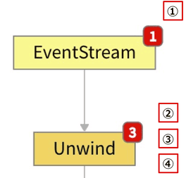

① 入力となる前のタスクの出力  

```JSON
{
    "PumpID": 1,
    "Status": [
        {
②           "Temp": 190,
            "RPM": 3560,
            "ts": "2020-01-01T00:00:01Z"
        },
        {
③           "Temp": 180,
            "RPM": 4560,
            "ts": "2020-01-01T00:00:02Z"
        },
        {
④           "Temp": 170,
            "RPM": 5560,
            "ts": "2020-01-01T00:00:03Z"
        }
    ]
}
```

*1つのイベントを複数に分ける*  
② `Unwind` の出力①  

```JSON
{
    "PumpID": 1,
    "Temp": 170,
    "RPM": 5560,
    "ts": "2020-01-01T00:00:03Z"
}
```

③ `Unwind` の出力②  

```JSON
{
    "PumpID": 1,
    "Temp": 180,
    "RPM": 4560,
    "ts": "2020-01-01T00:00:02Z"
}
```

④ `Unwind` の出力③   

```JSON
{
    "PumpID": 1,
    "Temp": 190,
    "RPM": 3560,
    "ts": "2020-01-01T00:00:01Z"
}
```

## Procedure

- 用意されている Activity Pattern にない処理を App Builder で使用したい時に使用する
- 自作の Procedure（VAILコード）を呼び出して使うことができる

:globe_with_meridians: [Procedure | App Builder Reference Guide](https://dev.vantiq.com/docs/system/apps/#procedure)

### Procedure 例

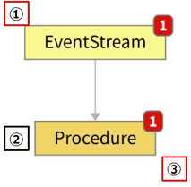

① 入力となる前のタスクの出力  

```JSON
{
    "value": 1
}
```

② 呼び出している自作 Procedure（例）

```JavaScript
PROCEDURE myProcedure(event)
event.value += 1
return event
```

③ `Procedure` の出力  

```JSON
{
    "value": 2
}
```

## VAIL

- VAIL で自由に処理を記述することができる
- Procedure を別途用意する必要はなく、タスクのプロパティに直接 VAIL を記述できる
- `event.value` が入出力データの中身に当たる部分となる

:globe_with_meridians: [VAIL | App Builder Reference Guide](https://dev.vantiq.com/docs/system/apps/#vail)

### VAIL 例


① 入力となる前のタスクの出力  

```JSON
{
    "TempSensorID": "tempSensor2",
    "Time": "2021-10-04T06:48:19.218Z",
    "Temp": 211,
    "PumpID": "pumpId2"
}
```

② VAILの内容（例）

```JavaScript
// Tempに「℃」を追加
event.value.Temp = event.value.Temp + "℃"

// Timeを削除
deleteKey(event.value, "Time")

// CurrentTimeを追加
event.value.CurrentTime = now()
```

③ `VAIL` の出力  

```JSON
{
    "TempSensorID": "tempSensor2",
👉  "Temp": "211℃",
    "PumpID": "pumpId2",
👉  "CurrentTime": "2021-10-04T03:54:21.783Z"
}
```

## Filter

- 設定した条件に合致するイベントのみ通過させる

:globe_with_meridians: [Filter | App Builder Reference Guide](https://dev.vantiq.com/docs/system/apps/#filter)

### Filter 例

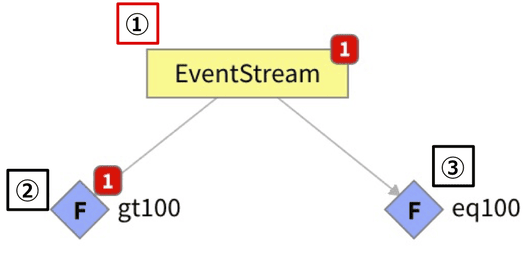

① 入力となる前のタスクの出力  

```JSON
{
    "value": 200
}
```

② 設定した条件  

```JavaScript
event.value > 100
```

③ 設定した条件  

```JavaScript
event.value == 100
```

## AccumulateState

- この Activity Pattern が設定されたタスクを通過するイベントを追跡し続ける
- `AccumulateState` 用の Procedure を作成して設定するため、通過していくイベントに対して任意の処理を実行することができる
- `AccumulateState` を使用する場合は事前に `SplitByGroup` を使用してストリームを分割しておく必要があります。

:globe_with_meridians: [Accumulate State | App Builder Reference Guide](https://dev.vantiq.com/docs/system/apps/#accumulate-state)

### AccumulateState 例: 通過したイベント数をカウントしてみる❶

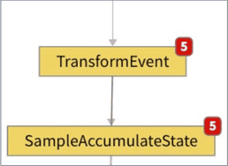

- `SampleAccumulateState` における ***1*** 件目のイベント

```JSON
{
    "PumpID": 1,
    "Temp": 183,
    "RPM": 3063,
    "Location": {
        "coordinates": [
            139.5811,
            35.5445
        ],
        "type": "Point"
    },
    "ReceivedAt": "2020-11-30T08:18:18.441Z",
    "current_status": {
👉      "eventCount": 1
    }
}
```

- `SampleAccumulateState` における ***5*** 件目のイベント

```JSON
{
    "PumpID": 4,
    "Temp": 183,
    "RPM": 3896,
    "Location": {
        "coordinates": [
            139.5813,
            35.5447
        ],
        "type": "Point"
    },
    "ReceivedAt": "2020-11-30T08:18:18.464Z",
    "current_status": {
👉      "eventCount": 5
    }
}
```

### AccumulateState 例: 通過したイベント数をカウントしてみる❷

**作成した `AccumulateState` 用の Procedure**

```JavaScript
PROCEDURESample.accumulateState(lastEvent Object, event Object)
if(lastEvent){
    // このタスクを経過したイベントがある場合
    lastEvent.eventCount++
} else {
    // このタスクを経過したイベントがまだない場合
    lastEvent = {
👉      eventCount: 1
    }
}
return lastEvent
```

&nbsp;&nbsp; ***＊ イベントが経過するたびに「eventCount」がカウントアップされる***

### AccumulateState 例: 通過したイベント数をカウントしてみる❸

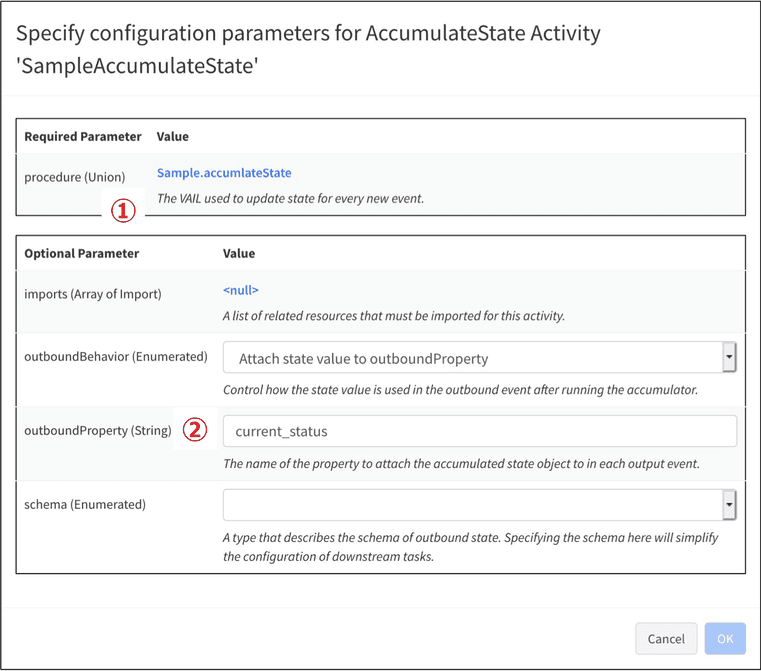

① _procedure_: `AccumulateState` 用に自作した Procedure  
② _outboundProperty_: `AccumulateState` のオブジェクトのプロパティ名    
