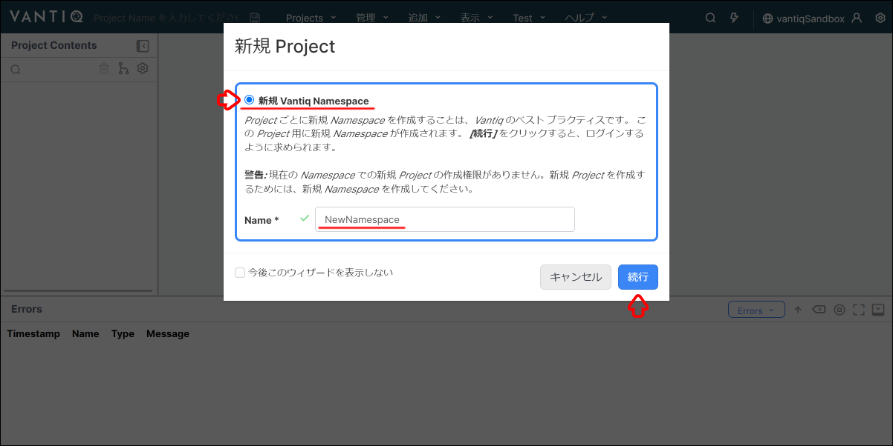
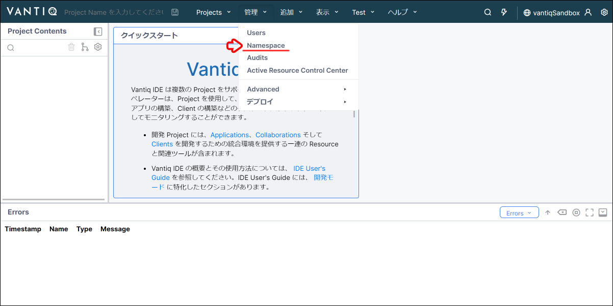
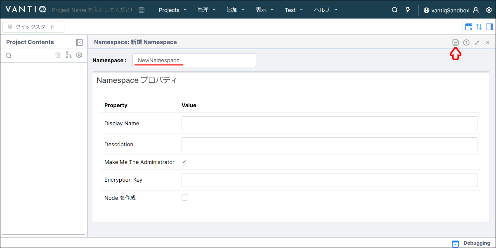
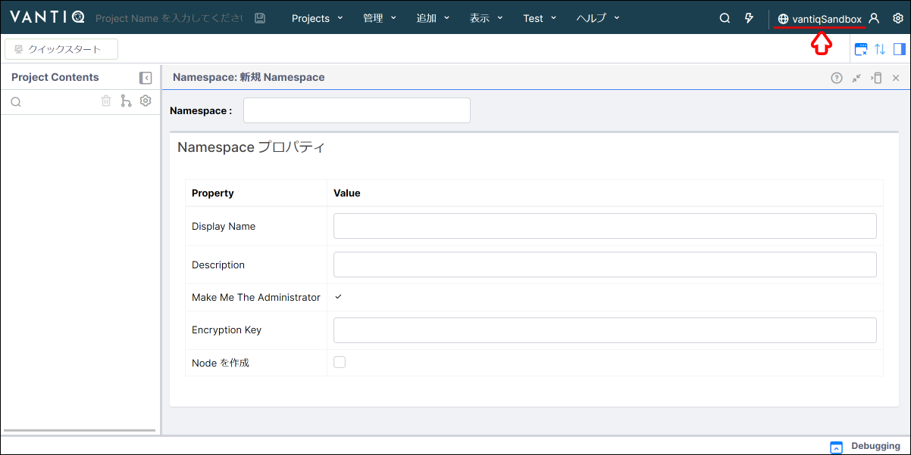
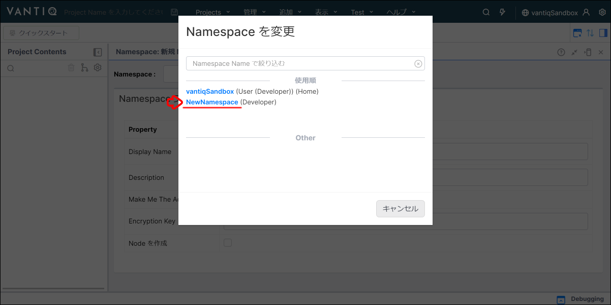
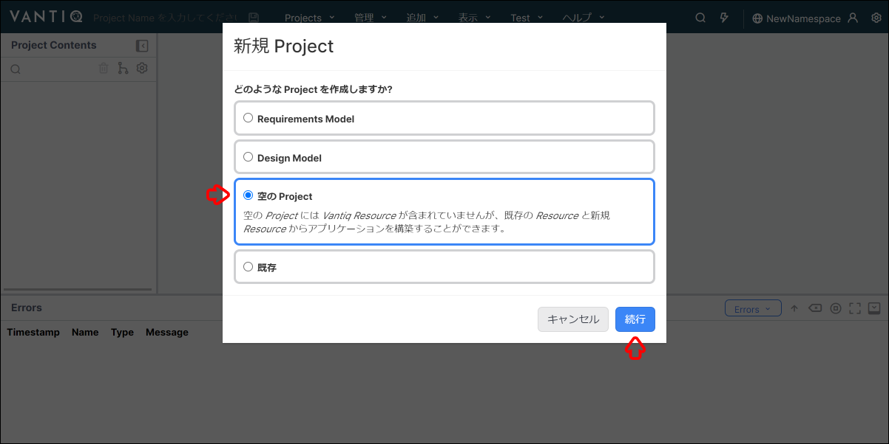
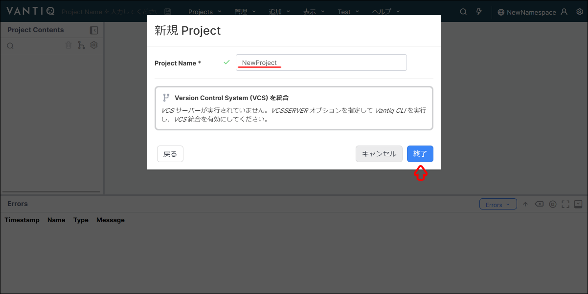
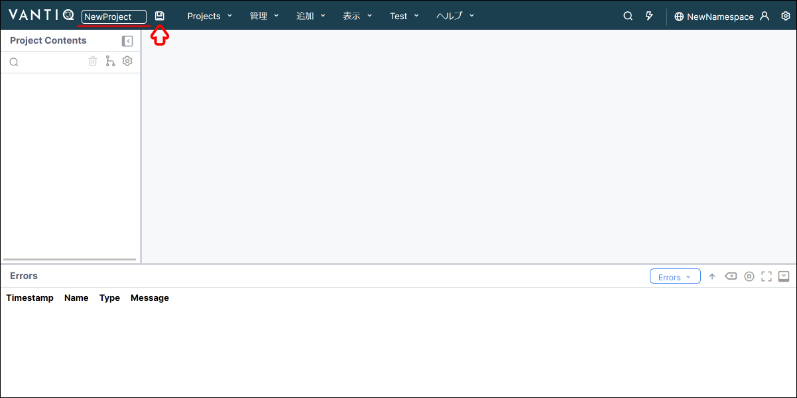
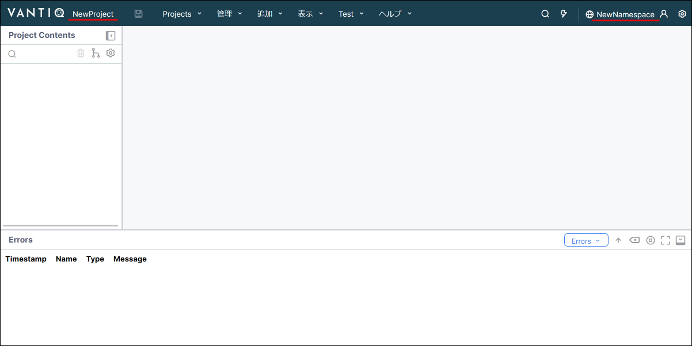

# Vantiq の Namespace と Project について

このセッションでは Vantiq で開発する上で欠かすことができない Namespace と Project について解説します。

## 目次

- [Vantiq の Namespace と Project について](#vantiq-の-namespace-と-project-について)
  - [目次](#目次)
  - [Namespace とは](#namespace-とは)
  - [Project とは](#project-とは)
  - [Namespace と Project の作成方法](#namespace-と-project-の作成方法)
    - [Vantiq へのログイン](#vantiq-へのログイン)
    - [Namespace の作成（ウィザード画面）](#namespace-の作成ウィザード画面)
    - [Namespace の作成（管理画面）](#namespace-の作成管理画面)
    - [Project の種類の選択（ウィザード画面）](#project-の種類の選択ウィザード画面)
    - [Project の作成（ウィザード画面）](#project-の作成ウィザード画面)
    - [Project の作成（ナビゲーションバー）](#project-の作成ナビゲーションバー)
    - [Namespace と Project の確認](#namespace-と-project-の確認)
  - [Project のインポート](#project-のインポート)
  - [Project のエクスポート](#project-のエクスポート)
  - [Project の管理](#project-の管理)

## Namespace とは

Namespace とは、各ユーザーごとに割り当てられた Vantiq の開発環境です。  
各 Namespace 内で開発した Resource は Namespace ごとに隔離されて管理されています。  

> Namespace 名は一意である必要があります。  
> 重複する Namespace 名は作成できませんので、ご注意ください。  

## Project とは

Project とは、デプロイ可能な Vantiq アプリケーションの最小単位になります。  

Project は同一の Namespace 内に複数の作成することができます。  
また、 Namespace 内の各 Resource は、同一 Namespace 内の異なる Project で共通利用することができます。  

> Project 名は同一の Namespace 内では、一意である必要があります。  
> 同一 Namespace 内で重複する Project 名は作成できませんので、ご注意ください。  

## Namespace と Project の作成方法

Namespace や Project の作成にいくつかの方法があります。  
画面遷移に応じた手順を下記に記載しています。  

### Vantiq へのログイン

1. Vantiq へログインします。  

   :link: [Vantiq 開発環境（https://dev.vantiq.co.jp）](https://dev.vantiq.co.jp)  

   > 上記の URL は Vantiq パブリッククラウド環境になります。  
   > Vantiq プライベートクラウドや Vantiq Edge などの他の環境を利用している場合は、 URL が異なりますのでご注意ください。  

1. Next step  
   表示される画面に対応するリンクをクリックしてください。  

   - **ウィザードが表示される場合：** [Namespace の作成（ウィザード画面）](#namespace-の作成ウィザード画面)
   - **ウィザードが表示されない場合：** [Namespace の作成（管理画面）](#namespace-の作成管理画面)

### Namespace の作成（ウィザード画面）

1. Namespace の作成  
   **新規 Project** 画面に下記の内容を入力し、 `続行` をクリックします。  

   - **ラジオボタン：** `新規 Vantiq Namespace` を選択します。
   - **Name：** 任意の Namespace 名を入力します。（例：NewNamespace）

   

1. Next step  
   クリックしたボタンに対応するリンクをクリックしてください。  

   - **続行：** [Project の種類の選択（ウィザード画面）](#project-の種類の選択ウィザード画面)
   - **キャンセル：** [Namespace の作成（管理画面）](#namespace-の作成管理画面)

### Namespace の作成（管理画面）

1. Namespace 画面を開く
   ナビゲーションバーから `管理` → `Namespace` をクリックし、新規 Namespace 画面を開きます。  

   

1. Namespace の作成  
   **新規 Namespace** 画面に下記の内容を入力し、右上の `保存ボタン` をクリックします。  

   - **Namespace：** 任意の Namespace 名を入力します。（例：NewNamespace）

   

1. Namespace の切り替え  
   ナビゲーションバー右側の `Namespace 名` をクリックします。  

   

1. Namespace の選択  
   先程、作成した Namespace 名をクリックします。

   

1. Next step  
   表示される画面に対応するリンクをクリックしてください。  

   - **ウィザードが表示される場合：** [Project の種類の選択（ウィザード画面）](#project-の種類の選択ウィザード画面)
   - **ウィザードが表示されない場合：** [Project の作成（ナビゲーションバー）](#project-の作成ナビゲーションバー)

### Project の種類の選択（ウィザード画面）

1. Project の種類の選択  
   **新規 Project** 画面から下記の内容を選択し、 `続行` をクリックします。  

   - **どのような Project を作成しますか？：** `空の Project` を選択します。  

   

1. Next step  
   クリックしたボタンに対応するリンクをクリックしてください。  

   - **続行：** [Project の作成（ウィザード画面）](#project-の作成ウィザード画面)
   - **キャンセル：** [Project の作成（ナビゲーションバー）](#project-の作成ナビゲーションバー)

### Project の作成（ウィザード画面）

1. Project の作成  
   **新規 Project** 画面に下記の内容を入力し、 `終了` をクリックします。  
   - **Project Name：** 任意の Project 名を入力します。（例：NewProject）  

   

1. Next step  
   クリックしたボタンに対応するリンクをクリックしてください。  

   - **終了：** [Namespace と Project の確認](#namespace-と-project-の確認)
   - **キャンセル：** [Project の作成（ナビゲーションバー）](#project-の作成ナビゲーションバー)

### Project の作成（ナビゲーションバー）

1. Project の保存
   ナビゲーションバーの `Project Name を入力してください` に任意の Project 名を入力し、右隣の `保存ボタン` をクリックします。  

   

1. 作成した Namespace と Project の確認  
   下記のリンクをクリックしてください。

   - [Namespace と Project の確認](#namespace-と-project-の確認)

### Namespace と Project の確認

1. Namespace と Project の作成完了  
   ここまでの手順で Namespace と Project の新規作成ができました。  
   下記の内容が表示されているか確認します。  
   - **画面右上：** 作成した Namespace 名
   - **画面左上：** 作成した Project 名

   

## Project のインポート

他の Namespace で作成した Project などを別の Namespace にインポートすることができます。  

Vantiq パブリッククラウドで開発した Project を Vantiq プライベートクラウドへインポートするといったこともできます。  

## Project のエクスポート

開発した Project をエクスポートすることができます。  
エクスポートすることで、他の Namespace へインポートすることやバックアップとして保管することも可能になります。  

## Project の管理

Namespace 内の Project の管理方法を解説します。

