# Project の管理について

このセッションでは Vantiq で開発した Project の管理方法について解説します。

## 目次

- [Project の管理について](#project-の管理について)
  - [目次](#目次)
  - [Project のインポート](#project-のインポート)
    - [Project のインポート方法](#project-のインポート方法)
  - [Project のエクスポート](#project-のエクスポート)
    - [Project のエクスポート方法](#project-のエクスポート方法)
  - [Project の追加作成](#project-の追加作成)
    - [Project の新規追加方法](#project-の新規追加方法)
  - [Project の切り替え](#project-の切り替え)
    - [Project の切り替え方法](#project-の切り替え方法)
  - [Project の削除](#project-の削除)
    - [Project の削除方法](#project-の削除方法)

## Project のインポート

他の Namespace で作成した Project を別の Namespace にインポートすることができます。  

Project のインポートの利用例を下記にあげます。  

- Vantiq Public Cloud で開発した Project を Vantiq Private Cloud へインポートする。
- 開発環境で作成した Project を本番環境にインポートする。
- Workshop などで提供されるデータジェネレータや実装サンプルをインポートする。

### Project のインポート方法

1. ナビゲーションバーの `Projects` → `インポート...` をクリックします。  

   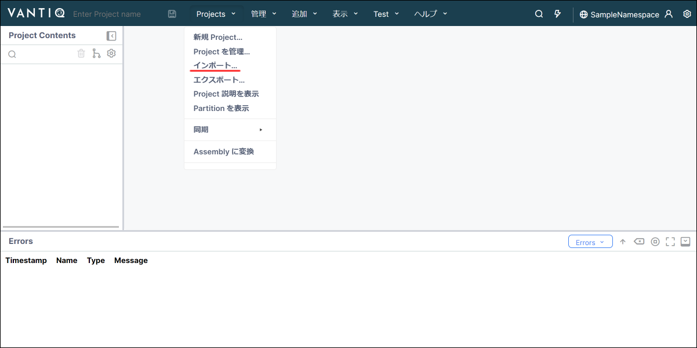

1. `インポートするフォルダまたは zip ファイルをここにドロップ` の破線の範囲内にインポートしたい Project の `フォルダ` または `zip ファイル` をドロップします。  

   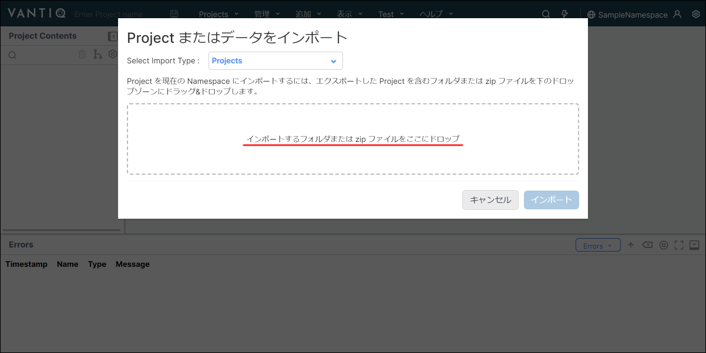

1. インポートする Project に誤りが無いか確認し、 `インポート` をクリックします。  

   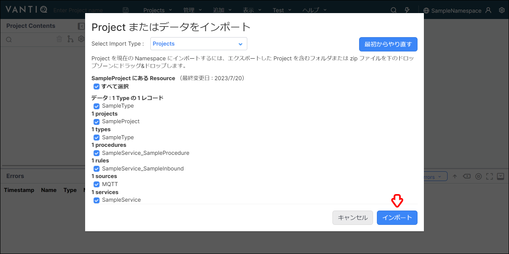

1. `リロード` をクリックします。  

   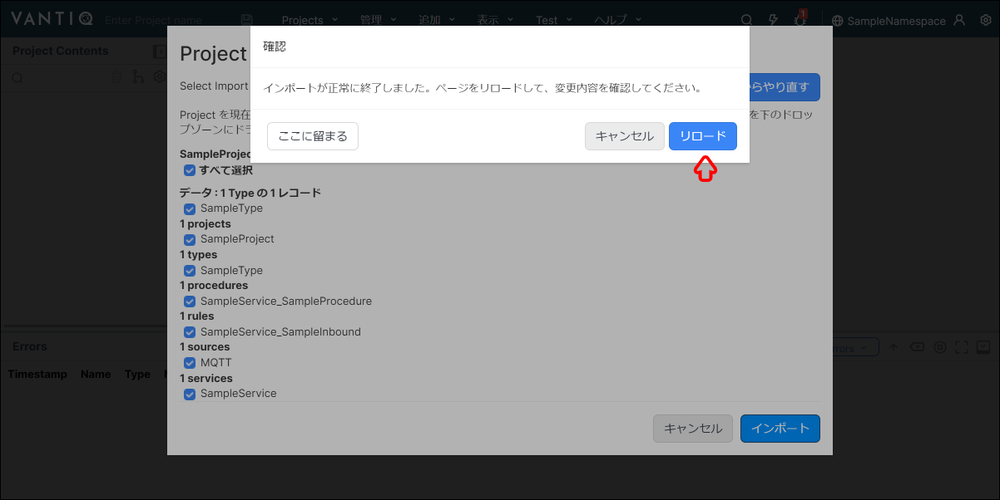

1. インポートした Project が表示されます。  
   以上で Project のインポートは完了です。  

   

## Project のエクスポート

開発した Project をエクスポートすることができます。  
Project をエクスポートすることで、他の Namespace へインポートすることやバックアップとして保管することが可能です。  

### Project のエクスポート方法

1. ナビゲーションバーの `Projects` → `エクスポート...` をクリックします。  

   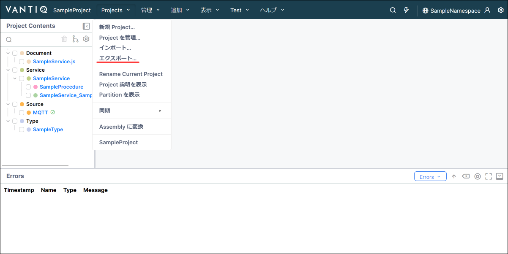

1. エクスポートする Resource を選択し、 `エクスポート` をクリックします。  
   > Type のデータもエクスポートする際は、 `データをエクスポート` にチェックを入れます。  

   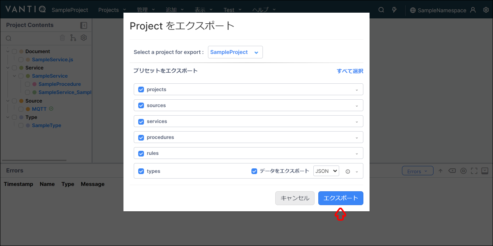

1. エクスポートした Project が zip ファイルでダウンロードされます。  

## Project の追加作成

同一 Namespace 内に新規で Project を追加する方法を解説します。  

### Project の新規追加方法

1. ナビゲーションバーの `Projects` → `新規 Project...` をクリックします。  

   

1. `Project を追加` を選択し、 `続行` をクリックします。  

   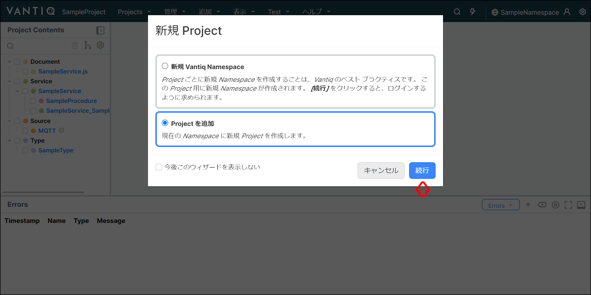

1. `空の Project` を選択し、 `続行` をクリックします。  

   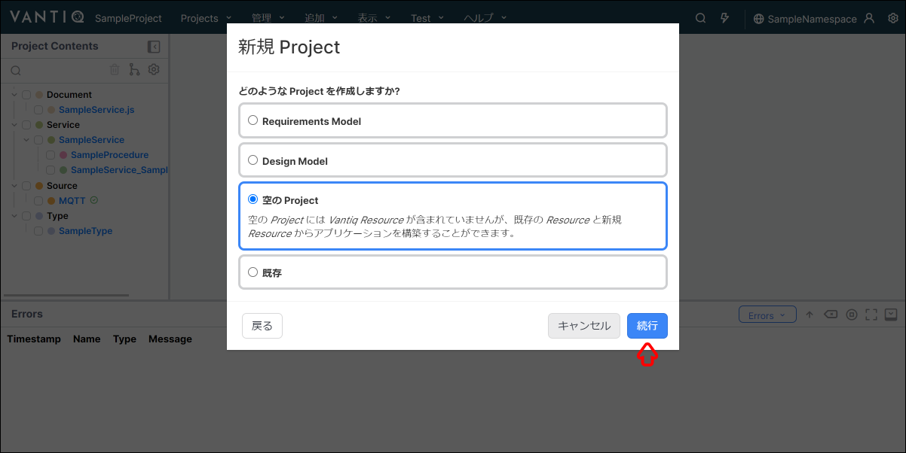

1. `Project Name` に任意の Project 名を入力し、 `終了` をクリックします。（例：TestProject）  

   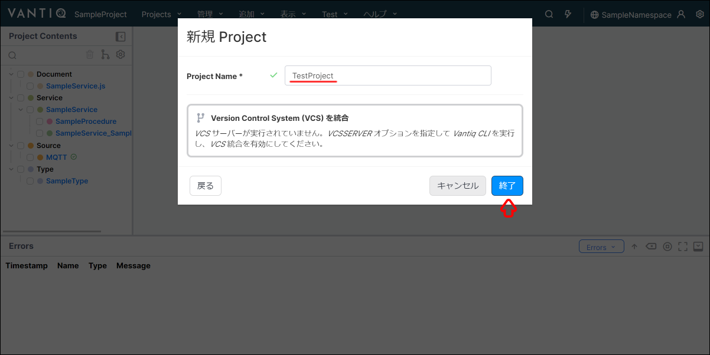

1. 先程作成した Project に切り替わっていることを確認します。  
   以上で Project の新規追加は完了です。  

   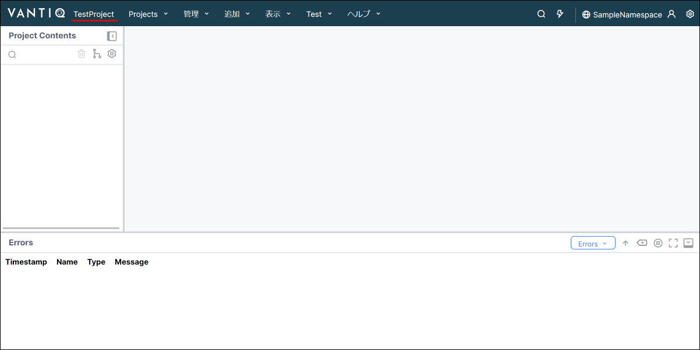

## Project の切り替え

Namespace 内の Project を切り替える方法を解説します。  

Project は、1つの Namespace 内に複数作成することができます。  
ただし、可能な限り Project ごとに Namespace を用意することが推奨されています。  

### Project の切り替え方法

1. ナビゲーションバーの `Projects` → `Project を管理...` をクリックします。  

   

1. 切り替えたい `Project 名` をクリックします。（例：SampleProject）  

   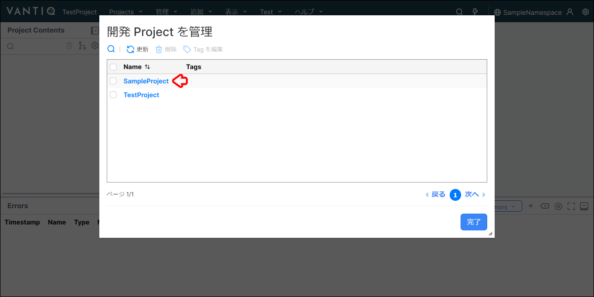

1. Project が切り替わっているか確認します。  
   以上で Project の切り替えは完了です。  

   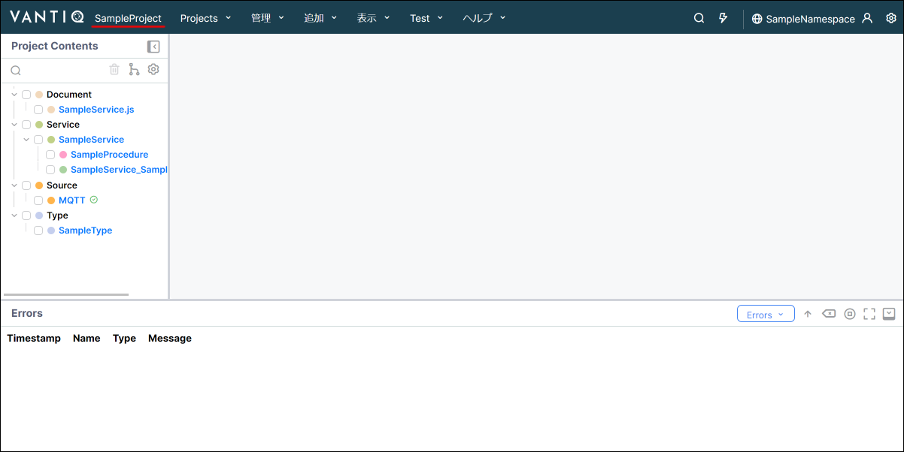

## Project の削除

Namespace 内の Project を削除する方法を解説します。  

Project を削除する際は、下記の2通りがあります。  
> 削除された Project や Resource の取り消しはできないため注意が必要です。  

- **Project と Resource を削除：**  
  Project と一緒に Project に含まれる Resource も削除する方法です。  
  > Namespace 内の他の Project で同一の Resource を利用している場合でも削除されてしまうため、注意が必要です。  
- **Project を削除：** Project のみを削除し、 Resource は残しておく方法です。

### Project の削除方法

1. ナビゲーションバーの `Projects` → `Project を管理...` をクリックします。  

   

1. 削除したい `Project のチェックボックス` にチェックを入れ、 `削除` クリックします。（例：TestProject）  

   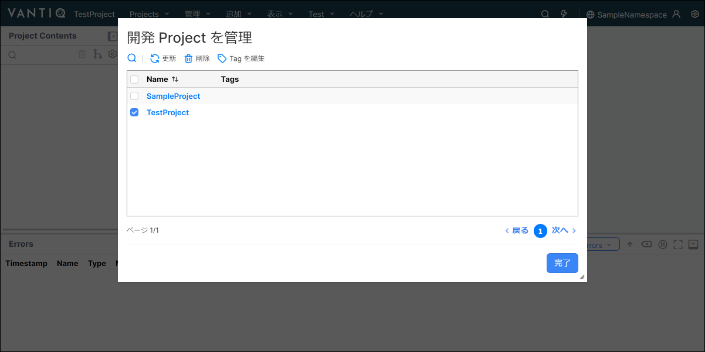

1. `Project と Resource を削除` または `Project を削除` のいずれかをクリックします。  

   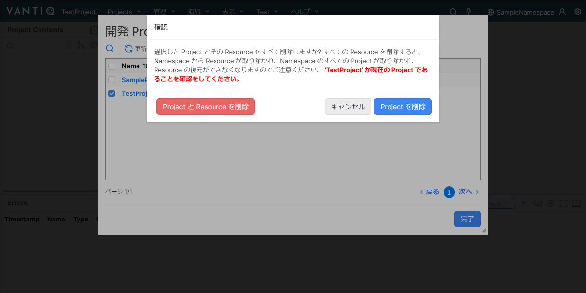

1. Project が削除されていることを確認し、 `完了` をクリックして、ウィンドウを閉じます。  
   以上で Project の削除は完了です。  

   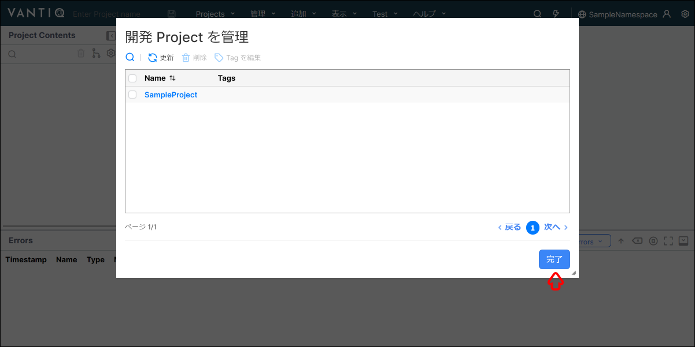
