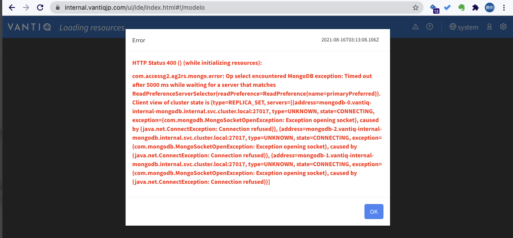

# Vantiqのmongodb構成について

## Vantiqで構成しているMongoDBの可用性について

### TL;DR
3台のミラー構成のうち最低2台が稼働していることが必要である。

### Details
Vantiqのmongodbは3台のミラー構成になっていますが、内訳は以下の通りです。

- 3台稼働の場合: Primary + Secondary + Secondary
- 2台稼働の場合: Primary + Secondary
- 1台稼働の場合: Secondary

Primaryは書き込み専用, Secondaryは読み込み専用です。
AZ障害等で1台になると、読み込みしかできないので、書き込みしようとするとタイムアウトエラーとなります。

数分後、Vantiq podが定期的な書き込みができず（ここは推測）、PodのContainer自体が`Ready`でなくなります。
その結果 `503 Service Temporary Unavailable`となります。

