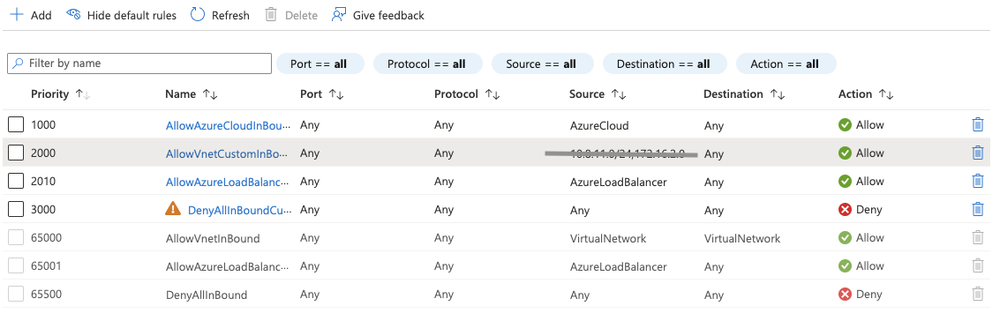
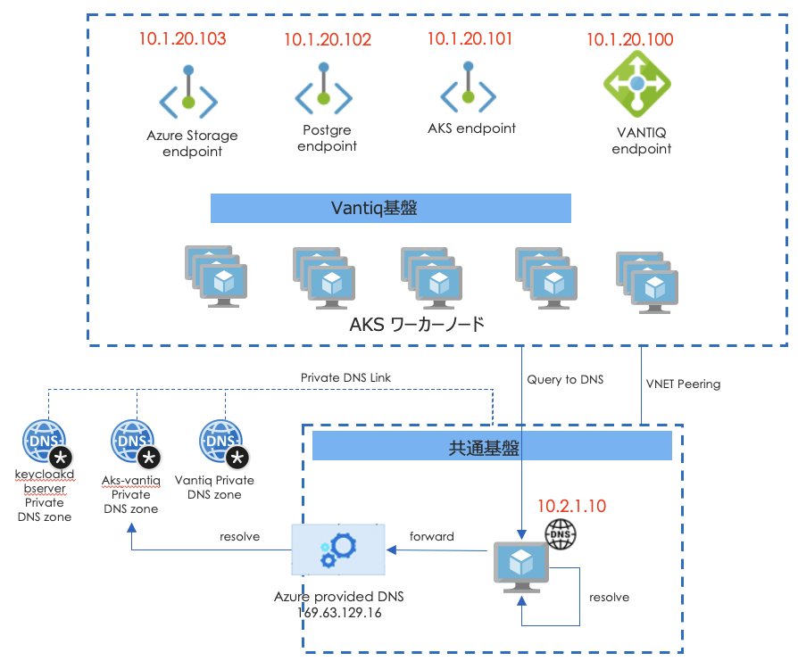
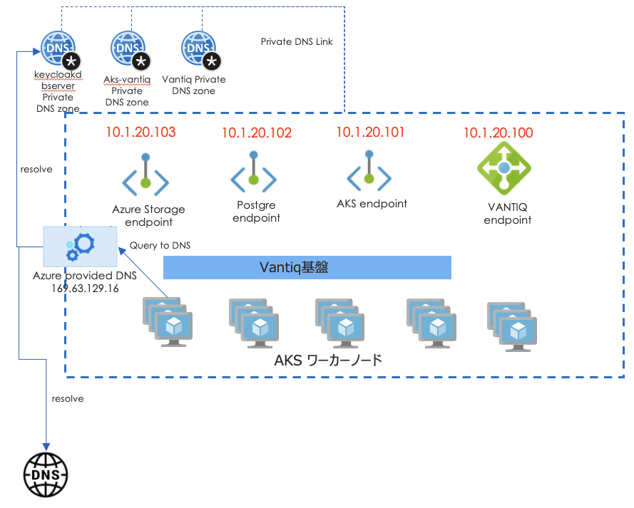
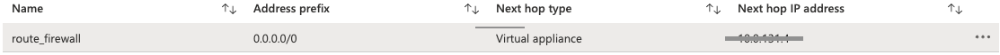

# 閉域網構成における考慮事項（Azure編）

## Internal Load Balancer

閉域網にLoad Balancerを作成する場合、以下を考慮する必要がある。

- Load Balancerが内部Load Balancerとして構成され、Public IPを持たないこと。
- Load Balancerが意図したサブネットに接続され、NSGで管理できること。

AKSの場合、`deploy.yaml`の`nginx.controller.service`プロパティに`annotations`を追加する。必要があれば、annotationでsubnetやIPを指定できる。
[Azure Kubernetes Service (AKS) で内部ロード バランサーを使用する](https://docs.microsoft.com/ja-jp/azure/aks/internal-lb)。
以下は、指定した名前のsubnetにLoad Balancerを配置する例。

```yaml
nginx:
  controller:
    tls:
      cert: xxx.xxx.full.crt
      key: xxx.xxx.key
    service:
      annotations:
        service.beta.kubernetes.io/azure-load-balancer-internal: "true"
        service.beta.kubernetes.io/azure-load-balancer-internal-subnet: "<target_subnet_name>"
```

### Security Groupの設定
Internetからのアクセスを制限するよう、設定する。
また、LoadBalancerはSNATを行わないので、LoadBalancerに設定したNSGと同様の許可をAKSワーカーノードにも設定する必要がある。すなわち、Load BalancerとAKSワーカーノードが別のSubnetにある場合、それぞれのSubnetに同様の設定を行う。



## Private Endpointの設定
AKS, Storage, Azure Database for PostgreSQLはデフォルトではそれぞれpublicのサービスとして構成されるため、閉域網からはアクセスすることができなくなる。
よって、それぞれのサービスをPrivateとして構成する必要がある。以下を考慮する必要がある。
- privateで構成すると、指定した[subnetでIPが採番](https://docs.microsoft.com/en-us/azure/private-link/private-endpoint-overview#private-endpoint-properties)される。このIPは構成のたびに不定のため、アプリケーションから確実に参照するためにはDNS登録を行う。
- Private DNS Zoneを作成し、FQDNを登録する。Azure PortalではPrivateにすることで自動的に構成されるが、terraformではそれぞれのリソースを個別に作成することが必要となる。以下は、terraformのスクリプトのサンプルを示す。

#### AKS
AKSは作成時に、`private_cluster_enabled`を指定することにより、自動的にAKS Endpointがプライベートに構成される。`xxxxxxxx-xxxx-xxxx-xxxx-xxxxxxxxxx.privatelink.japaneast.azmk8s.io`のような名前で自動的にPrivate DNS Zoneが構成され、VNETにアタッチされる。

```tf
resource "azurerm_kubernetes_cluster" "aks-vantiq" {
  name                = var.aks_cluster_name
  location            = var.location
  resource_group_name = azurerm_resource_group.rg-aks.name
  dns_prefix          = var.aks_cluster_name
  private_cluster_enabled = var.private_cluster_enabled
...
```

注意事項:
- AKS生成後に`private_cluster_enabled`は変更することはできない。変更する場合、クラスタを作り直し（よって、private endpointなどすべて変更）となる。
- AKSの場合、privateとpublicのendpointを同時に有効にすることができない。

#### Storage Account
StorageのPrivate EndpointはAzure Portalから作成時には自動で作成されるが、Terraformでは個別に定義が必要。


- Storage Accountを作成
```tf
# storage account
resource "azurerm_storage_account" "vantiq" {
  name                     = var.storage_account_name
  resource_group_name      = azurerm_resource_group.rg-storage.name
  location                 = var.location
  account_kind             = "StorageV2"
  account_tier             = "Standard"
  account_replication_type = "ZRS"
  access_tier              = "Hot"

  # security
  enable_https_traffic_only = true
  allow_blob_public_access  = false

  blob_properties {
    delete_retention_policy {
      days                   = 30
    }
  }

  tags = var.tags
}
```

- Private Endpointを作成する。
```tf
## private link
resource "azurerm_private_endpoint" "pe-vantiq-storage-account" {
  name                 = "pe-vantiq-storage-account"
  location             = var.location
  resource_group_name  = azurerm_resource_group.rg-storage.name
  subnet_id            = var.storage_account_subnet_id

  private_service_connection {
    name                           = "connection-vantiq-storage-account"
    is_manual_connection           = false
    private_connection_resource_id = azurerm_storage_account.vantiq.id
    subresource_names              = ["blob"]
  }
}
```

- Private DNS Zone `privatelink.blob.core.windows.net`を作成する。
```tf

## Private DNS zone
resource "azurerm_private_dns_zone" "pdns-vantiq-storage-account" {
  ## split "xxxxxxx.blob.core.windows.net" into
  ##  "xxxxxxx" and "blob.core.windows.net" and use the second
  ## portion as DNS zone name.
  name                =  format("%s.%s", "privatelink", join(".", slice(split(".", "${azurerm_private_endpoint.pe-vantiq-storage-account.custom_dns_configs[0].fqdn}"), 1, length(split(".", "${azurerm_private_endpoint.pe-vantiq-storage-account.custom_dns_configs[0].fqdn}")))))  #
  resource_group_name = azurerm_resource_group.rg-storage.name
}
```

- DNS RecordをPrivate DNS Zoneに追加する。
```tf
# add DNS record - add to DNS zone
resource "azurerm_private_dns_a_record" "pdns-vantiq-storage-account" {
  name                = split(".", "${azurerm_private_endpoint.pe-vantiq-storage-account.custom_dns_configs[0].fqdn}")[0]
  zone_name           = azurerm_private_dns_zone.pdns-vantiq-storage-account.name
  resource_group_name = azurerm_resource_group.rg-storage.name
  ttl                 = 300
  records             = [azurerm_private_endpoint.pe-vantiq-storage-account.private_service_connection[0].private_ip_address]
}
```
- VNETにPrivate DNS Zoneをアタッチする
```tf
# Prive DNS Zone association with VNET
resource "azurerm_private_dns_zone_virtual_network_link" "pdns-vantiq-storage-account" {
  count = length(var.private_endpoint_vnet_ids)
  name                  = format("pdns-vantiq-storage-account-%d", count.index)
  resource_group_name   = azurerm_resource_group.rg-storage.name
  private_dns_zone_name = azurerm_private_dns_zone.pdns-vantiq-storage-account.name
  virtual_network_id    = var.private_endpoint_vnet_ids[count.index]
}
```

#### Azure Database for PostgreSQL

Azure Database for PostgreSQLのPrivate EndpointはAzure Portalから作成時には自動で作成されるが、Terraformでは個別に定義が必要。

- Postgres Accountを作成
```tf
resource "azurerm_postgresql_server" "keycloak-dbserver" {
  name                = var.db_server_name  # change name
  resource_group_name = azurerm_resource_group.rg-rdb.name
  location            = var.location

  sku_name = "GP_Gen5_2"

  storage_mb                   = 102400
  backup_retention_days        = 7
  geo_redundant_backup_enabled = var.geo_redundant_backup_enabled
  auto_grow_enabled            = false

  administrator_login          = "keycloak"
  administrator_login_password = random_string.postgres_password.result
  version                      = "10"
  ssl_enforcement_enabled      = false
  public_network_access_enabled = var.public_network_access_enabled

  tags = var.tags
}

resource "azurerm_postgresql_database" "keycloak-db" {
  name                = "keycloak"
  ...
}
```

- private endpoint を作成する。
```tf
## private link
resource "azurerm_private_endpoint" "pe-keycloak-db-server" {
  name                 = "pe-keycloak-db-server"
  location             = var.location
  resource_group_name  = azurerm_resource_group.rg-rdb.name
  subnet_id            = var.private_subnet_id

  private_service_connection {
    name                           = "tfex-postgresql-connection"
    is_manual_connection           = false
    private_connection_resource_id = azurerm_postgresql_server.keycloak-dbserver.id
    subresource_names              = ["postgresqlServer"]
  }
}
```

- Private DNS Zone `privatelink.postgres.database.azure.com`を作成する。
```tf
## Private DNS zone
resource "azurerm_private_dns_zone" "pdns-postgres" {
  ## split "keycloakdbserver.privatelink.postgres.database.azure.com" into
  ##  "keycloakdbserver" and "privatelink.postgres.database.azure.com" and use the second
  ## portion as DNS zone name.
  name                =  format("%s.%s", "privatelink", join(".", slice(split(".", "${azurerm_postgresql_server.keycloak-dbserver.fqdn}"), 1, length(split(".", "${azurerm_postgresql_server.keycloak-dbserver.fqdn}")))))  #
  resource_group_name = var.resource_group_name
}
```
- Private DNS Zoneにレコードを追加する。
```tf
# add DNS record - add to DNS zone
resource "azurerm_private_dns_a_record" "pdns-a-postgres" {
  name                = split(".", "${azurerm_postgresql_server.keycloak-dbserver.fqdn}")[0]  # keycloakdbserver
  zone_name           = azurerm_private_dns_zone.pdns-postgres.name
  resource_group_name = var.resource_group_name
  ttl                 = 300
  records             = [azurerm_private_endpoint.pe-keycloak-db-server.private_service_connection[0].private_ip_address]
}
```
- private DNS ZoneをVNETにアタッチする。
```tf
# Prive DNS Zone association with VNET
resource "azurerm_private_dns_zone_virtual_network_link" "pdnslk-a-postgres" {
  count = length(var.private_endpoint_vnet_ids)
  name                  = format("pdnslk-a-postgres-%d", count.index)
  resource_group_name   = azurerm_resource_group.rg-rdb.name
  private_dns_zone_name = azurerm_private_dns_zone.pdns-postgres.name
  virtual_network_id    = var.private_endpoint_vnet_ids[count.index]
}
```

## カスタムDNSサーバーについて

顧客要件により、カスタムでDNSサーバーを配置する場合がある。Private DNS Zoneで解決している名前がカスタムDNSサーバー構成においても解決できるよう考慮する必要がある。
前提として、Azure Provided DNS (196.63.129.16)は、当該VNETにアタッチしているPrivate DNS Zoneを参照し、解決できないものは上位（Public)のDNSに問い合わせを行う。

#### Option 1: カスタムDNSサーバーでDNSフォワーダーを使用する

1. Private DNS ZoneをカスタムDNSサーバーが配置されているVNETにアタッチする。
1. カスタムDNSサーバーが、DNS ForwardでAzure provided DNS (196.63.129.16)を参照するようにする。
1. AKSワーカーノードが配置されているVNETのDNSサーバーをカスタムDNSサーバーのIPに指定する。



#### Option 2: Public DNS Zoneを構成する

1. Private DNS ZoneをAKSワーカーノードが配置されているVNETにアタッチする。
1. AKSワーカーノードが配置されているVNETのDNSサーバーをデフォルト(Azure Provided DNS)にする。
1. Public DNS ZoneにVantiq基盤以外との相互参照に必要なDNSを登録する。



#### 参考
- https://docs.microsoft.com/ja-jp/azure/virtual-network/virtual-networks-name-resolution-for-vms-and-role-instances#name-resolution-that-uses-your-own-dns-server
- https://docs.microsoft.com/ja-jp/azure/private-link/private-endpoint-dns
- https://docs.microsoft.com/ja-jp/azure/aks/concepts-network


## Internet Gateway
閉域網の場合、InternetへのOutbound接続を制限を検討する。

#### Outboundを制限しない場合
NAT Gatewayを構成し、AKSワーカーノードが配置されているサブネットにアタッチする。

#### Outboundを制限する場合
Azure Firewallなどのサービスを検討する。 Azure Firewallを使用すると、接続先のFQDNでトラフィックに制限をかけることができる。
OutboundのトラフィックがAzure Firewallにルーティングするよう、ルートテーブルを設定し、AKSワーカーノードが配置されているサブネットにアタッチする。


